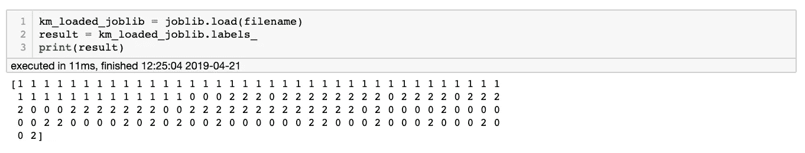

# 部署您的数据科学模型

> 原文：<https://towardsdatascience.com/deploy-your-data-science-model-7b81eea6c98?source=collection_archive---------7----------------------->

**第 1 部分:用 Pickle 或 Joblib 从笔记本上删除**

Photo by [SpaceX](https://unsplash.com/@spacex?utm_source=medium&utm_medium=referral) on [Unsplash](https://unsplash.com?utm_source=medium&utm_medium=referral)

作为一名初学数据科学的学生，到目前为止，我的大部分训练都是在选择、训练和评估许多有监督的机器学习方法。大部分是在 Jupyter 笔记本上。

Jupyter 笔记本电脑是数据科学的天赐之物，它在一个方便的开发环境中促进了分段评估和建模，这一点怎么说都不为过。很难想象，如果数据科学家不得不执行并寻找错误，那么训练他们会有多困难。py 可执行文件。

然而，Jupyter 笔记本并不适合部署。在我最近参加的一次黑客马拉松中，我可以开发建模对象，但是我的 Python 代码迫使全栈开发人员使用 Django 来适应它(及其依赖项)。我觉得自己是个不必要的负担。从那以后，我一直在寻找方法来部署我的模型，并在我的模型和生产环境之间建立更多的桥梁。为什么让那些家伙独享乐趣？这是系列文章的第一部分，将记录我在部署模型时遇到的困难。希望我能让你一路上不那么伤心。

所以，首先要做的是。你在笔记本上建立了一个模型。除非您想在生产中每次都运行笔记本，否则您需要从笔记本中取出建模对象，以便它可以在*中运行。py 可执行文件。

一般来说，有两种我们称之为模型持久性的方法。pickle 方法和更面向数据的 Joblib 方法。Pickle 方法或通常所说的“Pickle”是将一个对象转换成字节流以便保存和加载。由于编程中的几乎所有东西在其核心都被表示为一个对象，所以您可以看到这是多么有用。

然而，Joblib 库被开发成更适合 python 对象(通常是 numpy 类型)。如果对象是大量基于 numpy 数组的，这将大大节省保存和加载的时间。您可以看到 Joblib 在数据科学中的价值，并从中推断出它可能是建模持久性的更好途径。你可以两者兼得。但总的来说，更大的数据集将从使用 Joblib 中受益。pickle 正在更新，以便更好地适应基于 numpy 的对象，但这是以后的事了。不过今天不用担心，我将向您展示这两种方法，因为它们都相对简单。

首先，让我从心爱的虹膜数据集建立一个快速模型。

我们得分吧。

**唉。**不是最高分。但这不是重点。现在我们有了模型，并且知道它可以工作，让我们保存并加载 Pickle。

**用泡菜塑造坚持。**

Pickle 是 Python 2 和 3 的原生版本，所以不需要 pip 安装。我们首先想出一个要保存的文件名，然后用 pickle 启动 dump()方法，将我们的模型对象(上面的 km)写入二进制文件。注意这里的“wb”很重要，它不能和“w”(只写)一起使用。它**需要**转换成二进制形式。文件名是任意的，也是任意的。我使用的 sav "扩展名。它可以是任何东西，也不需要有扩展名。在你方便的时候给它起个名字，什么对你的目的起作用。

Huzzah, it’s off the notebook!

恭喜你。您已经成功保存了您的第一个模型以供将来使用。您可以使用这个 load 命令在将来的笔记本中调用它，或者出于演示的目的，我们可以在同一个笔记本中进行调用。我们对 pickle 使用 load()方法，对 read-binary 使用参数“rb”。现在，km_loaded_pickle 是我们之前的 km 模型对象。它应该有和以前一样的属性和方法。

It works!

另一件有趣的事情是——加载的模型维护了模型的所有方法。您不需要再次导入库来运行它的方法，例如运行预测。整洁！

**用 Joblib 建模持久性**

用 Joblib 实现模型持久性的过程或多或少是相同的，但是在我看来稍微简单一些。但是，您需要导入 sklearn.externals.joblib 包。我们以与前面相同的方式设置文件名，并使用我们刚刚定义的文件名在 km 模型上执行 joblib.dump。

嘣，保存了同一个模型，已经用了两种方法了！我们在这里好运连连。让我们强有力地结束。现在使用之前的文件名，用 joblib.load()重新加载它。

现在我们有了它，重新加载它并使用它的属性。像以前一样，我们也可以运行模型的方法，比如 predict()，而不需要导入库。这些都是内置在对象中的。

**警告**:不要加载任何你自己都不信任的 pickle 或 Joblib 二进制文件。两者都无法抵御恶意代码。

Photo by [Japheth Mast](https://unsplash.com/@japhethmast?utm_source=medium&utm_medium=referral) on [Unsplash](https://unsplash.com?utm_source=medium&utm_medium=referral)

这就是了。从起点到最终部署的第一步。我希望能在一周内完成这个系列的每一个连续部分。接下来，我想我们可能会将所有这些都放入 docker 容器中。如果您有任何问题、评论或担忧，请告诉我，或者我如何才能将这个系列变成我们都可以使用的有用的东西。

直到下一部分，编码快乐！