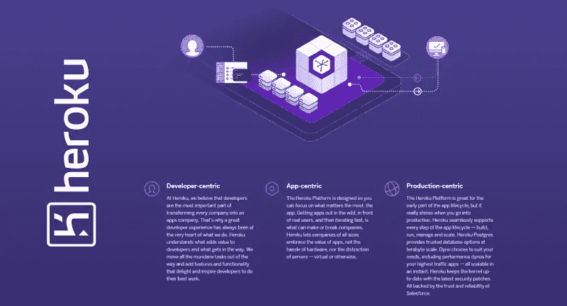
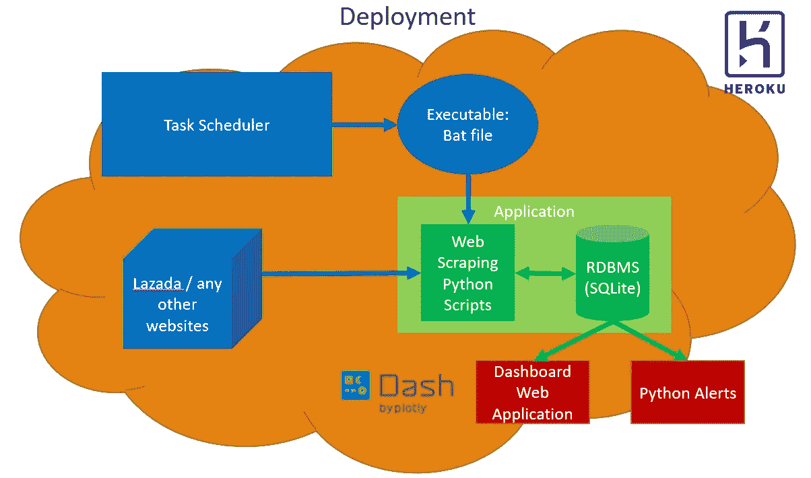
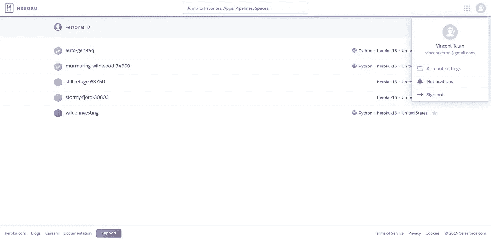
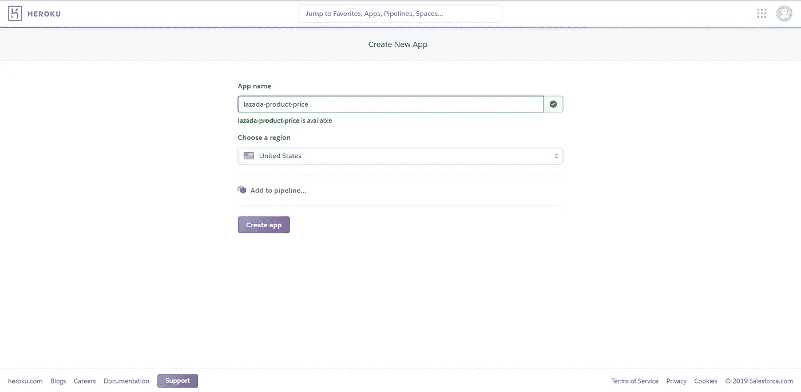
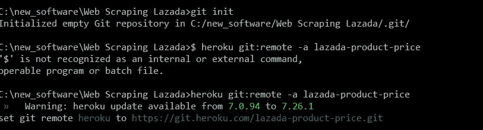
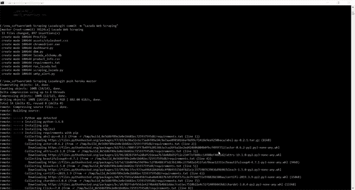
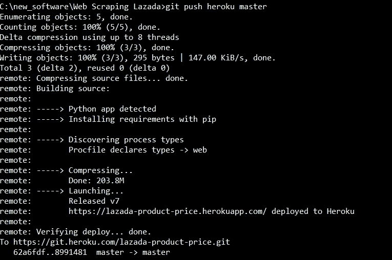
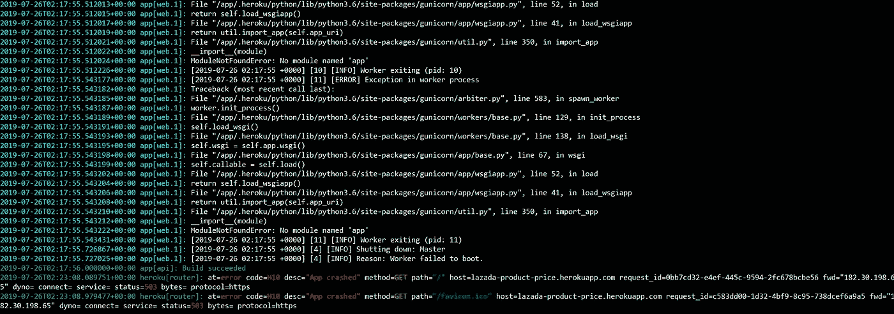

# 部署您的第一个分析项目

> 原文：<https://towardsdatascience.com/deploy-your-first-analytics-project-9280ea31b0ac?source=collection_archive---------30----------------------->

## 数据专业人员权威指南(数据分析)

## 用 Heroku 部署 Lazada 的 Web 抓取仪表板


Source: Unsplash

# 问题陈述:

对于数据科学家来说，将您的应用程序部署到云中，让任何技术或非技术用户都可以访问它是非常重要的。根据我的工作经验，数据科学家创建机器学习模型，而工程师部署它们的期望已经不复存在。大多数时候，数据科学家需要同时做两件事:设计他们的数据模型和部署他们的数据应用程序(开发-运营)。

> 如果我们可以轻松自由地为我们的用户部署我们的数据应用程序，那该有多好。

# 进入 Heroku



Source Heroku

Heroku 是一个广泛使用的商业软件平台(PaaS ),它使数据专业人员更容易构建、管理和部署各种规模的应用程序。这意味着您现在可以专注于开发分析应用程序，而无需担心部署基础架构。Heroku 为您处理所有部署的繁重工作！

简而言之，无论您在本地 Jupyter 服务器上运行什么，您都可以将其部署到云上，供用户使用！


Source: Giphy

# Heroku 在行动



Our Application in Big Picture, today we are going to learn how to deploy our application with Heroku

在本教程中，您将学习如何使用 Heroku 部署您的 Python [Dashboard Web 应用程序](/build-your-own-data-dashboard-93e4848a0dcf)。我们将部署仪表板来查看 Lazada 产品的价格下降并生成警报。

请随意欣赏这篇文章或访问我的 [Github Repo](https://github.com/VincentTatan/Web-Scraping/blob/master/Selenium%20Web%20Scraping/lazada/dashboard.py) 获取完整代码。或者向下滚动，欣赏这篇文章。

对于不熟悉我提到的仪表板 Web 应用程序的人来说。我正在建立一个基于 Lazada 报废产品价格变化的仪表板。每当用户修改下拉输入时，如果产品价格下降，应用程序会提醒用户。

**我们的任务**是用 Heroku 在云上部署这个应用程序。最终结果是一个[链接，你可以分享给你的朋友或同事，以访问和监控 Lazada 产品的价格趋势。](https://lazada-product-price.herokuapp.com/)


Price Optimization Dashboard Scraped from Lazada over 3 days

## 以下是实现这一目标的关键步骤:

1.  注册 Heroku 帐户
2.  创建新应用程序
3.  设置部署配置和库
4.  使用 Heroku Toolbelt 部署您的第一个应用程序
5.  调试和故障排除

# 注册 Heroku 帐户

访问 Heroku 并注册。然后，您会收到一封电子邮件通知，确认您的帐户创建。

一旦你准备好了，进入你的账户，你就可以访问你的个人应用主页。



Heroku Main Application Pages

# 创建新应用程序

继续点击页面右上角的*新应用*。输入您的应用程序名称，然后单击创建应用程序。



Creating new app

# 设置部署配置和库

Heroku 的第一页需要两个文件:requirements.txt 和 Procfile。

1.  **requirements.txt** 将在您运行应用程序时存储您的 Python 环境中的所有 Python 库和依赖项。您可以运行`pip freeze > **requirements**.**txt**` 将 Python 库转储到一个文件中
2.  **Procfile** 将指定部署标准，例如您使用的 dynos 类型。[**Dynos**](https://www.heroku.com/dynos)**是在 Heroku 平台上运行和缩放 app 的容器模型。这是一种非常可扩展和可靠的方式来平衡流量，并让您的应用程序在小引擎单元内运行。在这种情况下，我们将使用 gunicorn 作为我们与 dynos 交互的接口。**

## **Gunicorn 作为 Web 应用服务**

****

**[Source](https://www.fullstackpython.com/green-unicorn-gunicorn.html)**

****Gunicorn** 是一个 WSGI 接口，这意味着它可以托管任何 Python 可编程 web 应用程序，并确保与我们的 Dash Python 和 Flask 库进行适当的通信。**

**Gunicorn 负责 web 服务器和 web 应用程序之间的任务。它还可以帮助您运行 web 应用程序的多个实例，检查实例的健康状况，并在负载平衡这些实例时根据需要重置它们。我们已经做了很多努力来优化它，所以我们可以很容易地使用它。酷！**

**只需将这一行代码放在 Procfile 中，指示 dynos 使用 gunicorn web 界面。**

```
web: gunicorn app:server
```

# **使用 Heroku Toolbelt 部署您的第一个应用程序**

**使用 Heroku 有很多部署方式。但是我发现的最简单的方法之一是使用 Heroku Toolbelt。参考[此链接](https://devcenter.heroku.com/articles/heroku-cli#download-and-install)下载工具箱。**

**然后我们将使用 git 和 heroku 命令来部署我们的应用程序。**

****

**Initiating git in your code repos and deploying it with heroku**

**然后一旦你把它推入 heroku，你会看到你的主机将安装你在 requirements.txt 中指定的所有库。**

****

**Installing libraries from requirements.txt**

**在服务器完成它的任务后，你将获得链接来访问我们的应用程序。**

****

> **恭喜你，你刚刚在 Heroku 上部署了你的第一个应用！**

****

**YAY!! Source: Giphy**

# **调试和故障排除**

**在大多数情况下，您会遇到一些部署问题。因此，要对此进行调试，您可以插入命令`**heroku logs -tail.**`**

**该命令将返回以下日志，这些日志将告诉您应用程序崩溃的原因。**

****

**Heroku Logs to debug**

**这里说我仪表盘上的模块不叫 app。这是因为我将我的主应用程序命名为 dashboard.py，而不是 app.py。这导致了错误，因为 Flask 找不到要运行的主应用程序脚本。因此，我们可以重命名为 app.py，然后再次推送应用程序。**

**如果你遇到更多的问题，只需谷歌日志错误，堆栈溢出或破折号文件。如果没有，请在这里随意评论，我会尽快回复。干杯:)**

# **最终结果**

**恭喜你！！您已经部署了第一个数据应用程序。如果你做得正确，你将能够在你的 [链接](https://lazada-product-price.herokuapp.com/)上[访问应用程序。如果没有，请随意查阅我的](https://lazada-product-price.herokuapp.com/) [Github 代码](https://github.com/VincentTatan/Web-Scraping/blob/master/Selenium%20Web%20Scraping/lazada/dashboard.py?source=post_page---------------------------)或者在这里提出你的问题。**

****

**Price Optimization Dashboard Scraped from Lazada over 3 days**

> **现在，使用 Heroku 释放和部署您的分析应用程序**

# **更多参考**

**如果你需要更多的例子和更好的见解，Heroku 可以提供一些引擎。请随意访问以下链接。**

1.  **H [eroku 主站点](https://dashboard.heroku.com/apps)**
2.  **[将 Dash 部署到 Heroku](https://medium.com/@austinlasseter/how-to-deploy-a-simple-plotly-dash-app-to-heroku-622a2216eb73)**
3.  **[Heroku 定价和服务](https://www.heroku.com/pricing)**

# **最后…**

****

**Source: Unsplash**

**我真的希望这是一本很棒的读物，是你发展和创新的灵感来源。**

**请在下面**评论**出来建议和反馈。就像你一样，我也在学习如何成为一名更好的数据科学家和工程师。请帮助我改进，以便我可以在后续的文章发布中更好地帮助您。**

**谢谢大家，编码快乐:)**

# **关于作者**

**Vincent Tatan 是一名数据和技术爱好者，拥有在 Google LLC、Visa Inc .和 Lazada 实施微服务架构、商业智能和分析管道项目的相关工作经验[。](https://bit.ly/2I8jkWV.?source=post_page---------------------------)**

**Vincent 是土生土长的印度尼西亚人，在解决问题方面成绩斐然，擅长全栈开发、数据分析和战略规划。**

**他一直积极咨询 SMU BI & Analytics Club，指导来自不同背景的有抱负的数据科学家和工程师，并为企业开发他们的产品开放他的专业知识。**

**文森特还在 best top 上开设了他的一对一导师服务，指导你如何在谷歌、Visa 或其他大型科技公司获得你梦想中的数据分析师/工程师职位。 [**如果你正在寻找良师益友，请在这里预约他**](https://www.besttopcareer.com/mentors-datascience) **。****

**最后，请通过 [**LinkedIn**](http://www.linkedin.com/in/vincenttatan/?source=post_page---------------------------) **，**[**Medium**](https://medium.com/@vincentkernn?source=post_page---------------------------)**或** [**Youtube 频道**](https://www.youtube.com/user/vincelance1/videos?source=post_page---------------------------) 联系文森特**