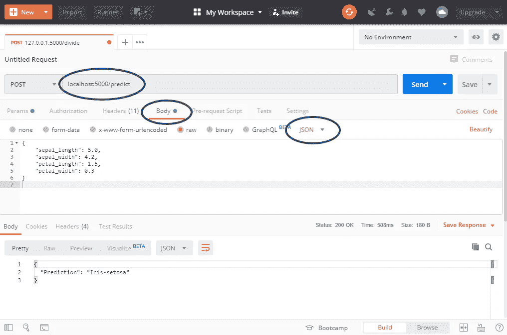

# 将您的机器学习模型部署为 REST API

> 原文：<https://towardsdatascience.com/deploy-your-machine-learning-model-as-a-rest-api-4fe96bf8ddcc?source=collection_archive---------9----------------------->

## 部署机器学习模型对初学者来说可能听起来有些吓人，甚至对那些有一些经验的人来说也是如此。这就是为什么我决定花一整篇文章来谈论它。


Photo by [Franck V.](https://unsplash.com/@franckinjapan?utm_source=medium&utm_medium=referral) on [Unsplash](https://unsplash.com?utm_source=medium&utm_medium=referral)

读完这篇文章后，你将能够部署机器学习模型，并根据你想要的任何编程语言进行预测。没错，你可以坚持使用 Python，或者你可以通过 Java 或 Kotlin 直接在你的 Android 应用中进行预测。此外，您可以在您的 web 应用程序中直接使用该模型——选项是无限的。为了简单起见，我将使用[邮递员](https://www.getpostman.com/)。

然而，我不会解释如何将模型放在一个活动的服务器上，因为选项是无穷无尽的，这可能是另一个帖子的好主意。该模型将在您的**本地主机**上运行，所以不，您将无法从不同的网络访问它(*但是可以随意谷歌如何将模型部署到 AWS 或类似的东西*)。

我已经创建了下面的**目录结构**:

*ML-展开*

*   *model / Train.py*
*   *app.py*

现在如果你已经通过 **Anaconda** 安装了你的 Python，那么你可能已经预装了所有的库，除了 ***Flask*** 。因此，启动终端并执行以下命令:

```
pip install Flask
pip install Flask-RESTful
```

***进展顺利吗？*** 好。现在让我们开始研究一些好东西吧。

# 制作一个基本的预测脚本

如果您正在按照目录结构进行操作，现在应该打开***model/train . py***文件。目标是载入 ***Iris*** 数据集，并使用简单的**决策树分类器**来训练模型。一旦训练完成，我将使用 ***joblib*** 库来保存模型，并且我还将向用户报告准确度分数。

这里没有什么复杂的，因为机器学习不是本文的重点，只有模型部署。以下是完整的脚本:

```
from sklearn import datasets
from sklearn.tree import DecisionTreeClassifier
from sklearn.model_selection import train_test_split
from sklearn.metrics import accuracy_score
from sklearn.externals import joblib

def train_model():
    iris_df = datasets.load_iris()

    x = iris_df.data
    y = iris_df.target

    X_train, X_test, y_train, y_test = train_test_split(x, y, test_size=0.25)
    dt = DecisionTreeClassifier().fit(X_train, y_train)
    preds = dt.predict(X_test)

    accuracy = accuracy_score(y_test, preds)
    joblib.dump(dt, 'iris-model.model')
    print('Model Training Finished.\n\tAccuracy obtained: {}'.format(accuracy))
```

# 部署

现在你已经准备好打开 ***app.py*** 文件并进行一些导入。你需要 ***os*** 模块，一些来自 ***Flask*** 和***Flask-RESTful***的东西，10 秒钟前创建的模型训练脚本，以及 ***joblib*** 来加载训练好的模型:

```
import os
from flask import Flask, jsonify, request
from flask_restful import Api, Resource
from model.Train import train_model
from sklearn.externals import joblib
```

现在你应该从 ***Flask-RESTful*** 中创建一个 ***Flask*** 和 ***Api*** 的实例。没什么复杂的:

```
app = Flask(__name__)
api = Api(app)
```

接下来要做的是检查模型是否已经训练好了。在 ***Train.py*** 中，您已经声明了模型将被保存在文件***iris-model . model***中，如果该文件不存在，则应该先对模型进行训练。一旦训练完毕，你就可以通过 ***joblib*** 加载它:

```
if not os.path.isfile('iris-model.model'):
    train_model()

model = joblib.load('iris-model.model')
```

现在，您需要声明一个用于进行预测的类。***Flask-RESTful***使用这个编码约定，所以你的类需要从***Flask-RESTful Resource***模块继承。在类内部，可以声明 ***get()*** ， ***post()*** ，或者其他任何处理数据的方法。

我们将使用 ***post()*** ，因此数据不会直接通过 URL 传递。您需要从用户输入中获取属性(*根据用户输入的属性值进行预测*)。然后，可以调用 ***。*预测()**加载模型的功能。仅仅因为这个数据集的目标变量是以( *0，1，2* )的形式而不是( *'Iris-setosa '，' Iris-versicolor '，' Iris-virginica'* )的形式，您还需要解决这个问题。最后，您可以返回预测的 JSON 表示:

```
class MakePrediction(Resource):
    @staticmethod
    def post():
        posted_data = request.get_json()
        sepal_length = posted_data['sepal_length']
        sepal_width = posted_data['sepal_width']
        petal_length = posted_data['petal_length']
        petal_width = posted_data['petal_width']

        prediction = model.predict([[sepal_length, sepal_width, petal_length, petal_width]])[0]
        if prediction == 0:
            predicted_class = 'Iris-setosa'
        elif prediction == 1:
            predicted_class = 'Iris-versicolor'
        else:
            predicted_class = 'Iris-virginica'

        return jsonify({
            'Prediction': predicted_class
        })
```

我们就要到了，坚持住！您还需要声明一个路由，这是 URL 中用于处理请求的部分:

```
api.add_resource(MakePrediction, '/predict')
```

最后，告诉 Python 让**在调试模式下运行应用**:

```
if __name__ == '__main__':
    app.run(debug=True)
```

仅此而已。您已经准备好启动模型并进行预测，无论是通过 Postman 还是其他工具。

以防你遗漏了什么，这里有完整的 ***app.py*** 文件:

```
import os
from flask import Flask, jsonify, request
from flask_restful import Api, Resource
from model.Train import train_model
from sklearn.externals import joblib

app = Flask(__name__)
api = Api(app)

if not os.path.isfile('iris-model.model'):
    train_model()

model = joblib.load('iris-model.model')

class MakePrediction(Resource):
    @staticmethod
    def post():
        posted_data = request.get_json()
        sepal_length = posted_data['sepal_length']
        sepal_width = posted_data['sepal_width']
        petal_length = posted_data['petal_length']
        petal_width = posted_data['petal_width']

        prediction = model.predict([[sepal_length, sepal_width, petal_length, petal_width]])[0]
        if prediction == 0:
            predicted_class = 'Iris-setosa'
        elif prediction == 1:
            predicted_class = 'Iris-versicolor'
        else:
            predicted_class = 'Iris-virginica'

        return jsonify({
            'Prediction': predicted_class
        })

api.add_resource(MakePrediction, '/predict')

if __name__ == '__main__':
    app.run(debug=True)
```

***好了，准备好了吗？***

太好了。导航到根目录(*其中****app . py****)，启动终端并执行以下操作:*

```
*python app.py*
```

*大约一秒钟后，您会得到一个输出，显示应用程序正在本地主机上运行。*

*现在我将打开**邮递员**并执行以下操作:*

*   *将方法更改为 POST*
*   *输入 localhost:5000/predict 作为 URL*
*   *在 Body 选项卡中，选择 JSON*
*   *输入一些 JSON 进行预测*

*然后，您可以点击发送:*

**

*瞧啊。几乎立刻你就能从你的模型中得到预测。*

# *最后的话*

*我希望你已经设法看完了这篇文章。如果你只是复制粘贴所有的东西，只要你安装了所有必要的库，你就可以开始了。*

*我强烈建议将这些新获得的知识用于您自己的数据集和您自己的业务问题。如果你在用 Python 之外的其他语言编写应用程序，并且只是将 Python 用于数据和机器学习相关的东西，这就很方便了。*

*感谢阅读，保重。*

*喜欢这篇文章吗？成为 [*中等会员*](https://medium.com/@radecicdario/membership) *继续无限制学习。如果你使用下面的链接，我会收到你的一部分会员费，不需要你额外付费。**

*[](https://medium.com/@radecicdario/membership) [## 通过我的推荐链接加入 Medium-Dario rade ci

### 作为一个媒体会员，你的会员费的一部分会给你阅读的作家，你可以完全接触到每一个故事…

medium.com](https://medium.com/@radecicdario/membership)*