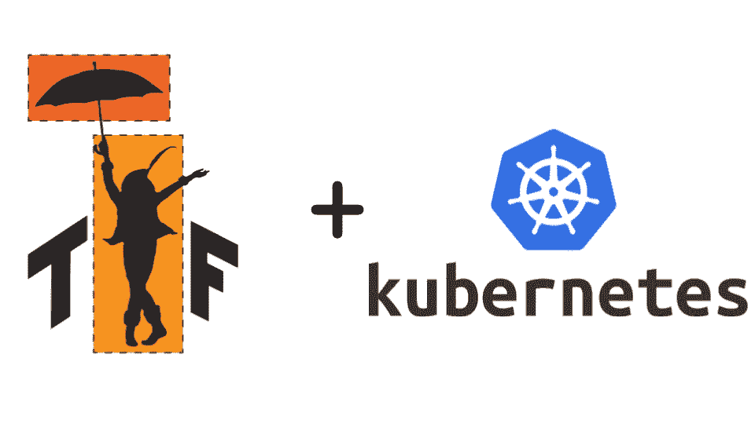
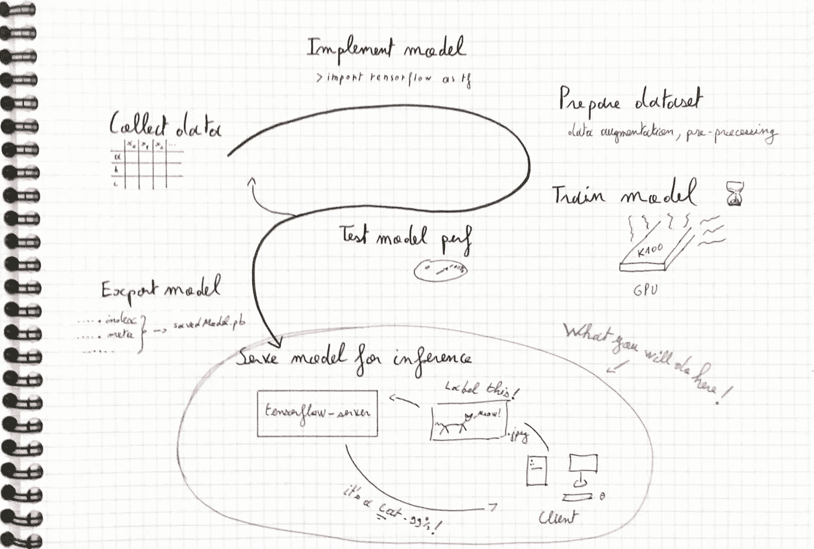
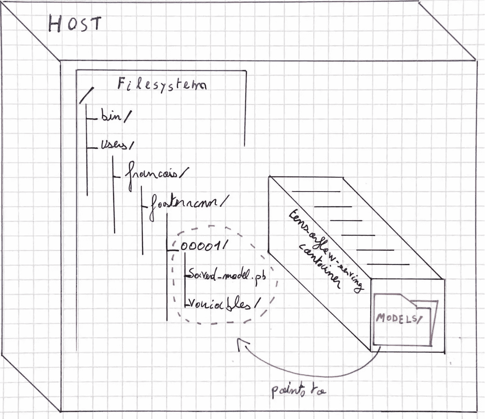
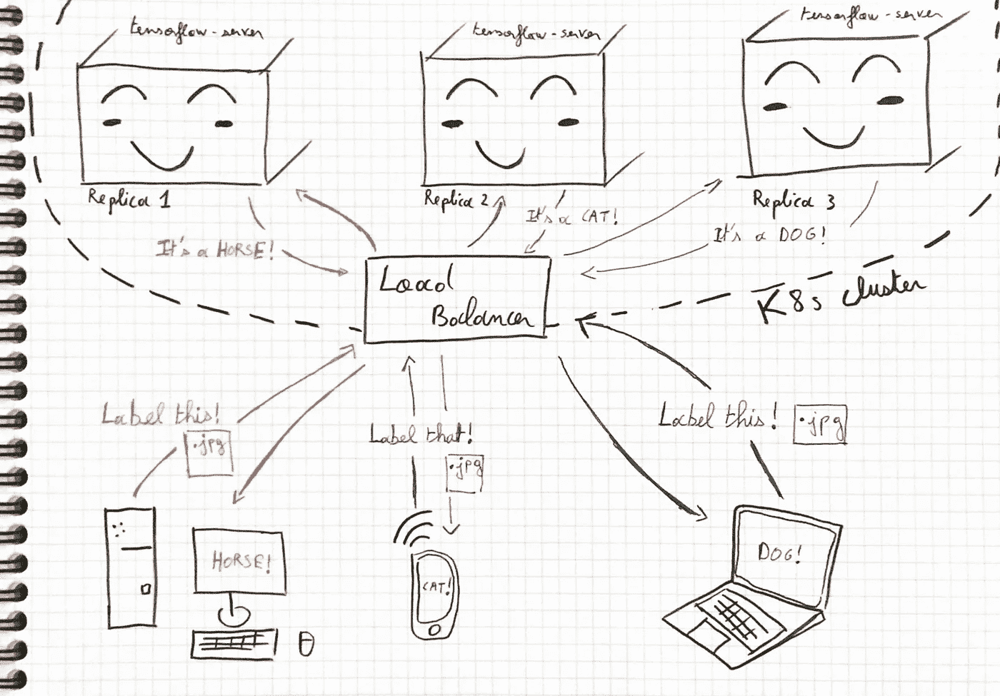
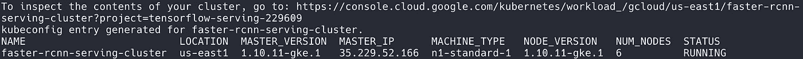
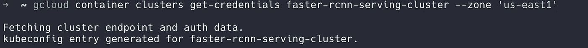
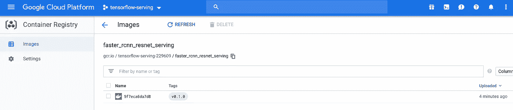
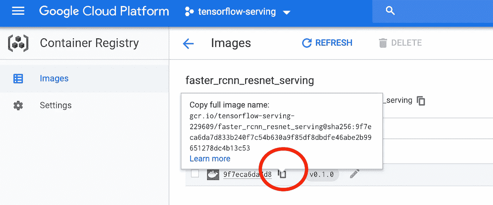
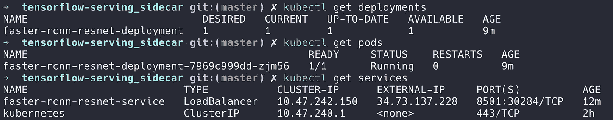
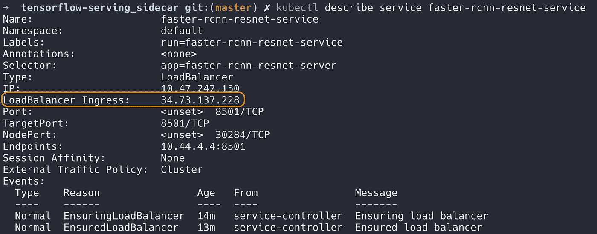

# 使用 tensorflow 服务和 kubernetes 部署您的机器学习模型

> 原文：<https://towardsdatascience.com/deploy-your-machine-learning-models-with-tensorflow-serving-and-kubernetes-9d9e78e569db?source=collection_archive---------6----------------------->



机器学习应用正在蓬勃发展，但数据工程师没有很多工具可以将这些强大的模型集成到生产系统中。在这里，我将讨论 tensorflow-serving 如何帮助您在产品中加速交付模型。这篇博文是关于服务机器学习模型的— *什么意思？*

> 服务是你如何在训练后应用一个 ML 模型——从事 tensorflow 服务的 Noah Fiedel 软件工程师

为了说明 [tensorflow 服务于](https://www.tensorflow.org/serving/)的能力，我将介绍服务于对象检测模型的步骤。在我的 GitHub 上找到与本文相关的所有代码:[https://github.com/fpaupier/tensorflow-serving_sidecar](https://github.com/fpaupier/tensorflow-serving_sidecar)



Summary of a machine learning pipeline — here we focus on serving the model

*张量流简而言之*

Tensorflow 服务使您能够无缝地服务于您的机器学习模型。

*   部署新版本的模型，让 tensorflow 服务优雅地完成当前请求，同时开始使用新模型服务新请求。
*   分开考虑，数据科学家可以专注于构建出色的模型，而运营部门则可以专注于构建可服务于这些模型的高度灵活且可扩展的架构。

# 第 1 部分—预热:设置本地 tensorflow 服务器

在上线之前，最好确保你的服务器在本地工作。我在这里给出了大的步骤，在项目`readme`中找到更多的文档。
[看看设置步骤](https://github.com/fpaupier/tensorflow-serving_sidecar/blob/master/docs/setup.md)以确保您能从本教程中获得最大收益:

1.  git 克隆[https://github.com/fpaupier/tensorflow-serving_sidecar](https://github.com/fpaupier/tensorflow-serving_sidecar)，创建 python3.6.5 虚拟环境并安装`requirements.txt`
2.  获取 tensorflow 服务 docker 图片`docker pull tensorflow/serving`
3.  得到一个模型来服务→我用这个，它执行对象检测[更快 _rcnn_resnet101_coco](http://download.tensorflow.org/models/object_detection/faster_rcnn_resnet101_coco_2018_01_28.tar.gz)
4.  转到模型目录，用版本号重命名`saved model`子目录，因为我们在这里做的是 v1，让我们称它为`00001`(它必须是数字)。我们这样做是因为 tensorflow serving docker image 在搜索要提供的模型时会搜索以该约定命名的文件夹。
5.  现在运行 tensorflow 服务器:

```
# From tensorflow-serving_sidecar/
docker run -t --rm -p 8501:8501 \
   -v "$(pwd)/data/faster_rcnn_resnet101_coco_2018_01_28:/models/faster_rcnn_resnet" \
   -e MODEL_NAME=faster_rcnn_resnet \
   tensorflow/serving &
```

在继续之前，请注意:



docker -v arg in our use case

这里我们绑定了容器的端口和本地主机。因此，当我们在`localhost:8501`上调用推断时，我们实际上将调用 tensorflow 服务器。

您还会注意到我们将本地主机目录`faster_rcnn_resnet101_coco_2018_01_28`——存储模型的地方——与容器`/models/faster_rcnn_resnet`路径链接起来。

请记住，此时`savedModel.pb`只在您的机器上，而不在容器中。

6.执行客户呼叫:

```
# Don't forget to activate your python3.6.5 venv

# From tensorflow-serving_sidecar/
python client.py --server_url "http://localhost:8501/v1/models/faster_rcnn_resnet:predict" \
--image_path "$(pwd)/object_detection/test_images/image1.jpg" \
--output_json "$(pwd)/object_detection/test_images/out_image1.json" \
--save_output_image "True" \
--label_map "$(pwd)/data/labels.pbtxt"
```

去查看`--output_json` 指定的路径，享受结果。(提供 json 和 jpeg 输出)


expected inference with our object detection model

很好，现在我们的模型运行良好，让我们将它部署到云上。

# 第 2 部分—在具有 tensorflow 服务的 kubernetes 集群上服务您的机器学习应用程序

在生产环境中，您希望能够随着应用程序负载的增加而扩展。你不希望你的服务器不堪重负。


An exhausted tensorflow server directly exposed over the network

为了避免这个问题，您将使用 kubernetes 集群来服务您的 tensorflow-server 应用程序。预期的主要改进:

*   负载将在您的副本之间平衡，您无需考虑这一点。
*   您是否希望在不停机的情况下部署新模型？没问题，kubernetes 支持你。执行滚动更新，逐步为您的新模型提供服务，同时适度终止旧模型上的当前请求。



a tensorflow server application running on many replicas in a k8s cluster, ensuring high availability to users

**我们开始吧**

首先，我们想要创建一个嵌入了对象检测模型的完整 docker 图像。一旦完成，我们将在 kubernetes 集群上部署它。我在[谷歌云平台](https://cloud.google.com/)上运行我的例子，因为免费层使得免费运行这个教程成为可能。为了帮助你在 GCP 建立云环境，你可以点击这里查看我的教程。

## 创建自定义 tensorflow 服务 docker 图像

1.  将服务映像作为守护程序运行:

```
docker run -d --name serving_base tensorflow/serving
```

2.将`faster_rcnn_resnet101_coco`模型数据复制到容器的`models/`文件夹中:

```
# From tensorflow-serving_sidecar/
docker cp $(pwd)/data/faster_rcnn_resnet101_coco_2018_01_28 serving_base:/models/faster_rcnn_resnet
```

3.提交容器以服务于`faster_rcnn_resnet`模型:

```
docker commit --change "ENV MODEL_NAME faster_rcnn_resnet" serving_base faster_rcnn_resnet_serving
```

*注意:*如果您使用不同的型号，相应地更改`--change`参数中的`faster_rcnn_resnet`。

`faster_rcnn_resnet_serving`将成为我们新的服务形象。您可以通过运行`docker images`来检查这一点，您应该会看到一个新的 docker 图像:


docker images result after creating a custom tensorflow-serving image

4.停止服务基本容器

```
docker kill serving_base
docker rm serving_base
```

太好了，下一步是测试我们全新的`faster_rcnn_resnet_serving` 形象。

## 测试定制服务器

在 kubernetes 上部署我们的应用程序之前，让我们确保它正常工作。

1.  启动服务器:

```
docker run -p 8501:8501 -t faster_rcnn_resnet_serving &
```

*注意:*确保您已经停止(`docker stop <CONTAINER_NAME>`)之前运行的服务器，否则端口`8501`可能会被锁定。

2.我们可以使用相同的客户端代码来调用服务器。

```
# From tensorflow-serving_sidecar/
python client.py --server_url "http://localhost:8501/v1/models/faster_rcnn_resnet:predict" \
--image_path "$(pwd)/object_detection/test_images/image1.jpg" \
--output_json "$(pwd)/object_detection/test_images/out_image2.json" \
--save_output_image "True" \
--label_map "$(pwd)/data/labels.pbtxt"
```

我们可以检查我们是否有相同的好的，现在让我们在`kubernetes`集群上运行它。

## 在 kubernetes 上部署我们的应用

除非你已经在 GCP 上运行了一个项目，否则我建议你检查一下[谷歌云设置步骤](https://github.com/fpaupier/tensorflow-serving_sidecar/blob/master/docs/gcp_setup.md)。

我假设你已经创建并登录了一个名为`tensorflow-serving`的`gcloud`项目

您将使用之前构建的容器映像`faster_rcnn_resnet_serving`在 [Google 云平台](https://cloud.google.com/)中部署带有 [Kubernetes](https://kubernetes.io/) 的服务集群。

1.  登录您的项目，首先用`gcloud projects list`列出可用的项目，选择项目的`PROJECT_ID`并运行

```
# Get the PROJECT_ID, not the name
gcloud projects list # Set the project with the right PROJECT_ID, i.e. for me it is tensorflow-serving-229609
gcloud config set project tensorflow-serving-229609
gcloud auth login
```

2.创建一个容器集群

*   首先，我们为服务部署创建一个 [Google Kubernetes 引擎](https://cloud.google.com/container-engine/)集群。由于免费试用的限制，您在这里不能使用超过 2 个节点，您可以升级或使用两个节点，这对我们的用例来说已经足够好了。在你的免费试用中，你的限额是 8 个 CPU。)

```
gcloud container clusters create faster-rcnn-serving-cluster --num-nodes 2 --zone 'us-east1'
```

您可以更新`zone` arg，您可以在*中选择，例如* : `europe-west1`，`asia-east1` -您可以使用`gcloud compute zones list`检查所有可用的区域。你应该有这样的东西:



kubernetes cluster creation output

3.为 gcloud container 命令设置默认集群，并将集群凭证传递给 [kubectl](https://kubernetes.io/docs/reference/kubectl/overview/) 。

```
gcloud config set container/cluster faster-rcnn-serving-cluster
gcloud container clusters get-credentials faster-rcnn-serving-cluster --zone 'us-east1'
```

之后您应该会看到这样的内容:



gcloud container clusters get-credentials output

4.上传我们之前构建的自定义 tensorflow 服务 docker 图像。让我们将我们的图像推送到 [Google 容器注册表](https://cloud.google.com/container-registry/docs/)，这样我们就可以在 Google 云平台上运行它。

使用容器注册表格式和我们的项目 id 标记`faster_rcnn_resnet_serving`图像，用您的`PROJECT_ID`更改`tensorflow-serving-229609`。最后还要修改标签，这是我们的第一个版本，所以我把标签设为`v0.1.0`。

```
docker tag faster_rcnn_resnet_serving gcr.io/tensorflow-serving-229609/faster_rcnn_resnet_serving:v0.1.0
```

如果你运行`docker images`，你现在会看到一个额外的`gcr.io/tensorflow-serving-229609/faster_rcnn_resnet_serving:v0.1.0`图像。

这个`gcr.io`前缀允许我们将图像直接推送到容器注册中心，

```
# To do only once
gcloud auth configure-dockerdocker push gcr.io/tensorflow-serving-229609/faster_rcnn_resnet_serving:v0.1.0
```

您已经成功地将您的图像推送到 GCP 集装箱注册中心，您可以在线查看:



docker image successfully pushed on Google Container Registry

5.创建 Kubernetes 部署和服务

该部署由一个由 [Kubernetes 部署](https://kubernetes.io/docs/concepts/workloads/controllers/deployment/)控制的 fast-rcnn 推理服务器的单一副本组成。副本通过 [Kubernetes 服务](https://kubernetes.io/docs/concepts/services-networking/service/)和[外部负载平衡器](https://kubernetes.io/docs/tasks/access-application-cluster/create-external-load-balancer/)对外公开。

使用单个副本实际上没有意义。我这样做只是为了在自由层内通过。如果您只有一个实例来指导您的查询，那么负载平衡是没有用的。在生产设置中，使用多个副本。

我们使用示例 Kubernetes config[faster _ rcnn _ resnet _ k8s . YAML](https://github.com/fpaupier/tensorflow-serving_sidecar/blob/master/faster_rcnn_resnet_k8s.yaml)来创建它们。您只需要更新 docker 图像以在文件中使用，用您的实际图像全名替换行`image: <YOUR_FULL_IMAGE_NAME_HERE>`，看起来像这样:

```
image: gcr.io/tensorflow-serving-229609/faster_rcnn_resnet_serving@sha256:9f7eca6da7d833b240f7c54b630a9f85df8dbdfe46abe2b99651278dc4b13c53
```

您可以在容器注册表中找到它:



find your docker full image name on google container registry

然后运行以下命令

```
# From tensorflow-serving_sidecar/
kubectl create -f faster_rcnn_resnet_k8s.yaml
```

要检查部署和 pod 的状态，请使用`kubectl get deployments`来监视整个部署，使用`kubectl get pods`来监视部署的每个副本，使用`kubectl get services`来监视服务。



sanity check for deployment

一切正常运行可能需要一段时间。服务外部`IP`地址列在负载平衡器入口的旁边。您可以使用`kubectl describe service`命令来检查它:

```
kubectl describe service faster-rcnn-resnet-service
```



find the IP address to query upon to perform inference

## 查询您的在线模型

最后，让我们来测试一下。我们可以使用相同的[客户端代码](https://github.com/fpaupier/tensorflow-serving_sidecar/blob/master/client.py)。简单地将前面使用的`--server-url`参数中的`localhost`替换为上面指定的负载平衡器入口的`IP`地址。

```
# From tensorflow-serving_sidecar/
python client.py --server_url "http://34.73.137.228:8501/v1/models/faster_rcnn_resnet:predict" \
--image_path "$(pwd)/object_detection/test_images/image1.jpg" \
--output_json "$(pwd)/object_detection/test_images/out_image3.json" \
--save_output_image "True" \
--label_map "$(pwd)/data/labels.pbtxt"
```

# 外卖食品

Tensorflow 服务提供了一个很好的基础，您可以依靠它以很少的开销在生产中快速部署您的模型。

*   机器学习应用程序的容器化部署能够*分离运营和数据科学家之间的关注点*
*   Kubernetes 等容器编排解决方案与 tensorflow-serving 相结合，为不熟悉分布式计算的人提供了在几分钟内部署高可用性模型的可能性。

**资源📚**

*   Tensorflow 服务由谷歌的软件工程师 Noah Fiedel 解释，他从事 Tensorflow 服务。它让我们深入了解它是如何建造的以及建造的目的是什么[https://www.youtube.com/watch?v=q_IkJcPyNl0](https://www.youtube.com/watch?v=q_IkJcPyNl0)
*   免费提供预训练模型库[https://github . com/tensor flow/models/blob/master/research/object _ detection/g3doc/detection _ model _ zoo . MD](https://github.com/tensorflow/models/blob/master/research/object_detection/g3doc/detection_model_zoo.md)
*   Tyler Labonte medium post 将 tensorflow 模型导出为保存的检查点[https://medium . com/@ tmlabonte/serving-image-based-deep-learning-models-with-tensor flow-servings-restful-API-d 365 c 16 a7 DC 4](https://medium.com/@tmlabonte/serving-image-based-deep-learning-models-with-tensorflow-servings-restful-api-d365c16a7dc4)
*   提供一个没有合适框架的 ML 模型是多么麻烦的例子[https://towardsdatascience . com/how-to-build-and-deploy-a-lyrics-generation-model-framework-agnostic-589 f 3026 FD 53](/how-to-build-and-deploy-a-lyrics-generation-model-framework-agnostic-589f3026fd53)
*   Cloud ML，用于部署 ML 模型的 Google 托管解决方案:[https://cloud . Google . com/ML-engine/docs/tensor flow/deploying-models](https://cloud.google.com/ml-engine/docs/tensorflow/deploying-models)