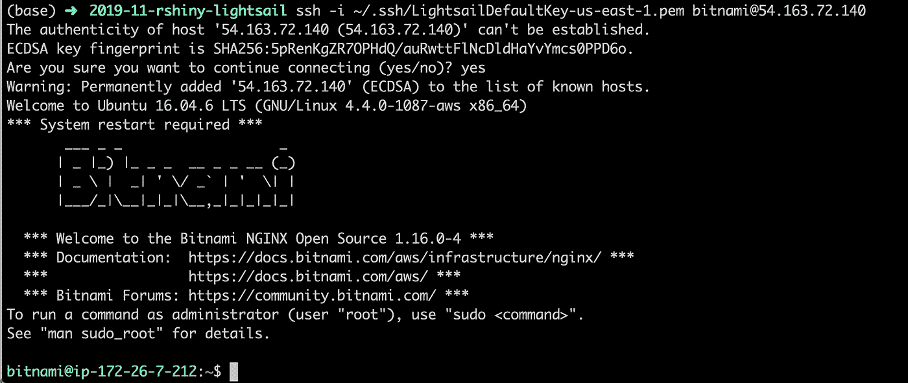

# 在 AWS 系列— Lightsail 上部署您的 RShiny 应用程序

> 原文：<https://towardsdatascience.com/deploy-your-rshiny-app-on-aws-series-lightsail-d56a05f85ad9?source=collection_archive---------40----------------------->

## 快速轻松地部署您的 RShiny 应用程序

如果您正在考虑为您的 [RShiny](https://shiny.rstudio.com/) 应用选择哪种部署场景，请不要再犹豫了！我已经为您计划了一整个系列的各种部署选项，以及为什么您应该选择每一个。

如果你像我一样，喜欢看视频而不是看博客，那就去我的 [YouTube](https://youtu.be/CtYEGPt-PCw) 频道看看这篇文章吧！

# 为什么应该使用 AWS Lightsail 进行 RShiny 部署？

部署场景像雪花一样。没有两个人是完全一样的！；-)对于不同的部署场景，您需要不同级别的电源和控制。这里我们将讨论 RShiny 部署，但它适用于几乎所有情况。

Lightsail 是整个 AWS 部署生态系统中相对较新的成员。与其他一些更强大的解决方案相比，它使部署 web 应用程序变得更加简单和高效。

如果符合以下条件，Lightsail 将是您部署的好选择:

*   部署 web 应用程序或配置 web 服务器(Apache、NGINX)会让你感觉不舒服。
*   你可以配置 web 服务器，但是你需要一些快速简单的东西。
*   你有一个很小的应用程序，你不希望流量出现大的峰值。

现在，每一点都有其例外。对我自己来说，我知道如何配置 web 服务器，但我仍然喜欢让我的生活更轻松的工具。如果我需要一个快速启动并运行的演示，或者一个不会存在很长时间的小应用程序，我不会花时间去计划一些复杂的部署场景，这些场景包含可伸缩的节点。虽然这很有趣，但也有点矫枉过正。

简单地说，许多 AWS 部署工具是弹性的或自动伸缩的，这意味着您可以根据需求进行伸缩。Lightsail 非常简单，没有任何弹性。

# 不使用 AWS Lightsail 部署 RShiny 应用程序的理由

如果预计流量会出现大峰值，您就不要使用 Lightsail。那么您将需要一个具有自动扩展能力的更强大的解决方案。更强大通常意味着更复杂。由于 Lightsail 将创建您的 EC2 实例，您可以随时从 Lightsail 开始，然后在需要更多功能时进行迁移。

# 创建您的 RShiny 基本实例

本教程的其余部分将假设您有一个 AWS 帐户。

前往[AWS light sail 主页。](https://lightsail.aws.amazon.com/ls/webapp/home)

选择实例位置和实例类型。我建议选择 NGINX 来证明你未来的生活。这可能是不必要的，取决于你的设置，但我喜欢它。更多关于 NGINX vs 无 NGINX 的稍后！


接下来点击 Change SSH key pair 来下载您的 SSH key pair。我知道它奇怪的措辞，但只要点击它。


一旦你点击它，你可以选择改变密钥对或者下载默认的。选择其中一个场景，并确保保存它！


最后，为您的实例命名，然后单击“创建实例”。


现在您已经准备好了实例，我们可以进入下一部分，实际上是运行 RShiny！

# 连接到您的 RShiny 实例

点击左上角返回 AWS Lightsail 主页。从那里，您将有一个实例列表。找到您之前创建的实例。我的名字叫 RShiny。


# 使用 web 界面连接

实际上，您可以单击 3 个垂直的橙色点，然后单击 connect，这将在 web 浏览器中显示一个终端。相当整洁！只需按连接，你的浏览器将启动一个终端。


# 使用终端连接

你也可以使用终端连接，这也是我想做的。我对自己的热键很挑剔！在该框的第二行中，它应该在左侧显示“正在运行”,并在右侧显示 IP 地址。IP 地址是您的公共 IP 地址。

```
chmod 600 ~/.ssh/LightsailDefaultKey-us-east-1.pem ssh -i ~/.ssh/LightsailDefaultKey-us-east-1.pem [bitnami@54.163.72.140](mailto:bitnami@54.163.72.140)
```

确保使用 ssh 密钥和实例的 IP 地址。我总是把我的从下载移到~/.ssh。



# 安装 RShiny 并运行一个示例

现在，我用康达安装了几乎所有的科学软件。如果你有其他的安装方法，那就试试吧。只要你把它安装好，你就万事俱备了！

```
wget https://repo.anaconda.com/miniconda/Miniconda3-latest-Linux-x86_64.sh chmod 777 *sh ./Miniconda3-latest-Linux-x86_64.sh -bexport PATH=$HOME/miniconda3/bin:$PATH # Conda forge has sooooo many packages conda config --add channels conda-forge # Create a conda environment called r-shiny and install the package r-shiny (add whatever packages you want here too) conda create -y -n r-shiny r-shiny
```


完成所有这些后，您应该会看到类似这样的内容。现在，如果您使用-b 安装了 Miniconda3，您将没有正确的 shell 别名来运行“conda activate”。使用旧的“source activate”语法，你就可以了。

```
source activate r-shiny
```

就是这样。现在我们准备开始玩一些代码！

# 从一个例子开始

即使你已经准备好了一个现实世界的应用程序，我还是建议你从最简单的场景开始。然后，当事情出错时，你就知道是哪里出错了。

这段代码主要摘自[闪亮的 github repo 示例。](https://github.com/rstudio/shiny-examples/blob/master/001-hello/app.R)

```
**#!/usr/bin/env Rscript**
library(shiny)

# Define UI for app that draws a histogram ----
ui <- fluidPage(

  # App title ----
  titlePanel("Hello Shiny!"),

  # Sidebar layout with input and output definitions ----
  sidebarLayout(

    # Sidebar panel for inputs ----
    sidebarPanel(

      # Input: Slider for the number of bins ----
      sliderInput(inputId = "bins",
                  label = "Number of bins:",
                  min = 1,
                  max = 50,
                  value = 30)

    ),

    # Main panel for displaying outputs ----
    mainPanel(

      # Output: Histogram ----
      plotOutput(outputId = "distPlot")

    )
  )
)
# Define server logic required to draw a histogram ----
server <- function(input, output) {

  # Histogram of the Old Faithful Geyser Data ----
  # with requested number of bins
  # This expression that generates a histogram is wrapped in a call
  # to renderPlot to indicate that:
  #
  # 1\. It is "reactive" and therefore should be automatically
  #    re-executed when inputs (input$bins) change
  # 2\. Its output type is a plot
  output$distPlot <- renderPlot({

    x    <- faithful$waiting
    bins <- seq(min(x), max(x), length.out = input$bins + 1)

    hist(x, breaks = bins, col = "#75AADB", border = "white",
         xlab = "Waiting time to next eruption (in mins)",
         main = "Histogram of waiting times")

    })

}
# If you want to automatically reload the app when your codebase changes - should be turned off in production
options(shiny.autoreload = TRUE)
options(shiny.host = '0.0.0.0')
options(shiny.port = 8080)
# Create Shiny app ---- 
shinyApp(ui = ui, server = server)
```

我创建了一个文件夹` ~/rshiny-app/`并将这段代码粘贴到 app.R. chmod 777 你的应用程序中。r 文件并运行它！


# 打开端口

如果你在端口 8080 上访问你的公共 IP 地址，它将不起作用，如果你不习惯 AWS 默认锁定端口，这将非常令人沮丧。

你要做的是进入你的 Lightsail 主页，点击右上角的 3 个垂直的橙色圆点。然后单击管理。


一旦有点击网络。


在防火墙下，单击添加另一个并添加端口 8080。确保点击保存！


给它几秒钟然后去公-ip:8080。


您应该看到您的 RShiny 实例启动并运行了！

# 后续步骤

根据您的需要，本教程的下一步是完全可选的。如果我正在部署一个演示，或者甚至是一个内部使用的非常小的应用程序，我可能会在这里停止它。

# 在 PM2 的进程管理器下运行你的应用

如果你以前从未使用过进程管理器，它听起来很像。流程管理器是你的应用程序的包装器，在这里是我们的应用程序。R RShiny 应用程序。它负责启动、停止、记录等等。

我最喜欢的进程管理器是 [pm2](https://pm2.keymetrics.io/docs/usage/quick-start/) 。它最初是为 Node.js 应用程序编写的，但实际上它适用于所有应用程序。我已经将它用于 bash 脚本(是的，我知道)、perl、python 和 R 以及 Node.js 应用程序。

顺便提一下，我认为学习一些可以跨多个部署场景使用的工具是非常有益的。我知道 RShiny 有自己的部署策略，但是我真的不想为每一种应用程序类型都学习一种新方法。我部署了很多应用程序，这对我来说不是一个合理的目标。相反，我知道如何使用一些不同的工具，主要是 pm2 和 NGINX，来运行我的 web 应用程序。(好了我说完了我和我的观点！)

Ctrl / Cmd + C 才能杀死你的 app.R。

```
conda install -y nodejs npm install -g pm2 pm2 start --name rshiny-example-app app.R --interpreter="Rscript"
```


如果你运行“pm2 日志应用程序名称”,你会看到你的日志

```
pm2 logs rshiny-example-app
```


您可以做许多其他有趣的事情，甚至将您的应用程序集群化以运行多个实例，以及创建启动脚本。PM2 甚至可以检测你在什么系统上，并相应地创建一个启动脚本！

# 使用 NGINX 服务您的应用

一旦我们的 RShiny 应用程序在我们的流程管理器下运行良好，就该用 NGINX 来服务它了。

在各种网络服务器下配置你的 RShiny 应用的最终权力(据我所知)是这里的[。](https://support.rstudio.com/hc/en-us/articles/213733868-Running-Shiny-Server-with-a-Proxy)这里我只讨论一个 NGINX 场景。

```
sudo su - 
# Or nano or whatever you want
vi /opt/bitnami/nginx/conf/bitnami/bitnami.conf
```

在“服务器”块的正上方放入这段代码

```
map $http_upgrade $connection_upgrade { default upgrade; '' close; }
```

然后，在您的服务器块中，放置以下位置块:

```
location / { 
   proxy_set_header Host $host; 
   proxy_set_header X-Real-IP $remote_addr; 
   proxy_set_header X-Forwarded-For $proxy_add_x_forwarded_for; 
   proxy_set_header X-Forwarded-Proto $scheme; 
   proxy_set_header Host $http_host; proxy_pass http://localhost:8080/;   proxy_redirect / $scheme://$http_host/; 
   proxy_http_version 1.1; 
   proxy_set_header Upgrade $http_upgrade; 
   proxy_set_header Connection $connection_upgrade; 
   proxy_read_timeout 20d; proxy_buffering off; 
}
```

这就是它看起来的样子。


重新启动 bitnami nginx 服务。

```
/opt/bitnami/ctlscript.sh restart nginx
```

去你的公共 IP 地址没有端口，你会看到你闪亮的应用！

# 总结性的新闻报导

这个帖子到此为止！在本系列即将发布的文章中，我将介绍如何使用更复杂的 RShiny 部署方法，包括 EC2、使用自动伸缩组、Swarm 和 Kubernetes。

【https://www.dabbleofdevops.com】最初发表于[](https://www.dabbleofdevops.com/blog/deploy-your-rshiny-app-on-aws-series-lightsail)**。**