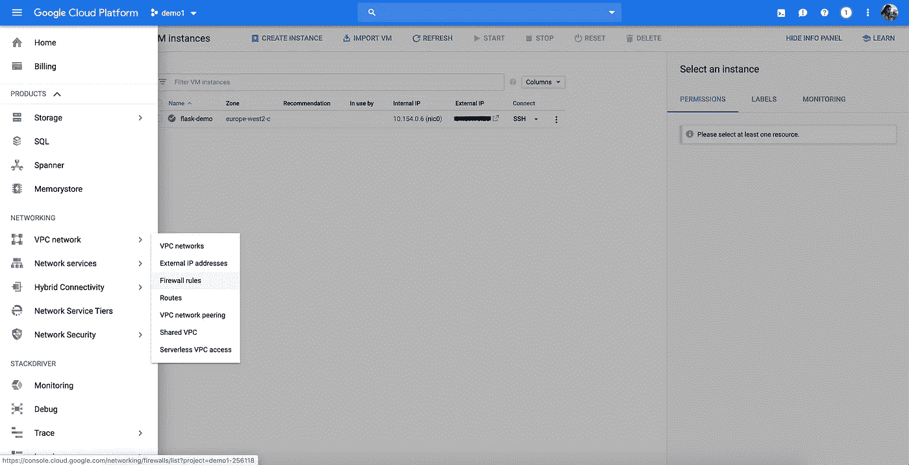

# 在 Google 计算引擎上部署 ML 模型

> 原文：<https://towardsdatascience.com/deploying-a-custom-ml-prediction-service-on-google-cloud-ae3be7e6d38f?source=collection_archive---------5----------------------->

## 简单的指南

## 使用 Flask 在 Google Compute Engine 上部署一个对象检测模型作为 API，并使用 NGINX 和 Gunicorn 设置一个生产服务器


from [Unsplash](https://pixabay.com/photos/beehive-bees-honeycomb-honey-bee-337695/)

## 介绍

将机器学习模型作为 web 服务来部署和维护可能是昂贵且棘手的。我最近开始在我的项目中使用 Compute Engine，并发现 Google Cloud 非常像 AWS，有一个相当陡峭的学习曲线。在这篇文章中，我将讨论如何在 Google Compute Engine 上用 Flask 部署一个对象检测模型作为 API。

这篇教程的代码可以在这里找到。

## 您将在本教程中学到的内容:

*   使用预训练的对象检测模型来检测和注释图像内的各种对象。
*   构建一个简单的 Flask API，通过 POST 请求接收图像，并提供预测的标签、边界框坐标、框颜色和检测对象的置信度。
*   设置 Google 云项目并配置计算引擎实例。
*   使用 Miniconda 安装和设置虚拟环境。
*   部署一个 Flask 应用程序并设置一个稳定的生产服务器，该服务器可以使用 NGINX 和 Gunicorn 处理大量请求。


Sample Model Output

**要求**:物体检测、Flask 和启用计费的谷歌云账户的基本知识。

*注意:谷歌云有一个免费的等级项目，为新用户提供 300 美元的积分。*

**应用引擎 vs 计算引擎**

App Engine 和 Compute Engine 是两个可以用来部署 ML 模型的 Google 云产品。这两种服务的主要区别在于，计算引擎是基础架构即服务(IaaS)，而应用引擎是构建在计算引擎之上的平台即服务(PaaS)。

这基本上意味着计算引擎是一种基本服务，而应用引擎提供额外的服务来简化 web 应用的部署、维护和扩展，尽管每小时的成本更高。App Engine 的好处在于，它会根据传入请求的数量自动伸缩，让您专注于应用程序，而不是系统管理。然而，如果您有持续的 API 请求负载，保持计算引擎实例运行会更便宜。


from [Ruby Garage](https://rubygarage.org/blog/iaas-vs-paas-vs-saas)

## 对象检测器项目结构

在本教程中，我不会深入研究对象检测代码的细节。我将使用的代码是阿德里安·罗斯布鲁克关于 [*YOLO 物体探测的优秀教程的编辑版本，打开 CV*](https://www.pyimagesearch.com/2018/11/12/yolo-object-detection-with-opencv/) ，可以在这里找到。我们将使用在 [COCO 数据集](http://cocodataset.org/#home)上训练的 YOLOv3 模型，这是一个大规模的对象检测、分割和字幕数据集，包含 80 个对象类别的 33 万张图像。

```
.
├── yolo-coco              # Pre-trained model files
    └── coco.names         # Object labels (person, car, etc.)
    └── yolov3.cfg         # Model configuration
    └── yolov3.weights     # Model weights              
├── app.py                 # Flask app serving predictions
├── yolo.py                # Functions to generate predictions
├── requirements.txt       # Dependencies
└── README.md
```

yolo.py 中的两个主要函数是 *download_model_weights* 和 *get_predictions，*期望一个单独的编码图像作为输入*。**get _ predictions*函数处理编码的输入图像，加载并运行模型，并返回每个检测到的对象的方框坐标、方框显示颜色、标签和置信度。首次在本地或 GCE 上运行应用程序时，会自动下载模型权重。

## 烧瓶 API

我们的 Flask 应用程序位于 *app.py* 中，有一个端点 */predict。*在更高的层面上，我们希望我们的应用程序能够:

*   可被其他计算机访问(您的客户！)
*   在端点接受带有编码图像的 POST 请求 */predict*
*   调用 yolo.py 中的对象检测函数，并将预测作为响应返回
*   始终保持活力，能够处理大量请求

```
from flask import Flask, jsonify, request
from yolo import get_predictionsapp = Flask(__name__)[@app](http://twitter.com/app).route(“/predict”, methods=[‘POST’])
def predict():
   predictions = get_predictions(request) return jsonify(predictions)if __name__ == “__main__”:
   app.run(host=’0.0.0.0', port=5000, debug=True)
```

默认情况下，Flask 在 *127.0.0.1* 上托管应用程序，该应用程序指的是您计算机的本地 IP 地址，只能由与您暴露的服务器运行在同一台计算机上的程序访问。显然，我们需要我们的应用程序能够在部署它的计算引擎实例之外被访问。将主机地址更改为 *0.0.0.0* 允许我们使用 GCE 实例的外部 IP 地址从其他计算机访问应用程序。

## 第 1 部分:设置 Google 项目和计算引擎实例

我们需要做的第一件事是创建一个项目。你可以使用现有的谷歌云项目，也可以在这里创建一个新的项目。


Creating a new project

我将我的项目命名为 *demo1* 并将计算引擎实例命名为 *flask-demo* ，但是项目和实例名称可以是您喜欢的任何名称。一旦您创建和/或选择了一个项目，您就可以前往[计算引擎>虚拟机实例](https://console.cloud.google.com/compute/instances)来创建一个新的 GCE 实例。


Creating a GCE VM instance

我们现在可以配置我们的虚拟机实例了，我选择了 *europe-west2* 作为区域，但是对于本教程，任何区域都可以。计算引擎还允许您更改和自定义 CPU 内核、内存、GPU 和引导磁盘的数量。

按照教程，选择 g1-small(或更大的)实例，将引导盘更改为 Ubuntu 18.04 LTS，并将防火墙设置为允许 HTTP 流量。不同地区的价格可能不同，但这种特殊的配置让我每月的估计成本为 17.04 美元。

*单击“创建”后，启动虚拟机实例可能需要几分钟时间。*


Configuring a new VM instance

我们为 GCE 实例启用了 HTTP 流量，但是我们还需要做一件事。我们的 Flask 应用程序将在端口 5000 上运行，默认情况下，谷歌云不监听端口 5000。项目中的默认网络带有默认防火墙规则“default-allow-http”和“default-allow-https ”,以允许端口 80 和 443 上的流量。

我们需要前往 [VPC 网络>防火墙规则](https://console.cloud.google.com/networking/firewalls/)并创建一个新的防火墙规则来接受我们的应用程序将要运行的端口上的传入连接和请求。



Firewall rules

点击**创建防火墙规则**并配置设置，如下所示。确保将 *http-server* 添加到目标标签，将 *0.0.0.0/0* 添加到源 IP 范围，并将 *5000* 设置为指定端口。


Creating a new firewall rule

## 第 2 部分:配置计算引擎实例

是时候配置我们的 GCE 实例了！您可以在[计算引擎>虚拟机实例](https://console.cloud.google.com/compute/instances)中列出您的计算引擎实例。

确保记下您的实例的*外部 IP* 地址，您将需要它来访问您的应用程序并在 GCE 实例外部发送 API 请求。单击 SSH 按钮从浏览器登录到实例。


List of Compute Engine instances


**注意:**复制/粘贴命令时要小心。某些字符可能不会完全按照预期进行传输。如果所有其他方法都失败，请手动写出该命令。

我们现在已经准备好设置我们的生产环境。我们将使用 [Miniconda](https://docs.conda.io/en/latest/miniconda.html) 来管理依赖项和环境。在实例的 SSH 终端上，运行:

```
# update system packages and install the required packages
sudo apt-get update
sudo apt-get install bzip2 libxml2-dev libsm6 libxrender1 libfontconfig1# clone the project repo
git clone [https://github.com/alaradirik/google-cloud-flask-tutorial.git](https://github.com/alaradirik/google-cloud-flask-tutorial.git)# download and install miniconda
wget [https://repo.anaconda.com/miniconda/Miniconda3-4.7.10-Linux-x86_64.sh](https://repo.anaconda.com/miniconda/Miniconda3-4.7.10-Linux-x86_64.sh)
bash [Miniconda3-4.7.10-Linux-x86_64.sh](http://Miniconda3-4.7.10-Linux-x86_64.sh)
```


按照说明并同意安装 Miniconda 的条款。保留默认安装位置，并对“您希望安装程序通过运行 conda init 来初始化 Miniconda3 吗？”回答“是”。

一旦安装完毕，我们将需要导出 Miniconda 的完整路径，使其可由 **conda** 命令执行。然后，我们可以继续创建一个新的 conda 环境。

运行 conda init 后，您可能需要关闭并重新打开 SSH 终端，以使更改生效。

```
export PATH=/home/<your name here>/miniconda3/bin:$PATH
rm [Miniconda3-4.7.10-Linux-x86_64.sh](http://Miniconda3-4.7.10-Linux-x86_64.sh)# confirm installation
which conda# create and activate a new environment
conda create -n flask-tutorial python=3.7
conda activate flask-tutorial
```


## 第 3 部分:部署和测试 Flask 应用程序

有趣的部分来了！我们已经安装了 Miniconda 并克隆了项目 repo，接下来我们需要做的是安装项目依赖项，启动应用程序并确保它可以接收来自其他计算机的请求。

```
# go to project root and install the requirements
cd google-cloud-flask-tutorial
pip install -r requirements.txt# run the app
python app.py
```

您可以通过使用实例的外部 IP 地址从本地计算机终端向 API 发送 POST 请求来测试您的应用程序。如果你没有外部 IP，去[计算引擎>虚拟机实例](https://console.cloud.google.com/compute/instances)找到它。

Github 上的[项目 repo 包括一个名为 *request.py* 的示例请求脚本和一个包含示例图像的 *images* 文件夹，用于测试应用程序。您可以将 repo 克隆到您的本地计算机，或者使用*设置>下载文件*按钮从实例的 SSH 终端下载文件。](https://github.com/alaradirik/google-cloud-flask-tutorial)


request.py 通过对实例的 POST 请求向我们的 API 的/predict 端点发送编码图像。您应该将实例的外部 IP 插入到 *url* 中，并创建一个具有执行 *request.py.* 的依赖项的虚拟环境

我们的应用程序发送每个检测到的对象的盒子坐标、盒子显示颜色、标签和置信度作为响应。 *request.py* 使用这些值在客户端创建并保存图像的注释版本。

```
# request.py dependencies
import requests
import json
import cv2 url = "http://<external IP address>:5000/predict"
headers = {"content-type": "image/jpg"}# encode image
image = cv2.imread('images/baggage_claim.jpg')
_, img_encoded = cv2.imencode(".jpg", image)# send HTTP request to the server
response = requests.post(url, data=img_encoded.tostring(), headers=headers)
predictions = response.json()# annotate the image
for pred in predictions:
   # print prediction
   print(pred) # extract the bounding box coordinates
   (x, y) = (pred["boxes"][0], pred["boxes"][1])
   (w, h) = (pred["boxes"][2], pred["boxes"][3]) # draw a bounding box rectangle and label on the image
   cv2.rectangle(image, (x, y), (x + w, y + h), pred["color"], 2)
   text = "{}: {:.4f}".format(pred["label"], pred["confidence"])
   cv2.putText(
       image, 
       text, 
       (x, y - 5), 
       cv2.FONT_HERSHEY_SIMPLEX,
       0.5, 
       pred["color"], 
       2
   )# save annotated image
cv2.imwrite("annotated_image.jpg", image)
```


Flask app running on the instance

第一次发送请求时，收到响应的时间会稍长一些，这是因为需要先下载模型权重。


Output on the client side

## 第 4 部分:用 Gunicorn 和 NGINX 设置生产服务器

**Flask 不是网络服务器。这是一个微型 web 应用程序框架:一组工具和库，使得构建 web 应用程序更加容易和美观。**

回顾一下，客户端和服务器之间的通信是通过请求和响应来完成的:

1.  一个客户端向网络发送一个 HTTP 请求
2.  网络服务器接收该请求
3.  服务器运行应用程序来处理请求
4.  服务器向客户端返回一个 **HTTP 响应**(输出)
5.  客户端收到响应

Flask 本身不能处理 HTTP 请求和响应，但是它附带了 Werkzeug，这是一个 WSGI 实用程序库，为开发目的提供了一个简单的 web 服务器。虽然 Flask 的开发服务器足以测试应用程序的主要功能，但我们不应该在生产中使用它。正如官方文件所述:

> 虽然 Flask 的内置服务器轻巧易用，但它并不适合生产，因为它不能很好地扩展，并且默认情况下一次只能服务一个请求。

在本教程中，我们将使用 Gunicorn 和 NGINX 创建一个生产服务器，它可以处理多个用户和大量的传入请求，而用户/客户端不必等待太长时间。


from [Real Python](https://realpython.com/)

Gunicorn 是一个可以执行 Python 代码的 web 服务器(也称为 WSGI 服务器)，我们需要将 Gunicorn 与另一个 web 服务器 NGINX 耦合，因为我们希望利用非基于 Python 的服务器(非 WSGI 服务器)的一些特性:我们可以通过 NGINX 将请求分发到多个 Gunicorn 实例，提供静态内容而不必与 Flask 应用程序通信，高效地处理高连接级别等。

回到 GCE 实例终端，我们需要做的第一件事是安装并启动 NGINX。

```
cd
sudo apt-get install nginx-full
sudo /etc/init.d/nginx start
```


接下来，我们需要删除默认配置文件，并为 flask 应用程序创建一个新的站点配置文件。“站点-可用”中的配置文件在启用之前是不活动的，因此我们需要为“站点-启用”中的新配置文件创建一个链接。

```
# remove default configuration file
sudo rm /etc/nginx/sites-enabled/default# create a new site configuration file
sudo touch /etc/nginx/sites-available/flask_project
sudo ln -s /etc/nginx/sites-available/flask_project /etc/nginx/sites-enabled/flask_project
```


现在，我们可以通过使用 nano 或 vim 等编辑器打开文件来编辑应用程序的配置文件:

```
sudo nano /etc/nginx/sites-enabled/flask_project
```

复制并粘贴下面的代码，并保存配置文件。

```
server {
    location / {
        proxy_pass [http://0.0.0.0:5000](http://0.0.0.0:5000);
    }
}
```


重启 NGINX 服务器。

```
sudo /etc/init.d/nginx restart
```

我们快完成了！我们需要做的最后一件事是回到项目文件夹，将 Flask 应用程序绑定到 Gunicorn 服务器。

需要记住的一件重要事情是，我们希望服务器和 Flask 应用程序在我们关闭终端窗口后继续运行。添加*守护进程*标志保持进程在后台运行。

```
cd google-cloud-flask-tutorial
gunicorn --bind [0.0.0.0:5000](http://0.0.0.0:5000) app:app --daemon
```


## 结论

就是这样！您在计算引擎上部署了一个对象检测模型作为 API，并设置了一个生产服务器。您可以随时关闭计算引擎终端并向 API 发送请求。

希望你喜欢这个教程！如果您有任何问题或意见，请使用下面的评论部分或通过 [Linkedin](https://www.linkedin.com/in/alaradirik/) 联系我们。