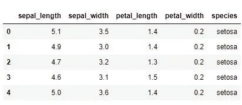

# 使用 Flask 和 Python 在 Heroku 上部署深度学习模型

> 原文：<https://towardsdatascience.com/deploying-a-deep-learning-model-on-heroku-using-flask-and-python-769431335f66?source=collection_archive---------5----------------------->

在我的上一篇文章中，我们已经看到了如何使用 Python 和 Flask(下面的链接)在 web 上部署机器学习模型

[](https://medium.com/analytics-vidhya/deploying-a-machine-learning-model-on-web-using-flask-and-python-54b86c44e14a) [## 使用 Flask 和 Python 在 Web 上部署机器学习模型

### 创建一个机器学习模型并对现实世界的问题进行预测听起来很酷。但是，那不是很…

medium.com](https://medium.com/analytics-vidhya/deploying-a-machine-learning-model-on-web-using-flask-and-python-54b86c44e14a) 

通过 CLI 进行预测很酷，但也存在一些问题，比如手动启动服务器和缺少简单的 GUI(图形用户界面)。

在本帖中，我们将尝试通过在 Heroku 服务器上部署我们的模型来解决上述问题，并因此为最终用户建立一个简单的全天候运行的 HTML 网站来进行预测。

让我们从创建深度学习模型的最基础开始旅程，然后逐步完成部署过程并学习新概念。


> **深度学习模型的创建**

**步骤 1。为虹膜数据集创建一个简单的 Keras 模型**

R.A. Fisher 在 1936 年的经典论文中使用了 Iris 数据集。它包括三种鸢尾，每种有 50 个样本，以及每种花的一些特性。

该数据集中的列是:

*   身份
*   SepalLengthCm
*   SepalWidthCm
*   PetalLengthCm
*   PetalWidthCm
*   种类

让我们导入必要的库，然后将 iris.csv 中的数据加载到 pandas 数据框架中，以便更好地理解。

```
import numpy as np
import pandas as pdiris = pd.read_csv(“../DATA/iris.csv”)iris.head()
```



**第二步。为训练目的定义 X 和 y**

现在，一旦我们加载了我们的数据，我们就可以为训练目的定义我们的 X 和 y，*我们最初的四列将贡献 X，物种将被标记为 y，这表示我们来自数据集的真实标签。*

```
X = iris.drop(‘species’,axis=1)
y = iris[‘species’]
```

**第三步。二值化物种标签**

正如我们在数据集 ***【物种】*** *中看到的，包含字符串格式的数据，因此我们应该将其编码成数字*，为此我们可以通过下面的代码使用 sklearn .预处理库中的 **LabelBinarizer**

```
from sklearn.preprocessing import LabelBinarizer
encoder = LabelBinarizer()
y = encoder.fit_transform(y)
```

现在，如果我们检查我们的*"****y****"它应该被二值化如下，其中[1，0，0]表示花“Setosa”，[0，1，0]表示“Virginica”，而[0，0，1]表示“Versicolor”。*


**步骤四。缩放数据**

在输入模型之前缩放我们的数据总是很重要的，以确保所有列的值都在同一范围内，您可以使用 **scikit-learn** 中的任何缩放器，如 StandardScaler 或 MinMaxScaler，下面我们使用的是 **MinMax scaler**

```
from sklearn.preprocessing import MinMaxScaler
scaler = MinMaxScaler()
scaled_X = scaler.fit_transform(X)
```

请注意，我们正在缩放我们的整个 X，这将用于训练我们的深度学习模型，您可以根据自己的建模步骤纳入更多步骤，如 **train_test_split** 。

**第五步。创建 Keras 模型**


让我们通过导入下面的库并调用顺序 API 来创建一个简单的 Keras 模型

```
from tensorflow.keras.models import Sequential
from tensorflow.keras.layers import Densemodel = Sequential()
model.add(Dense(units=4,activation=’relu’))
model.add(Dense(units=32,activation=’relu’))
model.add(Dense(units=16,activation=’relu’))
# Last layer for multi-class classification of 3 species
model.add(Dense(units=3,activation=’softmax’))model.compile(optimizer=’adam’,loss=’categorical_crossentropy’,metrics=[‘accuracy’])
```

在上面的代码中，我们已经开始创建一个连续的 Keras 模型，第一层的*是密集的，在 X 轴上有 4 个输入(萼片长度，萼片宽度，花瓣长度，花瓣宽度)。*

之后，我们添加了 2 个隐藏层，并使用**“relu”**作为除最后一层之外的所有层的激活函数。

**最后一层包含 3 个单元，分别用于 3 类花** ( Setosa、Virginica 和 Versicolor)，具有****soft max****激活函数，因为我们正在处理多类分类问题，而且在编译模型时，我们使用了****【亚当****优化器以及****

*****第六步。训练和保存模型*****

***最后，让我们开始在大约 100+个时期上训练我们的 Keras 模型，如果您想减少训练的运行时间，您可以添加回调机制，例如 EarlyStopping。***

```
***model.fit(scaled_X,y,epochs=150)Epoch 1/150
150/150 [==============================] - 0s 1ms/sample - loss: 1.1053 - accuracy: 0.3333
Epoch 2/150
150/150 [==============================] - 0s 93us/sample - loss: 1.0953 - accuracy: 0.3467
Epoch 3/150
150/150 [==============================] - 0s 86us/sample - loss: 1.0864 - accuracy: 0.5667
Epoch 4/150
150/150 [==============================] - 0s 100us/sample - loss: 1.0770 - accuracy: 0.6200
Epoch 5/150
150/150 [==============================] - 0s 86us/sample - loss: 1.0669 - accuracy: 0.4867***
```

*****训练完成后，我们将达到大约 95%的准确率**，而不会过度拟合数据。现在让我们保存我们的模型，以便稍后在部署过程中使用。***

```
***model.save(“final_iris_model.h5”)***
```

***这将把模型保存在您的*当前工作目录*中。***

****第七步。保存定标器****

**我们还将在当前的工作目录中保存 scaler，这样我们就可以在将用户输入数据传递给我们的模型并在我们的网站上显示结果之前对其进行缩放。**

```
**import joblib
joblib.dump(scaler,’iris_scaler.pkl’)**
```

> ****部署通过烧瓶，Python 对 Heroku****

****

**将我们的模型与 scaler 一起保存真是太好了，现在让我们深入了解设置我们自己的 flask 应用程序并将其部署在 Heroku 服务器上的步骤。**

**让我们开始创建我们的 ***app.py*** 文件，稍后将用于 Heroku 服务器上的部署。**

****步骤一。导入所需的库****

```
**from flask import Flask, render_template, session, redirect, url_for, session
from flask_wtf import FlaskForm
from wtforms import TextField,SubmitField
from wtforms.validators import NumberRange
import numpy as np 
from tensorflow.keras.models import load_model
import joblib**
```

****第二步。定义返回模型预测的函数****

```
**def return_prediction(model,scaler,sample_json):

 s_len = sample_json[‘sepal_length’]
 s_wid = sample_json[‘sepal_width’]
 p_len = sample_json[‘petal_length’]
 p_wid = sample_json[‘petal_width’]

 flower = [[s_len,s_wid,p_len,p_wid]]
 flower = scaler.transform(flower)

 classes = np.array([‘setosa’, ‘versicolor’, ‘virginica’])
 class_ind = model.predict_classes(flower)

 return classes[class_ind][0]**
```

**在上面的函数中，我们传递了 ***三个参数，我们的 model、scaler 和 sample_json*** 用于从 HTML 页面输入数据。**

**JSON (JavaScript Object Notation)是网络上最广泛使用的数据交换格式。这种数据交换可以在不同地理位置的两个计算机应用程序之间进行，也可以在同一台硬件机器上运行。**

**首先，JSON 构建在类似 python 字典的结构之上**

*   ****名称/值对的集合。****

```
**"employee": {
"id":           1,
"name":         "Admin",
"location":     "USA"
}**
```

**以类似的方式，我们从传入的请求中捕获了 sepal_length/width、petal_length/width 的数据**

```
**s_len = sample_json[‘sepal_length’]
 s_wid = sample_json[‘sepal_width’]
 p_len = sample_json[‘petal_length’]
 p_wid = sample_json[‘petal_width’]**
```

**完成上述步骤后，我们缩放了我们的花卉列表，并使用了**model . predict _ classes()****函数来获取对应于以下代码中花卉数据的类标签，**有关此函数的更多详细信息，请参见下面的链接。**

**[https://kite . com/python/docs/tensor flow . keras . sequential . predict _ classes](https://kite.com/python/docs/tensorflow.keras.Sequential.predict_classes)**

```
**flower = [[s_len,s_wid,p_len,p_wid]]
flower = scaler.transform(flower)
classes = np.array([‘setosa’, ‘versicolor’, ‘virginica’])
class_ind = model.predict_classes(flower)
return classes[class_ind][0]**
```

****第三步。定义 app 路线并完成 app.py 文件****

**在下面的代码中，为了更好的理解，每个代码块上面都定义了代码注释，如果你需要更多的了解 flask 的基本架构，也可以通过下面的链接访问我的上一篇文章。**

**[https://medium . com/analytics-vid hya/deploying-a-machine-learning-model-on-web-using-flask-and-python-54 b 86 c 44 e 14 a](https://medium.com/analytics-vidhya/deploying-a-machine-learning-model-on-web-using-flask-and-python-54b86c44e14a)**

```
****app = Flask(__name__)**
**# Configure a secret SECRET_KEY**
app.config[‘SECRET_KEY’] = ‘someRandomKey’**# Loading the model and scaler**
flower_model = load_model(“final_iris_model.h5”)
flower_scaler = joblib.load(“iris_scaler.pkl”)**# Now create a WTForm Class**
**class FlowerForm(FlaskForm):**
 sep_len = TextField(‘Sepal Length’)
 sep_wid = TextField(‘Sepal Width’)
 pet_len = TextField(‘Petal Length’)
 pet_wid = TextField(‘Petal Width’)
 submit = SubmitField(‘Analyze’)

[**@app**](http://twitter.com/app)**.route(‘/’, methods=[‘GET’, ‘POST’])**
 def index():
  # Create instance of the form.
  form = FlowerForm()
  # If the form is valid on submission
  if form.validate_on_submit():
  # Grab the data from the input on the form.
  session[‘sep_len’] = form.sep_len.data
  session[‘sep_wid’] = form.sep_wid.data
  session[‘pet_len’] = form.pet_len.data
  session[‘pet_wid’] = form.pet_wid.datareturn redirect(url_for(“prediction”))return render_template(‘home.html’, form=form)[**@app**](http://twitter.com/app)**.route(‘/prediction’)**
def prediction():
 #Defining content dictionary
 content = {}content[‘sepal_length’] = float(session[‘sep_len’])
 content[‘sepal_width’] = float(session[‘sep_wid’])
 content[‘petal_length’] = float(session[‘pet_len’])
 content[‘petal_width’] = float(session[‘pet_wid’])

 results = return_prediction(model=flower_model,scaler=flower_scaler,sample_json=content)return render_template(‘prediction.html’,results=results)**if __name__ == ‘__main__’:
 app.run(debug=True)****
```

**让我们一点一点来理解上面的代码。**

****我们正在配置一个*密钥*** 。*需要密钥来保证 Flask 中客户端会话的安全。*您可以生成任何您选择的随机密钥。**

*****我们正在使用@app.route 装饰主页和预测页面*** ，详情请参考我上一篇文章。**

****另外，我们正在创建 WT 表单**。使用 **Flask-WTF** ， ***我们可以在 Python 脚本中定义表单字段，并使用 HTML 模板*** 呈现它们**

****TextField** 表示<输入 type = 'text' > HTML 表单元素**

**请通过下面的脚本安装 Flask-WTF**

```
**pip install flask-wtf**
```

****第四步。定义我们的 HTML 表单，从终端用户那里获取输入。****

**现在让我们进入最后一步，为部署做好一切准备。**

**我们将为最终用户的输入创建两个基本的 HTML 表单，即*和***prediction.html***。***

****

***你也可以在* ***第三步*** *查看代码，通过@app.route decorator 定义两者，将 Flask 与 HTML 模板连接起来。***

****home.html****

```
**<h1>Welcome to IRIS prediction</h1>
<h2>Please enter your flower measurements below:</h2>
<form method=”POST”>
 {# This hidden_tag is a CSRF security feature. #}
 {{ form.hidden_tag() }}
 {{ form.sep_len.label }} {{form.sep_len}}
 <br>
 {{ form.sep_wid.label}} {{form.sep_wid}}
 <br>
 {{form.pet_len.label}}{{form.pet_len}}
 <br>
 {{form.pet_wid.label}}{{form.pet_wid}}
 <br>
 {{ form.submit() }}
</form>**
```

**在上述表格中，每一项如─**

*****form.sep_len、form.sep_wid 等*** *是我们在 FlowerForm 类中的 S****TEP 3****中定义的文本字段，这样一旦用户输入数据，这些数据就会被传递给 FlaskSession。***

****Prediction.html****

```
**<h1>Thank You. Here is the Information You Gave:</h1>
<ul>
 <li>Sepal Length: {{session[‘sep_len’]}}</li>
 <li>Sepal Width : {{session[‘sep_wid’]}}</li>
 <li>Petal Length: {{session[‘pet_len’]}}</li>
 <li>Petal Width : {{session[‘pet_wid’]}}</li>
</ul>
<h2>Your Predicted Flower Class is: {{results}}</h2>**
```

*****然后我们将相同的数据传递到步骤 3 中预测函数内部定义的内容字典中，*** *和* 进一步使用相同的数据作为我们模型的输入。*最后，我们将显示步骤 3 的结果变量。我们的 prediction.html 页面。***

> ****收拾好一切，部署到 Heroku****

****

**现在我们已经到了最后一步，那就是在 Heroku 号上部署一切。**

****步骤一。请按照下面的方式建立你的项目工作目录，有一个单独的模板文件夹包含你的 home.html 和 prediction.html 文件。****

****

**此外，请添加以下代码的 Procfile(无扩展名)作为一行代码**

```
**web: gunicorn app:app**
```

****“guni corn”，**是一个 [Web 服务器网关接口(WSGI)服务器](https://www.fullstackpython.com/wsgi-servers.html)实现，常用于运行 Python web 应用， ***这里 app 是我们的 app.py 文件名。*****

****第二步。创建一个 conda 虚拟环境来设置所有的库****

**导航到项目目录后，在 Anaconda 提示符下运行下面的代码，然后激活环境。**

```
**Step1\. conda create — name mydevenv python=3.7
Step2\. activate mydevenv**
```

**为您新创建的环境安装以下库，并为 Heroku 生成 requirements.txt**

```
**Step1\. pip install flask
Step2\. pip install flask-wtf
Step3\. pip install tensorflow2.0.0a0
Step4\. pip install scikit-learn
Step5\. pip install gunicorn
Step6\. pip freeze > requirements.txt**
```

**现在您的工作目录应该已经为 Heroku 部署创建了 requirements . txt。**

****第三步。创建 Heroku 帐户并安装 Heroku CLI 进行部署****

**注册一个新的 Heroku 账号[https://www.heroku.com/](https://www.heroku.com/)**

**根据您的操作系统安装 Heroku CLI 和 GIT**

**[https://dev center . heroku . com/articles/heroku-CLI #下载并安装](https://devcenter.heroku.com/articles/heroku-cli#download-and-install)**

**[https://git-scm.com/downloads](https://git-scm.com/downloads)**

**完成后请重启系统，在命令提示符下键入 **heroku** 和**如果没有“Heroku not found”的错误，您就可以进入下一步**。**

****第四步。将应用部署到 Heroku 服务器****

**通过打开一个新的命令提示符并键入以下内容来登录 Heroku。**

```
**heroku login**
```

**按任意键，一旦完成，你将被重定向到浏览器的登录页面，在那里完成登录过程。**

****

**现在转到 Heroku 主页，点击创建一个新的应用程序，如下所示**

****

**完成上述步骤后，执行最后几个步骤来部署到服务器。**

## **打开 GitBash 并导航到您的项目目录**

**初始化目录中的 git 存储库。用您自己的应用程序名称替换 ml-deployment-app。**

```
**$ cd my-project/
$ git init
$ heroku git:remote -a ml-deployment-app**
```

## **部署应用程序**

****

**将您的代码提交到存储库，并使用 Git 将其部署到 Heroku。**

```
**$ git add .
$ git commit -am "adding files"
$ git push heroku master**
```

**最后，您应该能够在 CLI 上看到如下所示的成功消息以及您的应用程序的 URL。**

****祝贺**你拥有了自己的网络直播应用。**

********

**在下面的网址上查看正在运行的应用程序。**

**[https://ml-deployment-app.herokuapp.com/](https://ml-deployment-app.herokuapp.com/)**

**如果你错过了什么或面临问题，所有的代码文件都在下面的 Github 链接中。**

**[https://github.com/guptasoumya26/ml-deployment-app-heroku](https://github.com/guptasoumya26/ml-deployment-app-heroku)**

*****在这篇文章中，我们学习了 Flask with Web，如何将它与 HTML 网站集成，最重要的是如何应用这些知识在 Web 服务器上部署它，以便最终用户可以随时与我们的 ML 模型交互，而无需任何外部依赖。*****

**我希望你觉得这个教程有用，谢谢你读到这里。我很好奇你是怎么想的，所以给我一些建议吧。
您也可以直接通过[邮箱](mailto:soumyansh@gmail.com)与我取得联系，或者通过 [LinkedIn](https://www.linkedin.com/in/soumyansh/) 与我联系。**