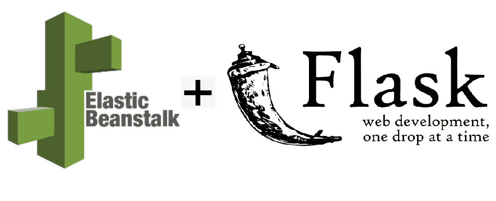

# 通过 CLI 在 AWS Elastic Beanstalk 上部署一个烧瓶应用程序

> 原文：<https://towardsdatascience.com/deploying-a-flask-application-on-aws-elastic-beanstalk-via-cli-c0e93548472e?source=collection_archive---------8----------------------->

## **使用带有烧瓶和弹性豆茎的易于使用的 API 展示后端数据分析。**



可以在 AWS 上用 **EC2** 实例托管商业级烧瓶应用程序。启动 EC2 实例很容易，但是资源管理是一项开销。为了更好地利用资源， **Lambda 和 API Gateway** 是一个替代方案。但是它带来了资源配置开销。

AWS **弹性豆茎** (EB)在不限制选择或控制的情况下降低了管理复杂性。我们需要做的只是上传应用程序，EB 本身会处理以下细节:

*   容量供应
*   负载平衡
*   缩放比例
*   应用健康监控

AWS 确实提供了关于 EB 的详细[文档](https://docs.aws.amazon.com/elastic-beanstalk/index.html)。浏览这些页面是很棘手的，通常不会提到陷阱。在这里，我分享使用 EB CLI 设置和启动 **Flask** 应用程序的过程。

## 先决条件:

*   我使用运行 Python 3.7 的 Linux 系统，假设你有类似的设置。
*   AWS 的工作知识。
*   烧瓶的工作知识。

## 步骤 1:安装 EB CLI

按照 [**中提到的步骤，在虚拟环境中安装 EB CLI。**](https://docs.aws.amazon.com/elasticbeanstalk/latest/dg/eb-cli3-install-virtualenv.html)

```
**# Quick Reference****$ pip install** **— user virtualenv****$ virtualenv *~/ebtest*****$ source** ***~/ebtest*/bin/activate****$ pip install awsebcli — upgrade****$ eb — version**
```

## 第二步:烧瓶应用

您可以按照下面提到的过程创建一个测试瓶应用程序。

[**用 Flask 建立 Python 虚拟环境**](https://docs.aws.amazon.com/elasticbeanstalk/latest/dg/create-deploy-python-flask.html#python-flask-setup-venv)

[**创建烧瓶应用**](https://docs.aws.amazon.com/elasticbeanstalk/latest/dg/create-deploy-python-flask.html#python-flask-create-app)

EB 默认期望文件名为 **application.py** 。如果您使用任何其他名称，应用程序加载将会失败。此外，EB 希望 flask 应用程序对象实例是应用程序。要更改这些默认值，您需要使用 EB 配置。

```
**# Quick Reference****$ pip install flask==1.0.2****$ pip freeze > requirements.txt****$ python application.py**
```

在 EB 上部署 flask 应用程序之前，确保在其上执行本地测试。

## 步骤 3: AWS API 密钥和机密

从 AWS 控制台的**我的安全凭证**下获取 API 密钥和密码。将 API 密钥和密码放在手边，以便配置 EB。

**注意:**请确保这些信息的安全。

EB 配置会将这些信息存储在 **~/下。aws/config** 如下所示。

```
**[profile eb-cli]****aws_access_key_id = KEY****aws_secret_access_key = SECRET**
```

## 步骤 4:在弹性豆茎上部署烧瓶应用程序

按照 [**中提到的步骤，使用 EB CLI**](https://docs.aws.amazon.com/elasticbeanstalk/latest/dg/create-deploy-python-flask.html#python-flask-deploy) 部署您的站点

使用**。ebignore** 文件，避免上传不需要的文件。创造这些**。**下的 config** 文件。ebextensions** 在 EB 上设置环境变量。

```
**# Quick Reference****$ eb init -p python-3.6 flask-tutorial — region us-east-2****$ eb init****$ eb create flask-env****$ eb open**
```

## 步骤 5:在弹性豆茎上使用端瓶

为此，您可以使用 Beanstalk 控制台或 EB CLI。

```
**# Quick Reference****$ eb terminate flask-env**
```

## 学分:

这篇博文是 [**LiveSafe**](https://livesafe.netlify.com/) 项目的成果。Live Safe 汇集了美国特定地区灾害风险的相关信息，以帮助潜在房主做出购买和租赁决定。

[Manjula Mishra](https://medium.com/u/e0146ea95834) 、 [Daniel Martin-Alarcon](https://medium.com/u/ad7a35c0a5e) 和我一起从事该项目的数据科学部分。你可以在这里找到数据科学相关的代码[。](https://github.com/labs12-should-i-live-here/DS)