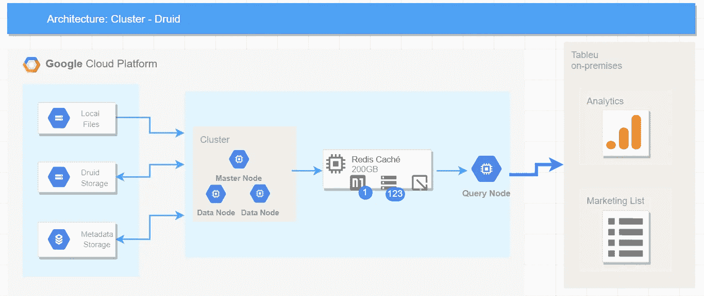

# 在 Google 云平台中部署一个生产 Druid 集群

> 原文：<https://towardsdatascience.com/deploying-a-production-druid-cluster-in-google-cloud-platform-43a7f1e15336?source=collection_archive---------28----------------------->

本文的目的是通过使用 GCP 来指导 Apache Druid 集群的设置过程


# 阿帕奇德鲁伊(孵化中)

Druid 是一个开源的分析数据存储，设计用于商业智能( [OLAP](http://en.wikipedia.org/wiki/Online_analytical_processing) )对事件数据的查询。Druid 提供了低延迟(实时)数据接收、灵活的数据探索和快速的数据聚合。

## 可扩展的架构



## 要求

*   对于基本 Druid 集群:每个节点 8 个 8vCPUS、30GB RAM 和 200GB 磁盘大小(例如 custom-6–30720 或 n1-standard-8)。
*   启用谷歌云存储
*   激活 MySQL 实例或云 SQL

# 安装

用你的 GCP 帐户登录，用 SO Debian 创建三个虚拟机。

## 下载德鲁伊:

为每个节点运行

```
wget https://www-us.apache.org/dist/incubator/druid/0.15.1-incubating/apache-druid-0.15.1-incubating-bin.tar.gz
tar -xzf apache-druid-0.15.1-incubating-bin.tar.gzexport $PATH_GCP = /path/druid/
```

## 安装组件

使用 SSH 输入每个节点并运行:

```
#Update libraries 
sudo apt-get update#Install Java JDK 
sudo apt install default-jdk -y #Install Perl 
sudo apt-get install perl -y #Donwload MySQL JAR 
sudo apt install libmysql-java #Install MySQL server 
sudo apt-get install mysql-server -y #Move MySQL JAR to Druid folder 
cp /usr/share/java/mysql-connector-java-5.1.42.jar $PATH_GCP/apache-druid-0.15.1-incubating/extensions/mysql-metadata-storage
```

## 安装动物园管理员

Zookeeper 可能安装在一个独立的节点上，尽管在这种情况下，我们打算安装在主节点上。使用 SSH 登录并运行以下脚本。

```
#Download
wget https://www-eu.apache.org/dist/zookeeper/zookeeper-3.4.14/zookeeper-3.4.14.tar.gz tar -zxf zookeeper-3.4.14.tar.gz #create folder and move
sudo mkdir -p /usr/local/zookeeper
sudo mv zookeeper-3.4.14 /usr/local/zookeeper#create folder
sudo mkdir -p /var/lib/zookeeper #create config file 
vi /usr/local/zookeeper/conf/zoo.cfg #add properties inside config file
tickTime=2000 
dataDir=/var/lib/zookeeper clientPort=2181
```

## 编辑公共运行时属性

编辑位于路由:`apache-druid-0.15.1-incubating/conf/druid/cluster/_common/common.runtime.properties`中的文件，为每个节点复制建议的更改。

使用`sudo vi`编辑文件

```
sudo vi apache-druid-0.15.1-incubating/conf/druid/cluster/_common/common.runtime.properties
```

以下改动按顺序写。

## 启用基本安全性

如果需要设置一个基本的身份验证系统，请在每个节点的公共文件中添加这些属性。这样做之后，您将拥有一个密码为`[PASSWORD_1]`的`admin`用户，可以访问集群中的所有网段。

在文件中添加以下属性:*Apache-druid-0 . 15 . 1-孵化器/conf/druid/cluster/_ common/common . runtime . properties*

# 运行 Apache Druid

## 启动动物园管理员

在您下载的节点中运行

```
sudo /usr/local/zookeeper/bin/zkServer.sh start
```

## 启动主机

```
export PATH_GCP=[PATH_GCP]
sudo nohup $PATH_GCP/apache-druid-0.15.1-incubating/bin/start-cluster-master-no-zk-server &#See log
tail -f $PATH_GCP/apache-druid-0.15.1-incubating/var/sv/coordinator-overlord.log
```

## 启动数据服务器

```
export PATH_GCP=[PATH_GCP]
sudo $PATH_GCP/apache-druid-0.15.1-incubating/bin/start-cluster-data-servertail -f $PATH_GCP/apache-druid-0.15.1-incubating/var/sv/historical.log
```

## 启动查询服务器

```
export PATH_GCP=[PATH_GCP]
sudo $PATH_GCP/apache-druid-0.15.1-incubating/bin/start-cluster-query-servertail -f $PATH_GCP/apache-druid-0.15.1-incubating/var/sv/broker.log
```

# 访问 Druid UI

在访问您的本地机器之前，您需要打开端口:8888、8081、8082 和 8083。作为一种快捷方式，您可以在项目云 shell 中运行此代码。

```
export LOCAL_IP=[LOCAL_IP]
gcloud compute --project=$PROJECT_ID firewall-rules create druid-port --direction=INGRESS --priority=1000 --network=default --action=ALLOW --rules=all --source-ranges=$LOCAL_IP
```

现在，你可以和德鲁伊一起工作。在我的下一篇文章中，我将展示一个如何使用它的真实案例。如果你需要关于德鲁伊的介绍，你可以在这里看到我的合作伙伴的文章[安东尼奥·卡川](https://medium.com/u/6ab1ede31d8e?source=post_page-----43a7f1e15336--------------------------------):[https://towards data science . com/a-gentle-introduction-to-Apache-druid-in-Google-cloud-platform-c1e 087 c 87 BF 1](/a-gentle-introduction-to-apache-druid-in-google-cloud-platform-c1e087c87bf1)

PS 如果您有任何问题，或者想要澄清一些事情，您可以在 [LinkedIn 上找到我。](https://www.linkedin.com/in/jmendezgal/)

PS2:你可以在我的 [github](https://gist.github.com/jmendezgal) 里看到代码

PS3:如果你想了解更多关于数据工程的知识，请关注:【https://datahacks.ai/】T4