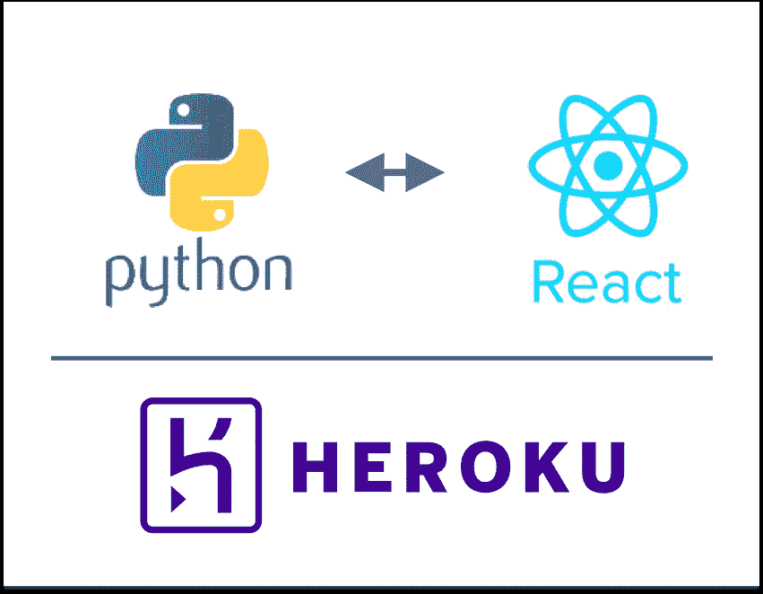

# 在 Heroku 上部署 React 应用程序:Python 视角

> 原文：<https://towardsdatascience.com/deploying-a-react-app-on-heroku-the-python-perspective-256deeec788f?source=collection_archive---------14----------------------->

## 如何部署与 Flask 后端配对的 React 前端



Heroku 来自 Python 背景，是一个非常适合部署的地方。我有各种各样的静态和基于 Flask 的网站，这些网站配置起来很简单，并且很容易与 Github 集成，以实现平稳的持续部署。这篇文章是*而不是*关于使用烧瓶部署的——[Heroku 指南](https://devcenter.heroku.com/articles/deploying-python)对此很有帮助，你可以在这里[和这里](https://github.com/archydeberker/ski-monitor)和[看到一些例子。](https://github.com/archydeberker/burnsbot)

在我最近的项目中，我学习了 Javascript——特别是， [React](https://reactjs.org/tutorial/tutorial.html) (如果你想做同样的事情，我发现 [Flavio Copes](https://flaviocopes.com) 博客很有帮助)。这带来了一系列令人眼花缭乱的新单词要学习，许多不同的方法来做同样的事情(与 Python 的法则相反)，以及让我迷惑不解的异步范例。

我正在用 Flask 后端构建一个 React 应用程序。在黑进了本地看起来合理的东西并部署了后端之后，我开始和我信任的朋友 Heroku 一起部署 React 部分。这就是麻烦开始的地方。

# **我用什么来服务一个 React app？**

我是数据科学家，不是开发人员，所以我和服务器的关系是功利的。Flask 给了我一个轻量级的 Python 服务器，如果我误以为我的网站会有大流量，我可以升级到`gunicorn`。当我部署到 Heroku 时，我可以使用一个`[Procfile](https://devcenter.heroku.com/articles/procfile)`来告诉 Heroku 运行什么命令来服务我的应用程序——通常是一个命令行程序。幸运的是，我用来在本地运行我的应用程序的命令和 Heroku 使用的命令是相同的:

```
python app.py
```

但是 React 的等价词是什么呢？

当您在本地开发时，您可以使用类似以下的内容:

```
npm run start
```

来运行您的开发服务器，但是稍微搜索一下就会发现没有人用它来为生产服务。相反，有很多关于所谓的`Express.js`的讨论。

## **express . js 到底是什么？**

Express 将自己描述为“Node.js 的快速、非个性化、极简主义的网络框架”。所有这些听起来对我来说都很好，但我真的不在乎——我只是想要一些允许其他人看到我在本地运行`npm run start` 时看到的东西。

事实证明，对此使用 Express 是完全没有必要的，尽管有许多关于它的博客文章。

困惑的产生是因为很多人也对基于 Javascript 部署后端感兴趣，所以很多关于部署 JS 的普通建议都是基于可以服务前端和后端资产的服务器。但是你，我的朋友，已经有了一个后端，由可信的 Flask 提供服务:所以我们可以坚持一些更简单的东西。

## **服务一个反应前端**

React 中大多数旅程的实际起点`create-react-app`建议，如果你在提供一个“静态应用”，你可以使用一个叫做`serve`的东西，这相当于一个两行程序:

```
npm install -g serve
serve -s build
```

这对我来说听起来相当不错，除了我不确定我是否在服务一个“静态应用程序”，在我看来这是由几个 HTML 页面组成的，而不是一个所有人都在唱歌所有人都在跳舞的 React 应用程序，在商店里到处都有旋转的小发明和跳跃的模态。

但是仔细想想，我的应用程序确实是静态的。如果你在 Flask 中创建一个后端，而你的 React 应用仅仅是一个前端，那么你的应用是静态的。从部署的角度来看，这是个好消息。

旁白:`serve`是来自 [ZEIT](https://zeit.co) 的一个库，他们实际上有一个 Heroku 的竞争对手叫`now`，它已经获得了一些非常有利的[写](https://www.google.com/search?client=safari&rls=en&q=NOW+vs.+heroku&ie=UTF-8&oe=UTF-8)写 [ups](https://www.benstanfield.io/projects/deploy.html) ，可能值得仔细看看。

## **最后一公里**

需要一些小的修正来让这个**在本地**工作:

1.  `serve`将服务于已经构建的任何东西，而不是您的开发代码，所以请确保您已经运行了`npm run build`来将您的 Javascript 编译成部署版本。如果您像我一样来自 Python 背景，您会忘记这样做，并且想知道当您在本地测试系统时，为什么对代码的更改没有反映在您的浏览器中。
2.  如果您使用`npm`遵循了 [create-react-app](https://create-react-app.dev) 框架，您可能已经向您的`package.json`添加了一个`proxy`字段，这允许您通过类似`/api/v1`的路径访问您的 API，而不是显式地指定主机。虽然[显然在`serve`中有一些功能](https://github.com/zeit/serve/issues/315)来复制它，但我无法让它工作，所以我只是定义了一个环境变量并使用它([见本指南](https://medium.com/@trekinbami/using-environment-variables-in-react-6b0a99d83cf5))。

最后，让 Heroku**的东西飞起来**(如果你不熟悉 Heroku 的 Github 工作流程，我真的推荐你，[看看他们的快速入门](https://devcenter.heroku.com/articles/git)):

1.  来自`create-react-app`的文档将`serve`与`npm install -g serve`一起安装，但是您实际上想要使用`npm install serve --save`将其添加到您的生产依赖项中(我花了一段时间试图弄清楚为什么 Heroku 会因为缺少`serve`依赖项而崩溃)。
2.  一旦 Heroku 意识到你已经获得了一个 NPM 应用程序(由检测到一个`package.json`触发)，它将尝试用`npm run build`构建你的应用程序，然后用`npm run start`运行它。为了让后者工作，您需要将默认的`create-react-app`从

```
“scripts”: {“start”: “react-scripts start”, ...
```

到

```
“scripts”: {“dev”: “react-scripts start”, “start”: “serve -s build”,
```

然后，您可以使用`npm run dev`在本地运行您的开发服务器，但是 Heroku 将能够在调用`npm run start`时运行您的生产服务器。

最后，如果你按照我的建议用`ENV`来设置你的后端 URL，确保通过`Settings > Config Vars`在 Heroku 中设置 env。

理论上就是这样！你可以在 [this repo](https://github.com/archydeberker/wildly-monitor/tree/deploy-static) 的 React 应用中看到这是什么样子。如果您对此工作流程有任何问题，或者您找到了在 Heroku 上部署 React 应用程序的更简单方法，请告诉我🤖🎉👯‍♀️