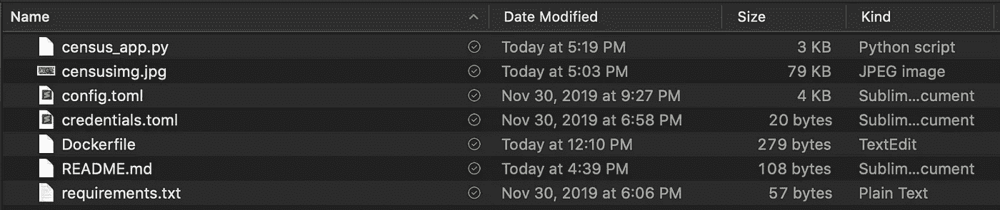

# 使用 Azure 应用服务部署 Streamlit Web 应用

> 原文：<https://towardsdatascience.com/deploying-a-streamlit-web-app-with-azure-app-service-1f09a2159743?source=collection_archive---------4----------------------->

继[微软官方文档之后。](https://docs.microsoft.com/en-us/learn/modules/deploy-run-container-app-service)


Photo by [Daniil Silantev](https://unsplash.com/@betagamma?utm_source=unsplash&utm_medium=referral&utm_content=creditCopyText) on [Unsplash](https://unsplash.com/s/photos/stream?utm_source=unsplash&utm_medium=referral&utm_content=creditCopyText)

# 细流

[Streamlit](https://streamlit.io/docs/) 是一个开源的 python 库，非常适合显示图表和使用小部件与可视化仪表板进行交互。凭借简单的语言和直观的控件，Streamlit 可以帮助您快速创建能够显示[文本、数据帧、图表、地图和更多](https://streamlit.io/docs/api.html)内容的 web 应用。将 Streamlit web 应用部署到实际互联网的第一步是编写 app.py 脚本并在本地启动，以确保它看起来像预期的那样。

您可以通过从我的 [GitHub repo 克隆来部署这个 docker 容器！](https://github.com/rchardptrsn/Census-Data-Streamlit-App)


通过在 shell 中从保存 app.py 文件的文件夹运行`streamlit run app.py`来启动您的 streamlit 应用程序。每当保存 app.py 文件时，本地 web 应用程序都会自动更新。Streamlit 有一个广泛的图形 API，允许 Seaborn/Matplotlib，Plotly 和 Altair 图表。结合 Streamlit 的复选框和其他小部件，您可以构建一个交互式绘图仪表板，而无需了解前端或后端 web 开发。这使得它成为研究人员和数据科学家的一个优秀工具，他们希望快速将研究结果发布到互联网上，或者在互联网上的可访问 web 应用程序中创建演示文稿。

Streamlit 的[入门](https://streamlit.io/docs/getting_started.html)教程是学习 API 的最佳途径，所以我将直接跳到 Streamlit web 应用程序的部署。对于这个例子，我将发表对美国人口普查局收集的[美国 5 年调查数据](https://www.census.gov/programs-surveys/acs)的探索性分析。下面是我的 streamlit 应用程序文件。使用 [CensusData](https://pypi.org/project/CensusData/) pip 包查询数据。

# Azure 容器注册表

当你准备好发布一个 web 应用时，你将创建一个托管在 Azure 容器注册中心的 docker 容器。这个容器将包含 web 应用程序运行所需的一切。

首先，登录到[https://portal.azure.com/](https://portal.azure.com/)。另外，安装 [Azure CLI](https://docs.microsoft.com/en-us/cli/azure/install-azure-cli?view=azure-cli-latest) 。

在您的电脑上，打开存储应用程序的文件夹中的 shell。通过键入以下内容登录 Azure

```
az login
```

接下来，创建一个资源组来存放容器注册中心和我们将在下面的步骤中创建的 Web App 服务。

```
az group create -l eastus -n CensusApp
```

[在 CensusApp 资源组下创建一个容器注册表](https://docs.microsoft.com/en-us/learn/modules/deploy-run-container-app-service/3-exercise-build-images?pivots=csharp)。

```
az acr create --name CensusAppRegistry --resource-group CensusApp --sku basic --admin-enabled true
```

## Dockerfile、配置文件和 requirements.txt

对于此应用程序，有 6 个文件是此应用程序运行所必需的。census_app.py 文件是 streamlit 应用程序文件。Censusimg.jpg 是网站顶部图像的文件。您需要创建一个 Docker 文件，它给出了容器构建的说明，一个 config.toml 文件用于应用程序设置，一个 credentials.toml 文件用于防止 Docker 容器在启动时崩溃，还有一个 requirements.txt 文件用于 app.py 文件所需的 python 包。

您可以访问我的 GitHub 查看完整的项目。



files that complete the docker build

## Dockerfile 文件

```
FROM python:3.7-slim
COPY . /app
WORKDIR /app
RUN pip install -r requirements.txt
EXPOSE 80
RUN mkdir ~/.streamlit
RUN cp config.toml ~/.streamlit/config.toml
RUN cp credentials.toml ~/.streamlit/credentials.toml
WORKDIR /app
ENTRYPOINT ["streamlit", "run"]
CMD ["census_app.py"]
```

## 和 credentials.toml

我推荐从他的 [awesome-streamlit 存储库中复制](https://github.com/MarcSkovMadsen/awesome-streamlit/tree/master/.streamlit) [MarcSkovMadsen](https://github.com/MarcSkovMadsen/awesome-streamlit/commits?author=MarcSkovMadsen) 的 config.toml 文件。

**requirements.txt**

```
streamlit
pandas
numpy
seaborn
matplotlib
psycopg2-binary
```

# 构建 docker 映像并保存到 Azure 容器注册表

在 shell 中保存文件的文件夹中，运行:

```
az acr build --registry CensusAppRegistry --resource-group CensusApp --image census-app .
```

如果构建成功，您应该会看到带有 sha256 的映像描述，输出类似于: **Run ID: ca1 在 2m36s 秒后成功**。通过登录 Azure 门户并导航到您的资源组，仔细检查以确保图像在您的容器注册表中，单击您的容器注册表，在服务刀片下，单击存储库。

# 从容器映像部署 Web 应用程序

为您的 web 应用创建应用服务计划。这将决定运行 docker 映像的虚拟机的大小。在这里，我选择了 B1 的 sku，这是 free 上面的第一层。在写这篇文章的时候，B1 服务计划是 12.41 英镑/月。[在门户内创建应用服务计划](https://docs.microsoft.com/en-us/cli/azure/appservice/plan?view=azure-cli-latest#az-appservice-plan-create)或运行:

```
az appservice plan create -g CensusApp -n CensusAppServicePlan -l eastus --is-linux --sku B1
```

[通过运行下面的命令从容器注册表中的 docker 容器创建 Azure web app](https://docs.microsoft.com/en-us/cli/azure/webapp?view=azure-cli-latest#az-webapp-create) ，[或者从门户创建。](https://docs.microsoft.com/en-us/learn/modules/deploy-run-container-app-service/5-exercise-deploy-web-app?pivots=csharp)

```
az webapp create -g CensusApp -p CensusAppServicePlan -n census-web-app -i censusappregistry.azurecr.io/census-app:latest
```

若要查看您的新网站，请转到您的新 web 应用程序资源并选择“浏览”。第一次查看时，会有冷启动延迟，大约 5 分钟后可能会没有响应。回到资源并再次单击 browse，您的 web 应用程序应该会出现在您的浏览器中！

现在，您应该可以在资源组中看到 3 个资源。


# 重新部署您的 web 应用程序

这种 web 应用交付方法的美妙之处在于，您可以通过重新构建容器来重新部署应用。

只需对您的 streamlit app.py 文件进行更改，并通过运行我们之前运行的命令在容器注册表中构建初始映像来重新构建您的容器。

```
az acr build --registry CensusAppRegistry --resource-group CensusApp --image census-app .
```

浏览器地址栏中将显示新 web 应用的链接。看看那个漂亮的应用程序！现在您已经完成了部署，您可以重新访问应用程序，进行更改并添加功能。干得好！


[请访问我的 GitHub](https://github.com/rchardptrsn/Census-Data-Streamlit-App) 获取用于构建这个容器化 web 应用程序的文件！

感谢您的阅读！

**编辑:将 SQL 请求更改为实际的 [CensusData API](https://pypi.org/project/CensusData/) 请求！