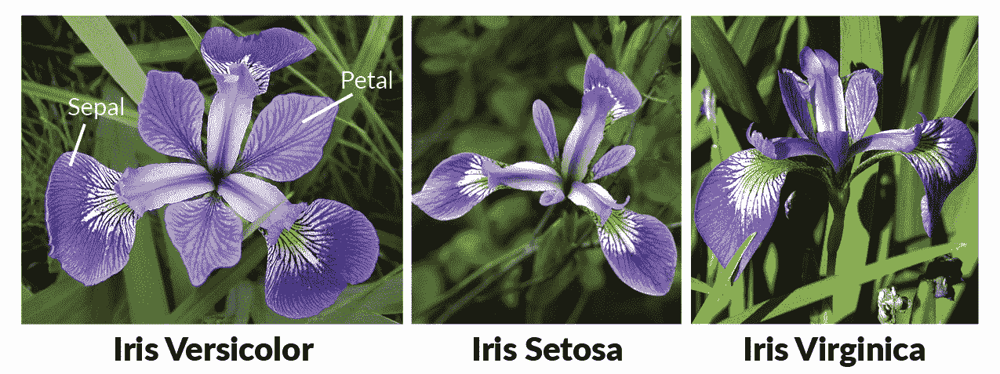
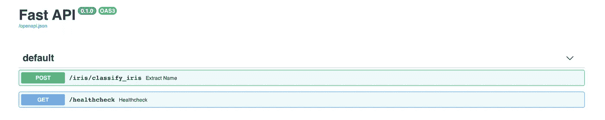

# 使用 FastAPI 和 Docker 部署 Iris 分类

> 原文：<https://towardsdatascience.com/deploying-iris-classifications-with-fastapi-and-docker-7c9b83fdec3a?source=collection_archive---------15----------------------->


## TLDR；

我们使用 Docker 部署了一个 FastAPI 应用程序，根据虹膜的测量值对其进行分类。所有的代码都可以在这里找到。

## 虹膜数据集

Iris 数据集是一个简单但广泛用于统计建模和机器学习的例子。该数据包含均匀分布在 3 个鸢尾亚类之间的 150 个观察值: *setosa，versicolor，virginica。*每个观察值包含相应的子类以及这些测量值:萼片宽度、萼片长度、花瓣宽度、花瓣长度(所有单位均为厘米)。



## FastAPI

> FastAPI 是一个现代、快速(高性能)的 web 框架，用于基于标准 Python 类型提示用 Python 3.6+构建 API。

FastAPI 网站提供了关于 FastAPI 如何工作以及使用 FastAPI 的优势的更多细节。顾名思义，FastAPI 就是 *fast* 。最重要的是，设置非常简单，框架带有一个 Swagger UI，它记录了 API 并使测试交互更加容易。

# 步骤 0:先决条件

1.  [安装对接器](https://docs.docker.com/v17.09/engine/installation/)
2.  按照[自述文件](https://github.com/happilyeverafter95/iris-classifier-fastapi)上的说明，确保安装了所有依赖项(`pip install requirements.txt`

我们将使用 Docker 和 FastAPI 将我们的模型部署为 REST API。API(应用程序编程接口)是一组定义其他应用程序如何与您的代码交互的函数和过程。REST APIs 利用 HTTP 方法如`GET, POST, PUT, DELETE`来管理这种交互。

在本例中，我们将只使用两种 HTTP 方法:

*   `GET:`用于从应用程序中检索数据
*   `POST:`用于向应用程序发送数据(推理所需)

当我们发送一个 HTTP 请求时，服务器发出一个状态码。状态代码通知请求的状态。我们可以根据第一个数字对状态代码进行分类:

*   1xx:信息回应
*   2xx:请求成功
*   3xx:需要进一步的操作来完成请求
*   4xx:由于客户端错误(即语法错误)，请求失败
*   5xx:由于服务器问题(即功能未实现)，请求失败

对于我们的应用程序，我们只会看到 2xx、4xx 和 5xx 代码。`200 OK`状态代码是我们*希望*看到的代码。

创建一个名为`iris`的新目录。该目录将包含用于构建应用程序的所有代码。

# 步骤 1:训练一个简单的分类器

为了简单起见，让我们使用逻辑回归作为我们的算法。我们可以使用`sklearn`来提供虹膜数据集并进行建模。

为了可读性，我将分类器构造为一个*类*。`train_model`用于训练分类器，`classify_iris`用于按照以下格式对新观察值进行分类:

`{'sepal_w': <sepal width>, 'sepal_l': <sepal length>, 'petal_w': <petal_width>, 'petal_l'l: <petal length>}`

我整理的这个分类器有很多缺点。抛开简单性不谈，每次调用`classify_iris`时都会训练一个新的分类器。这是对时间的不必要的利用，也使得审核之前的预测更加困难。一个更好的选择是将模型文件保存为应用程序的一部分，并加载它进行推理。

# 步骤 2:定义路由器

在与我们在步骤 1 中编写的分类器脚本相同的目录中，创建一个名为`routers`的文件夹来存放我们的路由器。路由器用于将复杂的 API 分解成更小的部分。每台路由器都有自己的前缀来标记这种分离。

在`routers`目录中，创建一个名为`iris_classifier_router.py`的脚本。这将`/classify_iris`路由到其相应的函数。响应与`IrisClassifier.classify_iris()`生成的响应相同

# 步骤 3:定义应用程序

在与`routers`文件夹相同的目录下，创建另一个脚本`app.py`。在此脚本中，定义应用程序并指定路由器。

我们还定义了一个`healthcheck`函数。健康检查 API 返回应用程序的运行状态。我们的健康检查返回了令人愉快的短语*虹膜分类器一切就绪！*应用健康时。请注意，这将调用一个`200`状态代码。

# 步骤 4:包含依赖项，Dockerfile

到这一步，文件结构应该如下所示:

├──iris
│├──iris _ classifier . py
│├──app . py
│└──路由器
│└──——iris _ classifier _ router . py

转到上一个目录，创建一个`requirements.txt`文件，指定构建这个应用程序所需的所有依赖项。

我的`requirements.txt`长这样:

```
fastapi==0.38.1
numpy==1.16.4
scikit-learn==0.20.1
uvicorn==0.9.0
```

我们还需要创建一个`Dockerfile`，它将包含组装图像所需的命令。一旦部署，其他应用程序将能够从我们的虹膜分类器进行消费，以做出关于花的酷推论。

`Dockerfile`也可以在上面链接的 GitHub repo 中找到。

第一行为我们的应用程序定义了 Docker 基本图像。python:3.7-slim-buster 是一个受欢迎的图片——它很轻量级，构建起来非常快。第二行指定维护者。使用`docker inspect`可以发现维护者信息。

我们的 Dockerfile 以一个`CMD`结束，它用于将默认命令设置为`uvicorn --host 0.0.0.0 --port 5000 iris.app:app`。默认命令在我们运行容器时执行。

# 步骤 5:运行 Docker 容器

使用`docker build . -t iris`构建 docker 图像。这一步需要一段时间才能完成。

构建完映像后，使用`docker run -i -d -p 8080:5000 iris`生成 docker 容器。这将应用程序暴露给端口 8080。运行容器还会启动我们之前设置的默认命令——这有效地启动了应用程序！

# 与 API 交互

使用`curl 'http://localhost:8080/healthcheck'`进行健康检查

要获得推论，请使用以下请求。`-d`之后的 JSON 字符串是传递给`classify_iris.`的模型输入

```
curl 'http://localhost:8080/iris/classify_iris' -X POST -H 'Content-Type: application/json' -d '{"sepal_l": 5, "sepal_w": 2, "petal_l": 3, "petal_w": 4}'
```

前往`localhost:8080/docs`查看 Swagger UI。这使得测试请求*变得更加容易。*



如果您有兴趣阅读更多关于模型部署的内容，我写了另一篇关于[使用 TensorFlow 服务](/deploying-kaggle-solution-with-tensorflow-serving-part-1-of-2-803391c9648)部署 Keras 文本分类器的文章。

# 感谢您的阅读！

如果你喜欢这篇文章，可以看看我关于数据科学、数学和编程的其他文章。[通过 Medium](https://medium.com/@mandygu) 关注我的最新动态。😃

作为一个业余爱好项目，我还在[www.dscrashcourse.com](http://www.dscrashcourse.com/)建立了一套全面的**免费**数据科学课程和练习题。

如果你想支持我的写作，下次你报名参加 Coursera 课程时，可以考虑使用我的会员链接。完全公开—我从每一次注册中获得佣金，但不会对您产生额外费用。

再次感谢您的阅读！📕