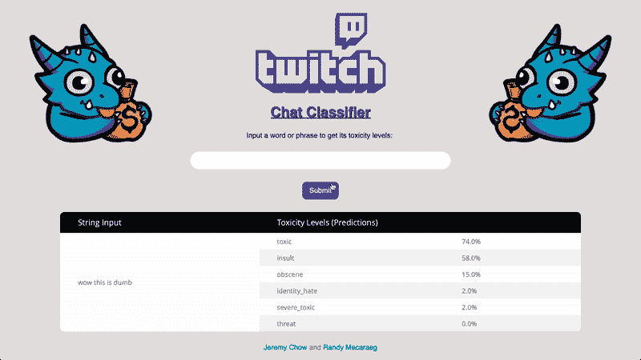

# 将模型部署到 Flask

> 原文：<https://towardsdatascience.com/deploying-models-to-flask-fb62155ca2c4?source=collection_archive---------10----------------------->


Photo by [Agence Olloweb](https://unsplash.com/@olloweb?utm_source=unsplash&utm_medium=referral&utm_content=creditCopyText) on [Unsplash](https://unsplash.com/search/photos/website?utm_source=unsplash&utm_medium=referral&utm_content=creditCopyText)

## 关于如何使用 Python 和 Flask 为用户交互部署机器学习模型的演练

这个项目的代码可以在[这里](https://github.com/jeremyrchow/Harassment-Classifier-App)找到。

你已经用熊猫、Sci-kit Learn 和 Jupyter 笔记本建立了一个模型。结果在您的笔记本上看起来很棒，但是您如何与他人分享您的成果呢？

为了共享模型，我们需要**部署**它们，最好是部署到某个网站，或者至少使用 Python 文件。今天，我将以我的[聊天室毒性分类器](/quantifying-chatroom-toxicity-e755dd2f9ccf)模型为例，向您介绍使用 Python 和 Flask 将模型部署到网站的过程。本文假设您知道如何编写 Python 代码，了解 HTML 的基础知识，并且安装了 Flask】或`conda install flask`)。我们将从文件结构开始！

# Flask 文件结构

Flask 希望东西在一个特定的文件夹布局中，以便正确加载。我为这个项目的文件结构拍了一个快照，但是下面只列出了几个重要的元素:


Example of deployed Flask and Heroku file structure

必要的要素是:

1.  **静态**文件夹—存在于根目录中。这包含了所有的静态资产，如 css 文件、图像、字体和压缩模型。
2.  **模板**文件夹——存在于根目录中。这是模板 HTML 文件**必须**在的默认位置，以便 Flask 正确地渲染它们。任何与你的模型交互的页面都会在这里。
3.  **predictor.html**—这是用户可以与之交互的前置 HTML 文件，您的模型将向其输出结果。这是一个需要放在 Templates 文件夹中的文件示例。
4.  **predictor_api.py** —存在于根目录中。该文件包含运行模型和数据预处理的函数。
5.  **predictor_app.py** —存在于根目录中。这个文件充当调用模型的 API 文件和显示结果并接受用户输入的 HTML 文件之间的链接。

上图中的所有内容对于 Flask 的正常运行都不是必需的，在本文的其余部分可以忽略。让我们来看看你是如何设置这些文件的！

# 设置 API.py 文件

首先，您需要创建一个 API Python 文件。这是一个包含所有方法的文件，这些方法预处理您的数据，加载您的模型，然后根据用户提供的数据输入运行您的模型。请注意，这是独立于 Flask 的**，**，因为这只是一个 python 文件，运行您的模型，没有 Flask 功能。下面是我的 predictor_api.py 文件的框架，其中包含运行我的模型的所有函数:

```
# predictor_api.py - contains functions to run modeldef clean_word(text):
    # Removes symbols, numbers, some stop words    
    return cleaned_textdef raw_chat_to_model_input(raw_input_string):
    # Converts string into cleaned text, converts it to model input
    return word_vectorizer.transform(cleaned_text)def predict_toxicity(raw_input_string):
    # Takes in a user input string, predict the toxicity levels
    model_input = raw_chat_to_model_input(raw_input_string)
    results = []
    # I use a dictionary of multiple models in this project
    for key,model in model_dict.items():
        results.append(round(model.predict_proba(model_input)))
    return resultsdef make_prediction(input_chat):
    '''
    Given string to classify, returns the input argument and the    
    dictionary of model classifications in a dict so that it may be
    passed back to the HTML page.
    ''' # Calls on previous functions to get probabilities of toxicity
    pred_probs = predict_toxicity(input_chat) probs = [{'name': list(model_dict.keys())[index], 'prob': \    
            pred_probs[index]} \
            for index in np.argsort(pred_probs)[::-1]]    
return (input_chat, probs)
```

这是个人偏好，您的数据处理步骤将因您正在做的模型类型以及您正在处理的数据而异，但我将这个有毒聊天分类器中的功能分为:

1.  字符串清洗
2.  对字符串进行矢量化，以将其输入到模型中
3.  使用步骤 2 的输出建立预测模型
4.  最终`make_predictions`函数，在一次函数调用中调用从原始输入到模型预测的管道中的所有先前步骤。

旁注:您将希望以**字典格式**传递您的预测，因为这是 Flask 在其模板和 python 文件之间传递信息的格式。

## 测试 API.py 文件

一旦你设置好了你的函数，你需要一些方法来测试它们。这是我们为脚本设置主要部分的时候:

```
if __name__ == '__main__':
    from pprint import pprint
    print("Checking to see what empty string predicts")
    print('input string is ')
    chat_in = 'bob'
    pprint(chat_in)x_input, probs = make_prediction(chat_in)
    print(f'Input values: {x_input}')
    print('Output probabilities')
    pprint(probs)
```

只有当我们使用`python script_name.py`在命令行上启动脚本时，`__name__=='__main__'`部分才会运行。这允许我们调试我们的功能，并在一旦我们的应用程序或网站启动就不会运行的文件区域中添加任何单元测试。**这部分代码纯粹是给程序员看的，以确保你的函数正常工作**。

# 设置 Flask Python app.py 文件

现在您的 API 文件应该可以工作了。酷，我们怎么把它放到网站上？这就是弗拉斯克的用武之地。Flask 是一个 Python 框架，它使用 [Jinja2 HTML 模板](http://jinja.pocoo.org/docs/2.10/intro/#basic-api-usage)来允许你使用 Python 轻松地创建网页。Flask 框架处理大量的后端 web 内容，因此您只需几行 Python 代码就可以做更多的事情。首先，您需要创建应用程序 Python 文件:

```
# predictor_app.py
import flask
from flask import request
from predictor_api import make_prediction# Initialize the appapp = flask.Flask(__name__)# An example of routing:
# If they go to the page "/" (this means a GET request
# to the page [http://127.0.0.1:5000/](http://127.0.0.1:5000/))[@app](http://twitter.com/app).route("/", methods=["GET","POST"])
def predict():
    # request.args contains all the arguments passed by our form
    # comes built in with flask. It is a dictionary of the form
    # "form name (as set in template)" (key): "string in the    
    # textbox" (value)
    print(request.args)
    if(request.args):
        x_input, predictions = \   
            make_prediction(request.args['chat_in'])
        print(x_input)
        return flask.render_template('predictor.html',
                                     chat_in=x_input,
                                     prediction=predictions)
    else: 
        #For first load, request.args will be an empty ImmutableDict
        # type. If this is the case we need to pass an empty string
        # into make_prediction function so no errors are thrown.

        x_input, predictions = make_prediction('')
        return flask.render_template('predictor.html',
                                     chat_in=x_input,
                                     prediction=predictions)# Start the server, continuously listen to requests.if __name__=="__main__":
    # For local development, set to True:
    app.run(debug=False)
    # For public web serving:
    #app.run(host='0.0.0.0')
    app.run()
```

这里发生了很多事情，所以我会试着把它分成容易理解的部分。

## 进口

首先我们导入 flask，并明确地导入`request`以提高生活质量。接下来，我们有

```
from predictor_api import make_prediction
```

这将转到我们之前编写的 API 文件并导入`make_prediction`函数，该函数接收用户输入并运行所有数据预处理，然后输出我们的预测。

## 托管网页

我将简单地跳到底层代码。如前所述，

```
if __name__=="__main__":
```

通过命令行运行 Python 脚本时运行。为了托管我们的网页，我们需要运行`python your_app_name.py`。这将调用`app.run()`并在本地运行我们的网页，托管在您的计算机上。

## 按指定路线发送

初始化应用程序后，我们必须告诉 Flask 当网页加载时我们要做什么。行`@app.route("/", methods = ["GET","POST"])` 告诉 Flask 当我们加载我们网站的主页时该做什么。GET 方法是 web 浏览器在访问网页的 URL 时向网站发送的请求类型。不要担心 POST 方法，因为它是用户想要更改网站时通常使用的请求，在这个部署过程中它与我们没有太大的相关性。如果您想在网站上添加另一个页面，您可以添加:

```
@app.route("/page_name", methods = ["GET","POST"])
def do_something():
    flask.render_template('page_name.html',var_1 = v1, var_2 = v2)
```

路由下的函数名没有任何意义，它只包含用户到达该页面时运行的代码。

## 运行模型

在路由下面的函数中，我们有`request.args`。这是一个 dictionary ( [JSON](https://www.w3schools.com/js/js_json_syntax.asp) )对象，它包含当有人单击我们表单上的“提交”按钮时提交的信息。下面我将展示我们如何分配`request.args` 对象中的内容。一旦我们有了参数，我们就使用从其他文件导入的函数将它传递给我们的模型，然后**使用我们的模型通过返回的预测值来呈现模板**:

```
return flask.render_template('predictor.html',
                              chat_in=x_input,
                              prediction=predictions)
```

这个函数接收我们的网站运行的 html 文件，然后传入从模型`x_input, predictions`输出的变量，并将它们作为`chat_in, prediction`发送到 HTML 模板。从这里开始，模型的工作就完成了，现在我们只需要担心向用户显示结果！

# 烧瓶模板

## 将用户输入传递到 app.py 文件

首先，我们需要为用户提供一种方法，将他们的输入传递给我们的模型。因为我们接受聊天输入，所以让我们创建一个文本框和一个提交按钮。

```
HTML Code
<input type="text" name="chat_in" maxlength="500" ><!-- Submit button -->
<input type="submit" value="Submit" method="get" >
```

当用户输入一个值并点击 submit 按钮时，它将向模板发送一个 get 请求，并用文本框中的`name`标志填充`request.args` 字典。为了访问用户的输入，我们将在 Python 应用程序文件中使用`request.args['chat_in']`。我们可以将它传递到模型中，如上面这行所示:

```
make_prediction(request.args['chat_in'])
```

## 将模型输出传递给 HTML 模板

因此，我们已经使用 python 文件做出了预测，但现在是时候使用 HTML 模板显示它们了。模板只是改变 HTML 代码的一种方式，这样我们就可以用新的值(比如我们的预测)来更新用户。我的目标不是在这里教你 HTML，所以我不打算详细说明 HTML 代码(但是如果你好奇，你可以在 github 链接中找到它)，但是基本上你会使用下面的语法显示传递的变量:

```
<!-- predictor.html file -->
<!DOCTYPE html>
<html lang="en"><p> Here are my predictions!<br>
{{ chat_in }}
{{ prediction[0]['prob'] }} </p>
```

在这个例子中，我显示了在上面的`render_template`函数中传递的`chat_in`变量。我还显示了传递给模板的字典`prediction`中的第一个元素，它包含多个模型。从功能的角度来看，我们完成了！从这里开始，你可以专注于让你的应用程序看起来漂亮，反应灵敏。



Website example using chat toxicity classifier

烧瓶到此为止！通过一些额外的 HTML 代码和可能的 JavaScript，你可以拥有一个在你的电脑上运行的漂亮的交互式网站。从这里，你可以将网站部署到你选择的平台上，可以是 Heroku、Amazon Web Services 或 Google Cloud。

感谢阅读，请关注我的下一篇关于部署到 Heroku 的文章！