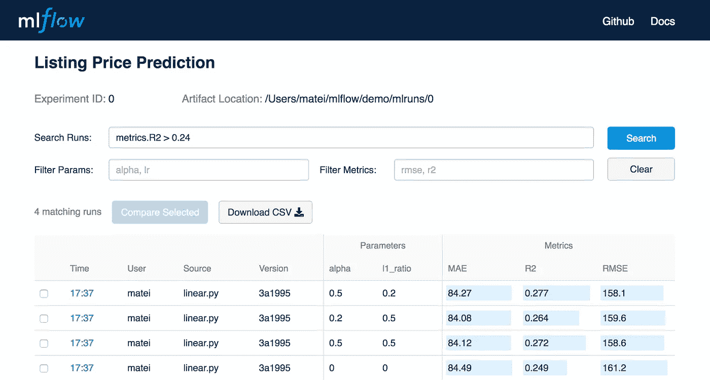

# 使用 Mlflow 和 Amazon Sagemaker 将模型部署到生产环境中

> 原文：<https://towardsdatascience.com/deploying-models-to-production-with-mlflow-and-amazon-sagemaker-d21f67909198?source=collection_archive---------4----------------------->

*2019 年 8 月 21 日更新:更改了参数和一些硬编码变量，以便与 mlflow 1.2.0 一起使用*

随着数据科学在 2019 年继续成熟，对数据科学家超越笔记本电脑的需求越来越多。一些绩效指标不再足以交付商业价值。模型需要以可伸缩的方式部署和使用，实时模型推理应该是容错和高效的。


Is Naruto in Sage Mode too nerdy even for this post? Probably…the SageMaker pun is weak as hell too but whatever — [Source](https://vignette.wikia.nocookie.net/naruto/images/d/dc/Naruto%27s_Sage_Mode.png/revision/latest?cb=20150124180545)

传统上，模型部署是由工程团队处理的。数据科学家将模型交给工程师进行代码重构和部署。然而，数据科学家缺乏标准化和良好的开发/运营会在两个团队之间产生摩擦，使部署变得繁琐和低效。作为对这一趋势的回应，Databricks 公司(由 Apache Spark 的创始人创立)一直致力于 ml flow——一个用于模型跟踪、评估和部署的开源机器学习平台。参见[介绍发布帖](https://databricks.com/blog/2018/06/05/introducing-mlflow-an-open-source-machine-learning-platform.html)。

Mlflow 与 Amazon SageMaker 或 AzureML 等托管部署服务配合得很好。你甚至可以用它来构建定制的开源部署管道，比如 Comcast 的这个[。鉴于最近发布的 mlflow 1.0.0，我想为数据科学家提供一些关于部署和管理他们自己的模型的最低限度的指导。](https://databricks.com/session/how-to-utilize-mlflow-and-kubernetes-to-build-an-enterprise-ml-platform)

# 设置

对于本教程，您需要:

*   AWS 帐户
*   安装在本地机器上的 Docker
*   安装了`mlflow>=1.0.0`的 Python 3.6

让我们开始吧。

## 配置亚马逊

您需要做的第一件事是在您的本地机器上配置 AWS CLI，以便您可以通过编程方式与您的帐户进行交互。如果你还没有，在这里创建一个账户[然后从终端运行下面的命令。](https://aws.amazon.com/)

```
pip install awscli --upgrade --user
aws configure
```

第二个命令将提示您输入您的密钥和区域，您可以在登录到控制台时从您的帐户获得。在此处查看完整指南[。如果您愿意，您还可以创建具有更具体和有限权限的 IAM 用户，如果您有多组凭证，请确保将`AWS_DEFAULT_PROFILE`环境变量设置为正确的帐户。](https://docs.aws.amazon.com/cli/latest/userguide/cli-chap-configure.html)


View of the AWS Console

最后，您需要一个能够访问 SageMaker 的角色。在 AWS 上，转到 IAM 管理控制台并创建一个新角色。然后，将“AmazonSageMakerFullAccess”策略附加到角色，稍后您将需要它来与 SageMaker 进行交互。

## 其他安装

按照正确的步骤在你的操作系统上安装 Docker 。然后确保你启动了 Docker 守护进程(在你的菜单栏里查看有趣的小鲸鱼)。

不打算解释如何安装 Python——我们必须超越这个权利？只要确保你已经用`pip install mlflow`安装了最新的 mlflow。如果您与团队合作，您也可以运行远程 mlflow 服务器，只需确保您指定了 mlflow 记录模型的位置(S3 存储桶)。请参见下面的服务器命令:

```
mlflow server --default-artifact-root s3://bucket --host 0.0.0.0
```

该服务应该在端口 5000 上启动。只需确保启动 mlflow 的主机和您的本地机器都具有对 S3 存储桶的写访问权限。如果只是在本地工作，不需要启动 mlflow。

# 使用 Mlflow 进行模型跟踪

酷，现在我们准备好开始实际建模了。Mlflow 允许您记录参数和指标，这对于模型比较来说非常方便。在您的代码中创建一个实验将会创建一个名为“mlruns”的目录，其中存储了您的实验的所有信息。

不要恨我，但我将使用 iris 数据集，因为它非常简单，这里的目的是说明 mlflow 如何与 SageMaker 一起使用。下面，我们可以看到一个记录我们的超参数、模型性能度量和实际模型本身的例子。

现在还不清楚发生了什么，但是如果你打开另一个终端，在你当前的工作目录中输入`mlflow ui`，你可以在一个方便的应用程序中检查我们刚刚登录的所有内容。Mlflow 允许您通过参数和指标进行过滤，并查看您可能已经记录的任何工件，如模型、环境、元数据等...



Look at the Mlflow UI (not our models) — [Source](https://databricks.com/wp-content/uploads/2018/06/mlflow-web-ui.png)

当 mlflow 记录模型时，它还会生成一个`conda.yaml`文件。这是您的模型需要运行的环境，它可以根据您的需要进行大量定制。使用 mlflow 模型可以做更多的事情，包括自定义预处理和深度学习。这个库有各种各样的模型“风格”,所以你不会被 sklearn 束缚住，还可以使用 Pytorch 或 TF。点击查看文件[。](https://www.mlflow.org/docs/latest/models.html)

# 亚马逊 ECR 图像

既然我们已经保存了我们的模型工件，我们需要开始考虑部署。第一步是向 Amazon 的弹性容器注册中心提供一个 Docker 映像，我们可以用它来服务我们的模型。如果你对 Docker 不熟悉，请查看[文档](https://docs.docker.com/get-started/)。


Amazon ECR — [Source](https://d1.awsstatic.com/diagrams/product-page-diagrams/Product-Page-Diagram_Amazon-ECR.bf2e7a03447ed3aba97a70e5f4aead46a5e04547.png)

mlflow Python 库有用于这一部分的函数，但我在编写时遇到了一些问题，所以我使用了 CLI。打开一个新终端，并在命令行中键入以下内容:

```
mlflow sagemaker build-and-push-container
```

如果您已经使用适当的权限正确地设置了 AWS，这将在本地构建一个映像，并将其推送到 AWS 上的映像注册表中。要检查它是否正常工作，请转到 AWS 控制台，并单击“服务”下拉菜单中“计算”下面列出的“ECR”服务。您应该看到一个名为`mlflow-pyfunc`的存储库，其中应该列出了一个图像。

# 部署到 Sagemaker

现在，在部署供消费的模型端点之前，我们只剩下有限的事情要做了。基本上，我们所要做的就是向 mlflow 提供我们的图像 url 和所需的模型，然后我们可以将这些模型部署到 SageMaker。


Amazon SageMaker Workflow — [Source](https://www.google.com/url?sa=i&source=images&cd=&ved=2ahUKEwjmwsakzr_jAhVLnOAKHTrQCsUQjRx6BAgBEAU&url=https%3A%2F%2Faws.amazon.com%2Fblogs%2Faws%2Fsagemaker%2F&psig=AOvVaw0G9_PSK7bAC6xy95EGXX7d&ust=1563578561006843)

您需要的是您的 AWS ID，您可以从控制台或通过在终端中键入`aws sts get-caller-identity --query Account --output text`来获得它。此外，您将需要在设置 Amazon 时创建的 SageMakerFullAccess 角色的 ARN。转到 IAM 管理控制台，单击角色并复制 ARN。如果您的模型托管在本地系统之外的其他地方，您还必须编辑模型路径。

如果您的 AWS 凭证设置正确，这应该会连接到 SageMaker 并部署一个模型！可能需要一点时间才能达到“使用中”状态。一旦完成，您就可以使用`boto3`库或通过进入控制台，以编程方式检查您的模型是否已经启动并运行。这段代码改编自这里的[数据块教程](https://docs.databricks.com/_static/notebooks/mlflow/mlflow-quick-start-deployment-aws.html)。

输出应该如下所示:

```
Application status is: InService
Received response: [2.0]
```

现在您正在调用您的端点，您可以通过 AWS 控制台查看使用情况的统计数据，方法是转到 SageMaker 服务。使用 SageMaker 还可以做更多的事情，但是我将把这些留给大量其他可用的教程。一旦你玩完了新的机器学习模型，你就可以删除端点了。

```
mfs.delete(app_name=app_name, region_name=region)
```

就是这样！这是一个非常简单的教程，但希望这能让你一窥生产级机器学习的各种可能性。请记住，永远不要将 AWS 密钥发布或上传到 Github 这样的地方——有人会偷走它们，并在你的硬币上挖掘一堆比特币。玩得开心！