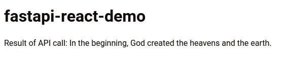
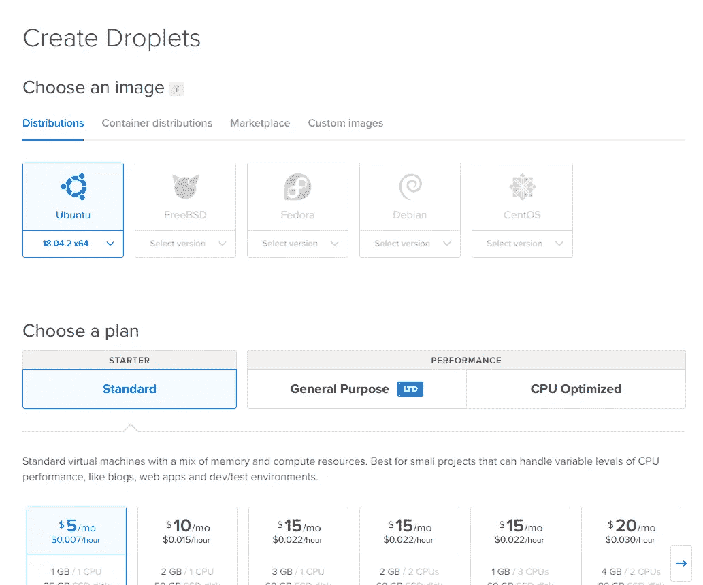
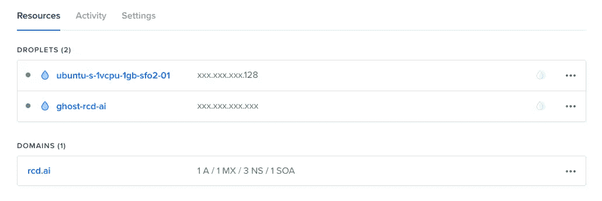
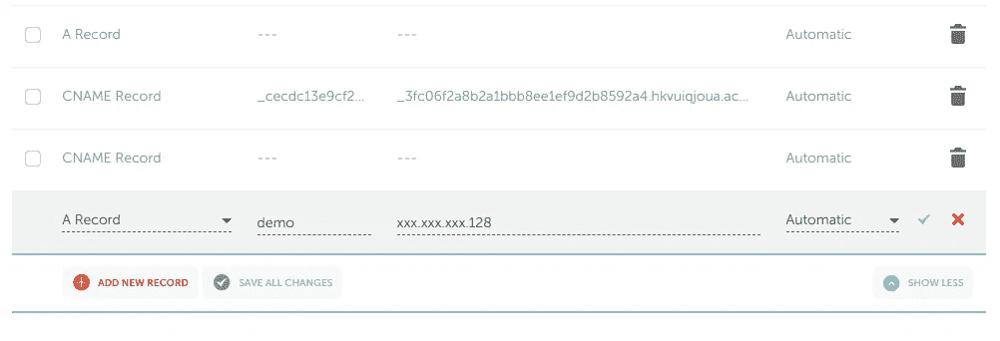
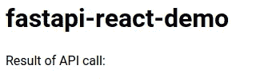
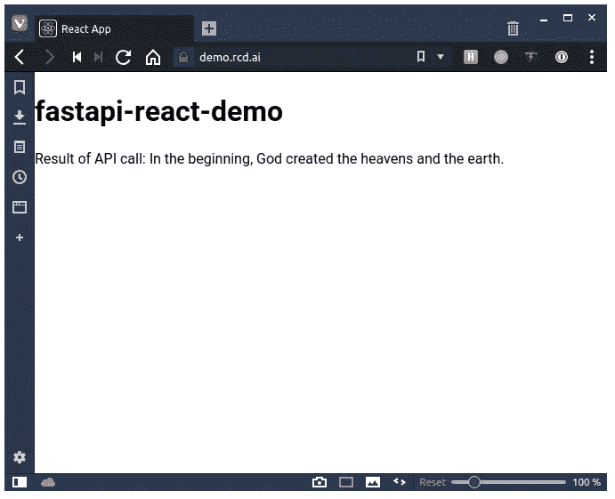

# 用 JavaScript 部署您的数据科学项目

> 原文：<https://towardsdatascience.com/deploying-your-data-science-projects-in-javascript-b873df6c2450?source=collection_archive---------22----------------------->

## 一小时内将 React 客户端、Python JSON API 和 SSL 证书从 Let's Encrypt 推送到 DigitalOcean


Photo by [Daniel Mayovskiy](https://unsplash.com/photos/ai6IRDJQMKw?utm_source=unsplash&utm_medium=referral&utm_content=creditCopyText) on [Unsplash](https://unsplash.com/search/photos/rocket?utm_source=unsplash&utm_medium=referral&utm_content=creditCopyText)

对于我最新的项目，我决定使用 React 进行大部分探索性数据分析(EDA ),并需要一个非常简单的 JSON API 来提供必要的数据，以避免加载+70 MB 的页面。在本教程中，我将带你在 DigitalOcean 上使用 [create-react-app](https://facebook.github.io/create-react-app/) 、 [fastapi](https://fastapi.tiangolo.com/) 和 [Nginx](https://www.nginx.com/) 部署一个示例应用的过程。您可以探索真正的应用程序，因为它目前位于 [https://ecce.rcd.ai](https://ecce.rcd.ai/) 。这种产品部署过程有点手动，但是如果需要的话，当然可以自动化。

以下是实现这一目标的顶级步骤:

1.  用 fastapi 创建 Python API
2.  使用 create-react-app 创建客户端应用程序(并将请求传递给 API)
3.  创建 DigitalOcean droplet 并安装依赖项
4.  配置 Nginx(将 React 和 Python 统一为一个 web 服务)
5.  构建客户端应用程序并拷贝到 droplet
6.  克隆客户端 API 并作为 cronjob 安装
7.  设置域并从 Let's Encrypt 获取 SSL 证书
8.  为出色完成的工作拿一杯咖啡☕！🎉

# Python API 和 fastapi

据我所知， [fastapi](https://fastapi.tiangolo.com/) 是创建 Python API 最简单、最快的方法。这是一个单一文件服务器，可以根据需要轻松扩展和配置。对于这个例子，我们将提供来自 ESV 的诗句(法律允许，因为这是一个非商业项目)。我们将使用这些命令从头开始项目:

```
*# Create directory and jump into it* mkdir -p fastapi-react-demo/app cd fastapi-react-demo *# Download data source* curl -LO [https://github.com/honza/bibles/raw/master/ESV/ESV.json](https://github.com/honza/bibles/raw/master/ESV/ESV.json)
mv ESV.json app/esv.json *# Install dependencies* pip install fastapi uvicorn toolz *# Save dependencies for later use* pip freeze | grep "fastapi\|uvicorn\|toolz" > requirements.txt*# Create server file* touch app/server.py
```

在`app/server.py`中:

```
from fastapi import FastAPI
from starlette.middleware.cors import CORSMiddleware
import json
import os
from toolz import memoizeapp = FastAPI() *# TODO: Change origin to real domain to reject Ajax requests from elsewhere* app.add_middleware(CORSMiddleware, allow_origins=['*'])@memoize
def data():
    with open(os.path.join(os.path.dirname(__file__), 'esv.json')) as f:
         return json.load(f) @app.get('/api/verse/{book}/{chapter}/{verse}')
def load_text(book: str, chapter: int, verse: int):
     try:
         return {'text': data()[book][str(chapter)][str(verse)]}
     except KeyError as e:
         return {'error': str(e), 'type': 'KeyError'}
```

从这个简单的文件中，我们有了 JSON API、CORS、参数验证等等。让我们继续在开发模式下运行它来检查一下:

```
# Start app
uvicorn app.server:app --reload# Send API request (in separate window)
curl [http://localhost:8000/api/verse/Genesis/1/1](http://localhost:8000/api/verse/Genesis/1/1)
# => {"text":"In the beginning, God created the heavens and the earth."}
```

随着服务器的运行，我们不仅在开发中拥有完全可操作的 JSON API，而且如果我们改变了文件中的任何内容，它甚至会实时重新加载。让我们谈谈客户。

# 具有创建-反应-应用的客户端应用

API 在开发模式下运行，让我们继续创建一个客户端应用程序。如果你在 React 中做数据科学可视化，我假设你熟悉 JavaScript 生态系统。

```
npx create-react-app client
```

在添加我们的 ajax 代码之前，我们需要为`create-react-app`配置代理，以将它不能处理的请求转发给运行在端口 8000 上的 API 服务器。

在`client/package.json`

```
 ...
},
"proxy": "http://localhost:8000",
"scripts": ...
```

我们将继续从客户端进行一个简单的 API 调用:

在`client/src/App.js`

```
import React, { Component } from 'react';class App extends Component {
  constructor(props) {
    super(props);
    this.state = { verse: 'Loading...' };
  } componentDidMount() {
    fetch('/api/verse/Genesis/1/1')
      .then(r => r.json())
      .then(data => this.setState({ text: data.text }));
  } render() {
    return (
      <div>
        <h1>fastapi-react-demo</h1>
        <p>Result of API call: {this.state.text}</p>
      </div>
    );
  }
}export default App;
```

有了更新的文件，我们就可以开始启动服务器了。

```
cd client && yarn start
```



万岁！它肯定不会赢得任何设计奖项，但我们现在有两个应用程序互相交谈。我们来谈谈如何实际部署这些应用程序。

请确保您已经将它上传到一个 Git 存储库，以便我们稍后可以轻松地克隆它。(如果没有，不要担心——你可以只使用 https://github.com/rcdilorenzo/fastapi-react-demo 的样本库)。

随着应用程序的启动和运行，我们现在必须为世界部署我们的代码！我们将从创建一个[数字海洋](https://www.digitalocean.com/)水滴开始。在这种情况下，我将选择 Ubuntu 18 的最小磁盘大小来为应用程序服务。



有了 SSH 键，我们就可以进入设置中描述的 droplet 了。



```
ssh root@<DROPLET_IP xxx.xxx.xxx.128># (on server)
apt-get update apt-get install -y nginx-full
```

# 配置 Nginx

我们现在需要设置 Nginx 来完成三项任务。

1.  每当路线以`/api`开始时提供 Python 应用
2.  对于任何特定资产或未找到路线，可退回到 React 应用程序
3.  强制 SSL 并使用来自“让我们加密”的证书

我不会跳过此配置的所有细节，但它应该可以实现我们的目标，稍后您将了解更多细节。对于编辑，继续使用您最喜欢的命令行编辑器。(我的是 vim，用于快速编辑；最简单的是纳米。)确保用您的自定义域替换`demo.rcd.ai`。

在`/etc/nginx/sites-available/demo.rcd.ai.conf`

```
server {
    listen [::]:80;
    listen 80;
    server_name demo.rcd.ai;
    location / {
        return 301 [https://$host$request_uri](/$host$request_uri);
    }
}server {
    listen [::]:443 ssl http2;
    listen 443 ssl http2;
    server_name demo.rcd.ai;
    access_log /var/log/nginx/access.log;
    error_log /var/log/nginx/error.log; ssl_certificate /etc/letsencrypt/live/demo.rcd.ai/fullchain.pem;
    ssl_certificate_key /etc/letsencrypt/live/demo.rcd.ai/privkey.pem; root /var/www/demo/; index index.html; location / {
      try_files $uri $uri/ /index.html;
    } location /api {
      proxy_pass [http://localhost:1234](http://localhost:1234); # Port of Python server
    } # JavaScript/CSS
    location ~* \.(?:css|js)$ {
        try_files $uri =404;
        expires 1y;
        access_log off;
        add_header Cache-Control "public";
    } # Any file route
    location ~ ^.+\..+$ {
        try_files $uri =404;
    }
}
```

让我们将这个文件符号链接到`sites-enabled`文件夹中，这样 Nginx 在收到来自域`demo.rcd.ai`的请求时就会知道要服务它。

```
ln -s /etc/nginx/sites-available/demo.rcd.ai.conf /etc/nginx/sites-enabled/demo.rcd.ai
```

虽然我们可以让 Nginx 重新加载，但是在它正常工作之前，我们还有一些事情要做。

1.  用我们的域名注册商添加`demo.rcd.ai`来指向这个 IP 地址
2.  将客户端的生产版本复制到`/var/www/demo`
3.  克隆 Python 服务器，并在端口 1234 上启动它
4.  请求让我们加密证书

我不会过多讨论设置子域记录的细节，因为这取决于你的提供商。这是我添加到 NameCheap 的内容，因为那是我的注册商。



请注意，这可能需要一段时间才能将变化反映到“互联网”上您总是可以通过简单的 ping 命令来检查它:

```
❯ ping demo.rcd.ai
# PING demo.rcd.ai (159.89.130.128) 56(84) bytes of data.
# 64 bytes from 159.89.130.128 (159.89.130.128): icmp_seq=1 ttl=48 time=88.4 ms
# 64 bytes from 159.89.130.128 (159.89.130.128): icmp_seq=2 ttl=48 time=85.4 ms
# ^C
# --- demo.rcd.ai ping statistics ---
# 2 packets transmitted, 2 received, 0% packet loss, time 1000ms
# rtt min/avg/max/mdev = 85.411/86.921/88.432/1.539 ms
```

# 构建和部署客户端

回到开发机器上的`client/`文件夹，创建一个产品版本就像发出一个命令一样简单。然后我们将它打包并发送到`/var/www/demo`目录中的 DigitalOcean droplet。

```
# Build production-optimized assets
yarn build# Zip contents
zip -r build.zip build/# Upload with scp
scp build.zip root@<DROPLET_IP>:/var/www/
```

然后在水滴上:

```
# Unzip and rename folder
apt-get install -y unzip
cd /var/www && unzip build.zip
mv build demo
```

此时，Nginx 应该适当地服务于资产。然而，因为证书还没有到位，它甚至不允许我们加载配置。

# 来自“让我们加密”的 SSL 证书

虽然我们可以设置 Python 服务器，但最好能得到一些反馈，以确保至少我们的客户端得到了正确的服务。本着快速迭代的精神，让我们首先设置证书。从 https://certbot.eff.org[很容易获得说明。在 droplet 上，继续安装 certbot。](https://certbot.eff.org/)

```
apt-get update
apt-get install software-properties-common
add-apt-repository universe
add-apt-repository ppa:certbot/certbot
apt-get update apt-get install certbot python-certbot-nginx
```

在这里，可以通过一个命令获得证书。

```
certbot certonly --standalone \
  --pre-hook "service nginx stop" \
  --post-hook "service nginx start" \
  --preferred-challenges http -d demo.rcd.ai
# ...
# Running pre-hook command: service nginx stop
# Obtaining a new certificate
# Performing the following challenges:
# http-01 challenge for demo.rcd.ai
# Waiting for verification...
# Cleaning up challenges
# Running post-hook command: service nginx start
# # IMPORTANT NOTES:
# - Congratulations! Your certificate and chain have been saved at:
# /etc/letsencrypt/live/demo.rcd.ai/fullchain.pem
# Your key file has been saved at:
# /etc/letsencrypt/live/demo.rcd.ai/privkey.pem
# Your cert will expire on 2019-06-26\. To obtain a new or tweaked
# version of this certificate in the future, simply run certbot
# again. To non-interactively renew *all* of your certificates, run
# "certbot renew"
# - Your account credentials have been saved in your Certbot
# configuration directory at /etc/letsencrypt. You should make a
# secure backup of this folder now. This configuration directory will
# also contain certificates and private keys obtained by Certbot so
# making regular backups of this folder is ideal.
# ...
```

因为这个命令停止并重启 Nginx，所以我们应该可以直接进入应用程序，看到一些东西( [https://demo.rcd.ai](https://demo.rcd.ai/) )。我们还可以特别请求 Nginx 重新加载配置。

```
nginx -s reload
```



# 部署 API

Nginx 配置需要一个内部服务器监听端口 1234，剩下的就是在 droplet 上运行 Python 服务器。因为我们将代码推送到 GitHub，所以剩余的命令可以从 droplet 运行。

```
# Clone code to folder
cd /var/www
git clone https://github.com/rcdilorenzo/fastapi-react-demo.git demo-server# Install Python-3.6 based virtualenv (to avoid version conflicts)
apt-get install -y python3.6-venv python3-venv python3.6-dev# Jump into server folder
cd demo-server# Create virtual environment in /var/www/demo-server/demo_3.6
python3.6 -m venv demo_3.6# Install a couple of prerequisites for compiling some dependencies
./demo_3.6/bin/pip install wheel
apt-get install -y gcc# Install dependencies
./demo_3.6/bin/pip install -r requirements.txt
```

安装完依赖项后，可以内联启动服务器进行测试。

```
./demo_3.6/bin/uvicorn app.server:app --port 1234
INFO:uvicorn:Started server process [9357]
INFO:uvicorn:Waiting for application startup.
INFO:uvicorn:Uvicorn running on http://127.0.0.1:1234 (Press CTRL+C to quit)
```

重新访问页面，我们可以看到诗句现在正确加载。



然而，只有当我们打开 SSH 会话时，这个 Python 服务器才会运行。为了让它在重启后仍然存在，我们可以添加到`crontab`中。我们必须运行的唯一命令是切换到服务器根目录并运行`uvicorn`。用`CTRL-c`杀死服务器，用`crontab -e`打开 crontab。

```
@reboot cd /var/www/demo-server && ./demo_3.6/bin/uvicorn app.server:app --port 1234
```

保存并关闭该文件。用`reboot`重启服务器。一旦 droplet 重新启动，应用程序应该会自动启动。

如果你已经走到这一步，那么恭喜你。🎉去喝杯咖啡吧！这个过程可能看起来有点乏味，但它表明，只需每月[$ 5](https://www.digitalocean.com/pricing/)美元，您就可以拥有一个生产级的、交互式的数据项目 web 应用程序，而无需通过一组更狭窄的可视化工具来强制数据科学过程。这种程度的灵活性在很多情况下肯定是不必要的，但是现在你知道如何为自己设置一切了。

关于这些步骤中的每一步，还有很多可以说的，但是我想把重点放在主要的工作流程上。当然，更新客户机或服务器需要几个命令，但这很容易实现自动化。如果你真的想要一个长期的、生产就绪的系统，和一个团队一起部署一个 [CI/CD](https://codefresh.io/continuous-integration/continuous-integration-delivery-pipeline-important/) 过程当然是值得花时间投资的。