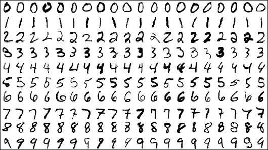
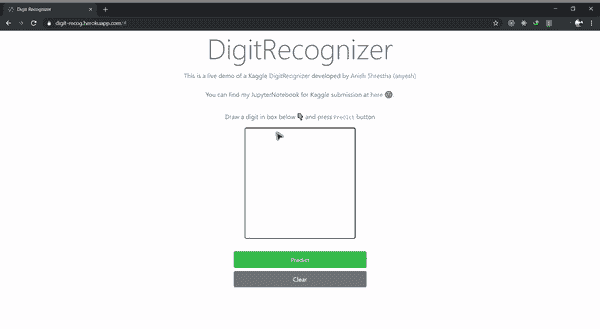
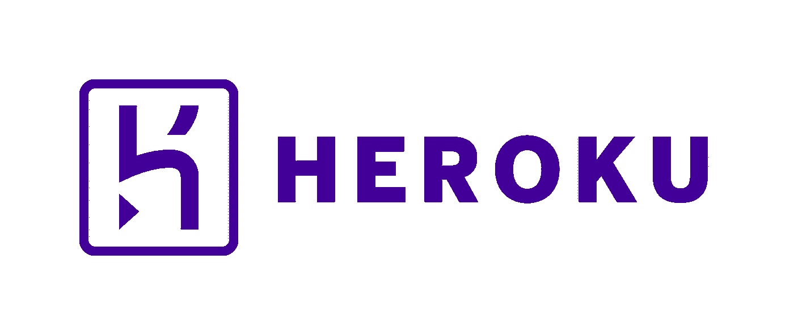
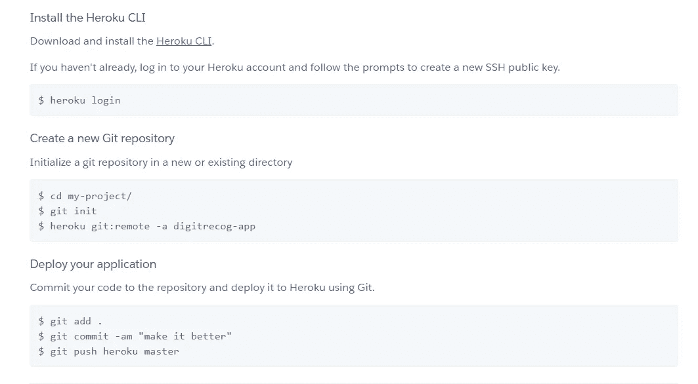

# 部署您的第一个深度学习模型:生产环境中的 MNIST

> 原文：<https://towardsdatascience.com/deploying-your-first-deep-learning-model-mnist-in-production-environment-510bfdc4808d?source=collection_archive---------19----------------------->

## 让你的深度学习模型飞起来

如何在生产环境中部署您的 MNIST 模型


Photo by [Ravi Roshan](https://unsplash.com/@ravi_roshan_inc?utm_source=medium&utm_medium=referral) on [Unsplash](https://unsplash.com?utm_source=medium&utm_medium=referral)

[](http://yann.lecun.com/exdb/mnist/)**数据集对于像我们这样的大多数 ML 爱好者来说是一个 hello world 数据集。在某个时候，每个已经开始这个领域的旅程或愿意开始的人都会遇到这个数据集，并肯定会得到它。**

> **对于那些希望在真实世界数据上尝试学习技术和模式识别方法，同时花费最少精力进行预处理和格式化的人来说，这是一个很好的数据集。——扬·勒昆**

****

**[MNIST](http://yann.lecun.com/exdb/mnist/)**

# **我们在建造什么？**

**在这篇文章中，我将讲述每个完成 MNIST 的人如何在生产环境中使用 Django 和 Heroku 将训练好的模型部署为漂亮的 web 应用程序。**

****

**MNIST Web App Demo**

## **先决条件**

**您应该具备以下基本知识:**

1.  **Python 编程语言**
2.  **[Django](https://www.djangoproject.com/) — Web 应用框架**
3.  **[Heroku](https://dashboard.heroku.com/)——平台即服务(**可选**:你将在这篇文章中学习如何使用它)**

**并且你应该有一个基于 **Keras** 的 **MNIST** 的模型文件；或者你可以马上开始用**[](https://colab.research.google.com/drive/16wrpQXdtYLjp2Kvtl4uxCyX4oVmgmHvo)**的小本子整理文件。******

# ******准备好您的后端******

******首先，让我们使用 CMD 或 bash 终端安装 Django 如果你还没有这样做。******

> ******如果你以前没有 Django 的经验，网上有很多免费的资源。请考虑看看。对于使用 Python 构建 Web 应用程序来说，这是一个非常棒的框架。没什么可失去的。******

## ******启动项目******

************

******[SOURCE](https://media.giphy.com/media/Y3MbPtRn74uR3Ziq4P/giphy.gif)******

```
****pip install django****
```

******这将为您安装 Django，您将可以访问 Django CLI 来创建您的项目文件夹。******

```
****django-admin startproject digitrecognizer****
```

******我将把我的项目命名为 **digitrecognizer** 你可以随意命名。一旦你这样做了，你会看到一个文件夹，里面有一些文件。******

****让我们使用 **mange.py** cli 在该文件夹中创建我们的新应用程序 **main** 。****

```
**python manage.py startapp main**
```

****这将为您创建一个名为 **main** 的新应用程序。现在我们可以在 **views.py** 文件中编写我们的主要代码了。****

## ****代码部分****

****让我们在 **views.py** 文件中编写一些代码:****

```
**## Views.pyfrom django.shortcuts import render
from scipy.misc.pilutil import imread, imresize
import numpy as np
import re
import sys
import os
sys.path.append(os.path.abspath("./model"))
from .utils import *
from django.http import JsonResponse
from django.views.decorators.csrf import csrf_exempt
global model, graph
model, graph = init()
import base64OUTPUT = os.path.join(os.path.dirname(__file__), 'output.png')from PIL import Image
from io import BytesIOdef getI420FromBase64(codec):
    base64_data = re.sub('^data:image/.+;base64,', '', codec)
    byte_data = base64.b64decode(base64_data)
    image_data = BytesIO(byte_data)
    img = Image.open(image_data)
    img.save(OUTPUT)def convertImage(imgData):
    getI420FromBase64(imgData)[@csrf_exempt](http://twitter.com/csrf_exempt)
def predict(request):imgData = request.POST.get('img')convertImage(imgData)
    x = imread(OUTPUT, mode='L')
    x = np.invert(x)
    x = imresize(x, (28, 28))
    x = x.reshape(1, 28, 28, 1)
    with graph.as_default():
        out = model.predict(x)
        print(out)
        print(np.argmax(out, axis=1))
        response = np.array_str(np.argmax(out, axis=1))
        return JsonResponse({"output": response})**
```

********

****看起来很多，其实不是！😂相信我。****

# ****我们来分解一下****

****在代码的最开始，我们导入每个需要的库和模块。****

## ****进口****

****每一个导入都是不言自明的，我也评论了重要的部分，考虑看看它。****

```
**from django.shortcuts import render
from scipy.misc.pilutil import imread, imresize
import numpy as np
import re
import sys## Apending MNIST model path
import os
sys.path.append(os.path.abspath("./model"))## custom utils file create for writing some helper func
from .utils import *from django.http import JsonResponse
from django.views.decorators.csrf import csrf_exempt## Declaring global variable
global model, graph## initializing MNIST model file (It comes from utils.py file)
model, graph = init()import base64
from PIL import Image
from io import BytesIO## Declaring output path to save our imageOUTPUT = os.path.join(os.path.dirname(__file__), 'output.png')**
```

## ****什么是 utils.py 文件？****

****导入所需的库之后，让我们编写一些助手函数来处理一个 **utils.py** 文件中的 MNIST 模型。****

```
**## utils.pyfrom keras.models import model_from_json
from scipy.misc.pilutil import imread, imresize, imshow
import tensorflow as tf
import osJSONpath = os.path.join(os.path.dirname(__file__), 'models', 'model.json')
MODELpath = os.path.join(os.path.dirname(__file__), 'models', 'mnist.h5')def init():
    json_file = open(JSONpath, 'r')
    loaded_model_json = json_file.read()
    json_file.close()
    loaded_model = model_from_json(loaded_model_json)
    loaded_model.load_weights(MODELpath)
    print("Loaded Model from disk")
    loaded_model.compile(loss='categorical_crossentropy',
                         optimizer='adam', metrics=['accuracy']) graph = tf.get_default_graph() return loaded_model, graph**
```

****这个文件包含了 **init** 函数，它基本上初始化了我们使用 **Keras** 保存的 **MNIST** 模型文件。它抓取或模型文件加载它们，并使用 **adam** optimizer 编译它们，使它们为预测做好准备。****

****这里，我们使用**分类交叉熵**作为我们的损失函数， **adam** 作为我们的优化器，而**准确性**作为我们的性能测量指标。****

****你可以从 [**这里**](https://machinelearningmastery.com/save-load-keras-deep-learning-models/) 学习如何使用 Keras 保存模型。****

## ****继续查看. py****

****这里我们有另一个帮助函数来帮助我们转换我们的 **BASE64** 图像文件；它是从客户端抓取到一个 **PNG** 文件；并保存为**输出**变量中的任何内容；即在当前目录下保存为 output.png 文件。****

```
**def getI420FromBase64(codec):
    base64_data = re.sub('^data:image/.+;base64,', '', codec)
    byte_data = base64.b64decode(base64_data)
    image_data = BytesIO(byte_data)
    img = Image.open(image_data)
    img.save(OUTPUT)def convertImage(imgData):
    getI420FromBase64(imgData)**
```

## ****编写我们的 API****

****现在让我们把主要的 API 写到:****

1.  ****获取客户端提交的 base64 图像文件****
2.  ****将其转换成 png 文件****
3.  ****处理它以适应我们的训练模型文件****
4.  ****使用我们之前的帮助函数预测图像，并获得相应的性能指标****
5.  ****将其作为 JSON 响应返回****

```
**[@csrf_exempt](http://twitter.com/csrf_exempt)
def predict(request):imgData = request.POST.get('img')convertImage(imgData)
    x = imread(OUTPUT, mode='L')
    x = np.invert(x)
    x = imresize(x, (28, 28))
    x = x.reshape(1, 28, 28, 1)
    with graph.as_default():
        out = model.predict(x)
        print(out)
        print(np.argmax(out, axis=1))
        response = np.array_str(np.argmax(out, axis=1))
        return JsonResponse({"output": response})**
```

****它使用 **csrf_exempt** decorator，因为 Django 对安全性非常严格。通过使用它，我们只是禁用 CSRF 验证。****

****现在，我们已经完成了应用程序后端代码的编写，可以对给定图像的标签进行分类。****

## ****提供路线****

****现在，让我们为我们的主要功能提供一条路线。****

****转到 settings.py 和 urls.py 文件所在的项目文件夹。****

****在 INSTALLED_APPS 数组下的 settings.py 文件中，安装我们之前创建的用于编写函数的主应用程序。****

```
**INSTALLED_APPS = [
    'django.contrib.admin',
    'django.contrib.auth',
    'django.contrib.contenttypes',
    'django.contrib.sessions',
    'django.contrib.messages',
    'django.contrib.staticfiles', ## our main application
    'main'
]**
```

****之后，返回 urls.py 文件，编写一条到达我们的 predict 函数的路径。****

```
**from django.contrib import admin
from django.urls import path, include
from main.views import predicturlpatterns = [
    path('', include('main.urls')),
    path('api/predict/', predict)
]**
```

****保存所有东西，现在我们的后端 API 已经准备好了。****

# ****前端部分****

****现在是时候写我们的前端代码，使我们能够与我们的后端 API 进行交互。****

****我们使用 Django 的模板来编写我们的前端。****

****让我们在主文件夹中创建一个模板文件夹，然后在里面创建一个**index.html**文件。****

****在 HTML 文件中，让我们编写一些代码来创建一个画布，并提交用户在该画布中绘制的图像。****

```
**<canvas
          id="canvas"
          width="280"
          height="280"
          style="border:2px solid; float: left; border-radius: 5px; cursor: crosshair;"
        ></canvas><p id="result" class="text-center text-success"></p>
<a href="#" class="btn btn-success btn-block p-2"  id="predictButton">
            Predict
</a>
<input
        type="button"
        class="btn btn-block btn-secondary p-2"
        id="clearButton"
        value="Clear"
 />**
```

****你可以随心所欲地设计你的前端，并在里面创建画布。****

****显示画布后，让我们用一些 JS(Jquery)使它变得难以处理。****

```
**(function()
{
 var canvas = document.querySelector( "#canvas" );
 canvas.width = 280;
 canvas.height = 280;
 var context = canvas.getContext( "2d" );
 var canvastop = canvas.offsetTopvar lastx;
   var lasty;context.strokeStyle = "#000000";
   context.lineCap = 'round';
   context.lineJoin = 'round';
   context.lineWidth = 5;function dot(x,y) {
     context.beginPath();
     context.fillStyle = "#000000";
     context.arc(x,y,1,0,Math.PI*2,true);
     context.fill();
     context.stroke();
     context.closePath();
   }function line(fromx,fromy, tox,toy) {
     context.beginPath();
     context.moveTo(fromx, fromy);
     context.lineTo(tox, toy);
     context.stroke();
     context.closePath();
   }canvas.ontouchstart = function(event){
     event.preventDefault();lastx = event.touches[0].clientX;
     lasty = event.touches[0].clientY - canvastop;dot(lastx,lasty);
   }canvas.ontouchmove = function(event){
     event.preventDefault();var newx = event.touches[0].clientX;
     var newy = event.touches[0].clientY - canvastop;line(lastx,lasty, newx,newy);lastx = newx;
     lasty = newy;
   }var Mouse = { x: 0, y: 0 };
 var lastMouse = { x: 0, y: 0 };
 context.fillStyle="white";
 context.fillRect(0,0,canvas.width,canvas.height);
 context.color = "black";
 context.lineWidth = 10;
    context.lineJoin = context.lineCap = 'round';debug();canvas.addEventListener( "mousemove", function( e )
 {
  lastMouse.x = Mouse.x;
  lastMouse.y = Mouse.y;Mouse.x = e.pageX - this.offsetLeft;
  Mouse.y = e.pageY - this.offsetTop;}, false );canvas.addEventListener( "mousedown", function( e )
 {
  canvas.addEventListener( "mousemove", onPaint, false );}, false );canvas.addEventListener( "mouseup", function()
 {
  canvas.removeEventListener( "mousemove", onPaint, false );}, false );var onPaint = function()
 {
  context.lineWidth = context.lineWidth;
  context.lineJoin = "round";
  context.lineCap = "round";
  context.strokeStyle = context.color;context.beginPath();
  context.moveTo( lastMouse.x, lastMouse.y );
  context.lineTo( Mouse.x, Mouse.y );
  context.closePath();
  context.stroke();
 };function debug()
 {
  /* CLEAR BUTTON */
  var clearButton = $( "#clearButton" );clearButton.on( "click", function()
  {context.clearRect( 0, 0, 280, 280 );
    context.fillStyle="white";
    context.fillRect(0,0,canvas.width,canvas.height);});/* COLOR SELECTOR */$( "#colors" ).change(function()
  {
   var color = $( "#colors" ).val();
   context.color = color;
  });/* LINE WIDTH */$( "#lineWidth" ).change(function()
  {
   context.lineWidth = $( this ).val();
  });
 }
}());**
```

****这基本上是我们的 JS 函数，允许用户在我们的画布内绘图。它抓住用户的鼠标+触摸笔划，并根据他们的绘图在画布内绘制线条。****

****之后，让我们编写一个代码，将这些绘制的线条作为 base64 图像文件提交到后端。****

```
**<script type="text/javascript">
      $("#predictButton").click(function() {
        var $SCRIPT_ROOT = "/api/predict/";
        var canvasObj = document.getElementById("canvas");
        var context = canvas.getContext( "2d" );
        var img = canvasObj.toDataURL();
        $.ajax({
          type: "POST",
          url: $SCRIPT_ROOT,
          data: { img: img },
          success: function(data) {
            $("#result").text("Predicted Output is: " + data.output);context.clearRect( 0, 0, 280, 280 );
            context.fillStyle="white";
            context.fillRect(0,0,canvas.width,canvas.height);}
        });
      });
    </script>**
```

****这里我们使用 jquery 来:****

1.  ****收听我们的按钮点击事件****
2.  ****定义我们的 API 路由路径****
3.  ****抓住我们的画布元素****
4.  ****以 base64 图像的形式获取画布的上下文****
5.  ****使用 ajax 请求将其提交到我们的后端****
6.  ****从我们的后端获得一个响应，并显示在我们的输出部分。****

****现在最后，让我们添加一个路由到我们的前端，并编写一个函数来服务我们的主应用程序中的 HTML 文件。****

```
**# views.pydef index(request):
    return render(request, 'index.html', {})# urls.py
from django.urls import path
from .views import indexurlpatterns = [
    path('', index, name="index")
]**
```

****就是这样！我们已经成功地完成了我们的后端+前端开发，以识别手写数字。****

****现在让我们部署它。****

# ****部署****

********

****我们将使用 [**Heroku**](https://dashboard.heroku.com/) 来部署我们的 Django 项目，因为它很棒而且免费！****

> ****你可以从 heroku 的官方文档页面了解更多。它很漂亮，一切都有据可查。****

****在你的笔记本电脑上安装 Heroku CLI，让我们开始吧。****

****为了准备好我们的 Django 项目 Heroku，让我们在根目录中编写一个 **Procfile** 。****

```
**# Procfileweb: gunicorn digitrecognizer.wsgi --log-file - --log-level debug**
```

****现在让我们在 Heroku 中创建新的应用程序存储库，并获取该应用程序的远程 URL。****

********

****之后，git 初始化我们的项目目录，将 git 远程 URL 添加到 Heroku url，并将我们的项目文件夹推送到 Heroku，其中包含 **requirements.txt** 文件。****

****这就是部署😊。我们已经成功地在云中部署了我们的应用程序，现在它已经上线了。您可以使用 Heroku 在您的应用仪表板中提供的 URL 来访问该应用。****

# ****最后的想法****

****在真实环境中部署您的项目以展示您的项目是非常重要的。这对你的项目组合很有帮助。****

****我希望您已经学到了一些东西，尝试构建自己的手写数字分类器，并将其部署到生产环境中。你可以从 [**这里**](https://digit-recog.herokuapp.com/) 查看我的演示 app。****

# ****参考****

****[1] *熊伟·弗莱塔斯，*如何在 Heroku 上部署 Django 应用，2016 年 8 月 9 日[ [在线](https://simpleisbetterthancomplex.com/tutorial/2016/08/09/how-to-deploy-django-applications-on-heroku.html) ]****

****[2] *扬·勒库恩，* MNIST 数据库，1998 [ [在线](http://yann.lecun.com/exdb/mnist/) ]****