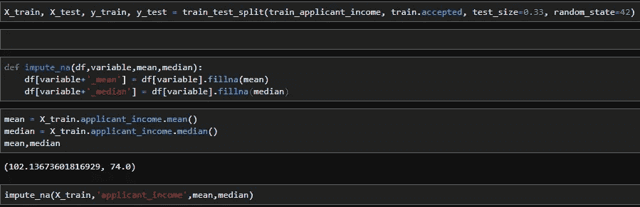
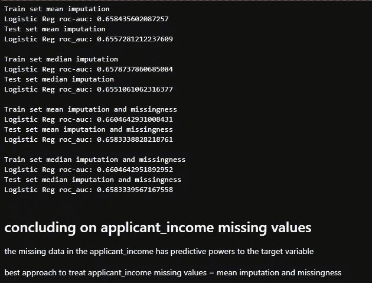
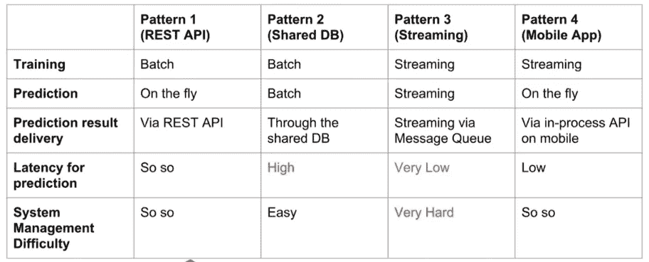
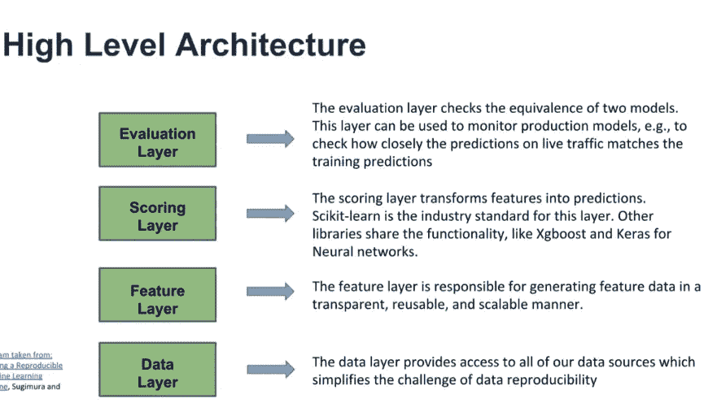
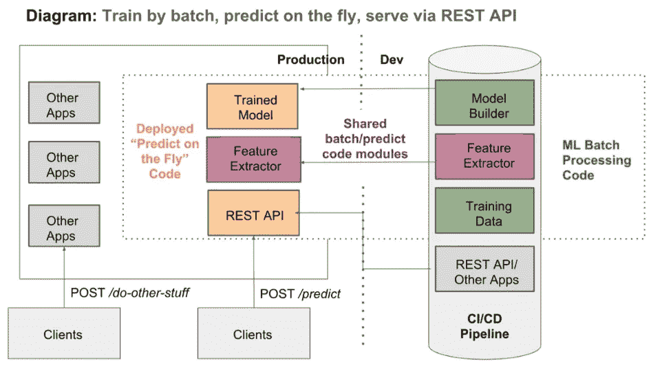
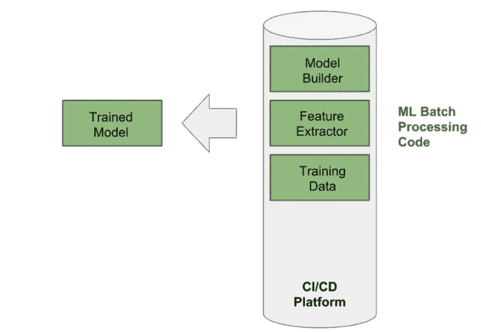
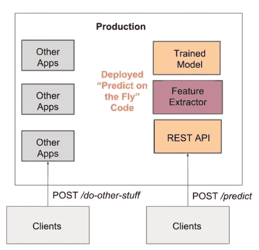

# 揭秘机器学习模型的部署(第 1 部分)

> 原文：<https://towardsdatascience.com/deployment-of-machine-learning-model-demystified-part-1-1181d91815d2?source=collection_archive---------4----------------------->

## *如何设计预测贷款违约率的算法*


source: [https://blogs.oracle.com/r/data-science-maturity-model-deployment-part-11](https://blogs.oracle.com/r/data-science-maturity-model-deployment-part-11)

*这是由两部分组成的系列文章的第一部分。你可以读一下* [*第二部分在这*](https://medium.com/@bamigbadeopeyemi/deployment-of-machine-learning-models-demystified-part-2-63eadaca1571) 之后

想象一下，建立一个受监督的机器学习(ML)模型来决定是否应该批准贷款申请。有了模型在成功应用中的置信水平(概率)，我们就可以计算无风险可贷金额。部署这样的 ML 模型是这个项目的目标。

*请和我一起经历我在尼日利亚数据科学公司的实习项目，在那里我有幸与数据科学家、软件工程师和人工智能研究人员中的精英一起工作。我们的目标是在 10 年内培养 100 万人工智能人才，我很自豪能成为其中的一员。*

数据科学家在 jupyter lab、google colab 等公司建立机器学习模型，而机器学习工程师将建立的模型投入生产。

ML 模型的部署简单地意味着将模型集成到现有的生产环境中，该环境可以接收输入并返回输出，该输出可用于做出实际的业务决策。

为了揭开部署过程的神秘面纱，我写了这篇文章，分为四章。在第一章中，我们介绍了构建基线模型的过程，在第二章中，我们将这个模型引入生产就绪代码。第 3 章和第 4 章包含在本系列的第 2 部分中。

**第一章:建立基线模型**

在这种情况下，基线模型指的是具有最小可能数量的特征但具有良好评估测量的 ML 模型。当构建用于部署目的的 ML 模型时，您必须始终考虑您的最终用户。一个拥有数千个特征的模型要达到 90%以上的评估准确率可能不够好，因为以下几个原因:

*   **可移植性**:软件从一台机器或系统转移到另一台机器或系统的能力。一个可移植的模型减少了代码的响应时间，并且当你的目标发生变化时，你必须重写的代码量将是最小的。
*   **可伸缩性**:是一个程序伸缩的能力。当一个模型不需要被重新设计来保持有效的性能时，它就被认为是可伸缩的。
*   **可操作化**:业务应用使用的模型的部署，用于预测分类/回归问题的目标值。
*   **测试**:对过程输出和输入的验证。健壮的模型将不必要地难以测试。

[点击下载](https://bit.ly/2qKwbe7)将用于本项目的数据集、笔记本和独家摘要，其中包含探索性数据分析、数据预处理、特征工程、特征选择、训练 ML 模型和模型评估。

作为第一步，我们使用 pandas 导入我们的测试和训练数据。

```
train = pd.read_csv("train.csv")
test = pd.read_csv("test.csv")
```

**数据预处理:**这包括将原始数据转换成适合训练模型的可理解格式。它需要处理缺失值、异常值、编码分类变量。

出于部署的目的，您希望始终保留您用来填充缺失值的值的记录，并且该方法必须是可复制的。具有缺失值的特性可以通过下面的代码片段一目了然


The horizontal white stripes indicate the locations of missing values.

有许多方法可以处理数字特征中的缺失值，但为了简单起见，我将尝试平均值和中值。

对于每个具有缺失值的数值特征，计算平均值和中值，估算该值并拟合数据模型，以查看每种情况对验证集的影响。例如，在试验 applicant_income 功能时，我们可以定义一个简单的 python 函数，它接受数据帧、感兴趣的变量、平均值和中值，并用平均值和中值填充功能的缺失部分。



split into training and testing sets and defined a function to fill in missing values

在填充缺失值时，可以执行一个简单的要素工程，即创建一个表示缺失(0 或 1)的二元要素，您可以判断缺失是否具有正面的预测效果。

```
#addition missingness features# create variable indicating missingness in applicant_income
X_train['applicant_income_NA'] = np.where(X_train.applicant_income.isnull(),1,0)
X_test['applicant_income_NA'] = np.where(X_test.applicant_income.isnull(),1,0)
```

现在，我们可以使用一个简单的逻辑回归模型来确定填充缺失值的最佳方法。

kindly download the notebook to see the full code snippets



the output of the code snippet above

对所有具有缺失值的要素重复此方法，并根据模型结果做出最佳决策。

**特征工程** : 这是使用数据的领域知识来创建使机器算法工作的特征的过程。我将创建的唯一特性是 income_loan_ratio，以避免部署过程中的复杂性。

**特征选择**:自动或手动选择对预测变量贡献最大的特征的过程。数据中包含不相关的要素会降低模型的准确性。

有几种为最终模型选择特征的方法，包括

**过滤方法**如恒定特征消除、准恒定特征消除、重复特征消除、fisher 评分、单变量法、互信息、相关性等。

**包装方法**如向前一步选择、向后一步选择和穷举搜索等。

**嵌入方法**如 LASSO、决策树导出重要性、回归系数等。

**训练 ML 模型:**这个项目的机器学习算法的类型是监督的，它是一个分类模型。在训练模型之前，我们需要从目标变量中分离出特征。

我选择使用 sklearn 的 GradientBoostingClassifier 进行部署，但在实验过程中也探索了其他算法，如 xgboost、Microsoft LGBM。

kindly check the notebook for the output

**车型评测**

从上述训练模型的输出来看，测试数据的准确率为 70.3%，ROC-AUC 为 77.2%。由于这个项目的目标是预测抵押贷款申请的接受状态，以及预测接受的贷款申请的安全金额，70%的准确性对于问题案例场景来说已经足够好了。该模型可以在以后进行改进，但我们不会专注于此，因为我们现在希望尽可能简单地部署。

**第 2 章:采用 ML 系统架构并编写生产就绪代码**

根据 ISO/IEC 42010 和我的解释，架构可以被定义为软件组件的排列方式以及它们之间的交互。

ML 系统架构是指组成系统的软件组件的排列方式，以及它们之间在实现预定目标时的交互方式。ML 模型的开发和部署相对快速和便宜，但是随着时间的推移有效地维护它们是困难和昂贵的。根据贵公司的能力和目标，选择最佳架构可能有点困难，因为它需要业务、数据科学、工程和开发运维的同步。

这是两部分系列的第一部分。你可以在此 之后阅读 [*第二部分*](https://medium.com/@bamigbadeopeyemi/deployment-of-machine-learning-models-demystified-part-2-63eadaca1571)

设计 ML 系统架构时，应牢记以下几点。

*   **模块性**:预处理/特征工程中使用的代码要安排在综合流水线中。
*   **再现性**:每一个组件的输出必须能在任何时间版本上再现。
*   **可伸缩性**:模型必须能够以最短的响应时间服务于大量的客户。
*   可扩展性:应该很容易为将来的任务修改。
*   **测试**:测试模型版本之间差异的能力。
*   **自动化**:尽可能消除手动步骤，减少出错几率。

**ML 架构概述**

*   **批量训练，动态预测，通过 REST API 服务**:离线训练和持续，实时预测。
*   **分批训练，分批预测，通过共享数据库服务**:训练和持续离线完成，而预测在分布式队列中完成，几乎类似于实时预测
*   **通过流进行训练和预测**:训练和预测都是在不同但相连的流上进行的。
*   **批量训练，在移动(或其他客户端)上预测**:类似于类型 1，但预测是在客户小工具上进行的。

**架构对比**



Source: [https://www.udemy.com/course/deployment-of-machine-learning-models/](https://www.udemy.com/course/deployment-of-machine-learning-models/)

对于这个项目，将使用模式 1，预测可以是单个的，也可以是批量的，也就是说，我们将在本地训练模型，并通过 flask 公开预测功能，我们可以在 flask 中上传我们的测试批量进行预测。



Source: Building a Reproducible Machine Learning Pipeline, Surgimura and Hart



Source: [https://www.udemy.com/course/deployment-of-machine-learning-models/](https://www.udemy.com/course/deployment-of-machine-learning-models/)

上图可以看出，整个系统分为开发和生产。在开发中，训练数据、特征提取器和模型构建器部分是离线完成的，而生产是在线的。



Training Phase

**训练数据**:该单元处理用于将模型训练到训练环境中的数据集的提取和用于训练的格式化。这个单元可以是复杂的，也可以是简单的，这取决于你正在处理的 ML 架构。这可能包括从多个续集、Hadoop 分布式文件系统中提取数据或进行 API 调用，出于本项目的目的，将编写一个简单的 python 脚本，以将已经下载到文件夹/目录中的数据集提取到训练环境中，然后通过数据管道传递，在训练前将在该管道中进行若干预处理。

**特征提取器**:选择/生成训练模型所需的基本特征的单元。注意，这是管道使用 sklearn 的一部分。除了 sklearn 库之外，另一个可以用来完成相同任务的流行库是 TensorFlow Extended(TFX ),这超出了本文的范围。

**模型构建器:**这是对已训练模型进行序列化和持久化、版本化和格式化以进行部署的单元。在 python 上下文中，这可能是使用 setuptools 构建包或简单地将模型保存为 pickle 格式的单元，这取决于您采用的架构。这些方法之间有很大的不同，但本文不会讨论。虽然我尝试了这两种方法，但是为了简单起见，我将和你分享后一种方法。

**训练模型**:这是上面讨论的三个子主题的输出，可以通过 REST API 轻松部署。



Prediction Phase

这是两部分系列的第一部分。你可以读一下 [*第二部分在此之后*](https://medium.com/@bamigbadeopeyemi/deployment-of-machine-learning-models-demystified-part-2-63eadaca1571)

在生产中，通过 REST API 批量发送请求，由特征提取器进行清理和预处理，然后使用加载的训练模型预测贷款申请是否被接受。然后，在通过我们的端点返回预测之前，接受的贷款将进一步分析无风险可贷金额。

在第 2 部分(第 3 章和第 4 章)，我将讨论如何将笔记本转换为生产就绪代码，以及如何创建可复制的管道、API 端点、通过 Postman 测试端点、CI/CD 在 ML 系统架构中的意义和使用、部署到 Pass、Docker 容器、部署到 Lass、无服务器部署等。

这是两部分系列的第一部分。你可以在此 之后阅读 [*第二部分*](https://medium.com/@bamigbadeopeyemi/deployment-of-machine-learning-models-demystified-part-2-63eadaca1571)

**你可以通过下面的链接克隆 Github 库:**

[](https://github.com/opeyemibami/machine_learning-Deployment-of-Mortage-Approval-Status-Model) [## opeyemibami/机器学习-抵押部署-批准-状态-模型

### 有助于 opeyemibami/machine _ learning-Deployment-of-mortgage-Approval-Status-Model 的开发

github.com](https://github.com/opeyemibami/machine_learning-Deployment-of-Mortage-Approval-Status-Model) 

# 包扎

有许多方法可以将 ML 模型部署到生产中，有许多方法可以存储它们，还有不同的方法可以在部署后管理预测模型。为用例选择最佳方法可能具有挑战性，但随着团队技术和分析的成熟，整体组织结构及其交互可以帮助选择正确的方法来将预测模型部署到生产中。

*联系我上* [***推特***](https://twitter.com/opeyemibami) *和* [***领英***](https://www.linkedin.com/in/bamigbade-opeyemi-49007a122/)

一定要抽出时间来看看我的其他文章和参考资料部分的进一步阅读。请记得关注我，以便获得我的出版物的通知。

[](https://medium.com/@opeyemibami/deployment-of-machine-learning-models-demystified-part-2-63eadaca1571) [## 揭秘机器学习模型的部署(第二部分)

### 具有无风险可贷金额的贷款接受状态预测

medium.com](https://medium.com/@opeyemibami/deployment-of-machine-learning-models-demystified-part-2-63eadaca1571) [](https://heartbeat.fritz.ai/building-a-conversational-chatbot-with-nltk-and-tensorflow-part-1-f452ce1756e5) [## 用 NLTK 和 TensorFlow 构建对话聊天机器人(第 1 部分)

### 用卷积神经网络构建的网球聊天机器人

heartbeat.fritz.ai](https://heartbeat.fritz.ai/building-a-conversational-chatbot-with-nltk-and-tensorflow-part-1-f452ce1756e5) [](https://heartbeat.fritz.ai/building-a-conversational-chatbot-with-nltk-and-tensorflow-part-2-c67b67d8ebb) [## 用 NLTK 和 TensorFlow 构建对话聊天机器人(第 2 部分)

### 用卷积神经网络构建的网球聊天机器人

heartbeat.fritz.ai](https://heartbeat.fritz.ai/building-a-conversational-chatbot-with-nltk-and-tensorflow-part-2-c67b67d8ebb) [](https://heartbeat.fritz.ai/deploy-a-machine-learning-model-as-a-web-application-part-1-a1c1ff624f7a) [## 将机器学习模型部署为 Web 应用程序(第 1 部分)

### 具有 Streamlit 的机器学习支持的 Web 应用程序

heartbeat.fritz.ai](https://heartbeat.fritz.ai/deploy-a-machine-learning-model-as-a-web-application-part-1-a1c1ff624f7a) [](https://heartbeat.fritz.ai/deploy-a-machine-learning-model-as-a-web-application-part-2-2f590342b390) [## 将机器学习模型部署为 Web 应用程序(第 2 部分)

### 具有 Streamlit 的机器学习支持的 Web 应用程序

heartbeat.fritz.ai](https://heartbeat.fritz.ai/deploy-a-machine-learning-model-as-a-web-application-part-2-2f590342b390) [](https://heartbeat.fritz.ai/deploying-machine-learning-models-on-google-cloud-platform-gcp-7b1ff8140144) [## 在谷歌云平台上部署机器学习模型(GCP)

### 在 Kaggle 上训练；部署在谷歌云上

heartbeat.fritz.ai](https://heartbeat.fritz.ai/deploying-machine-learning-models-on-google-cloud-platform-gcp-7b1ff8140144) [](https://medium.com/towards-artificial-intelligence/topic-modeling-open-source-tool-fbdcc06f43f6) [## 主题建模开源工具

### 使用 python 和 streamlit 构建的主题建模工具

medium.com](https://medium.com/towards-artificial-intelligence/topic-modeling-open-source-tool-fbdcc06f43f6) 

对于建模部署策略的其他方法，您可以通过下面的链接查看 NeptuneAi 帖子:

海王星部署策略:[https://neptune.ai/blog/model-deployment-strategies](https://neptune.ai/blog/model-deployment-strategies)

**参考文献**

*   [1] [Julien Kervizic](https://medium.com/@julienkervizic?source=post_page-----c699b34abf86----------------------) ，将机器学习(ML)模型投入生产的不同方法概述。
*   [2] [Mark Hornick](https://blogs.oracle.com/author/mark-hornick) ，数据科学成熟度模型—部署(第 11 部分)
*   [3] [索莱达·加利](https://www.udemy.com/course/deployment-of-machine-learning-models/#instructor-1) & [克里斯托弗·萨米乌拉](https://www.udemy.com/course/deployment-of-machine-learning-models/#instructor-2)，部署机器学习模型

*特别感谢我的导师(Olubayo Adekanmbi 博士、James alling ham)**Wu raola oye wus 和尼日利亚数据科学公司的全体员工。*

*# 100 万年*

*干杯！*