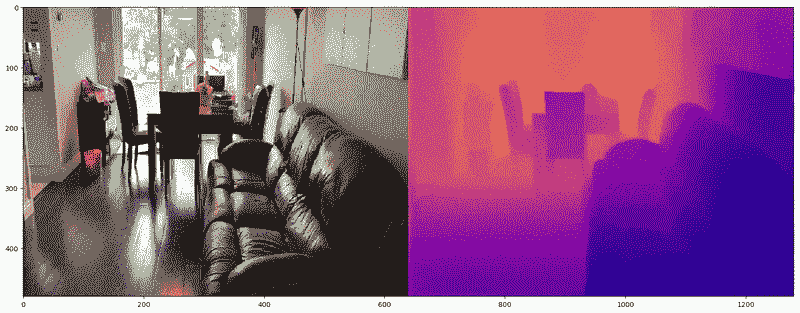
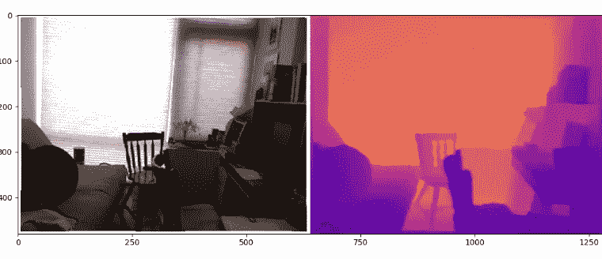
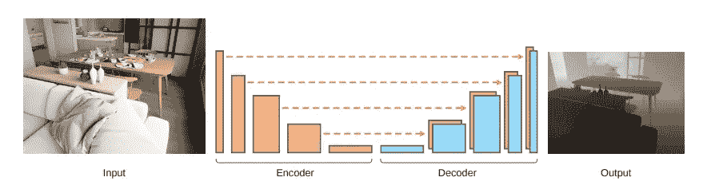
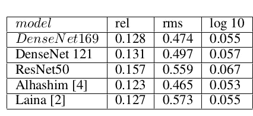

# 基于 DenseNets 的相机图像深度估计

> 原文：<https://towardsdatascience.com/depth-estimation-on-camera-images-using-densenets-ac454caa893?source=collection_archive---------10----------------------->

## 用数据做很酷的事情！

# 介绍

当观看二维场景时，人脑具有推断深度的非凡能力，即使是单点测量，就像观看照片一样。然而，从单幅图像进行精确的深度映射仍然是计算机视觉中的一个挑战。来自场景的深度信息对于增强现实、机器人、自动驾驶汽车等许多任务都很有价值。在这篇博客中，我们探索如何在 [NYU 深度数据集](https://cs.nyu.edu/~silberman/datasets/nyu_depth_v2.html)上训练深度估计模型。该模型在该数据集上获得了最先进的结果。我们还添加了代码，以在用户收集的图像+视频上测试该模型。

经过训练的模型在来自野外的数据上表现非常好，如下面的视频所示。

Actual Image on left and predicted depth map on the right

完整代码在我的 [Github repo](https://github.com/priya-dwivedi/Deep-Learning/tree/master/depth_estimation) 上开源。

深度信息是什么样的？深度可以存储为图像帧中每个像素到相机的距离，单位为米。下图显示了单一 RGB 图像的深度图。深度图在右边，实际深度已经用这个房间的最大深度转换成了相对深度。

RGB Image and its corresponding depth map

# 数据集

为了建立深度估计模型，我们需要 RGB 图像和相应的深度信息。深度信息可以通过像 [Kinect](https://www.jameco.com/jameco/workshop/howitworks/xboxkinect.html) 这样的低成本传感器来收集。对于这个练习，我使用了流行的 [NYU v2 深度数据集](https://cs.nyu.edu/~silberman/datasets/nyu_depth_v2.html)来建立一个模型。该数据集由超过 400，000 幅图像及其相应的深度图组成。我在训练任务中使用了全部数据集中的 50，000 幅图像的子集。

# 模型概述

我阅读了几篇执行深度估计任务的论文，其中许多论文使用了编码器解码器类型的神经网络。对于深度估计任务，模型的输入是 RGB 图像，输出是深度图像，该深度图像或者是与输入图像相同的维度，或者有时是具有相同纵横比的输入图像的缩小版本。用于该任务的标准损失函数考虑了实际深度图和预测深度图之间的差异。这可能是 L1 或 L2 的损失。

我决定使用来自 Alhashim 和 Wonka 的[密集深度模型。这个模型的简单性和准确性令人印象深刻。很容易理解，训练起来也比较快。它使用图像增强和自定义损失函数来获得比更复杂的架构更好的结果。该型号使用功能强大的](https://arxiv.org/abs/1812.11941) [DenseNet](https://arxiv.org/abs/1608.06993) 型号，带有预先调整的砝码，为编码器提供动力。

**密集深度模型**

本文介绍的编码器是一个预训练的 DenseNet 169。
编码器由 4 个密集块组成，出现在 DenseNet 169 模型中完全连接的层之前。它不同于其他深度模型，因为它使用非常简单的解码器。每个解码器模块由单个 bi-
线性上采样层和两个卷积层组成。遵循编码器解码器架构中的另一标准实践，上采样层与编码器中的相应层连接。下图更详细地解释了该架构。关于层的更多细节，请阅读[原文](https://arxiv.org/abs/1812.11941)。写得非常好！

Encoder Decoder model from Dense Depth Paper

# 训练和测试深度估计模型

在 NYU-v2 数据集的 50K 样本上训练密集深度。输入是 640×480 分辨率 RGB 图像，输出是 320×240 分辨率的深度图。使用 Adam optimizer 在 Keras 中训练该模型。我利用密集深度作者的回购开始。

训练了三种不同的模型架构:

1.  原代码提供了 DensetNet 169 en-
    编码器的实现。这个模型被训练了 8 个纪元(9 个小时在
    NVIDIA 1080 Ti 上)
2.  原始代码被修改以实现 DenseNet 121 编码器，其具有比 DenseNet 169 更少的参数。该模型被训练了 6 个时期(在 GPU 上 5 个小时),因为验证损失在此
    点已经稳定
3.  修改了原始代码以实现 Resnet
    50 编码器，该编码器具有比 DenseNet 169 更多的参数。
    我试验了连接编码器和解码器的不同方式。这个模型被训练了
    5 个时期(在 GPU 上 8 个小时),并且训练是不连续的，因为模型已经开始过度拟合。

所有这些代码修改都被推送到 [github repo](https://github.com/priya-dwivedi/Deep-Learning/tree/master/depth_estimation) 上，并附有如何进行培训、评估和测试的解释。

# 评估不同的模型

我们使用三种不同的指标来比较模型性能——预测深度和实际深度的平均相对误差(rel)、RMSE (rms) —实际深度和预测深度的均方根误差以及两个深度之间的平均对数误差(log)。所有这些指标的值越低，表示模型越强。

Model Comparison

如上表所示，DenseNet 169 型号的性能优于 DenseNet121 和 ResNet 50。此外，我训练的 DenseNet 169 在性能上与原作者(Alhashim 和 Wonka)的非常接近。

# 结论

我们希望这篇博客能成为理解深度估计工作原理的一个好的起点。我们提供了一个管道来使用一个强大的、简单的和易于训练的深度估计模型。我们还分享了代码，可用于从您收集的室内图像或视频中获取深度图像。希望您自己尝试一下这些代码。

我有自己的深度学习咨询公司，喜欢研究有趣的问题。我已经帮助许多初创公司部署了基于人工智能的创新解决方案。请到 http://deeplearninganalytics.org/来看看我们吧。如果你有一个我们可以合作的项目，那么请通过我的网站或在 info@deeplearninganalytics.org**联系我**

你也可以在 https://medium.com/@priya.dwivedi[的](https://medium.com/@priya.dwivedi)看到我的其他作品

**参考文献:**

*   [密集深度原始 Github](https://github.com/ialhashim/DenseDepth)
*   [密集深度纸](https://arxiv.org/abs/1812.11941)
*   [NYU V2 数据集](https://cs.nyu.edu/~silberman/datasets/nyu_depth_v2.html)