# 自动驾驶中的深度识别

> 原文：<https://towardsdatascience.com/depth-prediction-autonomous-driving-18d05ff25dd6?source=collection_archive---------19----------------------->

## *本文将介绍一些在车辆捕获的图像序列中进行深度预测的先进方法，这些方法有助于在不使用额外摄像头或传感器的情况下开发新的自动驾驶模型。*

正如我在之前的文章《[中提到的，自动驾驶是如何工作的？SLAM](/slam-intro-fd833ef29e4e) 介绍，有许多传感器用于在车辆行驶时捕捉信息。捕获的各种测量值包括速度、位置、深度、热量等。这些测量值被输入到一个反馈系统中，该反馈系统训练并利用车辆要遵守的运动模型。本文主要关注深度预测，这通常是由激光雷达传感器捕获的。激光雷达传感器使用激光捕捉与物体的距离，并使用传感器测量反射光。然而，激光雷达传感器对于日常司机来说是负担不起的，那么我们还能如何测量深度呢？**我将描述的最先进的方法是无监督的深度学习方法，它使用一帧到下一帧的像素差异来测量深度。**

*   请注意图片说明，因为大部分图片取自引用的原始论文，而不是我自己的产品或创作。

# 单深度 2

[1]中的作者开发了一种方法，该方法使用深度和姿态网络的组合来预测单个帧中的深度。他们通过在一系列帧和几个损失函数上训练他们的结构来训练两个网络。这种方法不需要地面真实数据集进行训练。相反，它们使用图像序列中的连续时间帧来提供训练信号。为了帮助约束学习，他们使用了一个姿势估计网络。根据输入图像和从姿态网络和深度网络的输出重建的图像之间的差异来训练该模型。稍后将更详细地描述重建过程。[1]的主要贡献是:

1.  去除不重要像素焦点的自动遮罩技术
2.  用深度图修正光度重建误差
3.  多尺度深度估计

## 体系结构

本文的方法使用了深度网络和姿态网络。深度网络是一个经典的 U-Net [2]编码器-解码器架构。编码器是预训练的 ResNet 模型。深度解码器与之前的工作类似，将 sigmoid 输出转换为深度值。

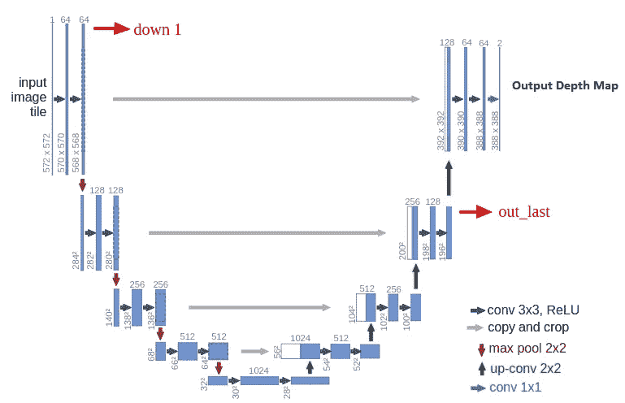

Sample image of U-Net [2].

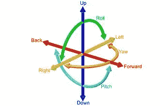

6-DoF. Image from [Wikipedia](https://en.wikipedia.org/wiki/Six_degrees_of_freedom#Engineering).

作者使用 ResNet18 中的姿势网络，该网络经过修改，可以将两幅彩色图像作为输入来预测单个 [6 自由度相对姿势](https://en.wikipedia.org/wiki/Six_degrees_of_freedom#Engineering)，或者旋转和平移。姿态网络使用时间帧作为图像对，而不是典型的立体图像对。它从序列中另一个图像的视点预测目标图像的外观，无论是前一帧还是后一帧。

## 培养

下图说明了该架构的培训过程。

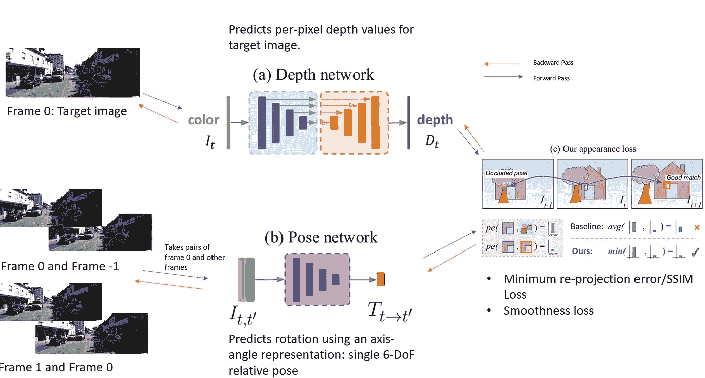

Images taken from KITTI and [1].

**光度重建误差**

目标图像位于第 0 帧，用于我们预测过程的图像可以是前一帧或后一帧，因此是第+1 帧或第-1 帧。该损失基于目标图像和重建的目标图像之间的相似性。重建过程从使用姿态网络从源帧(帧+1 或帧-1)计算变换矩阵开始。这意味着我们正在使用关于旋转和平移的信息来计算从源帧到目标帧的映射。然后，我们使用从目标图像的深度网络预测的深度图和来自姿态网络的变换矩阵投影到具有固有矩阵 K 的相机中，以获得重建的目标图像。该过程需要首先将深度图转换成 3D 点云，然后使用相机固有特性将 3D 位置转换成 2D 点。产生的点被用作采样网格，从目标图像对[进行双线性插值](https://en.wikipedia.org/wiki/Interpolation)。

这种损失的目的是减少目标图像和重建的目标图像之间的差异，其中姿态和深度都是需要的。

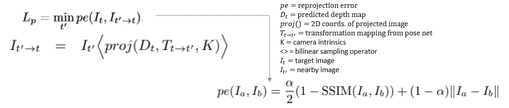

Photometric Loss function from [1].

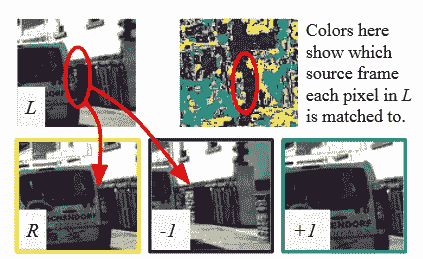

Benefit of using minimum photometric error. Pixel area circled are occluded. Image from [1].

典型地，类似的方法将重新投影误差一起平均到每个源图像中，例如帧+1 和帧-1。然而，如果一个像素在这些帧之一中不可见，但是因为它靠近图像边界或被遮挡而在目标帧中，则光度误差损失将不公平地高。为了解决与此相关的问题，他们在所有源图像上取最小光度误差。

***自动遮罩***

最终的光度损失乘以一个遮罩，该遮罩解决了与相机在静态场景中移动的假设中的变化相关的问题，例如，一个对象以与相机相似的速度移动，或者当其他对象正在移动时相机已经停止。这种情况的问题是深度图预测无限的深度。作者用一种**自动蒙版方法**解决了这个问题，这种方法可以过滤掉从一帧到下一帧外观不变的像素。它们使用二进制生成它们的掩模，其中如果目标图像和重建的目标图像之间的最小光度误差小于目标图像和源图像的最小光度误差，则为 1，否则为 0。

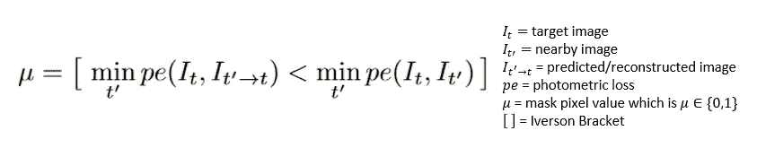

Auto-masking generation in [1] where [Iverson bracket](https://en.wikipedia.org/wiki/Iverson_bracket) returns 1 if true and 0 if false.

当相机静止时，结果是图像中的所有像素都被遮蔽。当物体以与相机相同的速度移动时，会导致图像中静止物体的像素被遮蔽。

***多尺度估计***

作者结合了每个尺度下的个体损失。它们将较低分辨率的深度图上采样到较高的输入图像分辨率，然后以较高的输入分辨率重新投影、重新采样并计算光度误差。作者声称，这限制了每个比例的深度图朝着同一目标工作，即目标图像的精确高分辨率重建。

## 其他损失

作者还使用平均归一化的逆深度图值和输入/目标图像之间的边缘感知平滑度损失。这鼓励模型学习尖锐的边缘并平滑掉噪声。

最终损失函数变为:

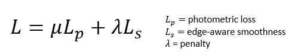

The final loss function in [1] which is averaged over each pixel, scale and batch.

## 结果

作者在包含驾驶序列的三个数据集上比较了他们的模型。在所有的实验中，他们的方法胜过了几乎所有其他的方法。下图显示了它们的性能示例:

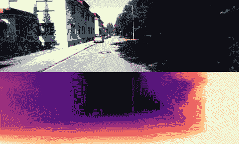

Image from [1] GitHub repository: [https://github.com/nianticlabs/monodepth2/](https://github.com/nianticlabs/monodepth2/)

有关他们的结果的更多细节，请参见原始论文“[深入研究自监督单目深度估计](https://arxiv.org/pdf/1806.01260.pdf)

# Monodepth2 扩展:Struct2Depth

## 物体运动建模

Google brain 的作者发表了进一步扩展 Monodepth2 的文章[3]。他们通过预测*单个物体*的运动来改进之前的姿态网络，而不是将整个图像作为一个整体。因此，重建的图像不再是单一的投影，而是一系列的投影，然后被组合起来。他们通过两个模型来做到这一点，一个*对象运动模型*和一个*自我运动网络*(类似于前面章节中描述的姿态网络)。步骤如下:

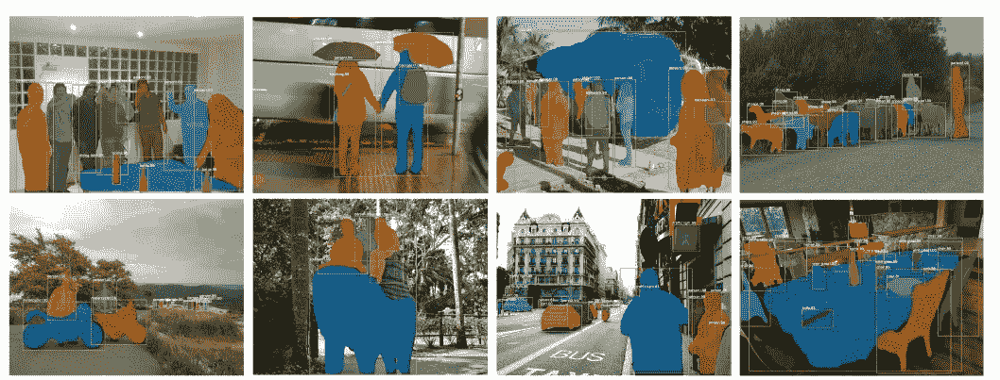

Sample output for Mask R-CNN [2]. Image from [2].

1.  应用预训练的掩模 R-CNN [2]来捕获潜在移动对象的分割。
2.  二进制掩模用于从静态图像(帧-1、帧 0 和帧+1)中去除这些潜在的运动物体
3.  掩蔽的图像被发送到自运动网络，并且输出帧-1 和 0 以及帧 0 和+1 之间的变换矩阵。

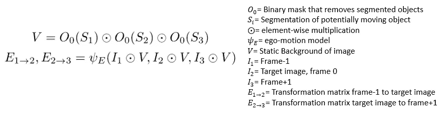

The masking process to extract the static background followed by the ego-motion transformation matrix without objects that move. Equation from [3].

1.  使用步骤 3 中得到的自我运动变换矩阵，并将其应用于第 1 帧和第+1 帧，以获得扭曲的第 0 帧。
2.  使用从步骤 3 得到的自运动变换矩阵，并将其应用于潜在移动对象到帧-1 和帧+1 的分割蒙版，以获得帧 0 的扭曲分割蒙版，所有都针对每个对象。
3.  使用二进制掩模来保持与扭曲的分割掩模相关联的像素。
4.  屏蔽的图像与扭曲的图像相结合，并被传递到输出预测的对象运动的对象运动模型。

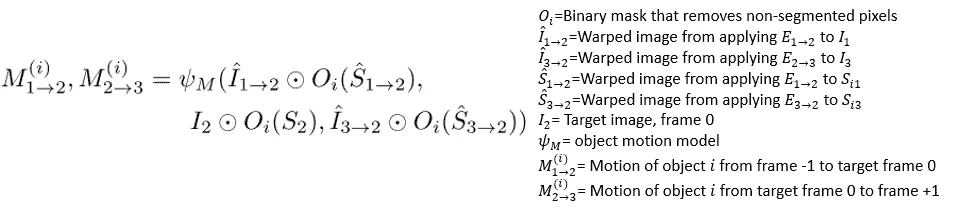

The object motion model for one object. Equation from [3].

结果是为了“解释”物体外观的变化，照相机必须如何移动的表示。然后，我们希望根据从对象运动建模过程的步骤 4 得到的运动模型来移动对象。最后，我们将扭曲的对象运动与扭曲的静态背景相结合，以获得最终的扭曲:

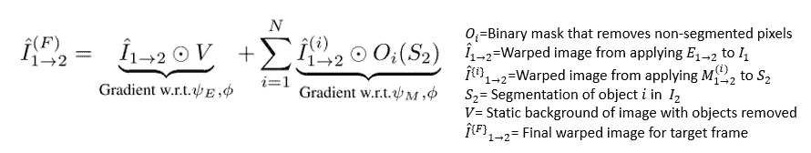

Equation from [3].

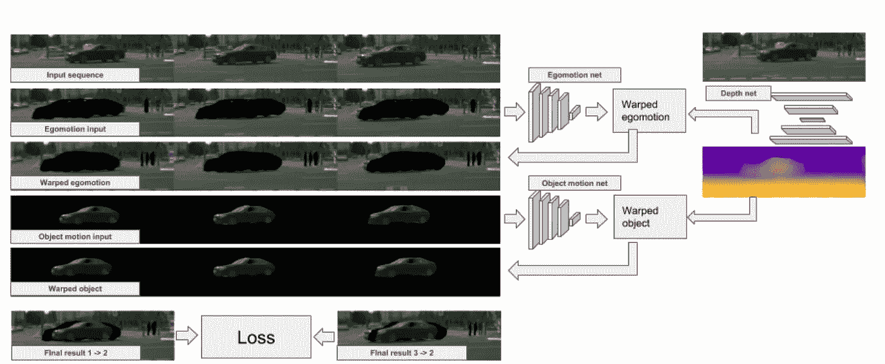

Image from [5]

## 学习目标量表

虽然 Monodepth2 通过其自动遮罩技术解决了静态对象或以与相机相同的速度移动的对象的问题，但这些作者建议实际训练模型来识别对象比例，以改善对象运动的建模。

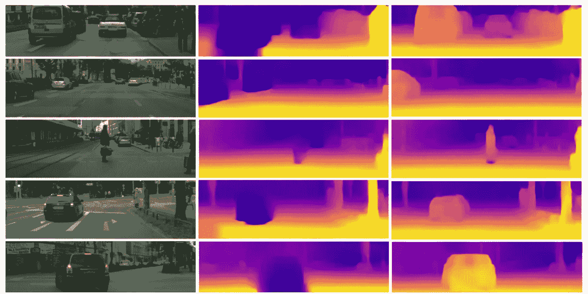

Image from [Struct2Depth](https://sites.google.com/view/struct2depth). Middle column shows the problem of infinite depth being assigned to objects moving at the same speed of the camera. The third column shows their method improving this.

他们根据对象的类别(如房屋)来定义每个对象的比例损失。其目的是基于对物体尺度的了解来约束深度。损失是图像中对象的输出深度图与通过使用相机的焦距、基于对象类别的高度先验以及图像中被分割对象的实际高度计算的近似深度图之间的差，两者都由目标图像的平均深度来缩放:

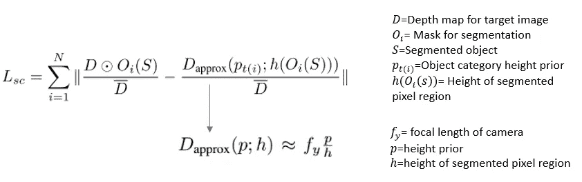

The formulation for the loss that helps the model learn object scale. Equations from [3].

## 结果

[3]中描述的扩展直接与 Monodepth2 模型进行比较，显示出显著的改进。

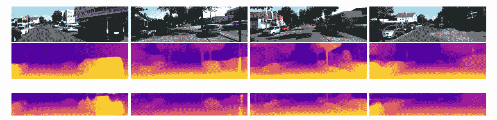

The middle row shows the results from [3] while the ground truth is shown in the third row. Image from [5].

# 摘要

自动驾驶中深度估计的常用方法是使用一对立体图像，需要两个摄像头或一个激光雷达深度传感器。然而，这些都是昂贵的，并不总是可用的。这里描述的方法能够训练深度学习模型，该深度学习模型在一幅图像上预测深度，并且仅在一系列图像上训练。它们表现出良好的性能，在自动驾驶研究方面有着广阔的前景。

为了亲自尝试这些模型，这两份报纸都有位于下面的存储库:

单部门 2:[https://github.com/nianticlabs/monodepth2](https://github.com/nianticlabs/monodepth2)

struct 2 depth:[https://github . com/tensor flow/models/tree/master/research/struct 2 depth](https://github.com/tensorflow/models/tree/master/research/struct2depth)

# 参考

[1]戈达尔，c .，麦克奥德哈，o .，菲尔曼，m .，&布罗斯托，G. (2018)。深入研究自我监督的单目深度估计。 *arXiv 预印本 arXiv:1806.01260* 。

[2]奥拉夫·龙内贝格、菲利普·费舍尔和托马斯·布罗克斯。U-Net:生物医学图像分割的卷积网络。InMICCAI，2015。

[3] [文森特·卡塞尔](http://www.google.com/url?q=http%3A%2F%2Fcasser.io&sa=D&sntz=1&usg=AFQjCNH30qjULbsZQ2oeuUDvNTGLWjqpvA)、[苏伦·皮尔克](http://www.google.com/url?q=http%3A%2F%2Fwww.pirk.info&sa=D&sntz=1&usg=AFQjCNEUmFE9WFfLKUxNTNumX00TrO5CCw)、[礼萨·马赫茹里安](http://www.google.com/url?q=http%3A%2F%2Fwww.cs.utexas.edu%2F~reza%2F&sa=D&sntz=1&usg=AFQjCNESkNsZ2t9xcsD6H0ny_Ia6bfIXpA)、[阿内莉亚·安杰洛娃](http://www.google.com/url?q=http%3A%2F%2Fwww.vision.caltech.edu%2Fanelia%2F&sa=D&sntz=1&usg=AFQjCNGJGBfAFQAbD1mw4rWdjLpuuvPPVA):没有传感器的深度预测:利用结构从单目视频进行无监督学习。第三十三届 AAAI 人工智能会议(AAAI'19)。

[4] He，k .，Gkioxari，g .，Dollár，p .，& Girshick，R. (2017 年)。屏蔽 r-cnn。IEEE 计算机视觉国际会议论文集(第 2961–2969 页)。

[5] [Vincent Casser](http://www.google.com/url?q=http%3A%2F%2Fcasser.io&sa=D&sntz=1&usg=AFQjCNH30qjULbsZQ2oeuUDvNTGLWjqpvA) ， [Soeren Pirk](http://www.google.com/url?q=http%3A%2F%2Fwww.pirk.info&sa=D&sntz=1&usg=AFQjCNEUmFE9WFfLKUxNTNumX00TrO5CCw) ， [Reza Mahjourian](http://www.google.com/url?q=http%3A%2F%2Fwww.cs.utexas.edu%2F~reza%2F&sa=D&sntz=1&usg=AFQjCNESkNsZ2t9xcsD6H0ny_Ia6bfIXpA) ， [Anelia Angelova](http://www.google.com/url?q=http%3A%2F%2Fwww.vision.caltech.edu%2Fanelia%2F&sa=D&sntz=1&usg=AFQjCNGJGBfAFQAbD1mw4rWdjLpuuvPPVA) :无监督单目深度和自我运动学习，具有结构和语义。CVPR 视觉里程计研讨会&基于位置线索的计算机视觉应用(VOCVALC)，2019