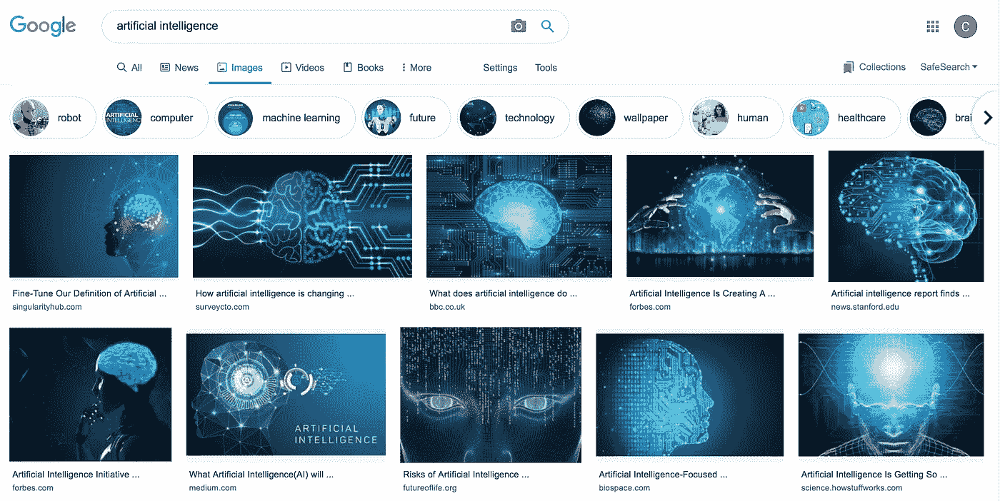

# 描述人工智能

> 原文：<https://towardsdatascience.com/describing-ai-f17dd90646fa?source=collection_archive---------22----------------------->

公司正在投资数百万英镑开发人工智能(AI)技术。许多人每天都在使用人工智能技术，让他们的生活变得更加轻松。但是在谷歌上搜索“人工智能”的图片，你会看到一片发光的、亮蓝色的、相互连接的大脑的海洋。用来说明人工智能的图像与人工智能在用户眼中的更平凡的现实相去甚远，在用户眼中，人工智能为导航、语音助手和人脸识别等服务提供支持。这种脱节让人们很难把握人工智能的现实。

用来描述人工智能的语言可能和使用的图像一样有问题。随着人工智能越来越多地影响如此多的人的日常生活，准确地描述它，而不是模糊设计系统的人的责任是非常重要的。

# “人工智能自学”

大部分关于 AI 的文章都在说机器学习(ML)。那是一套从数据中训练模型的算法。训练后，模型对训练数据中存在的模式进行编码。机器学习是我们所知的让计算机执行复杂任务的最佳方式，比如理解语音，这是我们无法明确编程让它们去做的。

我们谈论 ML 模型学习，所以写“AI 教自己……”做一些事情是很有诱惑力的。例如，AI 已经自学了[偏好男性候选人](https://www.ft.com/content/5039715c-14f9-11e9-a168-d45595ad076d)、[玩游戏、](https://www.bbc.co.uk/news/science-environment-31623427)、[解魔方](https://www.futurity.org/rubiks-cube-artificial-intelligence-2115172/)等等。短语“*自学*是有问题的，因为它暗示计算机和机器学习模型有代理。它隐藏了机器学习的现实，即科学家或工程师仔细构建数据集和模型，然后花大量时间构建和调整模型，直到它们表现良好。该模型仅从训练数据中学习，训练数据通常以某种方式受到约束。也许只有有限数量的数据可用，或者有限的时间和计算能力来运行训练。无论约束条件如何，模型最终学到的东西都受到其创造者的设计选择的强烈影响。

# “人工智能作弊”

机器人还[教自己作弊，](https://www.wired.com/story/when-bots-teach-themselves-to-cheat/)可能通过[隐藏数据](https://techcrunch.com/2018/12/31/this-clever-ai-hid-data-from-its-creators-to-cheat-at-its-appointed-task/)或[利用电脑游戏中的漏洞](https://kotaku.com/earlier-this-year-researchers-tried-teaching-an-ai-to-1830416980)。然而，*欺骗*是一个情绪化的词，也暗示了欺骗背后的意图。

> 欺骗(动词):“为了获得利益而不诚实或不公平地行事”

ML 模型被训练完成的任务是由它的创建者很好地定义的。通常，不完美的模拟或视频游戏被用来模仿现实世界，因为在外面太昂贵或太危险。在这些模拟中，计算机可以比人重复相同的动作更多次，并且行动更快，因此它们可以发现和利用人无法发现的错误。他们不会因为点击鼠标或按下按钮的物理行为而慢下来。发现和利用任务中的错误是机器学习模型的完美合理的预期结果。我们有一个默契，利用模拟或电脑游戏中的漏洞是作弊。然而，计算机不知道这不符合游戏的精神。他们看不到游戏规则和执行过程中的错误之间的区别。

# "这个机器人无视物理定律！"

在现实世界中，没有什么能违背物理定律。当一个模拟违反物理定律时，就有问题了。机器学习模型可以利用模拟中的错误来发明行为，我们直观地知道这些行为是错误的，但这些行为满足任务的约束。尽管如此，结果可能很有趣，并告诉我们一些关于机器学习如何工作的事情:

> “当他们对算法没有任何限制，并要求它穿过一个充满障碍的路线时，人工智能建造了一个极高的两足动物，它只需摔倒就可以到达出口。”
> 
> [新科学家](https://www.newscientist.com/article/2182304-ais-invent-weird-new-limbs-to-beat-virtual-obstacle-courses/)

# “人工智能可以判断你是不是罪犯”

已发表的研究表明，人工智能可以[从你的脸部照片判断你是罪犯](https://www.theregister.co.uk/2016/11/18/ai_can_tell_if_youre_a_criminal/)还是[你的性取向](https://www.forbes.com/sites/bernardmarr/2017/09/28/the-ai-that-predicts-your-sexual-orientation-simply-by-looking-at-your-face/)，[从你的声音判断你是否在撒谎](https://futurism.com/new-ai-detects-deception-bring-end-lying-know-it)，或者从你的步态识别你的[情绪。但是，即使是表现最好的人工智能也不能完成不可能的事情。](https://venturebeat.com/2019/07/01/ai-classifies-peoples-emotions-from-the-way-they-walk/)

用于训练机器学习模型的数据集必须被准确标记。如果人们不能准确地标记数据集，那么机器就不太可能学习这项任务。有时需要专家来标记数据集——几乎任何人都可以转录音频，但很少有人有专业知识来标记 MRI 扫描——但准确的数据标签对机器学习任务来说是必不可少的。对任何人来说，正确标记性取向，你是否在说谎，你是否是一个罪犯，或者你处于什么样的情绪状态都是一项不可能的工作。

有一些场景，机器学习可以揭示人们看不到的模式。例如，可以使用来自活检的附加信息来标记 MRI 扫描。也许做标记的医生不能从图像中确定肿块是否是癌性的，但是来自活检的额外信息可以帮助标记图像。然而，在这种情况下，您必须额外注意设置和评估，以确保模型确实在学习新的和新奇的东西。

关于用于训练 ML 模型的数据集，需要注意的另一点是，它们是由在约束内工作的人构建的。这些限制可能与时间、金钱、标签工作或其他事情完全相关。例如，在对性取向的研究中，研究人员从约会网站上搜集了个人资料照片。用户从他们自己的许多照片中选择约会简档照片，以向世界传达特定的图像。从这些照片中预测性取向告诉我们的更多的是性别表述的文化规范，而不是你是否可以从一个人的面部预测他的性取向。有时，在实验室环境中完成一项任务的令人印象深刻的结果并不能转移到现实世界中。

机器学习和人工智能最近显示了一些令人印象深刻的结果——包括语言之间的翻译，过滤掉你的垃圾邮件，回答问题，检测欺诈，驾驶汽车等等。去掉夸张并不会减损它的成功，最终会让每个人更容易理解。

** NB:不能，也不应该。关于性取向研究的更深入的探讨，请看这篇* [*文章*](https://medium.com/@blaisea/do-algorithms-reveal-sexual-orientation-or-just-expose-our-stereotypes-d998fafdf477)

*原载于 2019 年 9 月 18 日*[*http://mycomputerdoesntlisten.wordpress.com*](https://mycomputerdoesntlisten.wordpress.com/2019/09/18/describing-ai/)*。你可以雇用我！如果我能帮助你的组织使用 AI &机器学习，请* [*取得联系*](https://www.catherinebreslin.co.uk/consulting) *。*