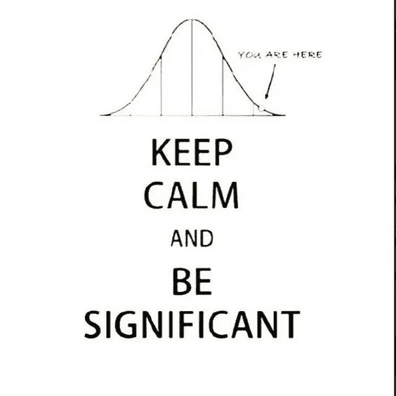

# 时间序列建模中的描述统计学

> 原文：<https://towardsdatascience.com/descriptive-statistics-in-time-series-modelling-db6ec569c0b8?source=collection_archive---------8----------------------->

有各种统计测试可以用来描述时间序列数据。时间序列建模要求数据以某种方式存在，这些要求因模型而异。这些模型一旦符合数据，就需要通过统计测试进行某种验证。

但最常见的是，我们在时间序列中寻找的是平稳性、因果性、相关性、季节性等属性。ARMA、ARIMA、SARIMA、Holt Winters 等模型处理不同类型的时间序列数据。需要检查数据的底层属性，statsmodels 有各种测试来探索和处理这些属性。以下是这些属性的简要概述。

# **平稳性**

如果时间序列不随时间线性或指数增加或减少(无趋势)，并且不显示任何类型的重复模式(无季节性)，则称其为平稳的。在数学上，这被描述为随着时间的推移具有恒定的平均值和恒定的方差。同样，对于方差，自协方差也不应该是时间的函数。如果你已经忘记了什么是均值和方差:均值是数据的平均值，方差是距离均值的平均平方距离。

Stationary data: Total number of daily female births

Non- stationary data: Number of airlines passengers over the years

一些模型对时间序列的平稳性做了一般性的假设，但大多数模型如 ARMA、ARIMA、SARIMA、VARMA 等。，需要数据是平稳的。但是，我们如何确定给定的数据是否是平稳的呢？

理解这一点的最基本的方法是绘制数据，并检查是否有任何潜在趋势或季节性的迹象。这种视觉练习很少有帮助，而且通常人眼很难分辨出来。因此，我们可以将滚动统计(如移动平均)添加到具有固定窗口大小的数据中，以检查平稳性。

Rolling mean with a window size of 12

有时，甚至很难直观地解释滚动平均值，因此我们借助统计测试来确定这一点，一个这样的增强 Dickey Fuller 测试。ADCF 检验是使用 python 中的 statsmodels 实现的，它执行经典的零假设检验并返回 p 值。

*原假设检验的解释:*如果 p 值小于 0.05 (p 值:低)，我们拒绝原假设，假设数据是平稳的。但是，如果 p 值大于 0.05 (p 值:高)，那么我们无法拒绝零假设，并确定数据是非平稳的。

一旦确定了数据集的稳定性，我们就根据需求执行转换。如果发现数据是稳定的，我们继续对其进行建模，但是如果发现数据不是稳定的，那么我们必须在拟合模型之前对其进行转换。“差分”是一种将数据转换为静态数据的常用方法，它只不过是找到连续数据项之间的差异，并将它们移动 1。首先，我们尝试对数据进行一阶差分，然后是二阶、三阶等等，直到数据变得稳定。但是每一步的差异都是以丢失一行数据为代价的。(因为我们每一步都将行/数据点移动 1)如果数据显示季节性，则差异是按季节进行的。例如，如果我们有具有年度季节性的月度数据，那么我们用时间单位 12 来区别数据。

# **因果关系**

因果关系与因果现象有关:如果一个时间序列可以用来预测另一个时间序列，那么这两个时间序列被认为有某种因果关系。如何检验因果关系？格兰杰因果关系检验无疑是检验它的最佳方法。也可以使用 python 中的 statsmodels 来实现。

从视觉上看，确定数据中是否存在因果关系变得很困难。正如我们在下面的例子中看到的，我们很难理解因果关系。

The two time series ‘a’ and ‘d’ have causality

在上图中，两个时间序列有某种因果关系；如果你把 a 向前移动两个单位，就会得到 d 值。

格兰杰因果关系检验的解释:当 p 值大于 0.05 时，没有因果关系，当 p 值较低，即小于 0.05 时，数据中有因果关系的迹象。

# **评估预测**

时间序列建模包括通过绘制数据与某些时间单位的滞后版本来查看数据中的相关性。当我们将时间序列与其自身的滞后版本进行比较时，很难看出任何与时间显著增加的相关性。为了评估模型拟合度和预测质量，我们使用了 MAE、MSE、RMSE、AIC 和 BIC 等指标。

平均绝对误差、均方误差和均方根误差是我们用于回归问题的几种误差，因此也用于基于回归的时间序列模型。

我们想了解的是 AIC 和 BIC 指标。

AIC:1971 年开发的 Akaike 信息标准评估了一组模型——它评估了每个模型相对于其他模型的质量，并将这些模型相互比较。

AIC 专门用于基于 ARIMA 的模型，以确定 p、d、q 参数。所以，如果你要用不同的 p，d 和 q 阶来运行 ARIMA 模型，你需要一个指标来比较这些模型。AIC 是做这项工作的最佳人选。这种度量的优点是，它提供了用于努力阻止过拟合的多个参数的惩罚。假设您有一个性能相对较好的简单模型和一个性能略好于前一个模型的复杂模型。如果这两个模型之间有微小的性能改进，那么 AIC 会考虑这一点，并告诉你选择简单的模型，而不是复杂的模型。在这种情况下，复杂模型将比简单模型具有更低的信息标准值。在某种程度上，AIC 惩罚了使用太多参数的模型。

感谢您阅读文章！