# 带 Spotifyr 的荒岛光盘()

> 原文：<https://towardsdatascience.com/desert-island-discs-with-spotifyr-f3539b7aa0b0?source=collection_archive---------45----------------------->

## 使用 R 中的 Spotify API 来可视化我们的朋友和家人最喜爱的音乐

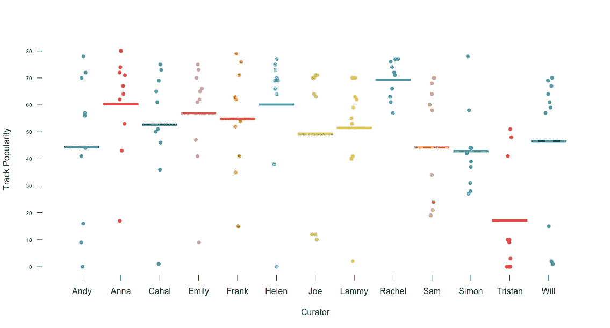

# 介绍

一年多前，我最好的朋友、室友兼音乐势利者“山姆”突发奇想。我可能稍微夸大了这个概念，但考虑到他有限的认知能力，我认为他的提议非常简洁。两人都是 BBC 荒岛唱片系列的狂热粉丝，他指出，他认为知道他所爱的人最喜欢的音乐会比知道名人更多。对我来说，这非常有意义。我们对我们的朋友和家人有一种实际的亲近感，一种崇拜和理解，这是我们永远无法与在电视上见过但从未见过面的人联系在一起的。假设是，通过了解我们所爱的人最喜欢的音乐，我们可能会明白是什么让他们这样做。

首先，山姆让我们所有的朋友和家人给他发送他们各自的荒岛光盘，他将这些光盘整理成单独的 Spotify 播放列表。在听完每个播放列表后，萨姆来找我，问我是否可以帮助他拼凑一个片段——书面的或其他形式的——可以显示他收到的关于荒岛光盘的所有信息；既相互比较，又确定汇编之间是否存在共性。我同意帮忙，在 Spotify API 和他们的开发者文档的大力帮助下，我们能够收集到一些关于朋友和家人的播放列表的真正有趣的信息。

这篇文章将展示在我们的发现中获得信息的步骤，同时也讨论我们合成的实际结果。虽然你可能不知道我们为这首曲子所用的人，但它向你展示了 Spotify API 的一些功能，以及如何用它来比较你喜欢的人的音乐品味。

享受吧。

***仅供参考:*** 这篇文章的一部分涉及技术设置和用于计算这项研究结果的代码。对于那些不太关心这些技术方面并且对分析结果感兴趣的人(尽管这首先是一个数据科学博客)，您可以跳到“发现”部分。

# 方法

## Spotify API

进行这种分析所需的几乎所有繁重工作都由 Spotify API 完成，我发现它具有惊人的可塑性。你不仅可以用很多有趣又酷的方式来操作和组织数据，Spotify 对你可以访问的元数据也相当开放，每个音轨都有各种各样的性能指标(见下面的“指标”)。

这一节将分解为我们朋友的所有汇编创建一个数据框架的步骤，以便进行探索性分析，这可以很容易地复制和开发。

## 软件包安装/帐户创建

首先，你需要安装所有用于从 Spotify API 中提取、格式化、排列和绘制数据的软件包。

要访问 Spotify Web API，您首先需要 [**设置一个开发帐户**](https://developer.spotify.com/dashboard/login) 。这将给你你的客户 ID 和客户秘密。一旦你有了这些，你就可以用*get _ Spotify _ access _ token()*把你的访问令牌拉入 R。最简单的认证方式是将您的凭证设置为*sys . setenv:*SPOTIFY _ CLIENT _ ID 和 SPOTIFY_CLIENT_SECRET 中的输入。*get _ Spotify _ access _ token()*(以及这个包中的所有其他函数)的默认参数将与这些相关。用您唯一的客户 ID 和 Spotify 生成的密码填充散列值:

```
# Install packages/load librariesinstall.packages('spotifyr')
install.packages('ggstatsplot')
library(spotifyr)
library(ggjoy)
library(lubridate)
library(tidyr)
library(dplyr)
library(ggplot2)
library(ggstatsplot)
library(yarrr)# Create access tokenSys.setenv(SPOTIFY_CLIENT_ID = ‘####’)
Sys.setenv(SPOTIFY_CLIENT_SECRET = ‘####’)
access_token <- get_spotify_access_token()
access_token
```

## 数据格式编排

如前所述，Spotify API 提供了多个有用的功能，我强烈建议您去看看。但是这篇文章是关于荒岛唱片的，所以会涉及到多个播放列表的组织和绑定。如前所述，我们让朋友和家人把他们的歌曲发过来，我们在 Spotify 上把它们组合成单独的播放列表。然后我们使用了*get _ playlist _ audio _ features()*函数，使用 playlist_uri(可以在任何公共播放列表中找到)。最佳实践是将每个 API 调用分配给一个新的向量，并创建一个名为“$curator”的新列，这将允许您按照每个单独的播放列表及其创建者来划分搜索结果。然后，您可以 *rbind()* 所有播放列表创建一个新的数据框(DID_project ),您可以稍后使用它来浏览数据:

```
# Frank Musicfrank_playlist <- get_playlist_audio_features(playlist_uris = '5s9tAnjcHVagUHtN9YXoC0')
frank_play$curator <- paste("Frank")# Joe Musicjoe_playlist <- get_playlist_audio_features(playlist_uris = '6mvg2kNHyxZ6Jgr11TuQv8')
joe_play$curator <- paste("Joe")# Sam Musicsimon_playlist <- get_playlist_audio_features(playlist_uris = '3UNv39UZ29o7dCpdXzHdUw')
simon_play$curator <- paste("Sam")DID_project <- rbind(frank_playlist, joe_playlist, sam)
```

## 韵律学

现在，这就是酷的地方。Spotify 会在每首曲目上附上大量元数据，包括:曲目时长、曲目受欢迎程度、曲目和专辑的发布日期、节奏以及歌曲创作的基调。除此之外，Spotify 还提供了许多与每首歌曲相关的指标，用于后续分析。你可以在他们的 [**开发者文档**](https://developer.spotify.com/documentation/web-api/reference/tracks/get-audio-features/) **中查看 Spotify 如何计算他们所有的指标。**

这是我们的新数据帧，包含所有相关的音频功能和指标:

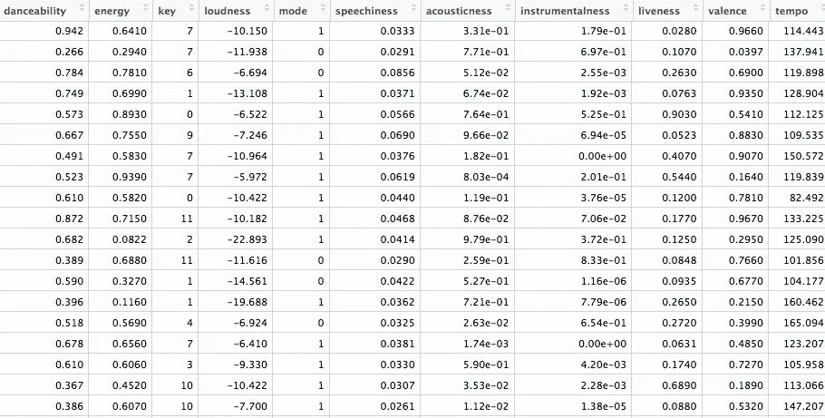

## 排列数据

现在，我们可以根据这些指标排列数据，并开始查看每个曲目和播放列表的表现。你必须通过曲目名称、指标，然后是馆长(这样我们可以评估每张荒岛唱片相对于其他播放列表的“性能”)。您可以将 *arrange()* 参数换成任何感兴趣的指标，并相应地进行选择。因为我们总共收到了 129 首曲目，所以我将范围缩小到每个音频功能的前 25 首表演曲目:

```
top_25_loudness <- DID_project %>% 
 arrange(-loudness) %>% 
 select(track.name, loudness, curator) %>% 
 head(25)
```

## 可视化数据

下面是在下面讨论的发现中使用的许多有用图的语法。

分别绘制所有策展人与曲目流行度(使用密度脊)和 *pirateplot()* 的关系图:

```
# Density plotggplot(DID_project, aes(x = DID_project$track.popularity, y = DID_project$curator, fill = DID_project$curator)) + 
  geom_joy() + 
  xlab("Track Popularity (0-100)")+
  ylab("Curator")+
  ggtitle("Desert Island Disc Popularity by Curator")# Pirate plotpirateplot(DID_project$track.popularity ~ DID_project$curator, DID_project,
           xlab = "Curator", ylab = "Track Popularity",
           theme = 0, point.o = 0.7, avg.line.o = 1, jitter.val = .05, 
           bty = "n", cex.axis = 0.6)# Pirate plot to calculate "DID Score"pirateplot(DID_project$track.popularity + DID_project$energy + DID_project$valence + DID_project$danceability  ~ DID_project$curator, DID_project,
           xlab = "Curator", ylab = "DID Score",
           theme = 0, point.o = 0.7, avg.line.o = 1, jitter.val = .05, 
           bty = "n", cex.axis = 0.6)
```

根据轨道持续时间绘制所有策展人:

```
ggplot(DID_project, aes(x = DID_project$track.duration_ms, y = DID_project$curator, fill = DID_project$curator)) + 
  geom_joy() + 
  xlab("Track Duration (ms)")+
  ylab("Curator")+
  ggtitle("Desert Island Disc Track Duration by Curator")
```

绘制与这些音频特征相关的指标和前 25 首曲目:

```
ggplot(top_25_loudness, aes(x = loudness, y = track.name, col = curator, size = loudness)) + 
  geom_point()+
  geom_joy() + 
  theme_joy()+
  ggtitle("Top 25 - Loud Songs")
```

使用 *ggstatsplot()* 绘制相关图，以评估指标/音频特征之间的统计关系:

```
ggstatsplot::ggcorrmat(
 data = DID_project,
 corr.method = “robust”,
 sig.level = 0.001,
 p.adjust.method = “holm”,
 cor.vars = c(energy, danceability, liveness, acousticness,    loudness, instrumentalness, track.popularity), 
 matrix.type = “upper”,
 colors = c(“mediumpurple3”, “violet”, “blue”),
 title = “Correlalogram for all Spotify Performance Metrics”
)
```

# 调查的结果

## 追踪受欢迎程度

Spotify 是这样对他们文档中的歌曲流行度进行分类的:

> 曲目的受欢迎程度是一个介于 0 和 100 之间的值，100 是最受欢迎的。流行度是通过算法计算的，并且在很大程度上基于该曲目的总播放次数以及这些播放的最近时间。一般来说，现在经常播放的歌曲会比过去经常播放的歌曲更受欢迎。重复曲目(例如单曲和专辑中的同一首曲目)被独立评级。艺术家和专辑的受欢迎程度是从曲目的受欢迎程度中数学推导出来的。请注意，流行度值可能会滞后实际流行度几天:该值不会实时更新

由于播放次数似乎是评估曲目受欢迎程度的主要指标，可以说每个人在这一指标上的得分越高，他们的品味相对于 Spotify 的其他部分就越受欢迎。根据这一理论，分数越低，他们的品味就越小众。(我可以向你保证，作为本次分析中大多数策展人的密友，Spotify 在评估曲目受欢迎程度方面做得很好)。总的来说，最受欢迎的歌曲来自瑞秋、海伦和喷火战机乐队。不出所料，**特里斯坦**最没有流行音乐品味(或者说最小众，取决于你怎么看)。如果你认识特里斯坦，这就说得通了。他得分最低的歌曲包括:阿兹特克摄像机的《在我心中的某个地方》、恐惧之泪的《给心中的年轻人的忠告》和新秩序的《奇异的三角恋》。看起来，尽管这些 80 年代后期的新浪潮流行歌曲在特里斯坦心中有着特殊的地位，但在 Spotify 的眼中，它们仍然是一首未雨绸缪的歌曲(或肖尔迪奇的家庭聚会)。

有趣的是， **Joe** 就其受欢迎程度而言拥有最多样的音乐品味，歌曲从 11 首到 72 首不等；这可能意味着乔愿意听流行音乐的两端。这很有趣，因为我们家一直流传着一个笑话“乔只听摩城”。(虽然应该提到的是，这一指标的方差是衡量歌曲在 Spotify-universe 中的受欢迎程度，而不是歌曲选择的多样性，因此这一假设仍有待否定)。

这可以通过一些巧妙的方式来可视化(方法中引用的代码):

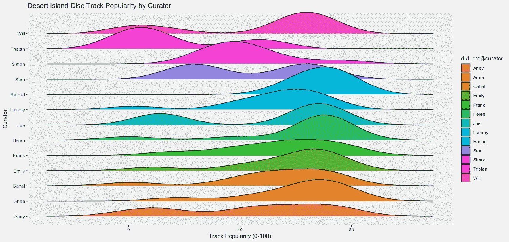

Figure 1\. Desert island disc popularity (0–100) by curator


Figure 2\. Track popularity (0–100) by curator

## 持续时间

这是一个有趣的问题。每个人的荒岛光盘似乎落在平均 3-6 分钟的区域，这是可以预期的。如果不是因为**西蒙**在他的播放列表中包含了两首导致数据倾斜的歌曲，这些数据会被认为是正态分布的。西蒙收录了我们收到的所有荒岛唱片中最长的两首歌曲:Yes 的《谵妄之门》(约 22 分钟)和米勒·戴维斯的《嘘/和平——LP 混音》(约 18 分钟)。两首歌加起来足足有 40 分钟，有人可能会说这对于它自己的播放列表来说已经足够了(如果你喜欢 40 分钟的摇滚和爵士乐的话！).

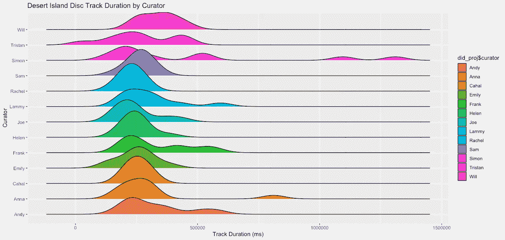

Figure 3\. Desert island disc track duration (ms) by curator.

## 拍子

似乎**威尔**在他的播放列表中拥有最大范围的节奏——以每分钟的节拍来衡量。这可能很好地反映了他在早上举重到他最喜欢的北方摇滚乐队的能力，同时能够在作为一名工料测量师的艰难一天后放松下来。(或者更有可能的是，由于本分析中使用的名义样本量，这是一种统计上的巧合)。

似乎卡哈尔更喜欢快节奏的歌曲。也许这就是他在房子里跺着脚听的音乐，而没有考虑到他沉重的脚步对周围环境的影响？

海伦的播放列表在 120 bpm 左右形成了一个几乎完美的分布。鉴于这是“流行歌曲”的典型节奏，这些发现得到了如上所述的曲目流行度数据的支持，其中海伦的歌曲是 Spotify 上最受欢迎的歌曲之一。

Emily 的数据也形成了一个很好的钟形曲线，但是在 110 bpm 左右。也许她对慢节奏歌曲的偏好决定了她在为 M 和 s 设计典型的英国桌布时总是镇定自若，举止放松。

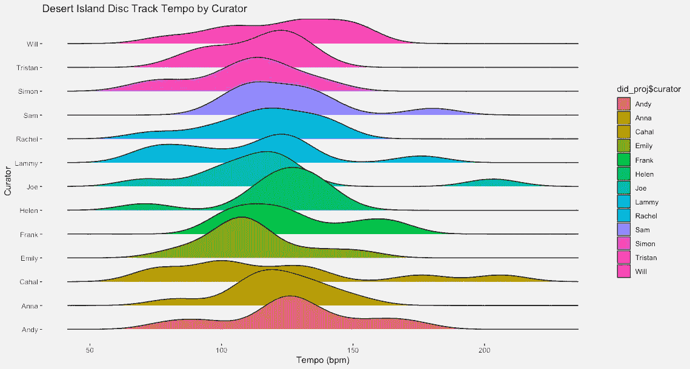

Figure 4\. Desert island disc track tempo (bpm) by curator.

## 25 首充满活力的歌曲

Spotify 是这样确定活力音乐的:

> 能量是一种从 0.0 到 1.0 的度量，代表强度和活动的感知度量。通常，高能轨道感觉起来很快，很响，很嘈杂。例如，死亡金属具有高能量，而巴赫前奏曲在音阶上得分较低。对该属性有贡献的感知特征包括动态范围、感知响度、音色、开始速率和一般熵。该特性的值分布如下所示:

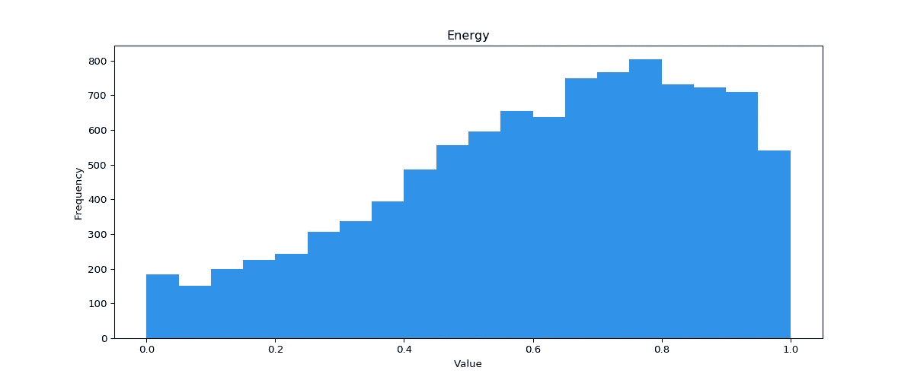

Figure 5\. How Spotify determine energetic music

下面展示了策展人在这次荒岛唱片分析中选出的 25 首最响亮的歌曲:

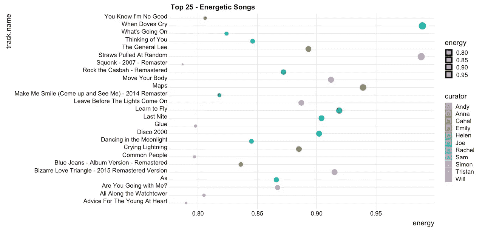

Figure 6\. Top 25 most energetic songs by curator

## 前 25 首响亮的歌曲

Spotify 是这样确定活力音乐的:

> 轨道的整体响度，以分贝(dB)为单位。响度值是整个轨道的平均值，可用于比较轨道的相对响度。响度是声音的质量，是与体力(振幅)相关的主要心理因素。值的典型范围在-60 和 0 db 之间。该特性的值分布如下所示:

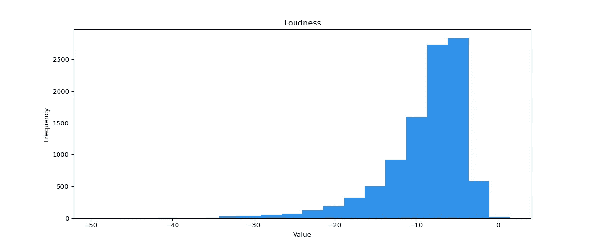

Figure 7\. How Spotify determine loud music

下面展示了策展人在这次荒岛唱片分析中选出的 25 首最响亮的歌曲。Spotify 是如何确定这一指标的:

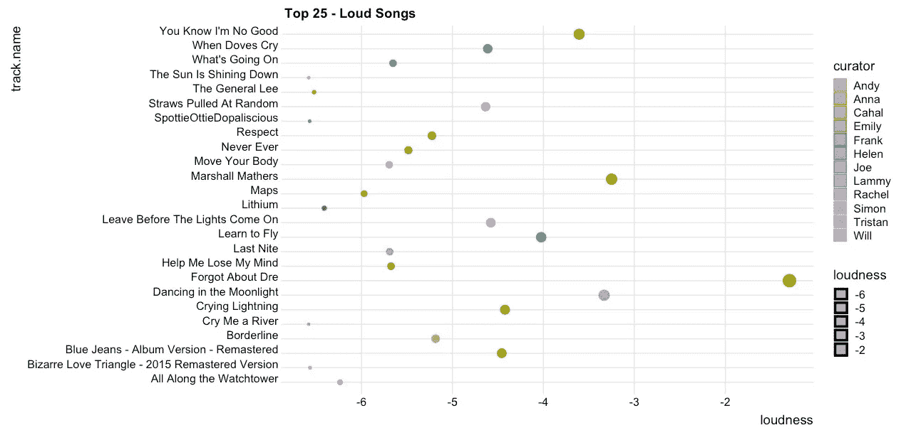

Figure 8\. Top 25 most loud songs by curator

# 统计分析

尽管这个项目使用了名义上的样本量，我还是忍不住尝试了一些统计分析。本节将简要讨论我对我们收集的所有播放列表数据进行的两项分析。

## "得分了"

我在 *yarrr()* 包的 *pirateplot()* 函数中发现了一个非常酷的功能，您可以在其中创建一个包含多个其他指标的组合效果的自定义变量。考虑到荒岛唱片是指当你被困在荒岛上时你会听的实际音乐，我创建了一个名为“DID Score”的变量，我觉得它最能反映如果你真的独处了很长一段时间你可能会选择听的音乐类型。此输出是从 Spotify API 中提取的以下变量的综合得分:

> **人气:**先前定义(见上图)
> 
> **能量:**先前定义的(见上文)
> 
> **效价**:从 0.0 到 1.0 的量度，描述一首曲目所传达的音乐积极性。高价曲目听起来更积极(例如，快乐、愉快、欣快)，而低价曲目听起来更消极(例如，悲伤、沮丧、愤怒)。该特性的值分布如下所示:

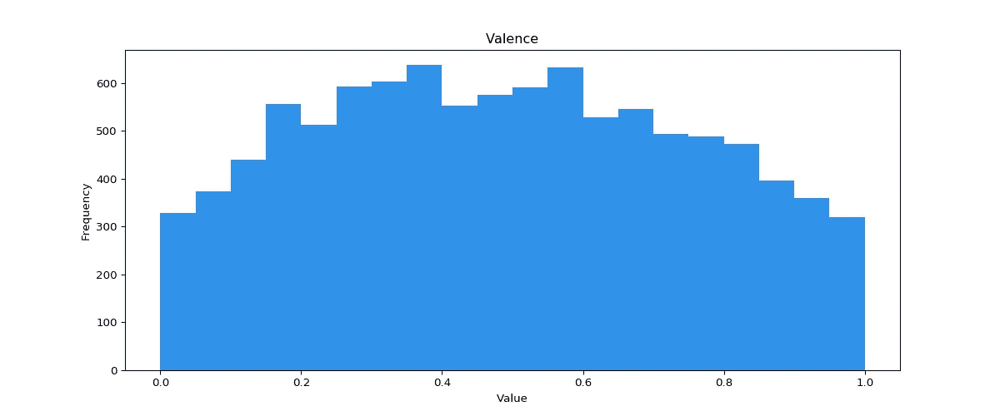

Figure 9\. How Spotify determine valence

> **可跳舞性:**根据音乐元素的组合，包括速度、节奏稳定性、节拍强度和整体规律性，描述一首曲目适合跳舞的程度。值 0.0 最不适合跳舞，1.0 最适合跳舞。该特性的值分布如下所示:

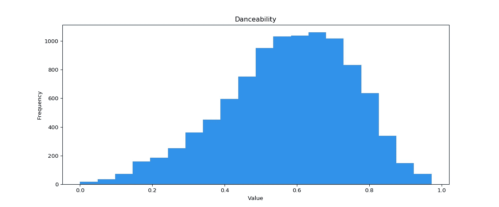

Figure 10\. How Spotify determine danceability

下面反映了所有策展人如何为他们的 DID 评分(对不起特里斯坦！):


Figure 11\. DID Score for all curators

## 相关分析

我尝试了一下，看看从 Spotify API 中提取的任何音频功能/指标之间是否有任何相关的关联。有趣的是，没有独立变量与跟踪受欢迎程度相关。响度和能量显著相关(0.74)。精力和跳舞能力也是如此(0.36)。毫不奇怪，能量和声音(-0.71)以及响度和声音(-0.54)之间存在负相关。这比什么都重要，是一个相当好的指标，表明 Spotify 对这些音频功能的分类相当严格。然而，值得一提的是，这种分析只在我们收到的荒岛光盘播放列表中使用的 129 个数据点上进行。很有可能通过增加样本量，Spotify 的音频功能——无论是独立的还是作为多元线性模型的一部分——能够预测歌曲的受欢迎程度。然而，这仍有待阐明。

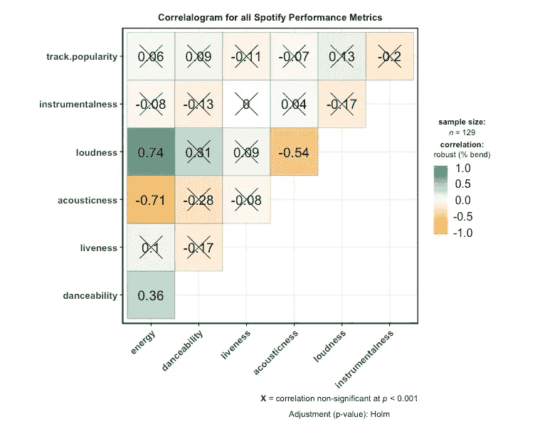

# 结论

音乐是我们生活中极其重要的一个方面。我们可能与电车上邻座的男人、地铁上的女人品味不同，当然也不会与在合作社花很长时间结账的老太太品味相同，但我们确实有一个共同的理解，那就是音乐能够带我们去某个地方。一些音乐激励我们在周六踢足球，一些音乐让我们反思我们希望能够收回的时间，一些音乐带我们回到我们最喜欢的海滩，在任何酷玩唱片的情况下，一些音乐让我们真诚地沮丧或想睡觉。

为了了解我们的朋友和家人喜爱的音乐，Sam 和我不仅能够实际聆听我们收到的播放列表，解读它们与馆长的相关性，还能想象它们对更广泛的音乐社区以及与其他人的播放列表的关系的重要性。在 Spotify 和他们的公共 API 的帮助下，以及这与 R 的良好集成，我能够对我们收到的播放列表所附的数据进行一些真正有趣的探索性分析，如果你对音乐或数据的热爱甚至只有我的一半，我真诚地推荐这个练习。