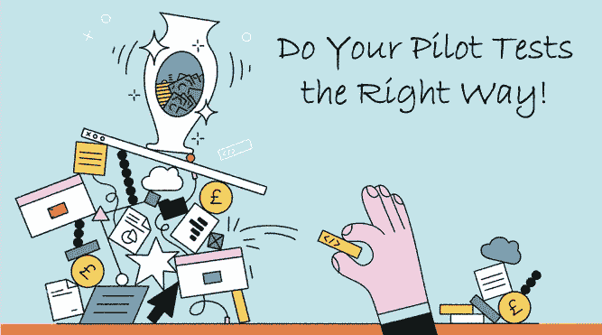
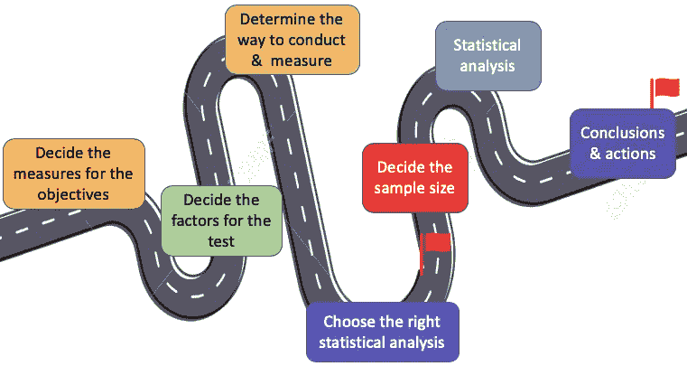
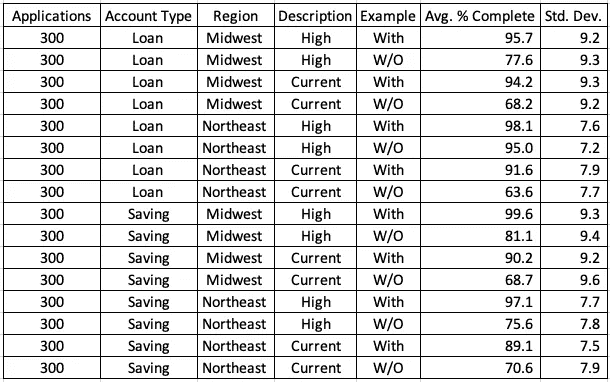
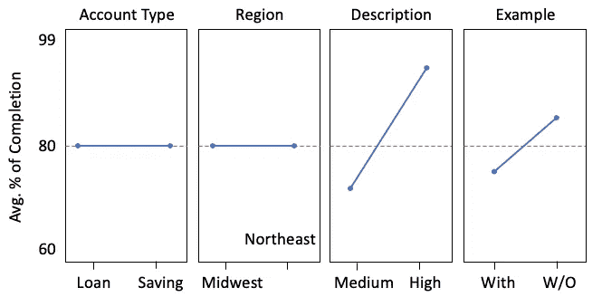
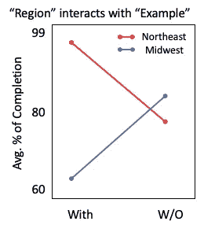

# 为您的变革管理设计实验

> 原文：<https://towardsdatascience.com/design-of-experiments-for-your-change-management-8f70880efcdd?source=collection_archive---------9----------------------->

## 实验设计的逐步指南

数据科学专业人员，您是否曾经面临过以下任何挑战？

**故事一:机器学习不等于实验设计**

> 由于你的统计专业知识，你被要求*设计一个实验*，但是你意识到你的机器学习工具不能帮助你设计一个实验。

**故事二:观测数据不可重复**

> 你的团队观察到了与几个因素相关的销售趋势。你的团队想要提出新的商业策略。但是团队不能决定复制该过程的正确因素。

**故事 3:相关性不是因果关系**

> 你的团队发现了两个因素之间的强相关性，并提出了业务变革计划。你的团队得到了客户的认可，在一个有希望的试点测试中实现了商业提议。测试期过后，你没有得到*声称的结果*。

如果是这样，你可能犯了用相关性来证明因果关系的错误。在我的岗位"[机器学习还是计量经济学？](https://medium.com/analytics-vidhya/machine-learning-or-econometrics-5127c1c2dc53)“我分享过很多解析题都是关于*因果*的。这些因果问题需要数据生成的设计，不能从大数据中导出。今天，机器学习和统计实验的分歧似乎汇聚到了大数据科学的保护伞下。然而，这两个不同的学科可以而且应该交叉融合来解决众多的业务计划。

使用实验设计是做这件事的正确方法。实验设计已经在制造业、临床试验和医院服务中实践了几十年。在这篇文章中，我将带你经历建立一个成功的 DoE 的步骤，从而引导你进行变革管理。我将用银行业的一个服务操作来介绍 DoE 的思路。

**什么是实验设计(DoE)？**

实验设计是对受控测试进行适当的计划、实施、分析和解释，以评估影响结果的因素。

**DoE 有什么好处？**

实验的设计能够真正识别因果洞见。结果使您能够为您的变更管理提出可行的策略。DoE 成本更低。它使用统计学来设计有效测试结果的最小样本量。您可以同时处理多个输入因素，并识别可能会错过的重要交互。

 [## 通过我的推荐链接加入 Medium-Chris Kuo/data man 博士

### 阅读 Chris Kuo/data man 博士的每一个故事。你的会员费直接支持郭怡广/戴塔曼博士和其他…

dataman-ai.medium.com](https://dataman-ai.medium.com/membership) 

它是如何工作的？

DoE 在以下七个步骤中有其成熟的程序。第一，目标是什么？您应确定目标的衡量标准。二、考什么？你将确定测试的因素。第三，如何进行？你将决定指导和衡量的方式。第四，如何衡量？你会选择正确的统计分析。第五，结果是否可信？您将确定所需的样本量。六、如何分析数据？应用统计分析。第七，接下来是什么？在统计分析的帮助下，你可以做出结论和可行的项目。

**案例研究:银行业服务运营的 DoE**

以下是美国能源部指导变革管理的成功案例。

一家零售银行需要重新设计其账户申请流程。虽然可以在线申请，但仍然需要无需预约的申请。该银行的不完整申请比例很高，需要重新处理申请。再加工工作也减缓了其他操作，导致整体效率低下。银行需要实施正确的行动改变，以消除再加工中的浪费。

步骤 1:确定目标的衡量标准

可量化的目标总是起点。项目团队决定将完成应用程序的百分比作为目标。该团队排除了其他有趣但不太相关的指标，如平均存款额。

步骤 2:确定测试的因素

项目团队怀疑有四个因素可能会影响应用程序是否完整。该团队为四个因素中的每一个设计了两个级别:(I)申请类型(贷款账户或储蓄账户)，(ii)分行位置(中西部和东北部)，(iii)申请表的说明(中级或高级描述)，以及(iv)有无示例。

步骤 3:确定指导和衡量的方式

实验在两个分支进行了两个月。自行管理的申请表继续在前台展示，因此展示方式没有变化。每个地点只有一种类型的申请表。表(A)中列出了这些因素的不同组合。

Exhibit (A)

步骤 4:选择正确的统计分析

项目团队需要了解各种因素水平的所有可能组合的影响。图表(A)被称为*全因子设计*。这样的实验允许研究者研究每个因素对目标变量的影响，以及因素之间的相互作用对目标变量的影响。

步骤 5:确定所需的样本量

如何确定析因分析的最小样本量？这是一个棘手的问题，因为它不仅取决于因素的数量，还取决于每个因素的“负载”或系数。正如“探索性和验证性因子分析”( [Bruce Thompson，2004](https://www.apa.org/pubs/books/4316025) )所解释的，如果一个因子有四个以上的水平，并且每个水平的系数小于 0.60，那么 N = 60 就足够了。如果一个因子有十个以上的水平，每个水平的系数在 0.40 左右，那么样本量至少应该是 150。任何超过 300 的样本量都被认为是足够的。项目组决定在每个因素组合中收集至少 300 份申请。

步骤 6:进行统计分析

该项目的目标是确定哪个因素组合显示出具有统计显著性的最高平均值。“统计显著性”是关键，这意味着这种差异足以保证下次的可重复性。研究小组使用了一种叫做 ANOVA(方差分析)的技术来比较“平均”。%完成”来验证差异是否具有统计学意义。

图表(B)显示了五个因素之间的差异。只有“描述”和“示例”中的差异在统计上具有显著性，置信度为 95%。这意味着高水平的描述和申请表中的例子将导致高完成率。

Exhibit (B)

一个因素可以影响另一个因素。这是通过因素之间的相互作用捕捉到的。申请表中的一个“例子”预计会降低中西部的毕业率，但会提高东北部的毕业率。

步骤 7:结论和可行策略

基于这些结果，项目团队总结了几个可行的策略:

*   两种账户类型的申请表格相同
*   提供更多描述
*   在申请表中为东北地区提供了一个示例，但没有为中西部地区提供示例

新的申请表将完成率从 60%提高到 95%以上。这一改变大大缩短了申请时间，并消除了重新处理的时间。

这里值得注意的是，在“识别因果关系”系列文章中，我涵盖了旨在识别因果关系的计量经济学技术。这些文章涵盖了回归不连续性、差异中的差异、面板数据分析和因子设计的随机对照试验:

*   **机器学习还是计量经济学？**(见[“机器学习还是经济学？](https://medium.com/analytics-vidhya/machine-learning-or-econometrics-5127c1c2dc53)
*   **回归不连续**(见[通过回归不连续](/@Dataman.ai/identify-causality-by-regression-discontinuity-a4c8fb7507df)识别因果关系)，
*   **(DiD)**(见)**【通过差异鉴别因果关系】**
*   ****固定效应模型**(参见[通过固定效应模型识别因果关系](/@Dataman.ai/identify-causality-by-fixed-effects-model-585554bd9735))**、****
*   ****采用析因设计的随机对照试验**(参见“[您的变更管理实验设计](/design-of-experiments-for-your-change-management-8f70880efcdd)”)。**

**您还可以将“ [Dataman 学习路径——培养技能，推动职业发展](https://medium.com/analytics-vidhya/dataman-learning-paths-build-your-skills-drive-your-career-e1aee030ff6e)”加入书签，了解更多信息。**

** [## 通过我的推荐链接加入 Medium-Chris Kuo/data man 博士

### 阅读 Chris Kuo/data man 博士的每一个故事。你的会员费直接支持郭怡广/戴塔曼博士和其他…

dataman-ai.medium.com](https://dataman-ai.medium.com/membership)**