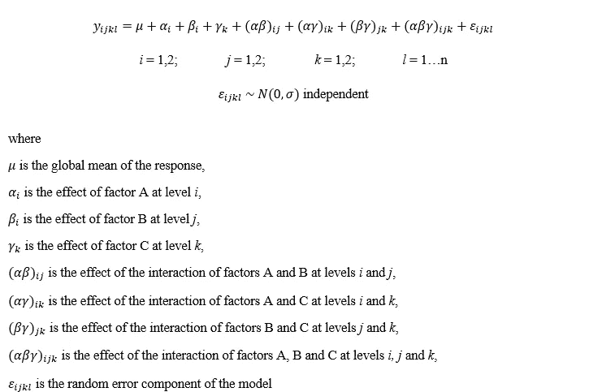
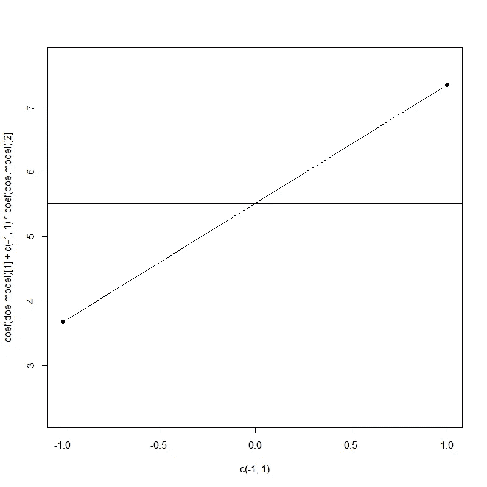
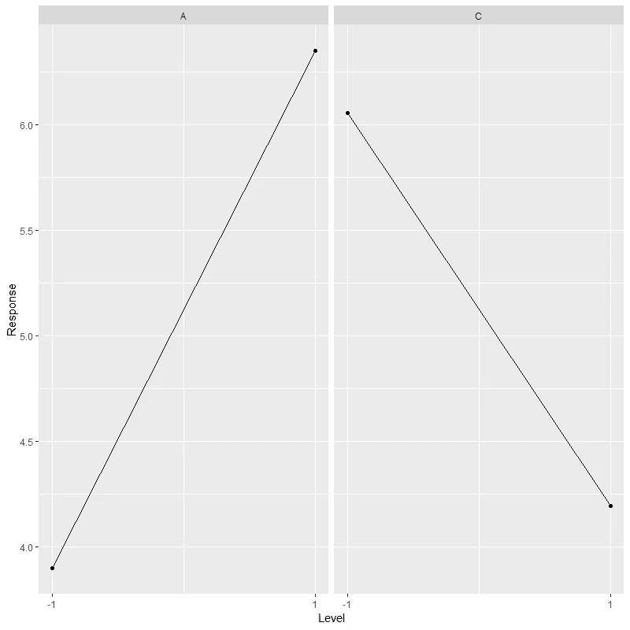
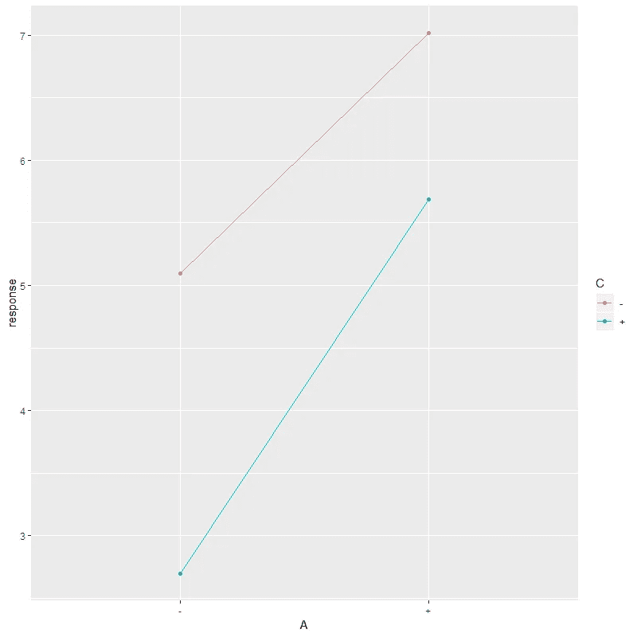
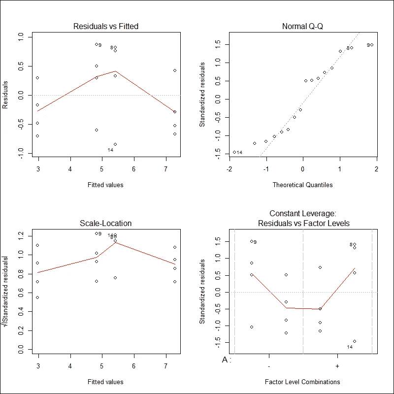

# R 的实验设计

> 原文：<https://towardsdatascience.com/design-of-experiments-with-r-e54167fac490?source=collection_archive---------4----------------------->

## r 代表工业工程师

## 构建 2^k 析因设计

Image by Hans Reniers available at [Unsplash](https://unsplash.com/photos/lQGJCMY5qcM)

# 实验设计

实验设计是六适马方法中最重要的工具之一。这是 DMAIC 循环中*改进*阶段的精髓，也是稳健流程设计的基础。

> 实验设计被定义为应用统计学的一个分支，它处理计划、实施、分析和解释受控试验，以评估控制一个参数或一组参数值的因素。DOE 是一个强大的数据收集和分析工具，可用于各种实验情况。它允许操纵多个输入因素，确定它们对期望输出(响应)的影响。
> 
> -美国质量协会

充分利用 DOE 将导致过程的改进，但是糟糕的设计会导致错误的结论，并产生相反的效果:效率低下，成本更高，竞争力更弱。

# 2^ *k* 析因设计

2^ *k* 析因设计是一般析因设计的特例； *k* 因子正在研究中，都在 2 个级别(即高，称为“+”或“+1”，低，称为“-”或“--1”)。这种析因设计广泛用于工业实验中，并且由于筛选大量可能在实验中有意义的因素的过程，通常被称为筛选设计，目的是选择它们用于测量响应。如果试验考虑了 *n* 次重复，那么试验总数为 *n* * 2^ *k* 。

因子通常用大写拉丁字母(A、B、…)表示，而主效应通常用与因子的拉丁字母相对应的希腊字母(α、β、…)表示，交互作用的效应用字母组合表示，这些字母代表其效应相互作用的因子。对于具有 3 个因子和 *n* 次重复的 2^ *k* 析因实验，统计模型为

对于下面的例子，我们将考虑一个 2 次重复的 2 全因子设计实验(即 2*2*2*2 = 16 次运行)。我们将这些因素命名为 *A* 、 *B* 和 *C* ，它们将有两个级别，分别为“ *+* ”和“-”。

让我们看看 R 代码！

第一步是导入 *SixSgima* R 包，设计 2 因子实验，将其随机化以消除未知或不可控变量的影响，定义一组重复，并为每个因子设计指定相应的响应。

设计好实验后，接下来的步骤包括聚合不同的析因设计，并从模型的汇总表中获得结果。

查看*p*-值，我们可以很有把握地得出，因子 *C* 和 *A* 的影响是显著的，而因子 *B* 的影响则不显著。这些因素之间的相互作用既不是双向的，也不是三向的，因此它们并不重要。获得这些统计信息后，我们可以通过排除所有不显著的影响来简化模型，获得模型的系数，获得所有实验条件的估计量，并计算每个因素的置信区间。

同样，我们也可以在单个地块中可视化每个因素对模型结果的影响。让我们用下面几行代码来绘制因子 *A* 的对模型结果的影响。

根据前面的图，我们可以观察到，当因子 *A* 设置在“+”级别(即 1.0)时，结果的值大于设置在“-”级别时的值(即-1.0)。此外，我们可以通过使用 *ggplot2* 包中的 *facet_grid* 来绘制单个图中重要因素的影响。

根据上面的图，与因子 *A* 对模型结果的影响相比，当因子 *C* 设置在“+”级别时(即 1.0)，结果的值低于设置在“-”级别时(即-1.0)。同样，我们可以在一个图中绘制两个因素的相互作用，以可视化它们对模型结果的影响。

如上图所示，由于两条线不相交，这两个因素之间没有相互作用。为了使结果值最大化，因子 *A* 应设置在“+”级，因子 *C* 应设置在“-”级；另一方面，为了最小化结果值，因子 *A* 应设置在“-”级，因子 *C* 应设置在“+”级。最后，我们可以绘制残差图，并使用正态性检验验证它们是否遵循正态分布。

Residuals Plots

根据上面的残差图，残差中没有清晰的模式。但是，正常的 Q-Q 图不够直。

# 总结想法

给出的实际案例是一个非常有代表性的例子，说明了如何在一个使用 R 软件的六适马项目中使用 DOE。从工程的角度来看，可以用来减少**时间**来设计/开发新产品和新工艺；提高现有流程的**性能**；提高产品的**可靠性**和性能；实现产品和流程的**稳健性**；并执行**评估**材料、设计方案、**设置**组件和系统公差。然而，DOE 本身并不是一种改进。工程师有责任充分利用这一工具来实现多个目标和更好的结果。

*— —*

*如果你觉得这篇文章有用，欢迎在*[*GitHub*](https://github.com/rsalaza4/R-for-Industrial-Engineering/tree/master/Design%20of%20Experiments)*上下载我的个人代码。你也可以直接在 rsalaza4@binghamton.edu 给我发邮件，在*[*LinkedIn*](https://www.linkedin.com/in/roberto-salazar-reyna/)*上找到我。有兴趣了解工程领域的数据分析、数据科学和机器学习应用的更多信息吗？通过访问我的介质* [*简介*](https://robertosalazarr.medium.com/) *来探索我以前的文章。感谢阅读。*

*-罗伯特*