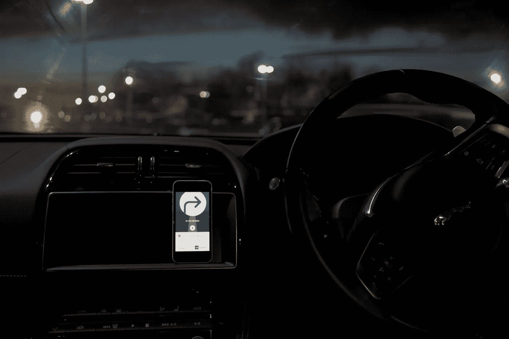

# 为适当的互动而设计

> 原文：<https://towardsdatascience.com/designing-for-appropriate-interaction-dcaaeffb7fb5?source=collection_archive---------15----------------------->

## 如果我们把机器设计成更体贴的社会角色会怎么样？

all images by author

我们的设备被设计成在社交上很笨拙。尽管如此，在过去十年里，没有什么比智能手机及其引发的二次效应对社会的影响更大了。在未来十年，随着技术变得更加亲密，同时通过传感器和人工智能的进步，我们作为设计师和技术专家有一个独特的机会来塑造技术作为社会行为者的角色。

人们经常引用迪特·拉姆斯的话说，他努力把产品设计得像“一个优秀的英国管家”。这是对拉姆斯的第五个原则“好的设计不引人注目”的一个很好的比喻。而在实体产品领域，这与他的第二个原则“好的设计让产品有用”明显不同——随着产品变得越来越相互关联，同时越来越深入我们的生活，如果它们在根本上不是为了不引人注目而设计的，它们很容易变得无用。
人们已经可以感觉到，在今天的智能手机使用中，人们对他们收到的大量通知是多么不知所措。现在，想象一下一套增强现实护目镜，它不知道什么时候适合显示信息，什么时候必须清除视野。

从更广泛的意义上来说，在现实世界中，产品是“英国管家”的理念和产品“在你需要的时候出现在你面前，但一直在后台”的要求通常被转化为审美品质。然而，数字产品在很长一段时间内都无法满足这种期望。有限的感知能力，但更重要的是电池寿命和计算能力的缺点，导致了交互设计中基于“拉”的模型，这种模型主要需要用户手动询问要采取的动作。随着智能手机的出现，以及无处不在的连接的出现，“推送通知”系统成为我们日常生活中根深蒂固的一部分，随之而来的是不断努力跟上这种新的基于“推送”的交互方式。虽然拟人化的数字管家(软件)在很长一段时间内从未预测到我们的需求，并且总是不得不被要求为我们执行一项行动，但它最近转向不断要求我们的注意，并对我们施加任何琐碎的干扰，同时不仅为他们的雇主(“我们”——用户)服务，还为任何其应用程序以某种方式出现在我们主屏幕上的公司的利益服务。

在 2006 年的论文[“魔法墨水”](http://worrydream.com/MagicInk/)中，Bret Victor 已经得出结论，当涉及到信息软件的人机界面设计时，“交互”将被“认为是有害的”——或者用一种更“拉姆齐”的说法——软件设计师应该努力做到“尽可能少的交互”。

Victor 提出了一个策略来减少与系统交互的需要，他建议“信息软件的设计最初应该主要作为一个图形设计项目来处理”,把任何界面设计项目首先作为图形设计的一个练习，只有在最后才使用操作。虽然这对于基于“拉”的信息软件来说是一种有效的方法，但对于通信软件(Victor 将其描述为“操纵软件和粘在一起的信息软件”)来说却是不够的，因为如今通信软件将信息强加给我们，而大多数通信软件根本没有多少图形界面。

另一种策略是通过环境、历史和用户交互来推断上下文。维克多写道，软件可以

> 1.推断出需要其数据的上下文，
> 2。筛选数据，排除不相关的和
> 3。生成一个直接针对当前需求的图形

12 年后，随着技术的进步，尤其是硬件和软件的集成，其推断上下文和筛选数据的能力变得更强，因此可以用于生成“图形”(或任何其他输出)，以更好地满足当前用户的需求，但更重要的是在时间、空间和方式上适合用户及其环境。

但是适当对(交互)行为意味着什么呢？[韦氏词典将合适定义为“特别适合或合适的品质或状态”。在这里，我认为任何行为或互动都是适当的，如果它不能通过自动化或预期来避免，并且符合特定社会的道德模式。这在不同的社会之间变化很大，但也取决于一个人与特定人群的个人关系——无论是整个文化还是一群朋友。](https://www.merriam-webster.com/dictionary/appropriate)

随着移动电话的广泛使用和铃声的出现，电影院决定制定一份合同，规定在他们提供的环境中如何恰当地使用这项技术。直到今天，每部电影都以一个通知开始，要求人们将手机设置为“静音模式”。公共交通也采取了类似的措施。智能手机的出现甚至导致了设备的家庭手工业，试图让人们更难使用智能手机，更难在演出时分心。

然而，通过计算模拟适当性并不是一件容易的事情。在我们目前的设备中解决这个问题的尝试都是非常战术性的。人机礼仪的整个领域在今天的大多数软件中仍然被忽视——有时仅仅是因为[的法律要求](https://www.engadget.com/2016/09/30/japans-noisy-iphone-problem/)才被考虑。

但即使是更通用的建模方法，如苹果 iOS 的“请勿打扰”功能，也需要用户在设置时非常谨慎，缺乏灵活性和流动性，因为它们都是模仿他们的祖先“飞行模式”的设计蓝图。

在交互设计或人机交互研究中，机器作为社会参与者的探索并不新鲜。传感器和计算的进步，加上更有能力的机器学习，自然导致了一场让计算机更具情境或社会意识的运动。

这篇文章是基于在[情感计算](https://www.media.mit.edu/groups/affective-computing/overview/)和[人机礼仪](https://dl.acm.org/citation.cfm?id=1965237)以及 [CASA](https://www.radford.edu/~sjennings15/CASA.pdf) (计算机作为一个社会角色)领域所做的大量工作。

我从探索工作的未来开始了我的设计过程。办公室一直是交互设计的沃土。在[“所有演示之母”](http://www.dougengelbart.org/content/view/209/448//)中，道格拉斯·恩格尔巴特通过讲述一个发生在知识工作者(或当时的“知识分子”)办公室的场景，开始解释观众将要看到的内容:

> “…如果在您的办公室里，作为一名脑力劳动者，为您提供一台由计算机支持的计算机显示器，它整天为您工作，并对您的每个动作做出即时(…)响应，您能从中获得多少价值？”

从那以后，办公室发生了很大的变化，这在很大程度上要归功于 Engelbart 和 Licklider 通过 SRI 所做的贡献。许多人再也不在办公室工作了——所有最终变成思维工具和大脑自行车的技术，真正帮助增强了我们大脑的能力、生产力和创造力，但同时也最小化了我们思维的空间——我们大脑的容量。

在以人为中心的设计过程中，我首先围绕当今的知识工作是什么样子采访人们，然后构思出超越知识工作者办公室的概念，无论是小隔间、开放式办公室还是任何地方。

最终出现的框架为其个别应用程序奠定了基础，即“API”，它建立在一个传感器和智能系统的基础上，该系统具有推断上下文和筛选数据的能力，以建立一个仅在适当时发生的最小交互模型，该模型基于用户的环境、精神状态和道德模型，该模型基于系统与用户在给定上下文中的先前交互的反馈进行训练。

Conceptual ‘API’ graph for appropriate machine behaviour

现在，我们将把这个系统应用于从目前包含“不适当”行为的研究中出现的场景，并尝试将涉及的机器想象为更体贴的社会行为者。

每一个原型都伴随着一个宽泛的‘我们怎么可能？’旨在作为一个松散原则的问题，以便其他设计师和技术人员在设计他们的产品或服务时可以问自己同样的问题——将原型视为许多可能的实施策略之一。

## 1 →人机礼仪

*我们怎样才能设计出能够恰当对待用户的机器？*

***如果一个导航系统能够尊重对话会怎么样？***

想象一下，开着你的车。与你的副驾驶进行深入的交谈。当你说话时，你的副驾驶会听你说话，反之亦然。这是一个引人入胜的讨论，每个懂自然语言的人都能看出来。

[Prototype](https://github.com/sarahmautsch/Etiquette) → a simple iOS app that doesn’t interrupt the user when it hears them speak, but uses short audio signals to make itself heard.

导航系统也是如此，它使用*语音识别*和*自然语言处理*来通知其“道德模型”。因此，只有在对话自然中断时，它才会说出下一个方向。当信息变得更紧急时，它会使用更具侵入性的信号。只有当紧急程度达到最大时，系统才会发出大声说话这样的干扰信号。在眼球追踪和其他传感设备的帮助下，它甚至可以判断你是否已经识别了指令。

使用“API”的同一个系统甚至可以与 Apple Music 或 Spotify 等应用程序集成，在你最喜欢的播客中的对话出现自然中断时，或者就在你正在听的当前歌曲中你最喜欢的部分之后，完美地定时中断。

## 2 →可协商的环境

我们怎样才能设计出意识到并关注周围环境的机器？

一般来说，“谈判环境”是指机器和它的主人之间的互动对周围的人产生影响的环境。这通常与公共空间相关，例如在火车上或公园里，但更重要的是在更私密的空间，由同一批人共享，如在开放式办公室、电影院甚至飞机上。

如果机器能够礼貌地对待它们影响的每一个人，会怎么样？

[*Prototype*](https://github.com/sarahmautsch/Negotiable-Environment) *→ A* new take on the brightness slider that contains a subtle gradient to visualize how others set brightness around you to nudge you to set it similarly.

只有少数人还在使用他们的设备。当第一批人调低他们笔记本电脑的亮度进入睡眠模式时，附近设备的平均亮度开始下降，其他没有调整亮度的设备也相应地自动适应。如果他们的用户不重置它(并因此应用负面强化),他们各自的“道德模型”会接受这种行为的训练，并被他们的用户接受。

## 3 →一致性

我们如何设计能够在新的未知环境和情况下适应适当行为的机器？

最后一个故事带来了一个有趣的问题:设置是否应该自动适应环境？当人们来到一个不熟悉的地方，他们会观察其他人的行为，以弄清楚“这个地方是如何运作的”。只有当他们对环境有信心时，他们才会开始做出调整，或者对自己在规则之外的行为感到自信。

***如果机器能够理解并动态适应不同的习俗和新环境会怎样？***

[*Prototype*](https://github.com/sarahmautsch/Conformity) *→* A settings app in which the settings change based on the user’s location or context (represented through proximity to different iBeacons).

想象一下，日本的一个家庭正在当地的餐馆享用美食。一名商人(似乎是他第一次来日本)在进入餐厅时，正大声录制语音信息发送给一名同事。他的智能手机识别新的环境，查看其他手机(都切换到“请勿打扰”)并复制它们的设置，因为他已经将自己对不熟悉环境的“符合性”级别设置为“高”。一旦他离开餐厅，他就会收到同事的回复，因此可以尽情享受他的用餐。

## 4 →增强

*当我们通过数字方式交流时，我们如何利用机器成为更好的社会参与者？*

既然我们已经看了关于系统如何使机器成为更好的社会行为者的多个例子，我们可能会问自己，这个系统如何帮助我们成为更好的社会行为者——特别是在数字通信中，即使是人类也经常缺乏我们用来判断中断是受欢迎还是具有破坏性的常见社会线索。

***如果我们一直都知道可以问同事一个“快速问题”会怎么样？***

[*Prototype*](https://github.com/sarahmautsch/Co-Working-Augmentation) *→* iOS App that uses Face ID eye-tracking and networks with another iPhone running the same app detecting when both people pay attention (or not) and then signaling between them.

*想象一下在一个开放式的办公室里。现在是上午 10 点，通常是一天中最忙的时候。马克有一个紧迫的问题，但他的同事劳拉似乎很忙。马克知道劳拉今天某个时候有一个截止日期。他不确定是否应该马上问这位同事，还是等到午餐时间，甚至是傍晚，这样才省点事。*

*马克使用“我的同事”应用程序，劳拉用它来表示她是否高度集中注意力或者是否为一点点分散注意力而高兴。该应用程序使用眼球追踪和其他参数来区分这两者。Laura 看起来确实很专注，所以 Mark 可以在她不再专注并且乐于聊天时请求通知。当系统检测到劳拉可能需要一点休息时，它会问她是否想和马克聊天。劳拉同意，她会感谢一点休息，并接受了邀请。马克收到通知，他们聊了一会儿。*

这个系统的一个重要元素是它从头学习的能力。每一个配备了这个框架的系统都可以从一个非常基本的“道德模型”开始——一个[“白板”](http://classics.mit.edu/Aristotle/soul.html)。随着它从环境中学习，主要是从它的用户那里学习，它将根据自己的经验——根据它在现实世界中采取的行动获得的反馈——对什么是适当的行为形成独特的观点。因此，一个被一位法国时尚博主“社会化”的系统，对于它认为合适的东西，会有一个略微不同的想法，这个系统是由一位日本老年妇女通过使用训练出来的，她刚刚得到了她的第一部智能手机。只有当这些设备在相同的附近时，它们才会开始相互影响，如果博主曾经去过日本，出于对他们不熟悉的文化的尊重，他们甚至会将设备的“一致性设置”更改为更高的级别，包括人对人和设备对设备。

这种“在[情境伦理](http://www.bbc.co.uk/ethics/introduction/situation_1.shtml)中的计算方法”与如今科技公司在判断对错时采用的更像“圣经法则”的方法截然不同。如今，互联网的大量使用由脸书控制，当谈到平台上允许或不允许什么内容时，它有一种非常典型的硅谷方式。硅谷的工程师、设计师和产品经理定义了使用他们产品的整个世界的道德标准。一旦脸书(或其子公司)不断进入新的市场并超越其 20 亿用户，或者来自其他文化的网络在技术世界中占据主导地位，今天已经形成的紧张局势只会进一步加剧，必须开始开发一种更具可扩展性、动态性和包容性的解决方案。

我很想听听你对我们如何让机器成为更体贴的社会角色的想法。请在这里或在推特上告诉我 [@sarahmautsch](https://twitter.com/sarahmautsch) 。

## 释文

[1]想想通知(其设计大多由操作系统的创造者规定)或语音用户界面，如 Siri 或 Alexa。

[2]在这篇文章中，伦理一词是在狭义上使用的，基于其字面上的原始含义，来自希腊民族精神/έθος/，在牛津词典中被定义为“一种文化、时代或社会的特有精神，表现在其态度和愿望中”。当考虑到环境来对其进行伦理评价时，它被称为情境伦理。相反，圣经法律类型的方法是基于绝对的道德学说来判断。由于这个项目关注的是让机器根据它们从环境中的(交互)行动中学习到的知识做出适当的行为，所以这个作品培养了情境伦理的思想。

[3]API 代表应用程序编程接口，是[‘一套规则，允许程序员为特定的操作系统开发软件，而不必完全熟悉那个操作系统’](https://www.merriam-webster.com/dictionary/application%20programming%20interface)—这里我们将把它看作是系统的一个概念(包括所有的输入、输出和核心功能)，在此基础上我们可以开始设计。