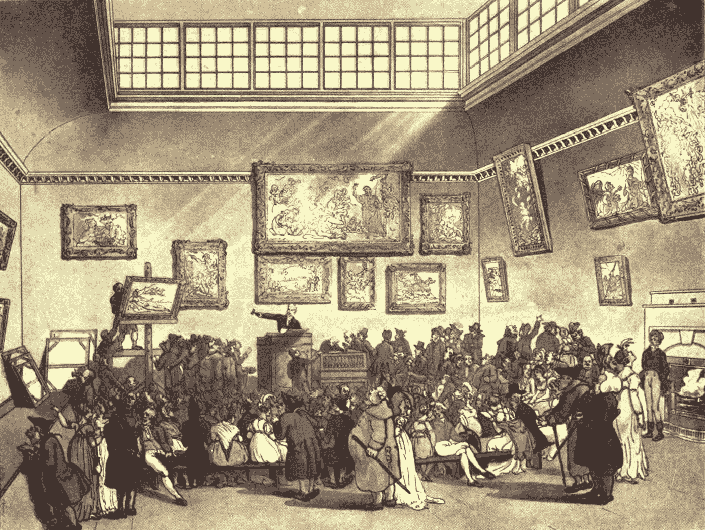
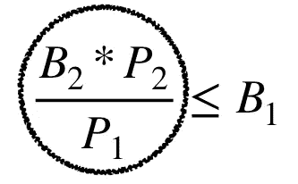

# 应用商店搜索广告系统的拍卖机制设计

> 原文：<https://towardsdatascience.com/designing-the-auction-mechanism-for-the-app-store-search-advertising-system-4aae53ce9e32?source=collection_archive---------39----------------------->

*The Microcosm of London* (1808), an engraving of Christie’s auction room. Taken from [here](https://en.wikipedia.org/wiki/Christie%27s).

这个故事分享了我为伊朗第三方 Android market place*Cafe Bazaar*的搜索广告系统设计拍卖机制的经历。

在深入研究该机制的细节之前，我需要解释一下该机制所针对的搜索广告模型。

# 搜索广告模型

简单地说，S*earch-ads*——app store 搜索广告系统，会在用户使用 app store 搜索系统搜索到的查询关键词***【q】***的搜索结果的第一行显示安卓应用***【a】***，作为广告。

如果***【u】***点击广告上的安装底部，***【a】***将被收取从对(***【q】******【u】***)对进行的拍卖中确定的价格金额。

综上所述，可以推断 S *earch-ads* 是一个**点击付费**广告系统，其成功因素依赖于两个方面:

1.  使用 app store 搜索系统，并希望找到自己想要的 android 应用程序的用户
2.  投资他们的钱为他们的 android 应用做广告的开发者

从现在开始，我将把使用 app store 下载自己想要的安卓应用的用户称为*用户*，把自己的安卓应用放到 app store 的安卓开发者称为*开发者*。

Two different ways that an ad can be shown in the search results of a query.

*Search-ads* 是一个先进的广告系统，这意味着每个想要为他们的应用做广告的 android 应用开发者都应该创建一个活动，包括开始和结束日期、预算金额和其他一些标识符。在创建活动之后，他们对他们想要的搜索查询进行竞价，并可能使用额外的搜索广告功能，如查询建议、广泛竞价等。

Search-ad 对任何用户搜索的每个搜索查询进行拍卖；并且进一步选择最多一个获胜者应用作为广告显示在搜索结果的第一行中。

这个系统是针对开发商的复杂投标。他们应该准确地知道什么目标查询，并相应地管理他们的出价。

# 拍卖

拍卖是搜索广告的核心。思考设计拍卖机制将导致人们考虑其特点。因此，对于应用程序商店的广告目标，机制设计过程在其设计者肩上奠定了一套具体的政策。

*搜索广告*‘拍卖必备特征’是:

*   首先，搜索广告的广告模式高度依赖用户——广告点击是最重要的赚钱行为。
    要交付像样的用户体验，搜索结果必须符合用户查询。此外，*搜索广告*，作为最突出的查询结果，在传递这种体验方面发挥了重要作用。如果有任何东西干扰这样做，用户对搜索结果的忠诚度就会丧失。这可能有不同的解释。有些人可能会说，获奖的应用程序应该具有高质量，其他人可能会说，它应该尽可能与查询相关，等等。然而，第一个特征告诉我们*首先来自用户*。
*   第二，模型需要有开发者作为不同拍卖的参与者。开发者正在投资一个出售安装点击的广告系统。因此，可以有把握地假设，他们的第一个也是最重要的动机是让新的可靠用户安装他们的 android 应用程序，从而促进他们业务的增长。考虑到这一点，拍卖机制应该是简单和健壮的，也就是说，对博弈论有幼稚理解的每个人都可以使用它。开发者对使用*搜索广告*的满意度将导致更多的参与和投资。因此，第二个特征告诉我们*第二个来自开发者*。
*   最后但同样重要的是，这种模式为应用商店创造了收入。因此，设计一个在创收方面最优或接近最优的拍卖机制是合理的。这最后一个特征告诉我们*最后出现在 app store 中。*

不仅这些特征的定义很重要，它们的顺序也很重要。他们的命令为设计拍卖机制强加了一套政策。

# 机械设计

为简单起见，固定查询关键字***【q】***。让我们假设有 *n* 个开发者想要使用*搜索广告*在***【q】***上为他们的 android 应用做广告。说*我*第八个开发者愿意支付*搜索广告*高达*Vi*——估价，每点击***【q】***。理想情况下，该机制希望每次点击获得的最大收入是 *MAXi{Vi}* 。然而，问题是点击是随着用户的动作发生的。为了更好地理解这一点，记住这两个概念是有帮助的:

1.  印象:
    当一个应用在***【q】***的搜索结果中显示为广告时，就会产生印象。
2.  点击率(CTR):app***【a】***查询***【q】***的
    点击率，是***【a】***在***【q】***的搜索结果上显示为广告时被点击的 id 概率。

给定上面的定义，让我们假设第*个开发者的应用在***【q】***上有 CTR *Pi* 。解释这些 CTR 的一种方法是将它们视为来自用户的直接反馈。因此，使用 CTRs 并在该机制中引入期望将使得每次印象的期望最大收入为 *MAXi{Pi * Vi}* 。具体来说，如果拍卖机制知道投标人的估价和 CTR，则该值是可实现的。但是，可能无法准确地拥有这两个变量。首先，开发商是在战略环境下投标。因此，他们可能不会在拍卖中使用他们的真实估价，并可能操纵他们的出价。其次，评估一个真正的点击率本质上是一项艰巨的任务，我们应该估计相关的点击分布。*

在讨论提议的拍卖机制之前，让我们首先考虑一种估计点击率的有效方法。

## CTR 估计

存在许多方式来考虑统计和机器学习方法，以估计点击的概率，例如用足够和可靠的数据训练模型等。

解决 CTR 估计问题的一种方法是将其视为强化学习(RL)设置。处理探索与开发的权衡是 RL 优化的独特之处之一。准确地说，多臂 bandit (MAB)算法有助于平衡 CTR 估计问题中的探索和利用。

要估算 app***【a】***在***【q】***上的点击概率，可以把它想象成 MAB 设定中的一只手臂。每当*作为广告在***【q】******【a】***上显示给用户时，用户对***【q】***有了印象，并通过他们在***【q】***上的动作接收是否点击的信号，这完全取决于用户。这个点击率可以用***【a】***在***【q】***上获得的点击数来估算，方法如下:*

*   **P = 1*——点击的概率，在开始时被初始化——假设某个常数因子 *c* 使得**T5【a】**已经得到 *c* 的印象和点击数，这导致了 c/c 的概率*
*   *每当*在拍卖中被宣布为获胜者并作为广告显示给用户时，其在***【q】***上的印象数增加 1，因此如果用户点击该广告，其在***【q】***上的点击数也增加 1。 *P* 是利用点击次数对印象数的上限置信区间估计——转化率重新估计的。**

**上限置信区间估计可以被解释为好像 *Search-ads* 把它的信任放在开发者——arm 的 MAB 设置上，并且为每个开发者使用最高可能的点击概率。**

## **拟议机制**

**我们假设用户***【u】***搜索***【q】***。假设第 *i* 个开发商在***【q】***的那一轮拍卖中出价 *Bi* 。 *Search-ads，*估算完第 *i* th 开发者的 app CTR *Pi，*会对 *Bi*Pi* 值进行降序排序。让我们假设 *B1*P1* 是拍卖中最高的，而 *B2*P2* 是第二高的值。具有与 *B1*P1* 匹配的 *B*P* 值的开发者是拍卖的获胜者。再者，他们的 app 显示为***【u】***的广告。如果***【u】***点击广告，拍卖的获胜者被收取价格金额，计算如下:**

****

# **机理分析**

**关于*搜索广告*的拍卖机制政策，让我们来看一下提议的机制。首先，该机制使用用户的直接反馈来估计点击率，点击率在确定广告的预期收入方面起着关键作用。毫无疑问，在这种设置中存在探索的成本，然而，该机制通过用户的反馈学会准确地估计点击率，从而在未来导致更好的广告分配。第二，该机制信任开发者——投标人，估计他们的 CTR 的上界置信区间。此外，它将获胜者的出价降低到他们可能出价但仍赢得拍卖的最小金额，并在点击发生时向他们收取该价值的费用——这类似于维克瑞(第二价格)拍卖背后的哲学。最后，该机制试图获得每个广告印象的最高预期收入。这三个分析与*搜索广告*三大政策是一致的。我鼓励读者进一步阅读[1]中介绍的拍卖机制，并仔细分析适用于*搜索广告*拍卖机制的差异和相似之处。**

# **结论**

**在这篇文章中，我试图说明在应用商店中为搜索广告系统设计拍卖机制时的重要因素，并介绍了基于这些因素的拍卖机制。我希望读者会觉得这段经历有用。**

# **参考**

**[1] Nikhil Devanur 和 Sham M. Kakade。点击付费拍卖的真实价格。在第十届 ACM 会议上。关于电子商务，第 99–106 页，2009 年。**