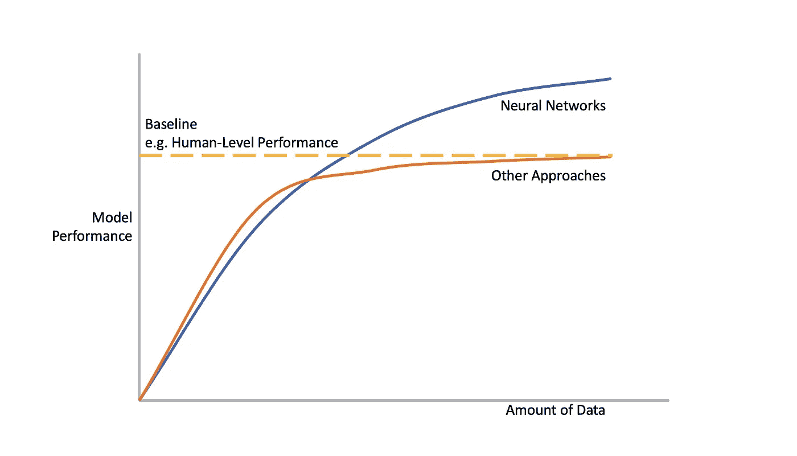
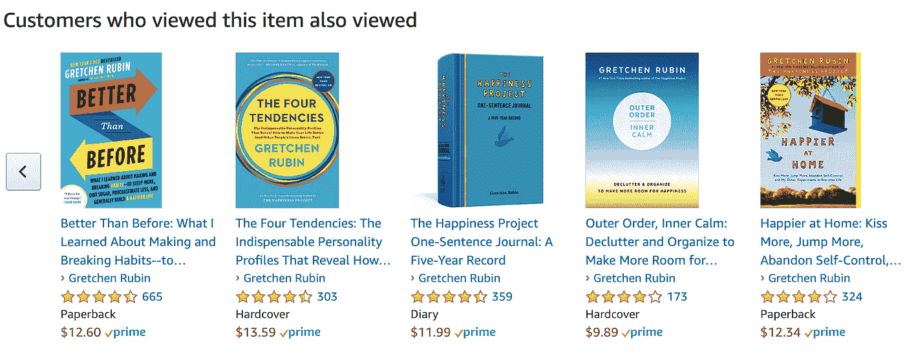

# 设计 ML 产品的用户体验

> 原文：<https://towardsdatascience.com/designing-the-user-experience-of-ml-products-8aef5afb510b?source=collection_archive---------24----------------------->

## 三个原则:期望、错误和信任！

之前，我谈到了管理机器学习(ML)产品的挑战,因为它涉及更多的实验、迭代，因此有更多的不确定性。作为一名项目经理，在决定前进的道路之前，您需要给工程师和数据科学家足够的空间和灵活性来探索。但是你也需要[清晰地定义目标函数](/how-to-manage-machine-learning-products-part-1-386e7011258a?source=---------2------------------)和[鼓励团队尽早并经常进行测试](/how-to-manage-machine-learning-products-part-1-386e7011258a?source=---------2------------------)，这样你就不会迷失方向。

 [## 如何管理机器学习产品—第 1 部分

### 为什么管理机器学习产品这么难？为什么你应该关心？

towardsdatascience.com](/how-to-manage-machine-learning-products-part-1-386e7011258a) 

当你为你的 ML 产品设计用户体验(UX)时，同样的挑战也适用。在过去的几个月里，我一直在与我们的 UX 团队合作，收集客户意见并改进我们产品的 UX。这里是我们学到的三个最重要的教训。

## **设定正确的期望值**

机器学习模型的性能随着它们用更多的数据训练而提高。模特会不断提升自己，这很棒。但这也意味着他们的表现从第一天起就不会完美。

帮助用户理解机器学习产品的本质至关重要。更重要的是，我们需要与用户合作，事先就一套**验收标准**达成一致。只有当机器学习模型符合接受标准时，我们才会推出它们。

在设定验收标准时，您可以查看系统的基准性能或替代/现有解决方案的性能，例如人工或当前软件程序的性能。

有时，你可能有不止一个用户组，他们在利益上有冲突。或者您的用例要求特定区域的零错误。您可能还需要根据您的业务案例，在[精度和](/how-to-manage-machine-learning-products-part-ii-3bdabf91eae4)召回之间做出权衡。

source: Bastiane Huang

对于用户需要模型从发布的第一天起就表现良好的情况。预先训练的模型可能是有用的。但是，即使有了预先训练的模型，边缘情况仍然会发生。您需要与用户一起工作，提出风险缓解计划:如果模型不起作用，备用计划是什么？如果用户想要装载新的项目或添加新的用例，重新训练模型需要多长时间？当不允许模型更新时，用户可以设置封锁期吗？

通过设定正确的用户期望，你不仅可以避免客户失望，还可以让客户高兴。亚马逊的智能音箱 Alexa 就是一个很好的例子。我们对类人机器人有很高的期望:我们希望它们像人类一样说话和行动。因此，当 Pepper 无法与我们进行明智的对话时，我们感到沮丧。相比之下，Alexa 被定位为降低客户期望的智能扬声器。当我们了解到它不仅仅可以演奏音乐时，我们很高兴。

透明度是增进沟通和信任的另一个重要因素。ML 比软件工程更具有概率性。因此，显示每个预测的**置信水平**是设定正确预期的一种方式。这也有助于用户理解算法是如何工作的，从而与用户建立信任。

## **建立信任**

[ML 算法通常缺乏透明度](/how-to-manage-machine-learning-products-part-1-386e7011258a)，就像一个黑匣子，接受输入(例如图像)并输出预测(例如图像中的物体/人是什么/谁)。这就是为什么向用户解释机器学习模型如何建立信任和获得认同至关重要。

如果做不到这一点，就会疏远用户。例如，[优步的司机报告说他们感觉失去了人性，他们质疑算法的公平性](/not-what-you-think-the-future-of-human-machine-relationship-b890d7f2072b)，尤其是当他们在没有明确解释的情况下受到处罚的时候。这些司机觉得应用程序对他们了解很多，但他们对算法如何工作和做出决策却知之甚少。

另一方面，亚马逊的网页告诉我们他们为什么推荐这些书。只是简单的一行解释。但它有助于用户理解算法是如何工作的，因此用户可以更好地信任系统。

[同一个优步司机研究](/not-what-you-think-the-future-of-human-machine-relationship-b890d7f2072b)还发现，司机们觉得他们不断被监视，但他们不知道这些数据将被用于什么目的。除了遵守 [GDPR 或其他数据保护](/how-to-manage-machine-learning-products-part-ii-3bdabf91eae4)法规之外，还要让用户容易知道他们的数据是如何被管理的。

## **优雅地处理错误**

> “…但也有未知的未知——我们不知道我们不知道的……后一类往往是困难的。”——唐纳德·拉姆斯菲尔德

当你在设计系统时，通常很难预测系统会如何出错。这就是为什么用户测试和质量保证对于识别失败状态和边缘情况是极其重要的。在实验室和现场进行广泛的测试有助于最大限度地减少这些错误。

同样重要的是对错误进行分类，并根据它们的严重程度和频率进行处理。存在需要通知用户并要求立即采取措施的致命错误。但是也有一些小错误并不会真正影响系统的整体运行。如果你把每一个小错误都通知给用户，那将会非常具有破坏性。如果不立即解决致命错误，这可能是灾难性的。

您也可以将错误视为用户期望和系统假设之间的意外交互:

**用户错误**一般由系统设计者在用户“误用”系统导致错误时定义。

**系统错误**发生在系统不能提供用户期望的正确答案的时候。它们往往是系统固有的局限性造成的。

当系统按预期工作，但用户察觉到错误时，就会发生上下文错误。这通常是因为我们设计系统的假设是错误的。

例如，如果用户一直拒绝来自某个应用程序的建议，产品团队可能想要看一看并了解原因。例如，应用程序可能会根据用户的信用卡信息错误地假设用户住在亚洲。在这种情况下，也许用户的实际位置数据将是做出这种建议的更好的数据点。

最棘手的错误是未知的未知:系统检测不到的错误。解决这个问题的一个方法是回到数据中，分析不寻常的模式，比如我们刚刚谈到的持续拒绝。

另一种方法是允许用户提供**反馈**:方便用户随时随地提供他们想要的反馈。让用户帮你发现未知的未知。您还可以利用用户反馈来改进您的系统。比如说。Youtube 允许用户告诉系统他们不想看到某些推荐。它还利用这一点来收集更多的数据，使他们的建议更加个性化和准确。

将你的机器学习模型预测框定为**建议**也是管理用户预期的一种方式。你可以给用户选项来选择，而不是命令用户应该做什么。但是请注意，如果您的用户没有足够的信息来做出正确的决定，这就不适用。

我们在之前谈到的许多一般[原则在这里仍然适用。你可以在我之前的文章中找到更多的细节。](/how-to-manage-machine-learning-products-part-ii-3bdabf91eae4)

 [## 如何管理机器学习产品——第二部分

### 最佳实践和我一路走来学到的东西。

towardsdatascience.com](/how-to-manage-machine-learning-products-part-ii-3bdabf91eae4) 

*   很好地定义问题，并尽早和经常地进行测试:如果你听到有人说“让我们构建模型，看看它能做什么”，要小心了。
*   知道什么时候应该或者不应该使用 ML。
*   从第一天开始就考虑你的数据策略。
*   构建 ML 产品是跨学科的。超越 ML 思考。

> C [***想看更多这样的文章就点这里吧！***](https://bastiane.substack.com/)

Bastiane Huang 是 OSARO 的产品经理，OSARO 是一家总部位于旧金山的初创公司，致力于开发软件定义的机器人技术。她曾在亚马逊的 Alexa 小组和哈佛商业评论以及该大学的未来工作倡议中工作。她写关于人工智能、机器人和产品管理的文章。跟着她到这里 。

*本帖已在*[*www.productschool.com*](http://www.productschool.com/?fbclid=IwAR2D6uU6IAZmeNGLtBWs2POMn-pk9i8C7O4u24emInePlGJSyYIvgR7Mhfk)*社区发布。*