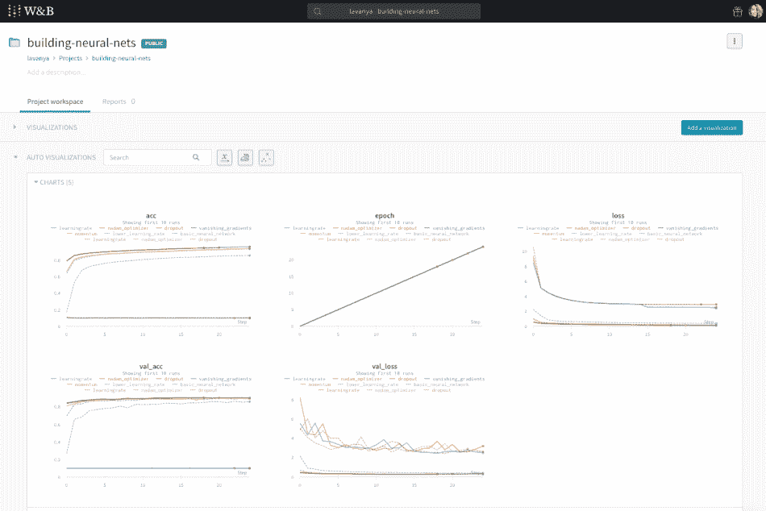
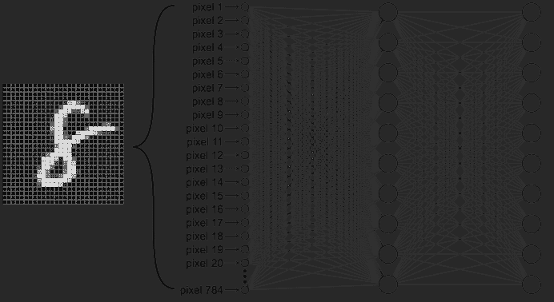
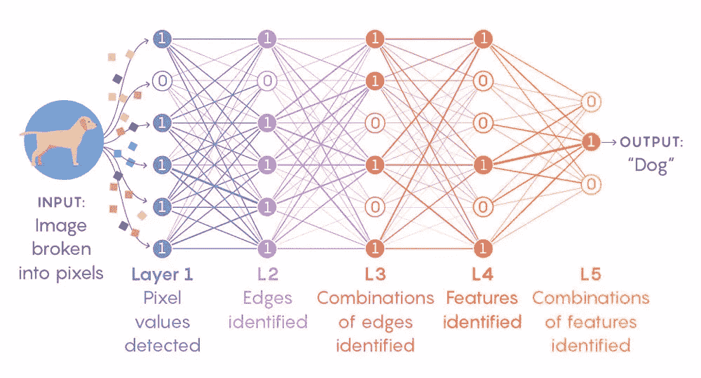
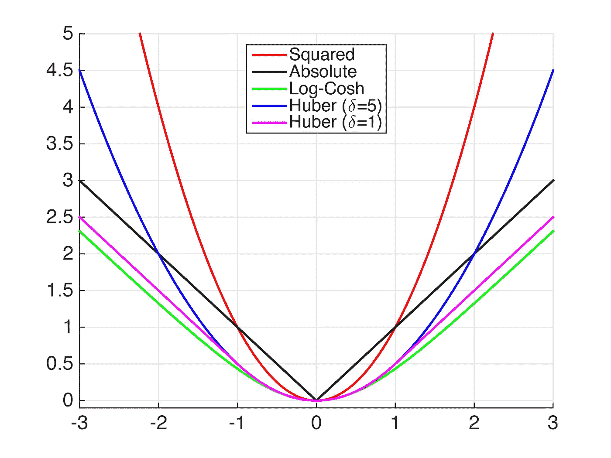
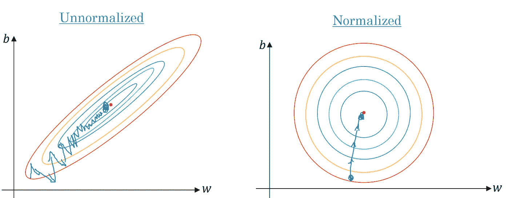
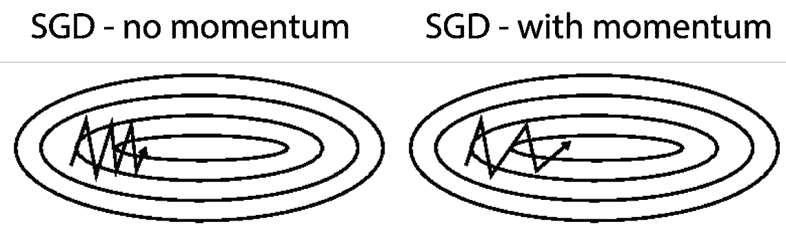
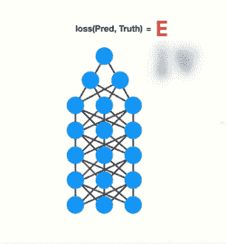
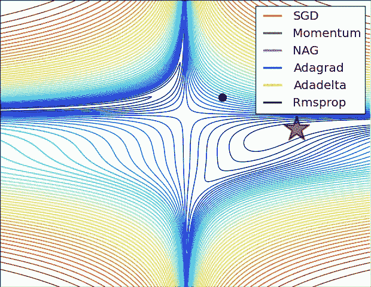
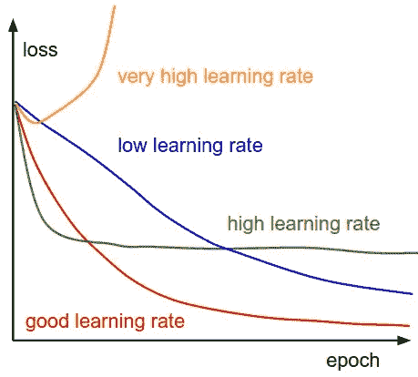

# 设计你的神经网络

> 原文：<https://towardsdatascience.com/designing-your-neural-networks-a5e4617027ed?source=collection_archive---------3----------------------->

# 逐步演练

训练神经网络可能会非常混乱！

什么是好的学习率？你的网络应该有多少隐藏层？退学其实有用吗？为什么你的渐变消失了？

在这篇文章中，我们将揭开神经网络的一些更令人困惑的方面，并帮助你对你的神经网络架构做出明智的决定。

我强烈推荐分叉 [**这个内核**](https://www.kaggle.com/lavanyashukla01/training-a-neural-network-start-here) 并且玩不同的积木来磨练你的直觉。

如果你有任何问题，随时给我发信息。祝你好运！

# 1.基本神经网络结构

## **输入神经元**

*   这是你的神经网络用来进行预测的特征数量。
*   输入向量的每个特征需要一个输入神经元。对于表格数据，这是数据集中相关要素的数量。您需要仔细选择这些特征，并删除任何可能包含无法超出训练集(并导致过度拟合)的模式的特征。对于图像，这是你的图像的尺寸(MNIST 的尺寸是 28*28=784)。

## **输出神经元**

*   这是你想做的预测的数量。
*   **回归:**对于回归任务，可以是一个值(如房价)。对于多变量回归，每个预测值对应一个神经元(例如，对于边界框，可以是 4 个神经元，每个神经元对应边界框的高度、宽度、x 坐标和 y 坐标)。
*   **分类:**对于二元分类(垃圾邮件-非垃圾邮件)，我们对每个肯定类别使用一个输出神经元，其中输出表示肯定类别的概率。用于多类分类(例如，在对象检测中，实例可以被分类为汽车、狗、房子等。)，我们每个类有一个输出神经元，并在输出层使用[**soft max activation**](https://sebastianraschka.com/faq/docs/softmax_regression.html)函数来确保最终概率总和为 1。

## **隐藏层和每个隐藏层的神经元**

*   隐藏层的数量高度依赖于问题和你的神经网络的结构。你实际上是在尝试进入完美的神经网络架构——不要太大，不要太小，刚刚好。
*   一般来说，1-5 个隐藏层可以很好地解决大多数问题。当处理图像或语音数据时，您可能希望您的网络有几十到几百个层，但并非所有层都是完全连接的。对于这些用例，有预先训练好的模型([**【YOLO】**](https://pjreddie.com/media/files/papers/YOLOv3.pdf)、[**【ResNet】**](https://arxiv.org/abs/1512.03385)、[**【VGG】**](https://arxiv.org/abs/1409.1556))，允许你使用它们网络的大部分，在这些网络之上训练你的模型，只学习高阶特征。在这种情况下，您的模型仍然只有几层需要训练。
*   一般来说，对所有隐藏层使用相同数量的神经元就足够了。对于某些数据集，拥有一个较大的第一层并随后拥有较小的层将会带来更好的性能，因为第一层可以学习许多较低级别的要素，这些要素可以输入到后续层中的一些较高级别的要素中。

*   通常，添加更多的层比在每层中添加更多的神经元会获得更大的性能提升。
*   我建议从 1-5 层和 1-100 个神经元开始，慢慢增加更多的层和神经元，直到你开始适应过度。您可以在您的 [**权重和偏差**](http://wandb.com/) 仪表板中跟踪您的损失和准确性，以查看哪个隐藏层+隐藏神经元组合导致最佳损失。
*   选择较小数量的层/神经元时要记住的一点是，如果这个数量太小，您的网络将无法学习数据中的潜在模式，因此是无用的。抵消这一点的方法是从大量的隐藏层+隐藏神经元开始，然后使用放弃和早期停止让神经网络为你缩小自己的规模。同样，我建议尝试一些组合，并在您的 [**权重和偏好**](http://wandb.com/) 仪表板中跟踪性能，以确定针对您的问题的完美网络规模。
*   安德烈·卡帕西还推荐了 [**过度拟合然后正则化的方法**](http://karpathy.github.io/2019/04/25/recipe/)——“首先获得一个足够大的模型，它可以过度拟合(即专注于训练损失)，然后适当地正则化它(放弃一些训练损失，以改善验证损失)。”

## **损失函数**

*   **回归:**均方差是最常见的优化损失函数，除非有大量异常值。在这种情况下，使用平均绝对误差[或**胡贝尔损失**或](https://en.wikipedia.org/wiki/Huber_loss)。
*   **分类:** [**交叉熵**](https://en.wikipedia.org/wiki/Cross_entropy) 在大多数情况下都会很好的为你服务。

## **批量大小**

*   大批量可以很好，因为它们可以利用 GPU 的能力，每次处理更多的训练实例。 [**OpenAI 已经发现**](https://openai.com/blog/science-of-ai/) 更大的批量(对于 [**图像分类**](https://arxiv.org/abs/1807.11205) 和 [**语言建模**](https://arxiv.org/abs/1808.01371) 为数万，对于 [**RL 代理**](https://blog.openai.com/openai-five/) 为数百万)很好地服务于缩放和并行化。
*   然而，小批量也是有道理的。根据 Masters 和 Luschi 的本文 中的 [**所述，通过运行大批量而增加的并行性所获得的优势被较小批量所实现的更高的性能概括和更小的内存占用所抵消。他们表明，增加批量大小会降低提供稳定收敛的学习速率的可接受范围。他们的观点是，事实上，越小越好；并且最佳性能是由 2 到 32 之间的小批量获得的。**](https://arxiv.org/abs/1804.07612)
*   如果您没有大规模操作，我建议您从较低的批量开始，慢慢增加规模，并在您的 [**重量和偏差**](http://wandb.com/) 仪表板中监控性能，以确定最合适的。

## **历元数**

*   我建议从大量的历元开始，并使用早期停止(参见第 4 节)。消失+爆炸梯度)以在表现停止改善时停止训练。

## **缩放您的特征**

*   简要说明:在将所有特征用作神经网络的输入之前，请确保它们具有相似的比例。这确保了更快的收敛。当您的要素具有不同的比例时(例如，以千为单位的工资和以十为单位的经验年数)，成本函数将看起来像左边拉长的碗。这意味着与使用归一化要素(右侧)相比，您的优化算法将需要很长时间来遍历山谷。

# 2.学习率

*   选择学习速度是非常重要的，你要确保你得到这个权利！理想情况下，当你调整网络的其他超参数时，你需要重新调整学习率。
*   要找到最佳学习率，从一个非常低的值(10^-6)开始，然后慢慢乘以一个常数，直到达到一个非常高的值(如 10)。在你的**权重和偏差仪表盘中测量你的模型表现(相对于你的学习率的对数),以确定哪个学习率对你的问题最有效。然后，您可以使用这个最佳学习率来重新训练您的模型。**
*   **最佳学习速率通常是导致模型发散的学习速率的一半。在附带的代码中随意为 learn_rate 设置不同的值，并查看它如何影响模型性能，以发展您对学习率的直觉。**
*   **我还推荐使用莱斯利·史密斯提出的 [**学习率查找器**](https://arxiv.org/abs/1506.01186) 方法。对于大多数梯度优化器(SGD 的大多数变体)来说，这是找到一个好的学习率的极好方法，并且适用于大多数网络架构。**
*   **此外，请参见下面的学习率计划部分。**

# **3.动力**

****

*   **[**梯度下降**](https://hackernoon.com/gradient-descent-aynk-7cbe95a778da) 朝着局部最小值采取微小的、一致的步骤，当梯度很小时，可能需要很长时间才能收敛。另一方面，动量考虑了先前的梯度，并通过更快地越过山谷和避免局部最小值来加速收敛。**
*   **一般来说，你希望你的动量值非常接近 1。对于较小的数据集，0.9 是一个很好的起点，随着数据集变得越来越大，您可能希望逐渐向 1(0.999)靠拢。(设置 nesterov=True 让 momentum 在当前点之前几个步骤考虑成本函数的梯度，这使它稍微更准确和更快。)**

# **4.消失+爆炸渐变**

****

*   **就像人一样，不是所有的神经网络层都以相同的速度学习。因此，当反向投影算法将误差梯度从输出层传播到第一层时，梯度变得越来越小，直到它们到达第一层时几乎可以忽略不计。这意味着第一层的权重在每一步都不会显著更新。**
*   **这就是 [**消失渐变**](/the-vanishing-gradient-problem-69bf08b15484) 的问题。(当某些层的梯度逐渐变大时，会出现类似的爆炸梯度问题，导致一些层的权重相对于其他层发生大规模更新。)**
*   **有几种方法可以抵消消失渐变。现在就让我们来看看它们吧！**

## ****激活功能****

****隐藏层激活** 一般来说，使用不同 [**激活函数**](https://isaacchanghau.github.io/post/activation_functions/) 的性能按此顺序提高(从最低→最高性能):逻辑→ tanh → ReLU →泄漏 ReLU → ELU → SELU。**

**ReLU 是最流行的激活功能，如果你不想调整你的激活功能，ReLU 是一个很好的起点。但是，请记住，与 eLU 的**或葛鲁的**相比，热卢的效果越来越差。******

******如果你更喜欢冒险，你可以尝试以下方法:******

*   ******对抗神经网络过拟合:RReLU******
*   ******减少运行时的延迟:泄漏 ReLU******
*   ******对于大规模训练集:PReLU******
*   ******对于快速推理时间:漏 ReLU******
*   ******如果你的网络不能自我正常化:ELU******
*   ******对于整体鲁棒的激活函数:SELU******

******一如既往，不要害怕尝试一些不同的激活功能，转向您的 [**权重和偏好**](http://wandb.com/) 仪表盘，帮助您选择最适合您的功能！******

****[**这篇**](https://arxiv.org/pdf/1811.03378.pdf) 是一篇优秀的论文，深入比较了神经网络的各种激活函数。****

******输出层激活
回归:**回归问题不需要针对其输出神经元的激活函数，因为我们希望输出呈现任何值。在我们希望 out 值被限制在某个范围内的情况下，我们可以对-1→1 值使用 tanh，对 0→1 值使用逻辑函数。在我们只寻求正输出的情况下，我们可以使用 softplus 激活。****

******分类:**使用 sigmoid 激活函数进行二进制分类，确保输出在 0 和 1 之间。使用 softmax 进行多类分类，以确保输出概率总和为 1。****

## ******权重初始化方法******

*   ****正确的权重初始化方法可以大大加快收敛时间。初始化方法的选择取决于激活函数。一些可以尝试的事情:****
*   ****当使用 ReLU 或漏 RELU 时，使用 [**He 初始化**](https://arxiv.org/pdf/1502.01852.pdf)****
*   ****当使用 SELU 或 ELU 时，使用 [**LeCun 初始化**](http://yann.lecun.com/exdb/publis/pdf/lecun-98b.pdf)****
*   ****当使用 softmax、logistic 或 tanh 时，使用 [**Glorot 初始化**](http://proceedings.mlr.press/v9/glorot10a/glorot10a.pdf)****
*   ****大多数初始化方法都是统一的和正态分布的。****

## ******批次号******

*   ****BatchNorm 只是学习每一层输入的最佳方法和规模。它通过对其输入向量进行零居中和归一化，然后对其进行缩放和移位来实现这一点。它也像一个正则化，这意味着我们不需要辍学或 L2 注册。****
*   ****使用 BatchNorm 可以让我们使用更大的学习速率(这将导致更快的收敛),并通过减少消失梯度问题在大多数神经网络中带来巨大的改进。唯一的缺点是它稍微增加了训练时间，因为每一层都需要额外的计算。****

## ******渐变裁剪******

*   ****减少渐变爆炸的一个很好的方法，尤其是在训练 rnn 的时候，就是在它们超过某个值的时候简单地修剪它们。我建议尝试 clipnorm 而不是 clipvalue，这样可以保持渐变矢量的方向一致。Clipnorm 包含 l2 范数大于某个阈值的任何梯度。****
*   ****尝试几种不同的阈值，找到最适合您的阈值。****

## ******提前停止******

*   ****早期停止让您可以通过训练具有更多隐藏层、隐藏神经元和比您需要的更多时期的模型来体验它，并且当性能连续 n 个时期停止改善时停止训练。它还会为您保存性能最佳的型号。您可以通过在适合您的模型时设置回调并设置 save_best_only=True 来启用提前停止。****

# ****5.拒绝传统社会的人****

*   ****Dropout 是一种奇妙的正则化技术，它为您提供了一个巨大的性能提升(对于最先进的模型来说，性能提升约 2%)，因为该技术实际上非常简单。dropout 所做的只是在每一层、每一步训练中随机关闭一定比例的神经元。这使得网络更加健壮，因为它不能依赖任何特定的输入神经元来进行预测。知识分布在整个网络中。在 2^n 周围(其中 n 是架构中神经元的数量),在训练过程中会生成略微独特的神经网络，并将其集合在一起进行预测。****
*   ****好的辍学率在 0.1 到 0.5 之间；RNNs 为 0.3，CNN 为 0.5。对较大的图层使用较大的速率。增加退出率会减少过度拟合，而降低退出率有助于克服欠拟合。****
*   ****您希望在网络的早期层中试验不同的辍学率值，并检查您的 [**权重和偏差**](http://wandb.com/) 仪表板，以选择表现最佳的一个。您肯定不想在输出图层中使用 dropout。****
*   ****在与 BatchNorm 一起使用 Dropout 之前，请先阅读 [**本文**](https://arxiv.org/abs/1801.05134) 。****
*   ****在这个内核中，我使用了 AlphaDropout，这是一种香草味的 Dropout，通过保留输入的均值和标准差，它与 SELU 激活函数配合得很好。****

# ****6.优化者****

*   ****梯度下降不是唯一的优化游戏！有几种不同的可供选择。 [**这篇文章**](https://isaacchanghau.github.io/post/parameters_update/) 很好地描述了一些你可以选择的优化器。****

********

*   ****我的一般建议是，如果你非常关心收敛的质量，并且时间不是最重要的，那么就使用随机梯度下降。****
*   ****如果您关心收敛时间，接近最佳收敛点就足够了，请尝试 Adam、Nadam、RMSProp 和 Adamax 优化器。您的 [**权重和偏好**](http://wandb.com/) 仪表盘将引导您找到最适合您的优化器！****
*   ****Adam/Nadam 通常是很好的起点，并且往往对糟糕的后期学习和其他非最佳超参数相当宽容。****
*   ****根据安德烈·卡帕西 的说法，在 ConvNets 的情况下，“一个调优的 SGD 几乎总是略胜亚当一筹”。****
*   ****在这个内核中，我从 Nadam 获得了最好的性能，它只是一个常规的带有内斯特罗夫技巧的 adam 优化器，因此比 Adam 收敛得更快。****

# ****7.学习率调度****

********

*   ****我们已经讨论了良好学习率的重要性——我们不希望它太高，以免成本函数在最佳值附近波动并发散。我们也不希望它太低，因为这意味着收敛将需要很长时间。****
*   ****照看学习率可能很困难，因为较高和较低的学习率都有其优势。好消息是我们不必承诺一个学习率！通过学习速率调度，我们可以从较高的速率开始，以更快的速度通过梯度斜坡，并在到达超参数空间中的梯度谷时减慢速度，这需要采取较小的步骤。****
*   ****有许多方法可以安排学习率，包括指数降低学习率，或者使用阶跃函数，或者在性能开始下降时调整学习率，或者使用 1 周期安排。在这个内核中，我将向您展示如何使用 ReduceLROnPlateau 回调函数，在 n 个时期内性能下降时以一个常数因子降低学习率。****
*   ****我强烈建议您也尝试一下 1 周期计划。****
*   ****使用恒定的学习速率，直到你训练完所有其他的超参数。最后实现学习率衰减调度。****
*   ****与大多数事情一样，我建议用不同的调度策略进行一些不同的实验，并使用你的 [**权重和偏好**](http://wandb.com/) 仪表板来挑选出一个最佳模型。****

# ****8.还有几件事****

*   ****尝试 [**EfficientNets**](https://arxiv.org/pdf/1905.11946.pdf) 以最佳方式扩展您的网络。****
*   ****阅读 [**本文**](https://arxiv.org/pdf/1803.09820.pdf) 了解一些额外的学习率、批量大小、动量和重量衰减技术的概述。****
*   ****还有 [**这个**](https://arxiv.org/abs/1803.05407) 上的随机加权平均(SWA)。它表明，可以通过沿 SGD 的轨迹对多个点进行平均，以循环或恒定的学习速率来实现更好的泛化。****
*   ****阅读安德烈·卡帕西的 [**优秀指南**](http://karpathy.github.io/2019/04/25/recipe/) ，让你的神经网络发挥最大效用。****

# ****结果****

****在这篇文章中，我们已经探索了神经网络的许多不同方面！****

****我们已经了解了如何建立一个基本的神经网络(包括选择隐藏层数、隐藏神经元、批量大小等)。)****

****我们已经了解了动量和学习率在影响模型性能中的作用。****

****最后，我们探讨了渐变消失的问题，以及如何使用非饱和激活函数、批处理、更好的权重初始化技术和早期停止来解决这个问题。****

****通过访问您的 [**权重和偏差**](https://app.wandb.ai/home) 仪表盘，您可以在一个图表中比较我们尝试的各种技术的准确性和损失性能。****

****神经网络是强大的野兽，它给你很多杠杆来调整，以获得你试图解决的问题的最佳性能！他们提供的定制的庞大规模甚至会让经验丰富的从业者不知所措。像 [**权重和偏差**](http://wandb.com/) 这样的工具是你在超参数领域导航、尝试不同实验和挑选最强大模型的最好朋友。****

****我希望这本指南能成为你冒险的良好开端。祝你好运！我强烈推荐分叉 [**这个内核**](https://www.kaggle.com/lavanyashukla01/training-a-neural-network-start-here) 并尝试不同的构建模块来磨练你的直觉。****

****如有任何问题或反馈，欢迎随时 [**推特我**](https://twitter.com/lavanyaai) ！****