# 四种主要慢性病和过早死亡

> 原文：<https://towardsdatascience.com/detailed-findings-of-4-groups-of-major-chronic-disease-indicators-53fdeb487155?source=collection_archive---------28----------------------->

## 详细分析人口健康指标、健康的社会决定因素以及对性别和种族的影响


Photo by [CMDR Shane](https://unsplash.com/@cmdrshane?utm_source=medium&utm_medium=referral) on [Unsplash](https://unsplash.com?utm_source=medium&utm_medium=referral)

在我们的 CDC 慢性病指标数据集的第 2 部分中，我们的分析揭示了几个具有高度相关的相互关系的领域——心血管疾病、慢性肾病、糖尿病中的指标，以及总体条件“社会决定因素”类别中的选择指标。虽然在癌症和慢性阻塞性肺病等其他领域也有高度相关的关系，但在最后这篇博文中，我们将主要关注前者。

上一篇文章中的图 1 显示了所有指标之间的关系，而上一篇文章中的表 5 显示了许多顶级相关对。通过按特定主题查看指标的重复出现模式，我们可以缩小感兴趣主题的范围。之前使用的相同代码用于构建以下六幅图中的相关性热图(红色—相关性更高):

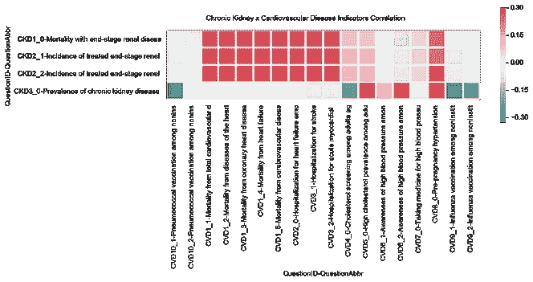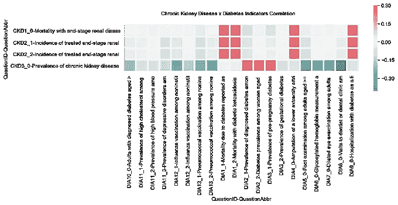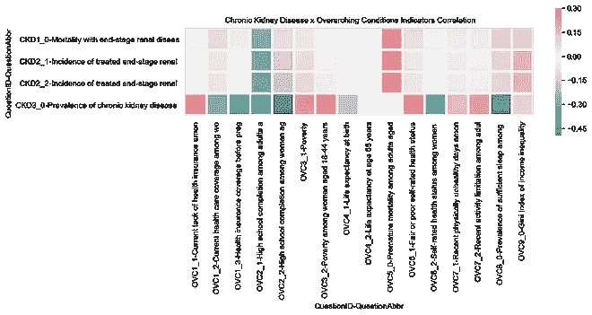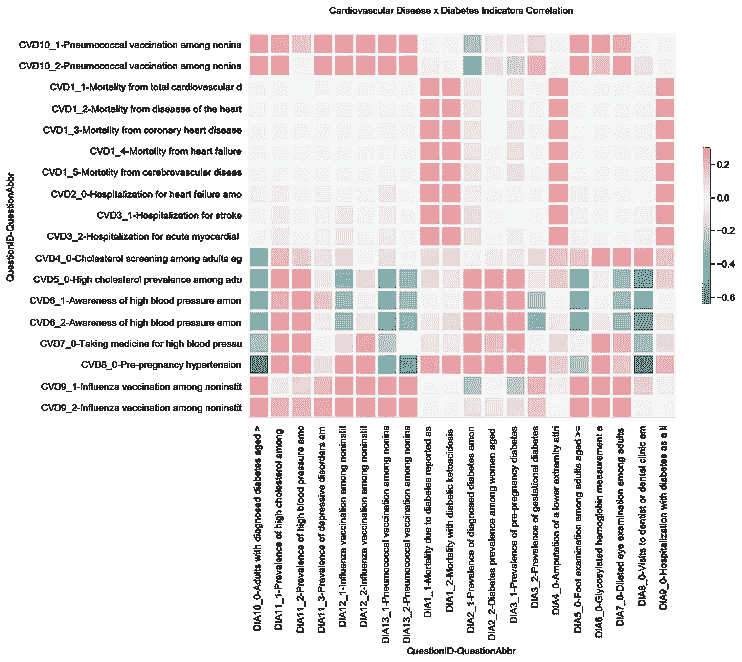

Correlation Heatmap by Topic Pairs (from top left to bottom right): 1) Chronic Kidney (CKD) and Cardiovascular (CVD), 2) CKD and Diabetes (DIA), 3) CKD and Overarching Conditions (OVC), 4) CVD and DIA, 5) CVD and OVC, and 6) DIA and OVC. Red/pink indicates higher positive correlation while green indicates higher negative correlation. See Figures 1 to 6 below for in depth views and descriptions.

下面，我们将一对一对地浏览每个关联热图。在第 6 部分的末尾，将会有一个实际问题和问题 ID (QIDs)的参考。如果这有助于理解主要的具体指标问题，请随意跳过。

**详细调查结果汇总:**

当我们按主题深入到每个高度相关的人群健康慢性病指标时，现在通过代表个体指标的个体问题 ID 对，相互关联的慢性病的主题得到加强。糖尿病、心血管疾病和慢性肾脏疾病之间的共病模式显示在一般指标和一些更具体的指标中。例如，一般指标是宽泛的指标，似乎涵盖了总体情况，如 DIA1_2“作为任何列出的死亡原因报告的糖尿病死亡率”这些具有高度正相关性的高水平指标也必然会导致更离散的死亡率结果，这虽然显而易见，但对个人采取可操作的下一步措施的能力提出了质疑。相反，它意味着实用路线强调预防是人口健康的一个关键方法。

有趣的是，各种总体状况(OVC)指标不断出现，如 ov C5 _ 0“45-64 岁成年人的过早死亡率”我们看到 OVC5_0 与所有前 5 名心血管疾病指标、前 3 名慢性肾病指标和前 4 名糖尿病指标配对。这种关系倾向于说明这三个相关问题的共病和 45-64 岁成年人的过早死亡率。

请看下面两人的发现，或者跳到下面两个部分，我们转而分析性别和种族的分层，以及相应的可视化。

**1。慢性肾脏疾病和心血管疾病**

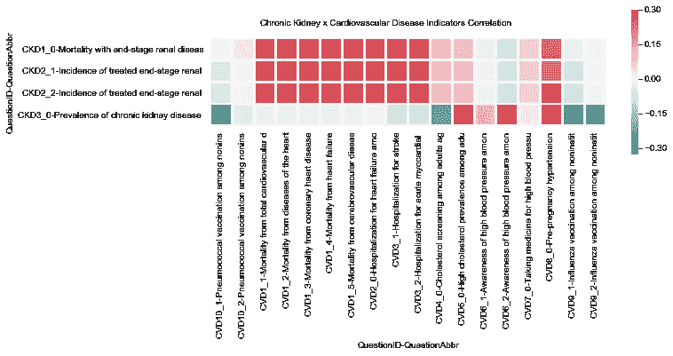

Figure 1\. Correlation Heatmap for Chronic Kidney Disease and Cardiovascular Disease

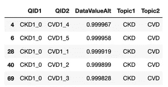

Table 1\. Top Correlation of Chronic Kidney Disease and Cardiovascular Disease, descending

```
top_corr_pair[(top_corr_pair['Topic1'] == ('CKD')) & (top_corr_pair['Topic2'] == ('CVD'))].head()
```

慢性肾病指标 CKD1_0 代表“终末期肾病死亡率”在心血管疾病方面，CVD1_1 至 CVD1_5 分别是“总心血管疾病死亡率”、“心脏病死亡率”、“冠心病死亡率”、“心力衰竭死亡率”和“脑血管疾病(中风)死亡率”。

**2。慢性肾病和糖尿病(CKD x DIA)**

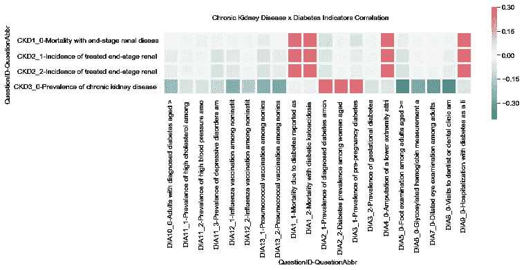

Figure 2\. Correlation Heatmap for Chronic Kidney Disease and Diabetes

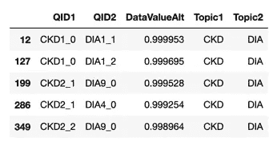

Table 2\. Top Correlation of Chronic Kidney Disease and Diabetes, descending

慢性肾病指标 CKD2_1 和 CKD2_2 分别是“治疗的终末期肾病的发病率”和“归因于糖尿病的治疗的终末期肾病的发病率”。在糖尿病方面，DIA1_1 和 DIA1_2 分别是“作为任何列出的死亡原因报告的糖尿病死亡率”和“作为任何列出的死亡原因报告的糖尿病酮症酸中毒死亡率”。DIA9_0 是“以糖尿病为列明诊断的住院治疗”DIA4_0 是“由于糖尿病导致的下肢截肢”

**3。慢性肾病和总体状况(慢性肾病 x OVC)**

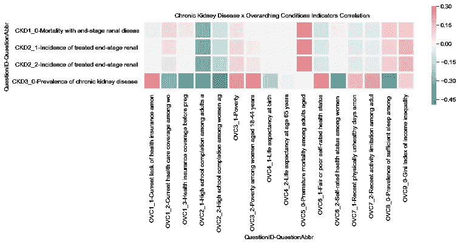

Figure 3\. Correlation Heatmap for Chronic Kidney Disease and Overarching Conditions

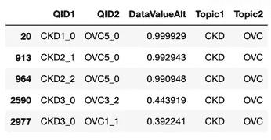

Table 3\. Top Correlation of Chronic Kidney Disease and Overarching Conditions, descending

总体状况指标 OVC5_0 和 OVC6_1 分别是“45-64 岁成年人的过早死亡率”和“18 岁以上成年人的一般或较差自测健康状况”。这些指标与相同的糖尿病指标 DIA1_1、DIA1_2、DIA4_0 和 DIA9_0 高度相关。此外，我们看到 dia 2 _ 1“18-24 岁成年人的高中毕业率”和 OVC6_1 与那些自我评估健康状况一般或较差的人之间存在相对较高的相关性。

**4。心血管疾病和糖尿病**


Figure 4\. Correlation Heatmap for Cardiovascular Disease and Diabetes

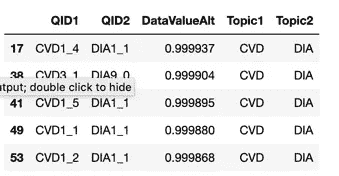

Table 4\. Top Correlation of Cardiovascular Disease and Diabetes, descending

当比较心血管和糖尿病指标时，最相关的指标从 DIA1_1 开始，dia 1 _ 1 是任何糖尿病死亡率的一般问卷，并且在诊断中还包括 DIA9_0 糖尿病住院。相关的心血管指标包括 CVD1_4(心力衰竭)、CVD3_1(住院治疗)、CVD1_5(中风死亡率)、CVD1_1(心血管总死亡率)和 CVD1_2(心脏病死亡率)。

**5。心血管疾病和总体状况(CVD x OVC)**


Figure 5\. Correlation Heatmap for Cardiovascular Disease and Overarching Conditions

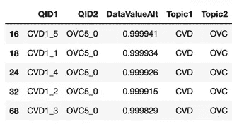

Table 5\. Top Correlation of Cardiovascular Disease and Overarching Conditions, descending

当比较高度相关的心血管疾病和总体状况指标 ov C5 _ 0“45-64 岁成人的过早死亡率”时，最相关的指标属于 CVD1_X 问题 id(qid 1)组，范围从心脏病到中风。

**6。糖尿病和总体状况(直径 x OVC)**

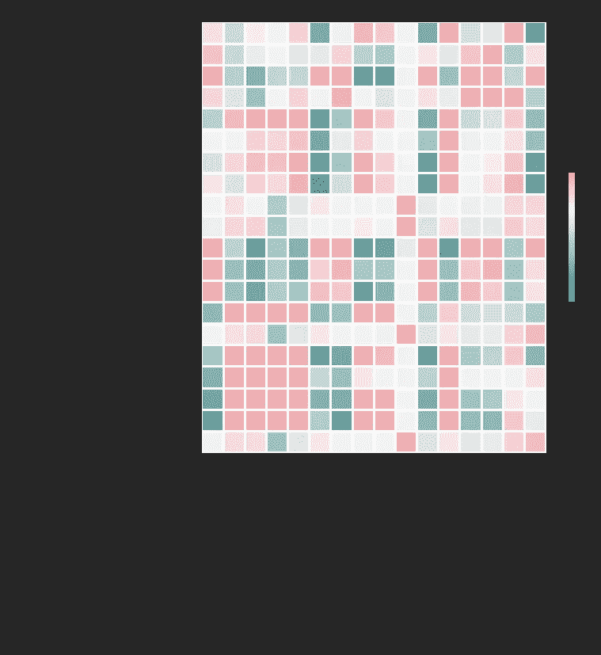

Figure 6\. Correlation Heatmap for Diabetes and Overarching Conditions

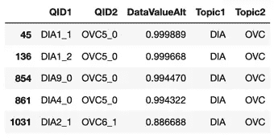

Table 6\. Top Correlation of Diabetes and Overarching Conditions, descending

总体状况指标 OVC5_0 和 OVC6_1 分别是“45-64 岁成年人的过早死亡率”和“18 岁以上成年人的一般或较差自测健康状况”。这些指标与相同的糖尿病指标 DIA1_1、DIA1_2、DIA4_0 和 DIA9_0 高度相关。此外，我们看到 dia 2 _ 1“18-24 岁成年人的高中毕业率”和 OVC6_1 与那些自我评估健康状况一般或较差的人之间存在相对较高的相关性。

**问题标识代码参考**

由于图/表 1 至 6 显示或列出了这些关系，再次查看问题 id(qid 1/qid 2)的相应问题将有助于更好地理解具体指标。在 df_new 数据帧上使用 groupby()方法，然后。loc[]拉出各自的主题，我可以查看一个问题列表和问题。

```
df_new_QTQLY = df_new[['QuestionID','Topic','Question','LocationAbbr','YearStart']].groupby(['Topic','QuestionID','Question']).count()df_new_QTQLY.loc['Cardiovascular Disease']
```

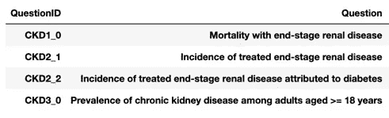

Table 7a. QuestionID for Chronic Kidney Disease Indicators

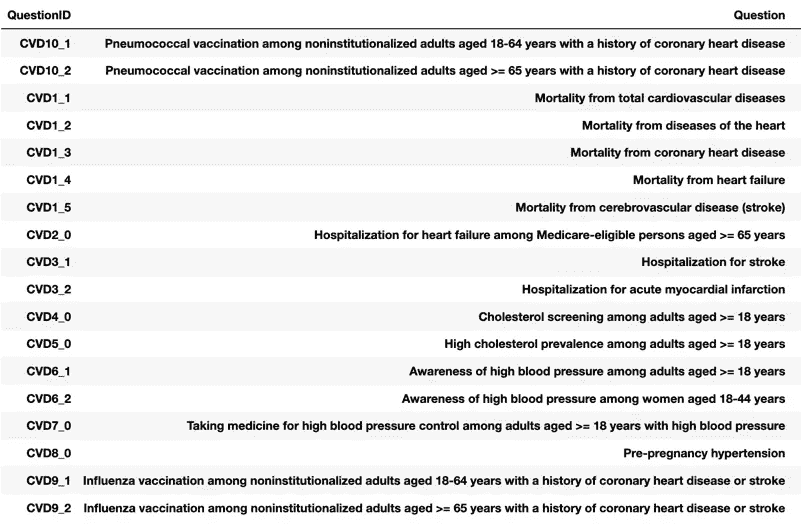

Table 7b. QuestionID for Cardiovascular Disease Indicators

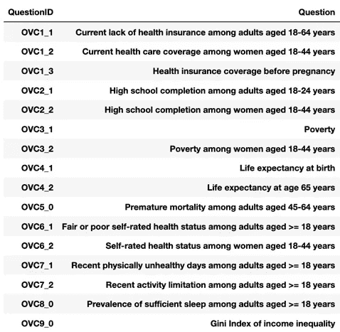

Table 7c. QuestionID for Overarching Condition Indicators

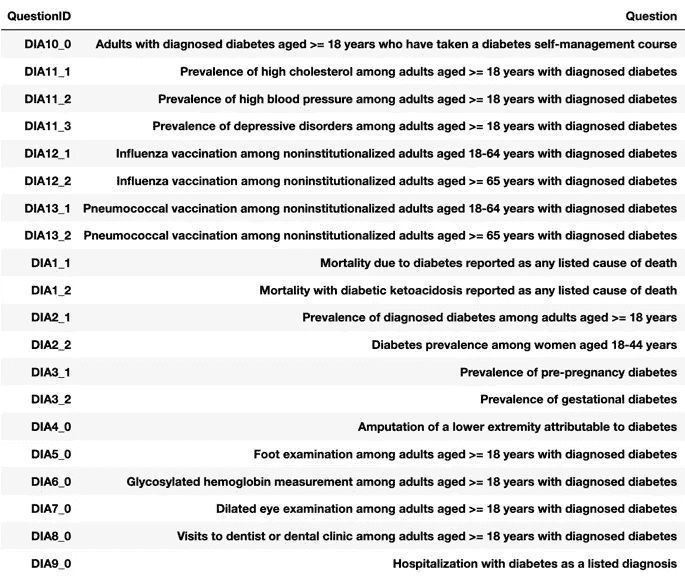

Table 7d. QuestionID for Diabetes Indicators

**成人过早死亡分层分析—性别**

由于 OVC5_0 指标“45-64 岁成年人的过早死亡率”反复出现，让我们通过性别和种族的分层来看看这个指标能告诉我们什么。我们将根据以下参数基于 df_new 创建 df_new_OVC5_0_gender 数据帧:

```
df_new_OVC5_0_gender = df_new[ (df_new['QuestionID'] == 'OVC5_0') & (df_new['StratificationCategory1'] == 'Gender') & 
(df_new['DataValueUnit'] == 'cases per 100,000')]df_new_OVC5_0_gender.info()
```

在上面的数据框架中，df_new['QuestionID'] == 'OVC5_0 '获取与我们的特定指标相关的数据子集。然而，这包括种族和性别的分层。要看性别分层，包括 df _ new[' strategification category 1 ']= ' Gender '。剩余的数据帧在数据值类型中显示为包括“数字”或“年龄调整率”“数字”代表了一个粗略的比率，即“一个社区健康结果的总负担”“年龄调整率”用于在年龄、性别或种族等群体之间进行更公平的比较。(更详细的解释[在这里](https://health.mo.gov/data/mica/CDP_MICA/AARate.html))。似乎当 DataValueType = '年龄调整率，' DataValueUnit = '每 100，000 个案例'时，我包含了 df_new['DataValueUnit'] = '每 100，000 个案例'该计数显示 OVC 主题和分层类别 1 没有像预期的完整数据集那样填充:

```
<class 'pandas.core.frame.DataFrame'>
Int64Index: 1020 entries, 268047 to 403039
Data columns (total 16 columns):
YearStart                    1020 non-null int64
LocationAbbr                 1020 non-null object
Topic                        1020 non-null object
Question                     1020 non-null object
DataValueUnit                1020 non-null object
DataValueType                1020 non-null object
DataValueAlt                 1020 non-null float64
StratificationCategory1      1020 non-null object
Stratification1              1020 non-null object
LocationID                   1020 non-null int64
TopicID                      1020 non-null object
QuestionID                   1020 non-null object
DataValueTypeID              1020 non-null object
StratificationCategoryID1    1020 non-null object
StratificationID1            1020 non-null object
QuestionAbbr                 1020 non-null object
dtypes: float64(1), int64(2), object(13)df_new_OVC5_0_gender.head()
```

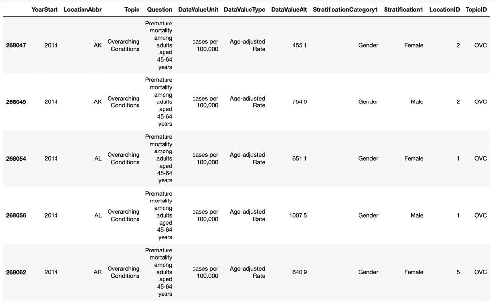

Table 8a. Stratification by Gender Dataframe

使用 groupby 汇总，我们看到可用数据运行了 5 年，而不是整个数据集的整个 15 年。下面还将绘制出趋势图和一个 seaborn 柱状图。

```
df_new_OVC5_0_gender1 = df_new_OVC5_0_gender.groupby(['Stratification1','YearStart'])
df_new_OVC5_0_gender1.mean().drop('LocationID',axis=1).round()plt.figure(figsize=(16, 6))
sns.barplot(x='YearStart',y='DataValueAlt',data=df_new_OVC5_0_gender,hue='Stratification1',ci=None,saturation=0.7)
```

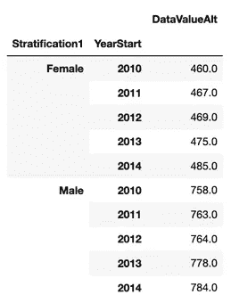

Table 8b. Groupby on the Stratification Gender dataset

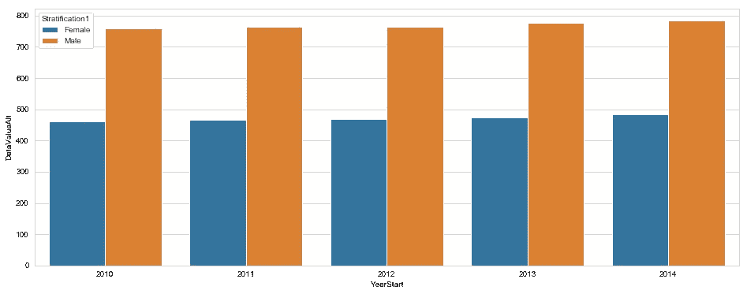

Figure 8\. 2010–2014 Trends on Premature Mortality by Gender, per 100K cases

2010 年至 2014 年期间，数据显示，45-64 岁人口的过早死亡率逐年略有上升。女性人口过早死亡率上升了 5.4%，男性人口过早死亡率上升了 3.4%。纵轴对应于以 100K 为单位的 DataValueAlt。例如，2014 年女性有 48.5 万例(38%)，而同年男性有 78.4 万例(62%)。令人惊讶的是，我预计男性的过早死亡率会比女性增长得更快。

虽然相关对给出了总体情况，但让我们以与相关对相同的方式比较男性和女性人口之间的指标。在最初的 df_new['QuestionID']中，整个数据集中有 201 个唯一的指标。由于我们关注的是年龄调整组，我们的 df_new_gender2['QuestionID']显示有 13 个独特的指标。牢记这一点，以下分析显示了指标的子集。我们将开始为下面的性别和潜在位置分析修改数据帧 df_new_gender，从而删除几个对此没有用的列。

```
df_new_gender2 = df_new_gender.drop(columns=['Question','Topic','DataValueUnit','DataValueType','StratificationCategory1','TopicID','DataValueTypeID','StratificationCategoryID1','StratificationID1','QuestionAbbr'])
df_new_gender2.head()
```

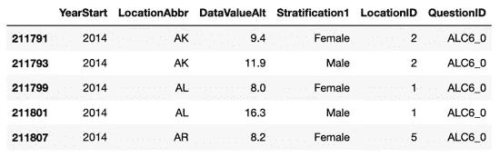

Table 9a. Working Dataframe with Stratification1 (Gender) and Location

为了创建一个表来可视化性别相关对，让我们使用表 9a 并应用 pivot_table 方法。让我们创建一个名为 df_new_gender2_loc_qid 的数据帧，其中行代表每个位置，列代表每个指示器。因为我们想按性别查看数据(分层 1)，所以每个位置需要有一个标签为男性或女性的列。此外，由于我们按位置查看每一行，因此将每个指标的 DataValueAlt 值汇总为平均值是有意义的，因此我们将把参数 aggfunc=np.mean 传入 pivot_table。

创建这个数据透视表时，我遇到了 LocationIDs 或 QuestionIDs 没有数据的问题，导致 NA 值。当这种情况发生时，我们可以通过删除所有具有 NA 值的行和/或列来评估是否只保留具有值的行/列。当我这样做时，产生的数据帧被大大缩减了。相反，通过使用。使用 df_new_gender_loc_qid.mean()使用平均值填充 na()，NA 值将替换为平均值。表 9b 是调整后的数据透视表的前 5 行。

```
df_new_gender2_loc_qid = df_new_gender2.pivot_table(values='DataValueAlt',index=['LocationID','Stratification1'],columns=['QuestionID'],aggfunc=np.mean)
# Create pivot table with rows by Location, columns of each QuestionID, values - DataValueAlt mean by Locationdf_new_gender2_loc_qid.reset_index(level='Stratification1',inplace=True)
df_new_gender2_loc_qid.fillna(df_new_gender2_loc_qid.mean(),inplace=True)
df_new_gender2_loc_qid.head()
```

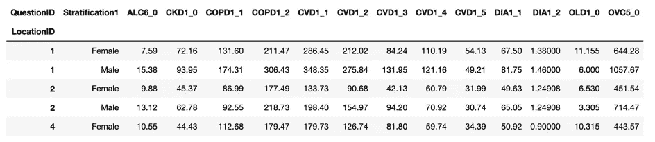

Table 9b. Pivot Table by Location and Gender Across 13 Indicators (QuestionIDs)

使用 df_new_gender2_loc_qid 上的 seaborn pairplot，hue 参数允许我们按性别渲染绘图。类似于来自[第二部分博客](/relationships-validated-between-population-health-chronic-indicators-b69e7a37369a)的[图 1](https://cdn-images-1.medium.com/max/2400/1*Ip5aiJBTRzCrnvGjp-NtCQ.png) ，我们有一个沿着相同 X 和 Y 轴的 13 个指标的图表。我们使用的不是相关性，而是按性别和状态(LocationID)划分的 DataValueAlt 中这 13 个指标的平均值:ALC6_0(酒精:慢性肝病死亡率)、CKD1_0(慢性肾病:终末期肾病死亡率)、2 个慢性阻塞性肺病(COPD)、5 个心血管疾病(CVD)、2 个糖尿病(DIA)、OLD1_0 和 OVC5_0(总体情况:45-64 岁的过早死亡率)。在前面的章节中，OVC5_0 是一个高度相关的指标。

```
sns.pairplot(df_new_gender2_loc_qid,hue='Stratification1',palette='RdBu_r')
```

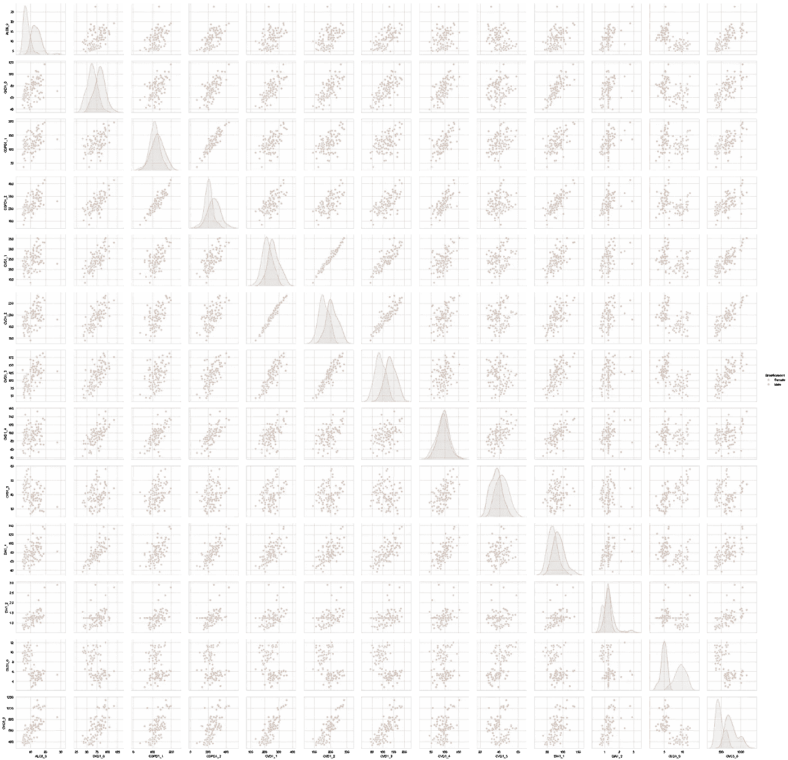

Figure 9\. Pairplot Across 13 Indicators Comparing Gender (Blue — Female, Orange — Male)

如上文图 9 所述，OVC5_0 是 45-64 岁人群的过早死亡率指标。沿着图 9 的底行，配对图通常显示雄性(橙色)和雌性(蓝色)种群之间的明显分布。在几乎所有情况下，当我们沿着底部行比较每个图(OVC5_0 与其他指标)时，我们看到大多数位置的男性人口具有较高的平均数据值 Alt 值，这反映了各州男性人口健康状况普遍较差。

**成人过早死亡分层分析—种族**

与按性别分层相似，按种族分层的分析将使用以下条件过滤数据。我们将基于 OVC5_0 创建一个新的数据框架 df_new_OVC5_0_race，使用“每 100，000 人中的病例数”和“种族/民族”的分层类别 1 基于年龄的患病率

```
df_new_OVC5_0_race = df_new[ (df_new['QuestionID'] == 'OVC5_0') & (df_new['DataValueUnit'] == 'cases per 100,000') &(df_new['StratificationCategory1'] == 'Race/Ethnicity')]df_new_OVC5_0_race1 = df_new_OVC5_0_race.groupby(['Stratification1','YearStart']).mean().round(0)
df_new_OVC5_0_race1
```

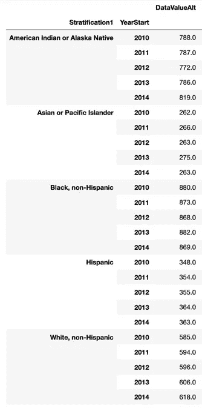

Table 10\. Stratification by Race with Average DataValueAlt Values

此外，我们将使用。groupby()方法根据种族、年份和数据值 Alt 将子集数据帧 df_new_OVC5_0_race 汇总到一个表中。《分层》中的种族类别给了我们 5 个类别:美洲印第安人或阿拉斯加土著人；亚洲人或太平洋岛民；黑人，非西班牙裔；西班牙裔；白人，非西班牙裔。对于 YearStart，我们有 5 年的数据，因为这是可用的分层数据和使用基于年龄的患病率的结果。DataValueAlt 是位置的平均值，四舍五入为整数。例如，2010 年，西班牙裔人口中每 10 万人中有 348 名 45-64 岁的人过早死亡。

为了可视化表 10，seaborn barplot 将显示每个种族分层和 DataValueAlt 的值。条形图的参数包括从 data=df_new_OVC5_0_race 传递 x=YearStart、y=DataValueAlt 和 hue = Stratification1。使用 plt.legend()，我们能够微调图例的渲染位置，我更喜欢使用 bbox_to_anchor 参数的外部绘图。

```
plt.figure(figsize=(16, 7))
sns.barplot(x='YearStart',y='DataValueAlt',data=df_new_OVC5_0_race,hue='Stratification1',ci=None,saturation=0.7)
plt.legend(loc='best',bbox_to_anchor=(0.5, 0,.73, .73))
```

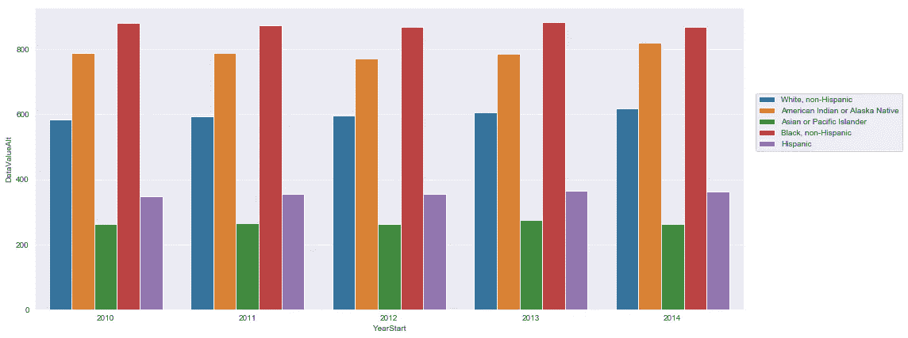

Figure 10\. 2010–2014 Premature Mortality Trends Across Race Stratification

从表 10 和图 10 可以看出，数据显示，过早死亡率逐年略有上升。45-64 岁成年人的过早死亡对“黑人、非西班牙裔”和“美国印第安人或阿拉斯加土著”人口的影响最为严重。另一方面，我们认为“亚洲人或太平洋岛民”和“西班牙人”是最不严重的。相比之下，我们看到“黑人，非西班牙裔”人口的过早死亡率是“西班牙裔”人口的两倍多。

虽然可以假设每一层的过早死亡率之间的相关性，但将描述性因素与因果关系联系起来超出了该数据集的范围。图 10 给出了对影响总体人口的因素的严重性的总体理解，这些因素可能是复杂的和多方面的。

观察种族分层的另一种方式是通过堆积条形图。同样，具有来自 df_new_OVC5_0_race 的相同数据的 pivot_table()是条形图的起点，如表 11 所示。

```
df_new_OVC5_0_race2 = df_new_OVC5_0_race.pivot_table(values='DataValueAlt',index='YearStart',columns='Stratification1').round()
df_new_OVC5_0_race2 
```

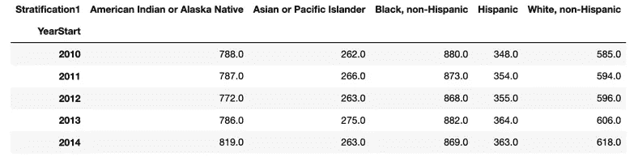

Table 11\. Stratification by Race and Year

基于表 11，我们希望创建累积值的列，而不是每个分层的特定值。我将修改 df_new_OVC5_0_race2，将后续列的值更新为前面列的总和。例如,“亚裔或太平洋岛民”列中的值将是美洲印第安人或阿拉斯加土著人与亚裔或太平洋岛民的总和。对接下来的三列重复此操作。通过删除列以保留新的累积列并重置索引的一些额外调整，新的数据帧 df_new_OVC5_0_race2c 可用于以下柱状图。

```
sns.set_style('darkgrid')
plt.figure(figsize=(8, 8))
sns.barplot(x='YearStart', y='cum_White', data=df_new_OVC5_0_race2c, color='blue',ci=None,saturation=0.7)
sns.barplot(x='YearStart', y='cum_Hispanic', data=df_new_OVC5_0_race2c, color='purple',ci=None,saturation=0.7)
sns.barplot(x='YearStart', y='cum_Black', data=df_new_OVC5_0_race2c, color='red',ci=None,saturation=0.7)
sns.barplot(x='YearStart', y='cum_Asian', data=df_new_OVC5_0_race2c, color='green',ci=None,saturation=0.7)
sns.barplot(x='YearStart', y='cum_AmIndianAK', data=df_new_OVC5_0_race2c, color='orange',ci=None,saturation=0.7)
```

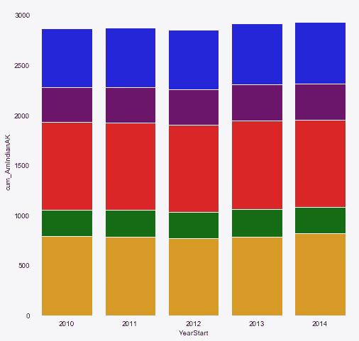

Figure 11\. Stacked Bar Chart of Stratification by Race and Year

由于每个种族分层的年与年之间的变化没有显著的不同，所以条形基本上是相似的。然而，这个柱状图提供了从 2010 年到 2014 年整体过早死亡率增长的另一个视角。该图表还显示了不同种族中过早死亡的比例。色调的颜色使用与图 10 中相同的图例:蓝色(白色，非西班牙裔)、紫色(西班牙裔)、红色(非西班牙裔黑人)、绿色(亚太岛民)和黄色/橙色(美洲印第安人或阿拉斯加土著)。

我希望你喜欢阅读美国疾病预防控制中心的美国慢性指标人群数据集。这就结束了我们的系列。关注我，了解更多数字健康数据科学相关主题。随时提出任何想法或建议！