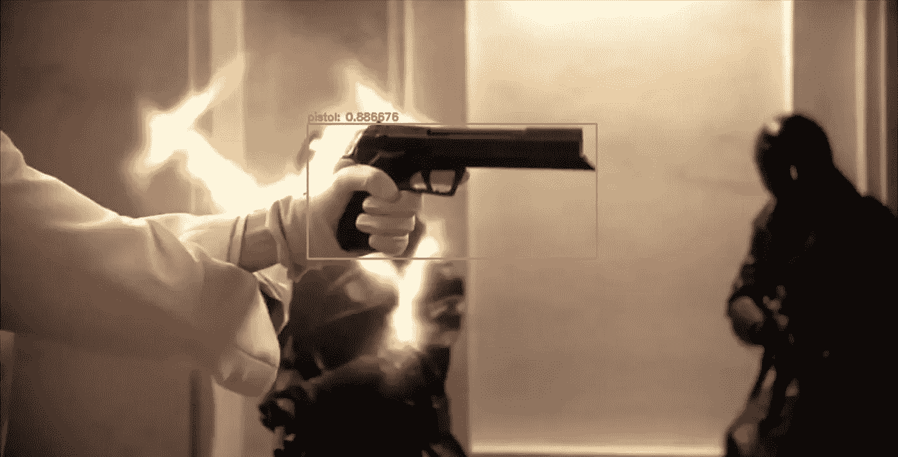
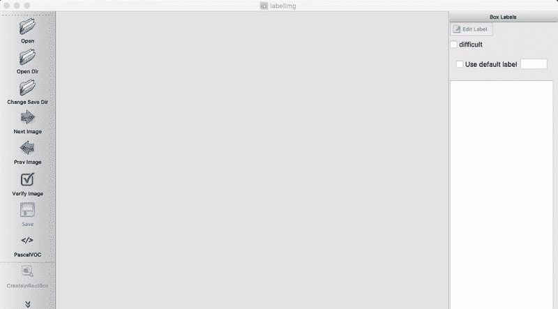
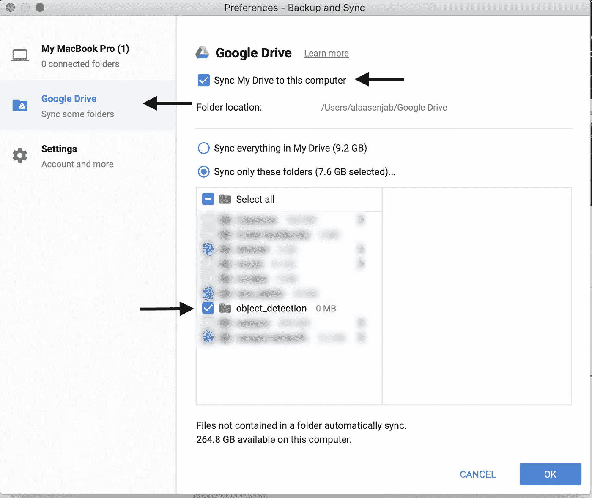
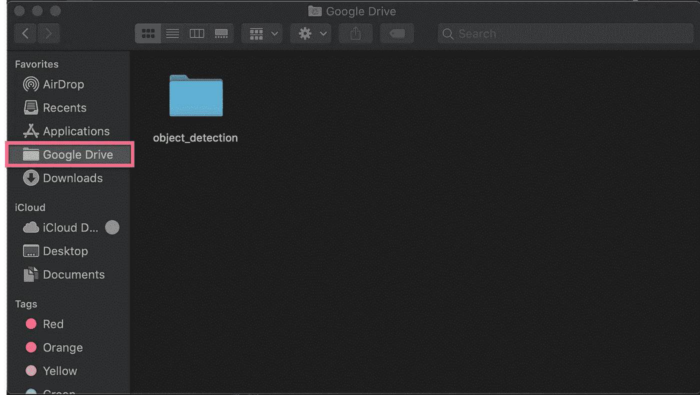
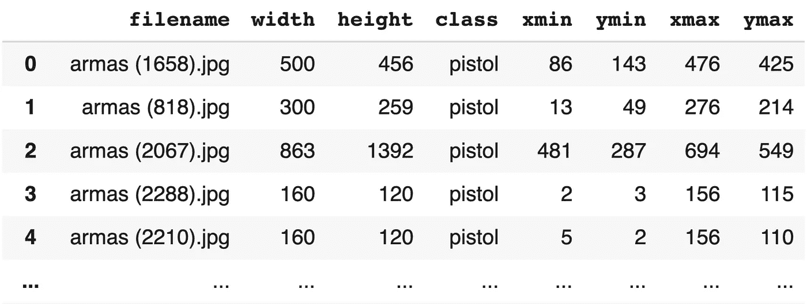
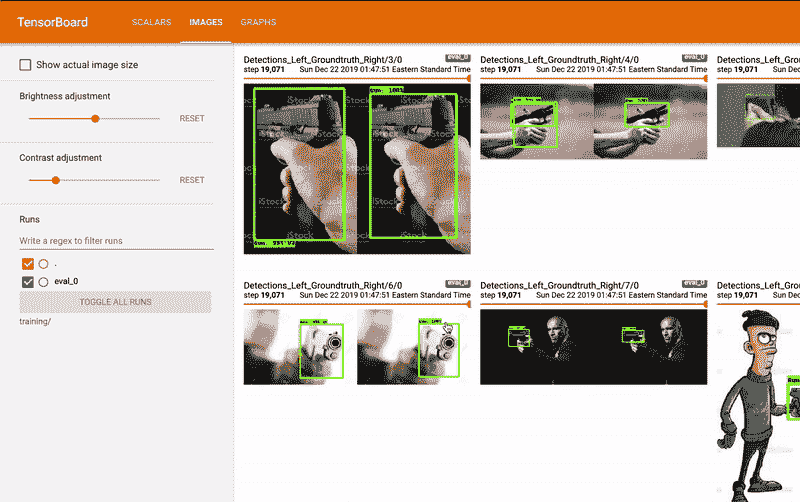

# 一步一步:构建您的自定义实时对象检测器

> 原文：<https://towardsdatascience.com/detailed-tutorial-build-your-custom-real-time-object-detector-5ade1017fd2d?source=collection_archive---------0----------------------->

## 附有详细的笔记本:使用 Tensorflow API、Google Colab 和 GDrive 从现场摄像机中检测枪支。



Model Inference on the [Equilibrium](https://www.google.com/search?sxsrf=ACYBGNQ1tnoKUwuqjnhSn9w4bPdjP-UCSw%3A1577040012760&ei=jLj_Xbz-LY_K_QajzZZQ&q=Equilibrium+2002&oq=Equilibrium+2002&gs_l=psy-ab.3..35i39j0i67l2j0l7.1835.1835..2009...0.2..0.64.64.1......0....1..gws-wiz.......0i71.oHYYez4zbOo&ved=0ahUKEwi89Ibu88nmAhUPZd8KHaOmBQoQ4dUDCAs&uact=5), 2002 [Video Clip](https://www.youtube.com/watch?v=4weEXyoXZKs)

当事故发生时，政策响应时间非常关键。在美国，警察的平均反应时间约为 18 分钟。[](http://1\. https://www.policemag.com/341042/quicker-response-to-active-shooters)
在我的上一个项目中，我试图通过在现场闭路电视摄像机中检测武器来最大限度地缩短警方的反应时间，作为一种一旦检测到枪支就向他们发出警报的方法。这个项目的主要动机是因为美国校园枪击事件越来越多

在本教程中，我们将:

*   使用 Tensorflow 对象检测 API 对自定义图像执行对象检测
*   使用 **Google Colab** 免费的 **GPU** 进行训练，使用 **Google Drive** 保持一切同步。
*   使用本地网络摄像头调整、训练、监控和使用模型进行推理的详细步骤。

如果你想开始探索，我已经创建了这个 [**Colab 笔记本**](https://colab.research.google.com/github/AlaaSenjab/-Tutorial-Tensorflow_Object_Detection_API_On_Custom_Dataset/blob/master/weapon_detection_BL.ipynb) 。它有一些这里没有提到的步骤和注意事项。建议看完这个教程再看*。*

Model Inference on the [Equilibrium](https://www.google.com/search?sxsrf=ACYBGNQ1tnoKUwuqjnhSn9w4bPdjP-UCSw%3A1577040012760&ei=jLj_Xbz-LY_K_QajzZZQ&q=Equilibrium+2002&oq=Equilibrium+2002&gs_l=psy-ab.3..35i39j0i67l2j0l7.1835.1835..2009...0.2..0.64.64.1......0....1..gws-wiz.......0i71.oHYYez4zbOo&ved=0ahUKEwi89Ibu88nmAhUPZd8KHaOmBQoQ4dUDCAs&uact=5), 2002 [Video Clip](https://www.youtube.com/watch?v=4weEXyoXZKs)

我们开始吧，好吗？

## 路线图:

1.[采集图像和标签](#862a)。
2。建立环境。
3。[导入并安装所需的软件包](#7b1a)。
4。[预处理图像和标签](#30ac)。
5。[下载 **Tensorflow** 模型](#ae83)。
6。[生成**TF records**。
7。](#afd3)[选择并下载预先训练好的模型](#d582)。
8。[配置培训管道](#e41c)。
9。[张量板](#78cd)。
10。[训练](#5f34)。
11。[导出训练好的模型](#b948)。
12。[网络摄像头推断](#695b)。

# 1.收集图像和标签。

我会用手枪的照片。[原始数据集](https://sci2s.ugr.es/weapons-detection)由西班牙[格拉纳达](https://www.ugr.es/en/)大学收集并标记。该数据集包含 3000 张不同位置、旋转、背景等的枪支照片。枪也已经贴好标签了(不是最好的)。你可以使用你自己的图片或者我在这里使用的数据集！

## ➊.收集图像:

如果你已经收集了你的图片，那太好了！如果没有，根据你的问题，你可以从手机拍照或从谷歌上搜索图片。

**记住**:垃圾进=垃圾出。选择图片是最重要的部分！
以下是收集图像时可能会有所帮助的一些提示:

1.  每节课至少 50 张图片。越多越好！如果您只检测一个类，甚至可以获得更多。
2.  背景中有随机对象的图像。
3.  各种背景条件；黑暗、明亮、室内/室外等。

收集图片最简单的方法之一就是使用 [**谷歌-图片-下载**](https://github.com/hardikvasa/google-images-download) **。**您也可以使用[下载图片。本](https://www.pyimagesearch.com/2017/12/04/how-to-create-a-deep-learning-dataset-using-google-images/)教程提供了多种从谷歌收集图片的方法。

将您的图像保存在名为`images`的文件夹中

***注意*** *:确保所有图像都是* ***。jpg*** *，如果图像在不同的扩展名中，您可能会在训练时出错。*

## ➋.标记图像:

一旦你收集了你的图片，是时候给它们贴上标签了。有许多工具可以帮助你标记你的图像。也许， [**LabelImg**](https://github.com/tzutalin/labelImg) 是最受欢迎也是最容易使用的。使用 github repo 中的说明，下载并安装到您的本地机器上。

使用**标签**很简单，只要记住:

1.  为标签创建一个新目录，我将其命名为`annotations`
2.  在**标签框**中，点击**更改保存目录**并选择`annotations`文件夹。这是保存标签/注释的位置。
3.  点击**打开目录**并选择图像文件夹。
4.  使用快捷方式可以加快速度。



```
Shortcuts for MacOS:
_____
| CMD + s | Save the label
_
|    w    | Create a box
_
|    d    | Next image
|    a    | Previous image
_
| CMD + + | Zoom in
| CMD + - | Zoom out
_____
```

默认情况下，标签将采用 PascalVOC 格式。每个图像将有一个**。有标签的 xml** 文件。如果一幅图像中有不止一个类或一个标签，那**。xml** 文件将包括它们全部。

# 2.设置环境。

## ➊.设置 Google Colab 笔记本:

1.  创建一个[新的](https://colab.research.google.com/notebook#create=true&language=python3)笔记本。
2.  从左上角菜单:进入**运行时** > **更改运行时类型** >从**硬件加速器中选择 **GPU** 。一些预训练的模型支持 TPU。我们在这个项目中选择的预训练模型只支持 GPU。**
3.  (强烈推荐)将 Google Drive 安装到 Colab 笔记本上:

当训练开始时，将创建检查点、日志和许多其他重要文件。当内核断开连接时，如果这些文件没有保存在你的 Google Drive 或其他地方，它们和其他所有文件都会被删除。在你的电脑睡眠后或使用 Colab GPU 12 小时后，内核会立即断开连接。如果训练的模型没有被保存，则需要从零重新开始训练。我也高度推荐下载谷歌备份和同步应用程序，这样移动和编辑文件就更容易了，也能让一切保持同步。



*   打开你的[谷歌硬盘](https://drive.google.com/)，创建一个名为`object_detection`的文件夹
*   在本地机器上打开谷歌备份和同步应用程序，选择`object_detection`文件夹，

注意:这种方法很大程度上取决于你的网络连接速度。

.

在 Colab 笔记本上，挂载 gdrive 并导航到项目的文件夹，会要求您输入授权代码:

```
from google.colab import drive

drive.mount('/gdrive')# the project's folder
%cd /gdrive/'My Drive'/object_detection
```

## ➋.上传您的图像和标签:

在`object_detection`文件夹中，创建一个包含图像和标签的文件夹`data`。选择以下方法之一上传您的数据。

1.  使用谷歌备份和同步应用程序:



上传`images`和`annotations`文件夹很容易；只需将它们从您的计算机移动到`data/object_detection` 文件夹中。

.

.

2.直接从笔记本上传:

***注*** *:这种方法最慢。*

使用以下内容直接上传到笔记本。你必须压缩`images`文件夹或者单独上传它们(不支持上传文件夹到 Google Colab)。组织和拥有相同的文件结构非常重要。

```
from google.colab import filesuploaded = files.upload()
```

3.直接从来源上传:

您也可以使用`curl`或`wget`直接从信号源下载

**到目前为止的工作目录:**

```
object_detection
             └── data
                   ├── images
                   │      ├── image_1.jpg
                   │      ├── image_2.jpg
                   │      └── ...
                   │
                   └── annotations
                          ├── image_1.xml
                          ├── image_2.xml
                          └── ...
```

**提示**:你可以在 **Google Colab** 笔记本上查看完整的工作目录，方法是:点击左上角的箭头打开左侧面板。或者使用**⌘**/**ctrl**+**alt**+**p** 然后点击左上角菜单中的**文件**。

## ➌.将图像分为训练和测试:

根据数据集的大小，您可能需要手动分割数据。如果你有很多图片，你可能想用这样的东西来随机分割你的数据。

***注意:****`*images*`*里面的图像不需要拆分，只需要* ***。xml*** *文件。**

***此时的工作目录:***

```
*object_detection
             └── data
                   ├── images
                   │      ├── image_1.jpg
                   │      └── ...
                   │
                   ├── annotations
                   │      ├── image_1.xml
                   │      └── ...
                   │
                   ├── train_labels //contains the labels only
                   │      ├── image_1.xml
                   │      └── ...
                   │
                   └── test_labels //contains the labels only 
                          ├── image_50.xml
                          └── ...*
```

# *3.导入和安装所需的软件包。*

## *➊.安装所需的软件包:*

*Google Colab 已经预装了大部分软件包；Python，Tensorflow，熊猫等。*

*这些是我们需要的软件包，默认情况下不会预装。通过运行以下命令来安装它们:*

```
*!apt-get install -qq protobuf-compiler python-pil python-lxml python-tk!pip install -qq Cython contextlib2 pillow lxml matplotlib pycocotools*
```

## *➋.导入库:*

*其他导入将在以后需要时完成。*

*我们需要 Tensorflow 版本 1.15.0。通过运行以下命令检查 Tensorflow 版本:*

```
*print(tf.__version__)*
```

# *4.预处理图像和标签。*

*我们需要为创建两个 **csv** 文件。 **xml** 文件中的每一个`train_labels/`和`test_labels/`*

**

*这两个 **csv** 文件将包含每个图像的文件名、标签/盒子位置等。此外，如果同一张图片有多个类别或标签，则会为其创建多个行。*

*除了 **CSV** s，我们还需要创建一个 **pbtxt** 文件来包含每个类的标签映射。这个文件将通过定义类名到类 ID 号的映射来告诉模型每个对象是什么。*

*您不必手动执行这些操作，下面的操作会将 **xml** 文件转换成两个 **csv** 文件，并创建`.pbtxt`文件。只要确保:*

*   *匹配 **xml** 所在的相同文件夹的名称:`train_labels/`和`test_labels/`(或者更改为下面的代码)*
*   *当前目录是`object_detection/data/`*
*   *图像在**。jpg** 格式*

***此时的工作目录:***

```
*object_detection/
             └── data/
                   ├── images/
                   │      └── ...
                   ├── annotations/
                   │      └── ...
                   ├── train_labels/
                   │      └── ...
                   ├── test_labels/
                   │    └── ...
                   │
                   ├── label_map.pbtxt
                   │
                   ├── test_labels.csv
                   │
                   └── train_labels.csv*
```

# *5.正在下载张量流模型。*

*Tensorflow 模型包含了我们感兴趣的对象检测 API。我们会从[官方回购](https://github.com/tensorflow/models)中得到。*

*   *导航到`object_detection/`目录，然后:*

```
*# downloads the models
!git clone --q [https://github.com/tensorflow/models.git](https://github.com/tensorflow/models.git)*
```

*接下来，我们需要编译 proto buffers——理解这个项目并不重要，但是你可以在这里了解更多。此外，PATH var 应该添加以下目录:`models/research/`和`models/research/slim/`*

*   *导航至`object_detection/models/research/`目录，然后:*

```
*# compils the proto buffers
!protoc object_detection/protos/*.proto --python_out=.# exports PYTHONPATH environment var with research and slim paths
os.environ['PYTHONPATH'] += ':./:./slim/'*
```

*最后，运行一个快速测试来确认模型构建器工作正常:*

```
*# testing the model builder
!python3 object_detection/builders/model_builder_test.py*
```

*如果你在测试结束时看到一个`OK`，那么一切都很好！*

# *6.正在生成 TFRecords。*

*Tensorflow 接受数据作为 TFRecords `data.record`。TFRecord 是一个二进制文件，运行速度快，内存使用率低。它在一个文件中包含所有的图像和标签。点击阅读更多相关信息[。](https://www.skcript.com/svr/why-every-tensorflow-developer-should-know-about-tfrecord/)*

*在我们的例子中，我们将有两个 TFRecords 一个用于测试，另一个用于培训。要做到这一点，我们需要确保:*

*   *匹配 **CSV** s 文件名:`train_labels.csv`和`test_labels.csv`(或者在下面的代码中更改)*
*   *当前目录是`object_detection/models/research`*
*   *通过改变`row_label`变量，在下面的函数`class_text_to_int`中添加您的自定义对象文本(这是将出现在被检测对象上的文本)。如果有多个对象，请添加更多标签。*
*   *检查到`data/`目录的路径是否与下面的`data_base_url`相同。*

# *7.选择和下载预先训练的模型。*

## *➊.选择预先训练的模型:*

*预训练模型仅仅意味着它已经在另一个数据集上被训练过。这个模型已经看到了成千上万的图像和物体。
[COCO](http://cocodataset.org/#home) (上下文中的常见对象)是一个包含 33 万幅图像的数据集，其中包含 80 个不同类别的 150 万个对象。比如，狗，猫，车，香蕉，…在这里勾选所有类别[。](https://gist.github.com/AruniRC/7b3dadd004da04c80198557db5da4bda)*

*从头开始训练一个模型是极其耗时的；完成训练可能需要几天或几周的时间。一个预先训练好的模型已经看到了大量的物体，并且知道如何对它们进行分类。所以，为什么不直接用它呢！*

*因为我们的兴趣是干扰实时视频，我们将选择一个具有低 **ms** 推理速度和相对高**地图**的模型。*

*本项目使用的型号为 **ssd_mobilenet_v2_coco** 。从[到**此处**到](https://github.com/tensorflow/models/blob/master/research/object_detection/g3doc/detection_model_zoo.md#coco-trained-models)查看其他型号。你可以使用任何你喜欢的预先训练的模型，但我建议先用**SSD’**single shot detector’模型进行实验，因为它们在实时视频 [⁴](http://4\. https://towardsdatascience.com/review-ssd-single-shot-detector-object-detection-851a94607d11) 上的表现比任何类型的 RCNN 都要快。*

*解释对象检测技术之间的区别超出了本教程的范围。你可以从[这篇](https://heartbeat.fritz.ai/a-2019-guide-to-object-detection-9509987954c3)博客文章中读到更多关于它们的信息，或者从[这里](https://heartbeat.fritz.ai/a-2019-guide-to-object-detection-9509987954c3)了解它们的速度和准确性。*

*让我们从选择一个预训练模型开始:*

*我们将下载选定的模型。我创建了这两个模型配置来使它更容易。这里选择的是 **ssd_mobilenet_v2** ，如果你愿意的话，可以稍后尝试使用**faster _ rcnn _ inception _ v2****。只需改变上面的`selected_model`。***

## ***➋.下载预训练模型:***

*   ***导航至`models/research/`***
*   ***`DEST_DIR`是下载模型的地方。如果您有不同的工作目录，请更改它。***

***在训练时，默认情况下，模型会每 600 秒自动保存一次。日志和图形，如**图**、**损失**和 **AR、**也会不断保存。让我们为它们创建一个文件夹，以便在培训期间保存:***

*   ***在`object_detection/model/research/`里面创建一个名为`training`的文件夹***

*****此时的工作目录:*****

```
***object_detection/
           ├── data/
           │    ├── images/
           │    │      └── ...
           │    ├── annotations/
           │    │      └── ...
           │    ├── train_labels/
           │    │      └── ...
           │    ├── test_labels/
           │    │      └── ...
           │    ├── label_map.pbtxt
           │    ├── test_labels.csv
           │    ├── train_labels.csv
           │    ├── test_labels.records
           │    └── train_labels.records
           │
           └── models/           
                ├── research/
                │      ├── training/
                │      │      └── ...
                │      ├── pretrained_model/

                │      ├── frozen_inference_graph.pb
                │      └── ...
                └── ...***
```

# ***8.配置培训渠道。***

***这是开始训练模型前的最后一步，终于！也许，在这一步，您可能会花一些时间来调整模型。***

***我们下载的 Tensorflow 对象检测 API 模型附带了许多示例配置文件。对于每个型号，都有一个“几乎”可以使用的配置文件。***

***配置文件位于以下位置:***

```
***object_detection/models/research/object_detection/samples/configs/***
```

*****SSD _ mobilenet _ v2 _ coco . config**是我们正在使用的预训练模型的配置文件。**T22 如果你选择了另一个型号，你需要使用&编辑相应的配置文件。*****

***因为我们可能必须不断地调整配置，所以我建议执行以下操作:***

*   ***通过运行以下命令查看示例配置文件的内容:***

*   ***复制配置文件的内容***
*   ***使用以下命令编辑它***

***或者，如果您使用任何文本编辑器同步了所有内容，您可以直接从本地机器打开并编辑配置文件。***

***以下是示例配置文件中需要更改的必要编辑，以及一些用于提高模型性能的建议编辑。***

***➊ **需要对配置文件进行的编辑:*****

1.  *****型号{}** > **ssd {}** :把`num_classes`改成你拥有的班级数。***

***2. **train_config {}** :将`fine_tune_checkpoint`改为检查点文件路径。***

*****注**:确切的文件名`model.ckpt`不存在。这是模型在训练期间将被保存的地方。这是它的相对路径:***

```
***/object_detection/models/research/pretrained_model/model.ckpt***
```

***3. **train_input_reader {}** :设置`train_labels.record`和标签映射`pbtxt`文件的路径。***

***4. **eval_input_reader {}:** 设置`test_labels.record`和标签映射`pbtxt`文件的路径。***

***就是这样！您可以跳过可选的编辑，直接参加培训！***

***➋ **。建议** **编辑配置文件:*****

***首先，您可能想开始训练模型，看看它做得有多好。如果你过拟合，那么你可能想做一些更多的图像放大。***

*   ***在示例配置文件中:默认添加`random_horizontal_flip` & `ssd_random_crop`。您也可以尝试添加以下内容:***

***来自**列车配置{}:*****

******注意*** *:每一次图像放大都会大幅增加训练时间。****

***您可以添加许多数据扩充选项。从官方代码[点击](https://github.com/tensorflow/models/blob/master/research/object_detection/protos/preprocessor.proto)查看完整列表。***

*   ***在**模型{ }>SSD { }>box _ predictor { }:**设置`use_dropout`为`true`这将有助于对抗过拟合。***
*   ***在 **eval_config : {}** 设置`num_examples`中的**测试**图像的数量，并移除`max_eval`以无限期评估***

******注*** *:提供的笔记本解释了更多关于调整配置文件的内容。* [*检查一下*](https://colab.research.google.com/github/AlaaSenjab/-Tutorial-Tensorflow_Object_Detection_API_On_Custom_Dataset/blob/master/weapon_detection_BL.ipynb) *！****

*****完整的工作目录:** (包括后面会创建和使用的一些文件/文件夹)***

```
***object_detection/
      ├── data/
      │    ├── images/
      │    │      └── ...
      │    ├── annotations/
      │    │      └── ...
      │    ├── train_labels/
      │    │      └── ...
      │    ├── test_labels/
      │    │      └── ...
      │    ├── label_map.pbtxt
      │    ├── test_labels.csv
      │    ├── train_labels.csv
      │    ├── test_labels.records
      │    └── train_labels.records
      │
      └── models/           
           ├─ research/
           │    ├── fine_tuned_model/
           │    │      ├── frozen_inference_graph.pb
           │    │      └── ...
           │    │         
           │    ├── pretrained_model/
           │    │      ├── frozen_inference_graph.pb
           │    │      └── ...
           │    │         
           │    ├── object_detection/
           │    │      ├── utils/
           │    │      ├── samples/
           │    │      │     ├── configs/             
           │    │      │     │     ├── ssd_mobilenet_v2_coco.config
           │    │      │     │     ├── rfcn_resnet101_pets.config
           │    │      │     │     └── ... 
           │    │      │     └── ...                                
           │    │      ├── export_inference_graph.py
           │    │      ├── model_main.py
           │    │      └── ...
           │    │         
           │    ├── training/
           │    │      ├── events.out.tfevents.xxxxx
           │    │      └── ...               
           │    └── ...
           └── ...***
```

# ***9.张量板。***

***Tensorboard 是我们可以想象训练中发生的一切的地方。您可以监控`loss`、`mAP`、`AR`等等。***

******

***你也可以在训练中监控图片和注释。在每一次评估`step`中，你可以看到你的模型在探测物体方面有多好。
**注意**:还记得我们上面设置`num_visualizations: 20`的时候吗？Tensorboard 将在这里显示大量测试图像的图片。***

***要在 Colab 上使用 Tensorboard，我们需要通过 [ngrok](https://ngrok.com/) 来使用。通过运行以下命令获得:***

***接下来，我们指定日志文件的存储位置，并配置一个链接来查看 Tensorboard:***

***当您运行上面的代码时，在输出的最后会有一个 url，您可以通过它访问 Tensorboard。***

*****注意事项**:***

1.  ***运行上述代码时，您可能不会得到 url，而是得到一个错误。只需再次运行上面的单元格。不需要重新安装 ngrok。***
2.  ***在训练开始之前，Tensorboard 不会记录任何文件。***
3.  ***使用 ngrok 时，每分钟最多允许 20 个连接，当模型正在登录时，您将无法访问 tensorboard。(经常发生)***

***如果您将项目同步到本地机器，您将能够不受任何限制地查看 Tensorboard。***

***转到本地机器上的**终端**并运行:***

```
***$ pip install tensorboard***
```

***运行它并指定日志目录的位置:***

```
***# in my case, the path to the training folder is:
tensorboard --logdir=/Users/alaasenjab/Google\ Drive/object_detection/models/research/training***
```

# ***10.训练…终于！***

***训练模型就像运行下面的代码一样简单。我们只需要给它:***

*   ***运行培训流程的***
*   *****管道 _ 配置 _ 路径**=路径/至/配置/文件/模型.配置***
*   *****型号 _ 目录** =路径/至/培训/***

*****注意事项**:***

1.  ***如果内核死亡，训练将从最后一个检查点恢复。除非你没有把`training/`目录保存在某个地方，比如:GDrive。***
2.  ***如果您正在更改以下路径，请确保等号`=`和路径之间没有空格。***

***现在退后，在 Tensorboard 上观看你的火车模型。***

# ***11.导出训练好的模型。***

***默认情况下，该模型将每 600 秒保存一个检查点，同时训练多达 5 个检查点。然后，随着新文件的创建，旧文件将被删除。***

***通过运行以下代码，我们可以找到最后一个定型的模型:***

***然后通过执行`export_inference_graph.py`将模型转换成一个冻结的模型`frozen_inference_graph.pb`，我们可以用它来进行推理。这个冰冻的模型不能用来恢复训练。然而，`saved_model.pb`也被导出，它可以用来恢复训练，因为它拥有所有的权重。***

*   *****管道 _ 配置 _ 路径**=路径/至/配置/文件/模型.配置***
*   *****输出目录** =保存模型的位置***
*   *****trained _ check point _ prefix**=路径/到/a/检查点***

***您可以从该目录访问所有导出的文件:***

```
***/gdrive/My Drive/object_detection/models/research/pretrained_model/***
```

***或者，你可以直接从 Google Colab 下载推理所需的冻结图:***

```
***#downloads the frozen model that is needed for inference
# output_directory = 'fine_tuned_model' dir specified above.files.download(output_directory + '/frozen_inference_graph.pb')***
```

***我们还需要标签图`.pbtxt`文件:***

```
***#downlaod the label map
# we specified 'data_base_url' above. It directs to
# 'object_detection/data/' folder.files.download(data_base_url + '/label_map.pbtxt')***
```

# ***12。网络摄像头推断。***

***要在本地机器上使用您的网络摄像头来推断型号，您需要安装以下软件:***

```
***Tensorflow = 1.15.0
cv2 = 4.1.2***
```

***您还需要在本地机器上下载 Tensorflow 模型(上面的步骤 5 ),或者如果您在本地机器上同步了 GDrive，您可以跳过这一步并导航到模型。***

*   ***转到本地机器上的终端并导航到`models/research/object_detection`***

***在我的例子中，我导航到 GDrive 中的文件夹。***

```
***$ cd /Users/alaasenjab/Google\ Drive/object_detection/models/research/object_detection***
```

***您可以从 jupyter 笔记本或通过创建一个`.py`文件来运行以下内容。但是，更改`PATH_TO_FROZEN_GRAPH`、`PATH_TO_LABEL_MAP`和`NUM_CLASSES`***

***运行代码微笑:)***

# ***结论:***

***从图像和视频中检测物体比实时检测要简单一些。当我们有一个视频或图像，我们想从其中检测对象时，我们不太关心模型检测对象可能需要的推理时间。在实时对象检测中，我们可能希望牺牲一些精度来获得更快的推理时间。
在检测枪支以通知警方的情况下，我们并不太关心检测枪支的确切位置。相反，我们可能会对这两种情况进行优化:
**假阴性:**当有枪时没有检测到枪。
**真否定:**没有枪的时候检测到枪。***

***我希望你觉得这篇关于如何使用 Tensorflow 检测自定义对象的教程简单而有用。别忘了查看 [Colab 笔记本](https://colab.research.google.com/github/AlaaSenjab/-Tutorial-Tensorflow_Object_Detection_API_On_Custom_Dataset/blob/master/weapon_detection_BL.ipynb)了解更多详情。***

***如果你有任何问题，请告诉我，我会尽力帮助你的！***

## ***资源:***

****⋆ Tensorflow 对象检测 API。by:*[*tensor flow*](https://github.com/tensorflow/models/tree/master/research/object_detection)*。*
*⋆的灵感来自:免费火车物体检测。由:* [*程维*](https://www.dlology.com/blog/how-to-train-an-object-detection-model-easy-for-free/) *。
⋆浣熊探测器数据集。by:*[*Dat Tran*](https://github.com/datitran/raccoon_dataset)*。
⋆使用 Colab 训练 Yolov3。作者:* [*大卫·伊瓦涅斯*](http://blog.ibanyez.info/blogs/coding/20190410-run-a-google-colab-notebook-to-train-yolov3-using-darknet-in/) *。****