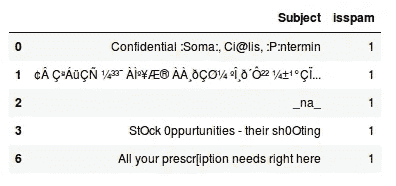
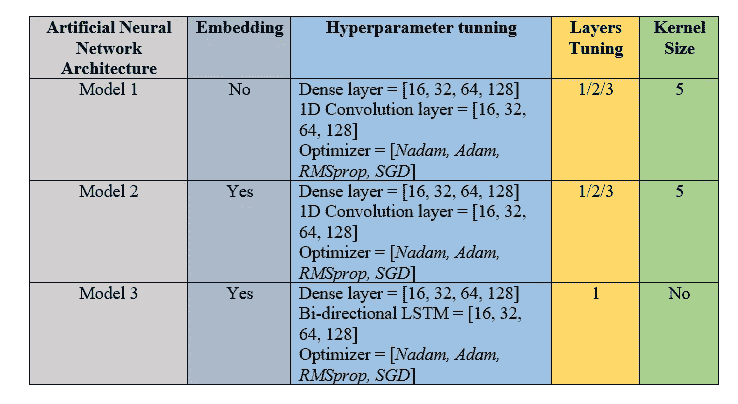
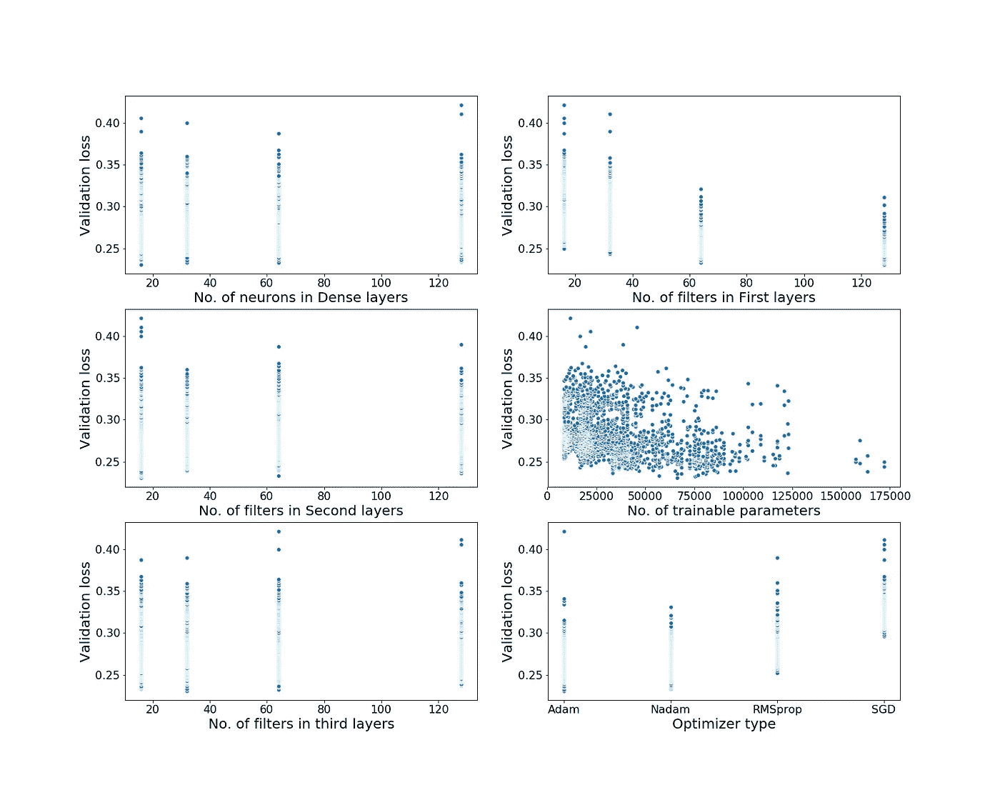
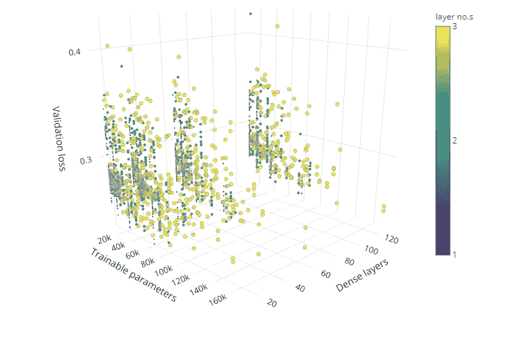
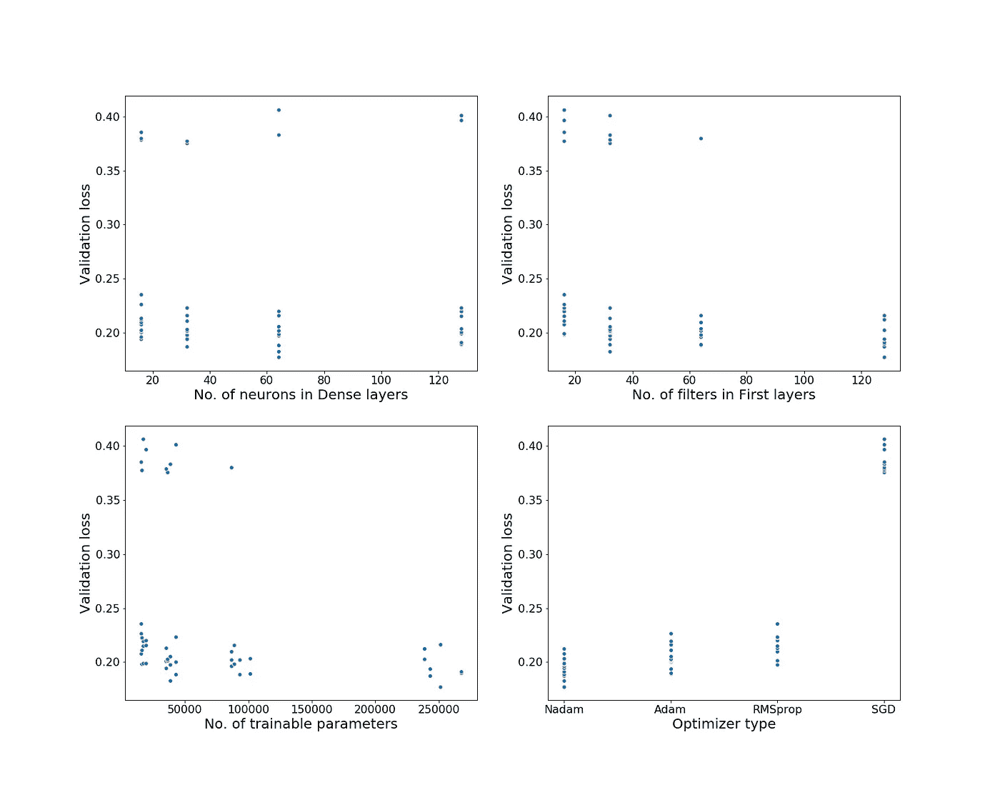
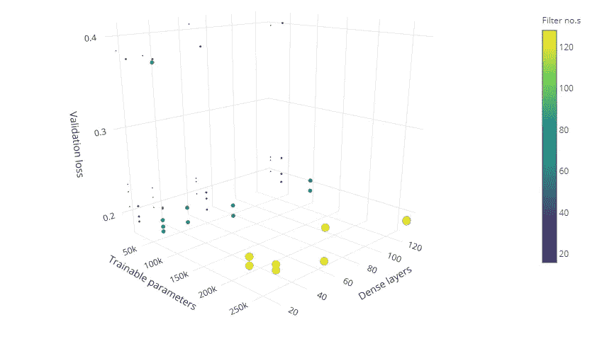
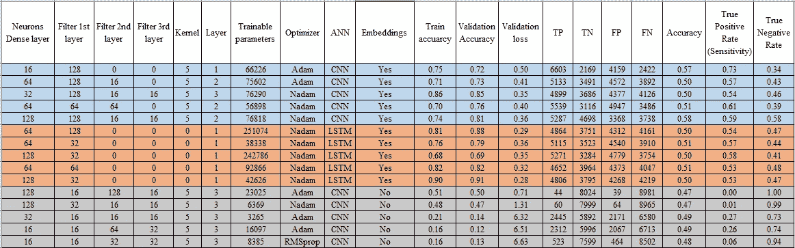

# 检测用于电子邮件分类的简单神经网络结构

> 原文：<https://towardsdatascience.com/detecting-a-simple-neural-network-architecture-using-nlp-for-email-classification-f8e9e98742a7?source=collection_archive---------14----------------------->

## 邮件分类中的超参数优化。


大约十年前，垃圾邮件使电子邮件濒临毁灭。到 2015 年，[谷歌](https://www.wired.com/2015/07/google-says-ai-catches-99-9-percent-gmail-spam/)称其垃圾邮件率下降到 0.1%，误报率下降到 0.05%。这一显著下降在很大程度上是由于其垃圾邮件过滤器中引入了神经网络，可以通过分析大量收集的内容来学习识别垃圾邮件和钓鱼邮件。

神经网络是强大的机器学习算法。它们可用于变换特征，以便形成相当复杂的非线性决策边界。它们主要用于分类问题。完全连接的层从 CNN 到 RNN/LSTM 获取深层表示，并将其转换为最终的输出类或类分数。

这篇文章解释了基于以下因素的垃圾邮件分类。

> 单词嵌入法在电子邮件主题行中的应用。
> 
> 在层和节点层数量方面的超参数调整，以及对电子邮件主题行的优化。
> 
> 基于邮件主题行比较 CNN 和 RNN 方法的性能。

## 垃圾邮件过滤器:

企业可以选择不同类型的垃圾邮件过滤器。一些过滤器针对电子邮件的内容，以确定这些内容是否与业务相关，而一些过滤器检查邮件的电子邮件标题。您还可以设置一些过滤器来限制接受来自特定地址的电子邮件，以及一些允许您设置参数来阻止哪些类型的电子邮件。甚至有一些可以让你阻止任何来自黑名单上地址的邮件。**在这项研究中，垃圾邮件过滤器是根据电子邮件的主题开发的。**



Example of email subject lines used in this study

## 数据集的基数:

该数据集基于清理后的安然语料库，共有属于 158 个用户的 **92188 条消息，平均每个用户 757 条消息**。该数据集的垃圾邮件和垃圾邮件分布几乎相等。**由 ham 和 spams 组成的 19997 封电子邮件**被用作 20%分割的训练和验证集。 **17880 封电子邮件**然后被用作**测试集**来识别准确性和误报。



Table 1: Neural Network Architecture used for hyper parameter tuning.**

# **层的超参数调整和节点层数**


人工神经网络有两个主要的超参数来控制网络的结构或拓扑:(a)层数和(b)每个隐藏层中的节点数。

为特定预测建模问题配置这些超参数的最可靠方法是通过稳健测试的系统实验。多层感知器由一个节点组成，也称为神经元或感知器，是一个计算单元，具有一个或多个加权输入连接、以某种方式组合输入的传递函数以及输出连接。节点然后被组织成层以构成网络。

MLP 中的图层类型如下:

1.输入层:输入变量，有时称为可见层。

2.隐藏层:输入层和输出层之间的节点层。可能有一层或多层这样的层。

3.输出层:产生输出变量的节点层。

4.大小:模型中节点的数量。

5.宽度:特定层中节点的数量。

6.深度:神经网络的层数。

7.架构:网络中各层和节点的具体安排。

> 检测超参数是必不可少的，原因有三个:( a)针对特定问题找到简单的神经网络架构。(b)从超参数的无数组合中找到正确的参数组，以及(c)复制神经网络结构以供将来使用。

表 1 给出了使用隐藏层的三个预训练深度神经网络(DNN)模型(双向 LSTM、非嵌入 CNN 和嵌入 CNN)的细节，在第一、第二和第三层中包含 16、32、64 和 128 个神经元以及 16、32、64 和 128 个滤波器。除了激活为“tanh”的致密层之外，所有层中的激活都是 ReLu。这里给出了 CNN 和嵌入双向 LSTM 网络的代码。所有模型都使用 16 的批量和 2 的纪元。

```
**def** embeddings(fl1=32, fl2=32, fl3=64, dl=16, optimizer= 'RMSprop', kl = 5, layer =1 ):
    sequence_input = Input(shape=(MAX_SEQUENCE_LENGTH,), dtype='int32')
    embedded_sequences = embedding_layer(sequence_input)
    **if** (layer == 1):
        x = Conv1D(filters = fl1, kernel_size = kl, activation='relu')(embedded_sequences)
        x = MaxPooling1D(pool_size = kl)(x)
    **elif** (layer == 2):
        x = Conv1D(filters = fl1, kernel_size = kl, activation='relu')(embedded_sequences)
        x = MaxPooling1D(pool_size = kl)(x)
        x = Conv1D(filters = fl2, kernel_size = kl, activation='relu')(x)
        x = MaxPooling1D(pool_size = kl)(x)

    **else**:
        x = Conv1D(filters = fl1, kernel_size = kl, activation='relu')(embedded_sequences)
        x = MaxPooling1D(pool_size = kl)(x)
        x = Conv1D(filters = fl2, kernel_size = kl, activation='relu')(x)
        x = MaxPooling1D(pool_size = kl)(x)
        x = Conv1D(filters = fl3, kernel_size = kl, activation='relu')(x)
    x = GlobalMaxPooling1D()(x)
    x = Dense(units = dl, activation='relu')(x)
    preds = Dense(1, activation='tanh')(x)
    model = Model(sequence_input, preds)
    model.compile(loss= 'binary_crossentropy',optimizer= optimizer,
              metrics=['acc'])

    **return** model
```

神经网络的两个重要技术是**丢失和激活。**超参数调整也可以基于这些技术完成，但这里不使用。为了改善大型神经网络的泛化误差，采用了丢包技术。在这种方法中，噪声使给定层中神经元激活的固定部分为零或消失。整流线性单元(ReLU)使用激活函数 max(0；x)。ReLUs 被结合到标准的前馈神经网络中，以保持概率模型具有最大(0；x)。

```
**def** embedding_LSTM(fl1=16, fl2=16, fl3=16, dl=16, optimizer= 'RMSprop', kl = 5, layer =1): 
    sequence_input = Input(shape=(MAX_SEQUENCE_LENGTH,), dtype='int32')
    embedded_sequences = embedding_layer(sequence_input)
    x = Bidirectional(LSTM(units = fl1, return_sequences=**True**))(embedded_sequences)
    x = GlobalMaxPool1D()(x)
    x = Dense(units=dl, activation="relu")(x)
    x = Dropout(0.1)(x)
    preds = Dense(1, activation='tanh')(x)
    model = Model(sequence_input, preds)
    model.compile(loss= 'binary_crossentropy',
              optimizer= optimizer,
              metrics=['acc'])
    **return** model
```

## 嵌入:

这里使用的 GloVe(全局向量)是将每个单词映射到 100 维向量的方法之一。这些向量可以用来学习单词的语义，如男人是女人，国王是女王。或者男+女=女。这种嵌入在许多应用中起着重要的作用。这是一种迁移学习，从大型数据语料库中学习单词嵌入，然后可以用于较小的数据集。向量由无监督学习算法(PCA)生成。在来自语料库的聚集的全局单词-单词共现统计上执行训练，并且所得的表示展示单词向量空间的线性子结构。该模型的主要直觉是简单的观察，即单词-单词共现概率的比率有可能编码某种形式的意义。手套数据集有 400000 个单词。

使用**单词袋**方法作为特征向量。对记号(单词)的分析揭示出，24.80%的词汇**和 43.05%的文本**出现在嵌入矩阵中。****

## 结果和分析:



Figure 1\. Results of hyperparameters vs validation loss in CNN models.

图 1 的结果显示，密集层中神经元的数量不是很确定，但是第一层中的 64 个过滤器给出了较低的验证损失。此外，很难分别预测第二层和第三层中的过滤器数量和低验证损失。



Figure 2\. 3D visualization of hyperparameters based on validation loss, trainable parameters and dense layers in CNN models.

图 2 给出了简单模型(低可训练参数)和复杂模型(高可训练参数)的可视化效果。在参数空间的左下角，具有单个神经元层和范围从 20k 到 70k 的可训练参数的模型给出了较低的验证损失，并且是良好的架构。



Figure 3\. Results of hyperparameters vs validation loss in bi-directional LSTM models.

图 3 的结果显示，密集层中的 64 个神经元是一个很好的近似值，第一层中的 128 个过滤器也是验证损失较低的可接受结果。然而，双向 LSTM 表明，可训练参数越多，验证损失越小。



Figure 4\. 3D visualization of hyperparameters based on validation loss, trainable parameters and dense layers in bi-directional LSTM models.

图 4 给出了双向 LSTM 模型中简单(低可训练参数)和复杂模型(高可训练参数)的良好可视化。至少需要 64/128 个密集层神经元来生成低验证损失的结果。此外，具有较高的可训练参数的模型具有较低的验证损失，并且是良好的架构。然而，与 CNN 模型相比，LSTMs 的验证损失较小。



Table 2: Detailed results of top 5 models from three different types of architecture.

表 2 的定性分析显示了具有和不具有全局向量嵌入的 CNN 和双向 LSTM 网络的结果。选择基于最小验证损失的前五个最佳模型。嵌入 CNN 产生的最大准确率为 58%。73%的最佳准确度和灵敏度是对于具有 66226 个可训练参数的 CNN 模型。平均准确率为 50%，无嵌入的 CNN 模型准确率低于 50%。模型的灵敏度在 50%以上，最高可达 73%。应该注意的是，没有嵌入的模型具有非常低的灵敏度。没有嵌入的模型具有较高的真阴性率。另外，**那达慕优化器**最适合处理这类问题。

## 结论:

回到问题上来:

*   事实证明，在电子邮件主题行中使用单词嵌入方法比不嵌入要好。
*   我们进行了广泛的研究，以寻找在训练集中产生低验证损失的最佳架构。
*   具有更多可训练参数的 LSMT (RNN)模型给出了最低的一组总验证损失。CNN 的简单一层模型会产生稍高的验证损失。具有嵌入的 CNN 模型具有最高的准确性和真阳性率。

未来的研究将包括处理词汇外单词的方法和使用基于字符的模型，如由谷歌大脑团队设计的 [lm_1b](https://github.com/tensorflow/models/tree/master/research/lm_1b) 模型，该模型包括 256 个向量(包括 52 个字符，特殊字符)，维度仅为 16。

我欢迎反馈和建设性的批评。可以通过 LinkedIn 联系到我。这项研究的代码可以在[这里](https://github.com/tannisthamaiti/Ham_spam_email_classification)找到。

___________________________________________________________________

* * CNN 模型中 hyper 参数的总组合为 3072，但仅考虑带有 Adam 和 Nadam 优化器的模型，因为它们产生的验证损失最小。类似的，只有亚当和那达慕优化是考虑为 LSTM。