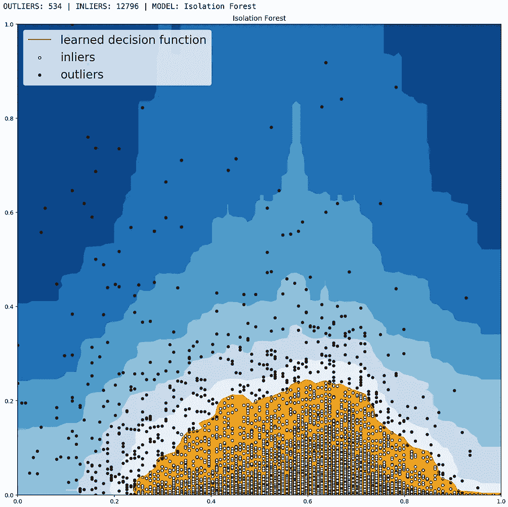

# 使用数据科学工具检测异常天气模式

> 原文：<https://towardsdatascience.com/detecting-abnormal-weather-patterns-with-data-science-tools-5fae48586469?source=collection_archive---------22----------------------->

## 世界各国都在努力应对更多的极端天气事件。但是你如何准确地指出这些异常值呢？


A large waterspout spotted off the east coast of Singapore on August 6 2016\. Photo: Chua Chin Hon

在世界各地，极端天气事件正变得越来越强烈和频繁。

其中一些重大的天气异常不容忽视，例如[山洪爆发](https://en.wikipedia.org/wiki/Floods_in_Singapore)或[持续干旱](https://www.straitstimes.com/singapore/singapore-experiencing-record-dry-spell-and-it-could-get-worse-nea)，它们会影响一个国家的大部分人口。

但是，并不是每一个天气异常值都能被轻易观察到，尤其是在新加坡，那里的季节变化对肉眼来说不那么明显。然而，这些“较温和”的异常对于理解未来天气模式的变化同样重要。

数据可视化，比如我之前关于主题的文章[中的图表范围，提供了一种快速发现数据集中异常值的方法。经典的 Seaborn pair 情节是做到这一点的一种方式。](/visualising-singapores-changing-weather-patterns-1983-2019-a78605fadbdf)


但当你有 36 年的天气数据时，依靠图表来准确挑出异常值并不容易或有效。

在使用来自新加坡的[历史天气数据](http://www.weather.gov.sg/climate-historical-daily)的多部分数据科学项目的第三部分中，我将使用 [Scikit-learn 的隔离森林模型](https://scikit-learn.org/stable/modules/generated/sklearn.ensemble.IsolationForest.html)以及 [PyOD](https://github.com/yzhao062/Pyod) 库(Python 离群点检测)来尝试查明数据集中的离群点。

看看这些异常天气模式发生的确切日期会很有趣。这也是项目第四部分(时间序列预测)的重要前期工作，在该部分中，剔除异常值是更准确预测的关键。

# 数据和回购

本项目气象数据的原始来源可以在[这里](http://www.weather.gov.sg/climate-historical-daily/)找到。这篇文章的 Jupyter 笔记本是[这里](https://github.com/chuachinhon/weather_singapore_cch/blob/master/notebooks/3.0_outlier_detection_cch.ipynb)，你可以下载交互式 Plotly 图表[这里](https://github.com/chuachinhon/weather_singapore_cch/tree/master/interactive_charts)来探索更详细的异常数据。

# 结果概述

对于那些可能对详细的数据工作流程不感兴趣的人，我将从结果的快速概述开始。

*   下图是从 1983 年 1 月 1 日至 2019 年 6 月 30 日新加坡日常天气中挑出异常值的两个 PyOD 模型的结果片段。我总共汇总了 4 个模型的结果，从包含 13，330 行的数据集中得到了 **816 个唯一的异常值**。换句话说，异常值约占数据的 6%。你可以在这里下载并探索天气异常值的子集。


Slice of PyOD results. Scroll down for the full version.

*   2010 年 3 月、1991 年 12 月和 1987 年 1 月并列一个月内异常天气发生次数最多的三个月——10 次。

```
Year  Month    Number of days with outlier weather 
2010  3        10
1987  1        10
1991  12       10
1983  4         9
1992  12        9
1983  12        8
2006  12        8
1998  12        8
2008  3         7
1986  1         7
```

*   1998 年出现异常天气的次数最多，其次是 1983 年和 2013 年。1998 年 3 月 26 日录得最高气温 36.0 度。


*   在新加坡过去的 36 年里，12 月和 1 月是异常天气最多的月份——考虑到年底和年初更强烈的风暴，这并不奇怪。


*   正如所料，天气数据集中的一些异常值比其他异常值更极端。将 816 个异常值绘制在一起，我们可以在中间看到一个清晰的集群，最高温度在 26–34°C 之间，最大风速在 20–50 公里/小时之间。较大的圆圈代表降雨量较大的日子。


更极端的异常值位于图表的右侧、左下角和顶部。以下是异常值中主要聚类的详细信息。点击下载并探索互动版[。](https://github.com/chuachinhon/weather_singapore_cch/blob/master/interactive_charts/outliers_ext.html)


Zoomed in detail of main cluster in outlier weather data set for Singapore, 1983–2019.

接下来，我将详细说明我是如何得出异常数据的，并绘制更多图表。

# 单变量(单变量)异常检测

凭直觉，我们知道试图孤立地挑出天气异常值是没有意义的。例如，一场大风暴显然会导致极端降雨、强风和低温。

但我很想知道对单个变量的异常分析会发现什么。我认为这将有助于有一些比较的基础，以及与多变量 PyOD 技术。

因此，让我们看看当隔离森林模型应用于新加坡 36 年的日降雨量数据时，我们能发现什么。但是首先，让我们检查一下日降雨量柱的偏度和峰度分数。


```
Skewness: 5.140533
Kurtosis: 40.778205
```

偏斜度是对数据集中失真程度的度量。具有正态分布的对称数据集的偏斜度值为 0。

峰度是对分布中异常值的度量。请点击此处的[文章](https://codeburst.io/2-important-statistics-terms-you-need-to-know-in-data-science-skewness-and-kurtosis-388fef94eeaa)获取一个读者友好的解释。

在“每日降雨量”列的情况下，我们看到数据高度向右倾斜(偏斜度得分大于 1 ),这是因为有些日子的降雨量不同寻常。大约一半的时间也没有下雨(因此在 0 处有一个尖柱)。

日降雨量变量的峰度得分也很高(正态分布的峰度为 3)，表明存在大量异常值。

我在隔离森林模型上运行了降雨数据，这是一种广泛用于识别异常值的基于树的模型。详见这两篇文章([此处](/anomaly-detection-for-dummies-15f148e559c1)和[此处](/outlier-detection-with-isolation-forest-3d190448d45e))进行深入解释。

这里要调整的关键参数是“污染”，即异常值的比例。我选择了旧的缺省值 0.1，而不是新的缺省值“auto”，这会给我一个高得多的离群值比例。


粉红色的主要异常区域始于大约 19.4 毫米的降雨量。在我们的数据集中，有 1，300 个条目的降雨量高于 19.4 毫米。这似乎是一个非常大的离群值数量，我不知道如何最好地重新调整污染水平。

我对日最高温度列重复了相同的步骤，最终得到了同样多的异常值——1223 个。我不会在这里详述，但是图表和代码可以在我的[笔记本](https://github.com/chuachinhon/weather_singapore_cch/blob/master/notebooks/3.0_outlier_detection_cch.ipynb)中找到。

总的来说，试图孤立地去除如此大量的异常值似乎是不正确的。让我们看看 PyOD 方法是否更好。

# 基于 PYOD 的多元异常检测

在新加坡的情况下，与异常天气关系最密切的两个变量是最高日温度和日降雨量，这使它们成为 PyOD 模型中异常值检测的明显选择。您可以使用两个以上的变量，但是这样做显然会使结果的可视化变得复杂。

[PyOD](https://github.com/yzhao062/pyod) 有超过 20 种检测算法，其中许多你可以混合搭配在一起。我觉得有用的是，该工具包允许轻松组合来自多个检测器的结果(更多细节见本文[这里](http://www.jmlr.org/papers/volume20/19-011/19-011.pdf))。

对于天气数据集，我选择了 4 种算法——基于聚类的局部异常值因子、基于直方图的异常值检测、隔离森林和经典的 K 近邻。如下图所示，4 个模型的结果略有不同。

然后我[汇总了结果，并通过《熊猫》中的几个简单步骤过滤掉重复的](https://github.com/chuachinhon/weather_singapore_cch/blob/master/notebooks/3.0_outlier_detection_cch.ipynb)。



PyOD 库开箱即用，但挑战仍然是领域知识。与前面的单变量分析一样，您必须为 PyOD 设置的一个关键参数是污染/异常值分数-您期望在数据集中找到的异常值的百分比。

默认值为 0.1 或 10%，这可能是高估或低估了。没有更好的气象知识，很难说什么是“正确的”离群分数设置。

由于我没有这方面的专业知识，我使用了一个试错过程来查看模型识别的异常值是否与极端天气(如山洪暴发)报告的特定关键日期相匹配。例子包括 2010 年[、2011 年](https://www.pub.gov.sg/Documents/fullReport.pdf)和 2018 年的山洪。

最终，我选择了 0.04 的异常值分数。任何更低的价格都会错过报告异常天气模式的关键日期。任何更高的值都会导致数据集的很大一部分被移除。

总之，PyOD 模型从总共 13，330 个数据点中挑出了 816 个独特的异常值，约占数据集的 6%。

通过检查，这些模型成功地选出了过去 36 年中降雨量最大的一天——2011 年 1 月 30 日，降雨量为 216.2 毫米。PyOD 模型还成功地选出了 1998 年 3 月 26 日测得的最高日温度——36℃。

# 对异常值的进一步检查

让我们在 [notebook2.0](https://github.com/chuachinhon/weather_singapore_cch/blob/master/notebooks/2.0_visualisation_cch.ipynb) 中的一些可视化技术的基础上，在这里应用它们，通过年、月和年月组合来更仔细地观察异常值模式。

正如前面的结果概述中提到的，2010 年 3 月、1991 年 12 月和 1987 年 1 月并列为一个月中异常天气发生次数最多的月份——10 次。以下是 2010 年 3 月的 10 个异常天气:


Weather outliers spotted by PyOD’s algorithms for March 2010.

最高温度和日降雨量列清楚地显示了为什么这些日期的天气被认为是异常值。例如，3 月 3 日、4 日、6 日、7 日和 9 日的日最高气温非常高，达到 35°C 或更高。

过去 36 年的日平均最高气温为 31.5 摄氏度，标准偏差为 1.6 摄氏度。另一方面，PyOD 的算法在 2010 年 3 月 20 日捕捉到了一个有趣的异常值，当时日最高气温仅为 25.9 摄氏度——按照新加坡的标准来看，这是非常低的。

2010 年 3 月还下了几天大雨，特别是 3 月 23 日(57.6 毫米)和 3 月 31 日(49.1 毫米)。过去 36 年的平均日降雨量为 5.85 毫米

1987 年 1 月的 10 个异常值也一目了然:


看看 1987 年 1 月 11 日 127.4 毫米的大暴雨记录。一天的降雨量大约是新加坡过去 36 年月平均降雨量(160.1 毫米)的 80%。

Plotly Express 交互式图表使探索异常值变得更加容易。我分别绘制了 2010 年 3 月和 1987 年 1 月的异常值。


不幸的是，Medium 不便于将交互式图表嵌入帖子中，所以你在上面和下面看到的是 screen-caps-gif。点击下载[的完整互动图表。](https://github.com/chuachinhon/weather_singapore_cch/tree/master/interactive_charts)


# 矩阵面板比较

我们还可以按年份分解异常天气数据，并查看哪一年的异常记录最多。1998 年出现异常天气的次数最多，其次是 1983 年和 2013 年。1998 年 3 月 26 日录得最高气温 36.0 度。

```
**Year  Number of outlier weather days** 
1998    38
1983    34
2013    31
2006    29
1984    29
1986    29
2010    29
2007    29
2008    28
1988    28
```

使用我在 notebook2.0 中尝试过的格式，我选择了异常天气模式数量最多的 3 年——2013 年、1998 年和 1983 年——并将它们分解成一系列矩阵面板，以便于比较。

在下方的[面板中，较大的圆圈代表降雨量较高的日子。圆圈越暗、位置越高，当天的最高温度和最高风速就越高。](https://github.com/chuachinhon/weather_singapore_cch/tree/master/interactive_charts)


1998 年看起来具有最有趣的异常值分布，除了通常在 1 月和 12 月出现的暴雨之外，从 4 月到 9 月出现了一段明显的异常天气。

# 离群值中的离群值

一些异常值显然比其他异常值更极端。让我们试着从“标准异常值”中分离出极端异常值。在下方的[图中，较大的圆圈表示降雨量较大。阴影较暗的圆圈表示最近的异常点。](https://github.com/chuachinhon/weather_singapore_cch/blob/master/interactive_charts/outliers_ext.html)


我们可以在中心看到一个清晰的星团，最高温度在 26–34 摄氏度之间，最大风速在 20–50 千米每小时之间。较大的圆圈代表降雨量较大的日子。

更极端的异常值位于图表的右侧、左下角和顶部。在接下来的几十年里，观察中央星团是否会向右上方移动将会很有趣。

异常值的分析可以有十几个不同的方向，这取决于您所做的选择和假设。如果您在类似的项目中使用相同的数据集，请分享您的见解。

像往常一样，如果您发现任何错误，请 ping 我@

推特: [@chinhon](https://twitter.com/chinhon)

领英:[www.linkedin.com/in/chuachinhon](https://www.linkedin.com/in/chuachinhon/)

这是我早期的一个项目，展示新加坡不断变化的天气模式。