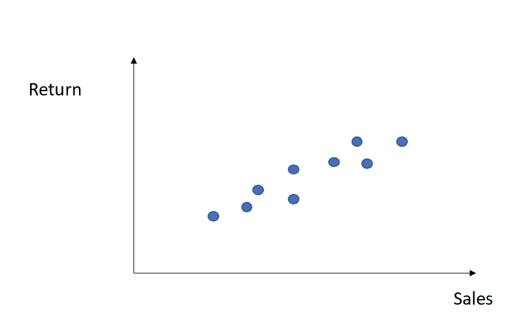
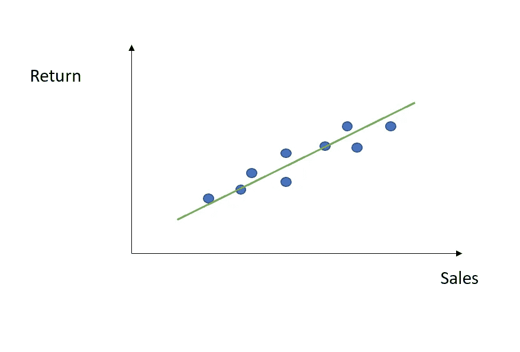
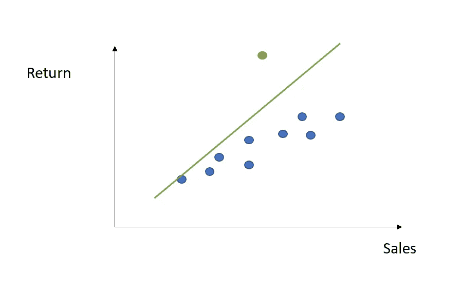
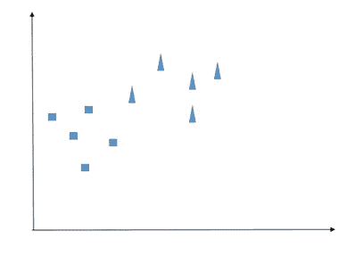
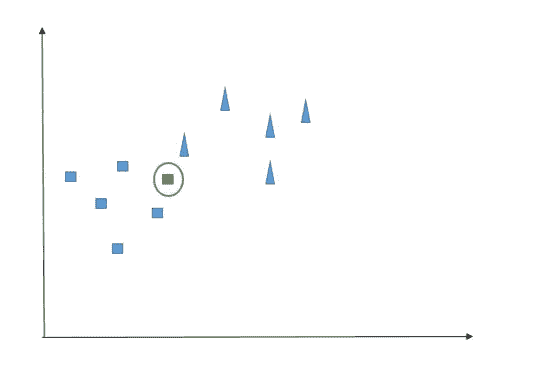
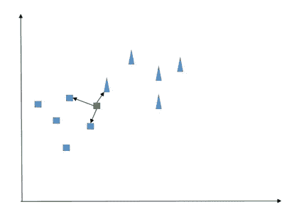
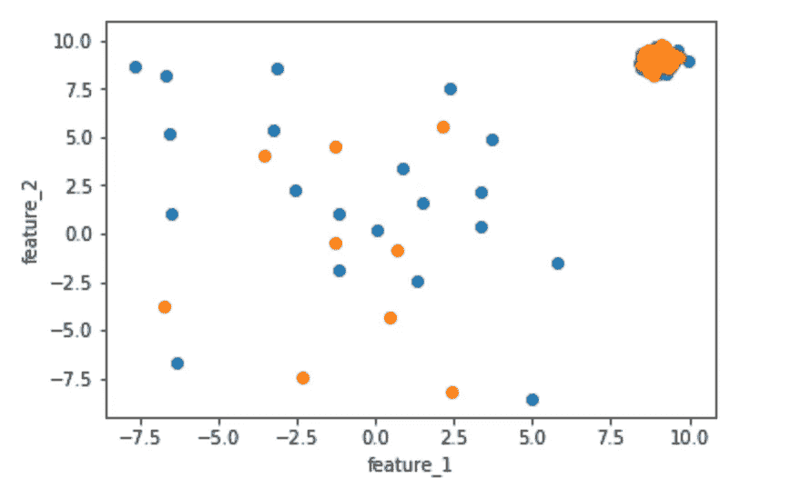
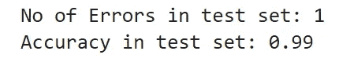
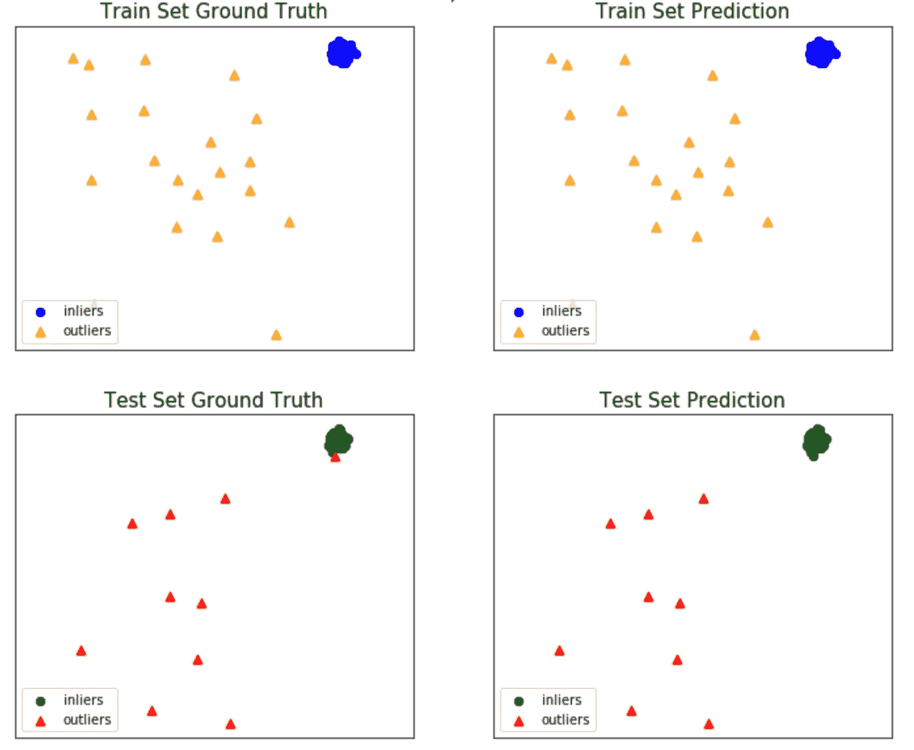

# 用 PyOD 检测异常值

> 原文：<https://towardsdatascience.com/detecting-and-modeling-outliers-with-pyod-d40590a96488?source=collection_archive---------11----------------------->


顾名思义，异常值是与您的观察结果明显不同的数据点。换句话说，它们远离你的数据的平均路径。

在统计学和机器学习中，检测异常值是关键的一步，因为它们可能会影响模型的性能。也就是说，假设您希望根据售出的单位数量来预测公司的回报。



为此，您希望用简单的线性回归来拟合您的数据，因此您继续使用 OLS 策略来找到您的参数 *alpha* 和 *beta* (要了解更多关于线性回归的信息，您可以在这里阅读我以前的文章):



很好，但是如果在你的数据中，有一个异常值呢？



如您所见，回归线更陡，因为它还想捕捉异常值的影响。但结果是，它在拟合所有其他数据点时不太准确。一种可能的解决方法是，一旦检测到所有的异常值(我们将在后面看到如何做)，简单地删除它们，或者更复杂一点，用该特征的平均值或中值替换它们。

然而，在这个过程中有一个陷阱。的确，离群值(至少不是全部)未必是坏事。事实上，它们可以包含偏离平均模式的相关信息，这种偏离在未来可能会重复。因此，一个没有捕捉到这些信息的模型将不能防止或至少在预测时模拟这些偏差。

也就是说，想象一个有许多机器工作的工厂。后者需要随着时间的推移进行监控:假设你只需要记录他们的压力。它可能会遵循一个给定的模式，这取决于一天中的时刻和工作流的数量。然后，你突然检测到压力值的峰值，然后一切恢复正常。直觉上，你是要忽略你刚刚看到的，还是要沉湎于这个高峰？也许这个峰值预测到了一个技术问题，因此你最好结合这个信息，并使用它来防止潜在的故障。

因此，在异常值检测中需要特别注意，尤其是在那些一旦遗漏就会产生高昂代价的领域(想想欺诈检测、网络安全等等)。这就是为什么有必要使用特定的算法进行异常检测，而不是简单的可视化方法，如直方图和箱线图。

这就是 PyOD 来帮忙的地方。

## PyOD 离群点检测算法

PyOD 是一个 Python 包，你可以通过控制台上的 *pip install pyod* 轻松安装。它提供了多种功能或算法来以有效的方式检测异常值，每个功能或算法都返回一个所谓的异常值:它将为每个数据点标记一个数字，该数字将与内部阈值进行比较，以确定该数据点是否为异常值。让我们检查其中的一些。

*   基于角度的异常值检测(ABOD):它考虑每个点与其邻居之间的关系，而不考虑这些邻居之间的关系。它的加权余弦值相对于所有邻居的方差可以被视为异常值。ABOD 方法对于高维数据特别有用，因为在高维空间中，角度是比距离更稳健的度量。
*   k-最近邻:它使用分类算法 KNN 背后的数学。事实上，对于任何数据点，到其第*个*最近邻居的距离都可以被视为离群值。PyOD 支持三种 KNN 检测器:最大值、平均值和中值，它们分别使用第 k 个邻居的距离、所有 k 个邻居的平均值和到 k 个邻居的中值距离作为离群值。
*   隔离森林:它是遵循决策树和随机森林的理论建立的。在这种情况下，根是随机选择的，其思想是离群值应该位于根附近。这是因为正常点需要许多分区来识别，而离群点将很容易通过较少的分区来识别。
*   局部相关积分(LOCI):对于检测异常值和异常值组非常有效。它为每个点提供了一个轨迹图，总结了该点周围区域的大量数据信息。

让我们看看 KNN 的 Python 实现。

## 异常值检测的 KNN

首先，让我们简单回顾一下 KNN 的实际工作原理。

KNN 可能是分类任务中最简单的算法。它的核心思想是相似的观测值应该彼此靠近。具体是什么意思？假设我们有以下两类观察结果:



我们的班级是正方形和三角形。现在，我们面临一个新的事件(带圆圈的观察)，我们想确定它是三角形还是正方形:



正如预期的那样，KNN 根据“相似性”进行推理，而“相似性”在数学术语中可以翻译为“距离”。例如，在这里我们可以计算我们的绿色观察和一些最近的观察之间的欧几里德距离(后者的数量是我们在训练模型之前必须设置的值，通常用 *K* 表示)。然后，我们简单地计算每个类的最近邻的数量:最高的数量决定了新观察的成员。

也就是说，如果我们设置 K=3，我们将面临以下情况:



我们可以计算两个正方形和一个三角形，因此新的数据点应该是一个正方形。一个很好的经验法则:试着把你的 K 设为奇数，这样你就可以避免一半一半的计算。

现在让我们用 Python 实现它。首先，PyOD 提供了一些嵌入式函数来创建一个包含少量异常值的随机数据集:

```
import numpy as np
from scipy import stats
import matplotlib.pyplot as plt
from pyod.models.knn import KNNfrom pyod.utils.data import generate_dataoutlier_fraction = 0.1  
n_train = 200 
n_test = 100X_train, y_train, X_test, y_test = generate_data(n_train=n_train, n_test=n_test, contamination=outlier_fraction)#let's plot our train and test setfeature_1_train = X_train[:,[0]].reshape(-1,1)
feature_2_train = X_train[:,[1]].reshape(-1,1)
feature_1_test = X_test[:,[0]].reshape(-1,1)
feature_2_test = X_test[:,[1]].reshape(-1,1)# scatter plot 
plt.scatter(feature_1_train,feature_2_train)
plt.scatter(feature_1_test,feature_2_test)
plt.xlabel('feature_1')
plt.ylabel('feature_2')
```



现在让我们用我们的 KNN 模型进行训练和预测。

```
knn=KNN(contamination=outlier_fraction)
knn.fit(X_train)# get the prediction labels and outlier scores of the training data
y_train_pred = knn.labels_  
y_train_scores = knn.decision_scores_ # get the prediction on the test data
y_test_pred = knn.predict(X_test)  
y_test_scores = knn.decision_function(X_test)# no of errors in test set
n_errors = (y_test_pred != y_test).sum()
print('No of Errors in test set: {}'.format(n_errors))
#accuracy in test set
print('Accuracy in test set: {}'.format((n_test-n_errors)/n_test))
```



不错，我们的算法能够正确地分类几乎所有的异常值。让我们也想象一下装配过程:

```
from pyod.utils import example
example.visualize(knn, X_train, y_train, X_test, y_test, y_train_pred, y_test_pred, show_figure=True, save_figure=False)
```



正如预期的那样，一旦正确地检测到我们的异常值，我们必须决定如何处理它们，或者换句话说，如何整合其中包含的信息。对异常值建模远非易事，它是统计学和数据科学中的一个开放话题。举个例子，一个有趣的研究领域是极值理论或极值分析(EVA)。它是统计学的一个分支，处理概率分布中值的极端偏差。它试图从给定随机变量的给定有序样本中，评估比任何先前观察到的更极端的事件的概率。

这篇文章是关于检测程序的，我不打算详述“建模”步骤。然而，如果你对这个话题感兴趣，我推荐这些进一步的阅读材料:

*   [http://manuals . mikepoweredbydhi . help/2017/General/EVA _ scidoc . pdf](http://manuals.mikepoweredbydhi.help/2017/General/EVA_SciDoc.pdf)
*   https://www.ncl.ucar.edu/Applications/extreme_value.shtml