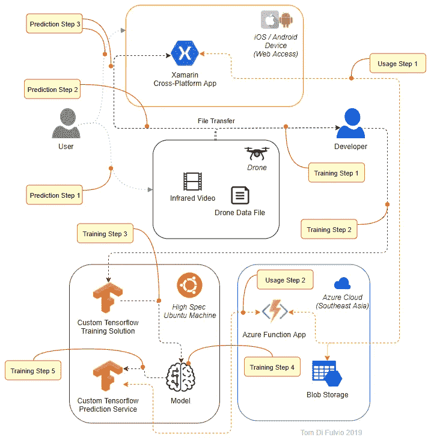

# 使用图像识别检测红外无人机镜头中的动物

> 原文：<https://towardsdatascience.com/detecting-animals-in-infrared-drone-footage-using-image-recognition-bfdd8da30ba3?source=collection_archive---------31----------------------->

今年早些时候，我设计了一个系统，能够在红外无人机镜头中找到并计数动物。我开始测试一些不同的技术，以证明它是可靠的。

与往常一样，我的解决方案是松散耦合和模块化的，如果有更好或更具成本效益的选项可用和/或未能满足预期，则允许轻松更换组件。在这个过程中，我提出并测试了三种我认为可以完成这项工作的不同架构。

# 探测动物

我还没有我需要的所有无人机镜头，所以我从 YouTube 上获得了一些野猪的样本红外镜头进行测试。YouTube 上的一些镜头是从直升机上拍摄的，一些是从地面拍摄的。我想给我的模型最好的机会来发现猪，所以我收集了尽可能多的例子，从我收集的视频中抓取截图。很多镜头里也有郊狼，所以我也趁机收集了它们的照片。

总的来说，我会说我使用的数据很低。很多图像都很模糊，最终图像非常小，有些只有大约 100x100 像素。我使用了大约 200 个样本进行测试，这也是一个很小的数字，但我决定从那里开始，继续进行乏味的谈话，只在我需要的时候收集更多的截图。

以下是我收集的一些图片类型的例子…

Wild Hogs in Infrared

Wild Coyotes in Infrared

Examples of some of the testing images I used

## 张量流

我仔细阅读了莱奥·博科特的文章《使用 Tensorflow、OpenCV 和 Docker 进行实时和视频处理对象检测》并以此为基础建立了我的张量流模型。我选择了 [Tensorflow](https://www.tensorflow.org/) ，因为我已经知道目标检测已经在这个平台上被广泛研究过，而且我已经很熟悉它了。

TensorFlow 是一个为高性能计算而构建的开源机器学习库。其灵活的架构允许跨各种平台轻松部署计算，从台式机到服务器集群，再到移动和边缘设备。

Ubuntu 上的定制 TensorFlow 实现在许可方面不需要任何成本，但是在基础设施和开发时间方面需要成本。好处是，你得到了一个专门构建的人工智能，它有可能产生更好的结果，规模更便宜，可以扩展和定制。

**优点:**

*   使用成本低廉。
*   可以根据需要无限修改。
*   可以对模型进行微调，以获得所需的结果。
*   可以受益于其他数据以及图像数据；该模型可以使用诸如位置或天气数据之类的附加特征进行训练，

**缺点:**

*   在图像分类方面可能比现成的商业系统慢，这取决于基础设施。
*   将需要维护一个托管服务器。
*   模型需要开发，增加了开发成本和时间。
*   需要更多的镜头才能像商业模型一样精确。
*   训练这个模型需要更多的时间。

**实施步骤:**

1-设置 Ubuntu 服务器

2-安装 Python 和 Tensorflow 以及服务器。

3-用相关图像训练模型。

4 —测试模型中的预测。

这个模型的一个很大的优点是，我已经为解析视频设置了它，它可以在一帧中标记多个结果。其他 API 端点系统会要求我一帧一帧地发送镜头，只有微软认知服务可以在一幅图像中给我多个结果的详细边界框信息。

## 微软认知服务

[认知服务](https://azure.microsoft.com/en-au/services/cognitive-services/)是 Azure 中的一组仪表板和 API，允许开发人员访问智能流程，如图像识别和语音以及应用程序的语言理解。

Azure Custom Vision 是[计算机视觉认知服务](https://azure.microsoft.com/en-au/services/cognitive-services/computer-vision/)的一部分，它允许您构建、部署和改进您自己的图像分类算法，这些算法构建在 Azure 图像识别 GUI 中。所提供的人工智能服务可以在接受监督训练后，根据图像的视觉特征将标签应用于图像。可以通过 REST API 调用将图像发送给训练好的模型进行分类，并以 JSON 格式返回结果。

**优点:**

*   易于使用和培训。
*   不需要拥有强大的高端服务器或强大的高端电脑或手机来使用这项服务。
*   这个系统是微软改进的。

**缺点:**

*   不能修改模型，只能训练它。
*   必须连接到互联网才能使用该模型。
*   只能受益于图像数据；无法使用位置或天气数据等附加功能来训练模型。

使用该模型非常简单，结果可以返回包围盒信息，这正是我所需要的。正如我之前提到的，认知服务的主要优势是我能够一次标记多个图像。这对于我的用例来说至关重要，因为一幅图像中很可能同时出现不止一只动物。

## 西米拉尔

捷克公司 [Ximilar](https://www.ximilar.com/) 提供计算机视觉服务，这是[为挑战图像识别领域的谷歌和微软](https://www.ximilar.com/is-ximilar-better-than-ai-giants/)而建立的。我发现它是一个非常有能力的选择，而且非常容易上手。Ximilar 团队与我进行了很多交流，他们给我提供了手动培训模型，并就如何充分利用他们的平台向我提供了建议。我强烈推荐和这个团队一起工作，因为我发现他们的高度开放和服务令人耳目一新。

为了使用该平台，我将我的训练图像上传到 Ximilar，并使用 GUI 标记它们。GUI 允许我配置训练服务来自动翻转和旋转我的图像，并随机改变它们，添加静态和改变它们的颜色。这是完美的，因为它允许我模拟不同类型的红外和图像，可以从空中的无人机以各种角度拍摄。

Some of my Training Images Tagged in Ximilar

我尝试了一些不同的场景，如下图所示，只用了少量的图片就获得了非常有希望的结果。我未来的测试将会让模型在更大的图片中找到动物。

Detection Rates for a Hog or Coyote Comparer

Detection Rates for a Comparer that Differentiates Between Hog Tops or Sides and Coyotes

下面的测试表明需要更多的数据和更高质量的图像。我用一张不相关的图片进行了测试，但模型觉得它仍然需要对一些东西进行分类…要么是这样，要么是火影忍者看起来像一只跃起的猪？

Naruto Runner or Hog?

调试该问题的尝试显示了一个局限性。结果返回的图像上没有坐标，平台仅返回图像中有结果以及结果是什么:

Ximilar JSON Sample

这是一个限制，如果我后来在实现过程中问了 Ximilar 团队，他们也许能够帮助我纠正。

# 设计系统

为了补充关键的人工智能组件，并为该领域提供一个可用的系统，我需要一个围绕它的系统，允许无人机向模型发送信息，并让用户获得有关镜头的信息。这将意味着无人机必须在 TensorFlow 的情况下发送视频，或者将图像作为帧发送给我基于网络的模型。其他数据，如飞行遥测数据，需要从无人机上提取。DAT 文件，如果我想在未来使用它。其中一个就是用它来产生。可以直观地查看航班 KML 映射文件。

## 外围组件

[**Azure Blob Storage**](https://azure.microsoft.com/en-au/services/storage/blobs) 是微软面向云的对象存储解决方案。Blob 存储针对存储大量非结构化数据进行了优化。非结构化数据是不符合特定数据模型或定义的数据，如文本或二进制数据。我想从无人机和气象网站上尽可能多地收集这些信息，因为我认为温度、天气和月相有可能在我们尚不了解的动物位置中发挥作用。

[**Xamarin**](https://visualstudio.microsoft.com/xamarin/) 是一个跨平台的框架和工具包，允许开发人员高效地创建可以在 iOS、Android 和通用 Windows 平台之间共享的原生用户界面布局和应用。我计划用它作为我的应用框架，因为它是基于 C#的，可以很容易地部署到 Azure，这意味着我只需要为 iOS 和 Android 开发一个应用。

[**Azure Functions**](https://azure.microsoft.com/en-au/services/functions/) 是一个在云中轻松运行小块代码的解决方案。您可以只为手头的问题编写所需的代码，而不必担心整个应用程序或运行它的基础结构。我认为这是一个不错的解决方案，可以处理 WebAPI 请求，并将不同的数据和结果发送到需要的地方。

[**Ubuntu**](https://ubuntu.com/) 是一个免费开源的 Linux 发行版。我计划将 Tensoflow 实现放在 Ubuntu 服务器上，而不是放在运行 Ubuntu 的 docker 容器中。

## 使用张量流的系统

Animals in IR Drone Footage Detector Using TensorFlow

**训练步骤 1** 红外视频镜头和飞行数据由开发者从无人机上下载。

**训练步骤 2**
开发人员获取图像数据和飞行数据，并将其发送到 Ubuntu 服务器，在那里可以使用这些数据来训练自定义 Tensorflow 模型。

**训练步骤 3** 开发者获取图像数据和飞行数据，并基于飞行数据和来自镜头的每一帧的图像的组合特征，使用它来训练定制 Tensorflow 模型。

**训练步骤 4** 模型产生，转换成可用于自定义 Tensorflow 预测服务的格式，并冻结导出。

**训练步骤 5** 将冻结的模型加载到自定义 Tensorflow 预测服务中，用于预测。

**预测步骤 1** 用户使用无人机进行监视/侦察飞行，收集红外图像和无人机飞行数据。

**预测第二步** 从无人机上下载数据，并发送给跨平台的 Xamarin app。这款应用可以在 iOS 或 Android 设备上使用。

**预测步骤 3** 用户使用应用程序选择要发送给人工智能进行预测的视频。用户可以修剪镜头的开头或结尾，以避免发送不相关的起飞和着陆镜头。该应用程序自动将数据文件与视频文件相结合，并对数据进行适当的修剪/清理。

**使用步骤 1** App 取裁剪好的素材，分离成每秒 5 帧的视频，并将每一帧发送给 Azure Function App。同时，该应用程序将数据和镜头上传到 Azure Blob 存储中，以供存档和未来使用。

**使用步骤 2** 功能 app 调用 Ubuntu 服务器上的 AI，为每张图片预测内容。预测结果返回到功能应用程序，然后将每一帧的预测结果传递回 Xamarin 应用程序，Xamarin 应用程序从这些预测结果中组装一个缩短的视频，其中只有包含动物的帧，并将其保存到 Xamarin 应用程序中的用户视频库中。包含动物的帧的时间被识别并用于从中提取位置数据。DAT 文件，并生成一个. KML 文件的地图可视化。

## 使用认知服务的系统

Animals in IR Drone Footage Detector Using Microsoft Cognitive Services

**训练步骤 1** 红外视频镜头和飞行数据由开发者从无人机上下载。

**训练步骤 2**
开发人员仅从素材中提取图像，并将其上传至自定义视觉训练仪表板。

**训练第三步** 开发者使用上传的镜头，通过微软的定制视觉训练仪表盘来训练模型。

**训练步骤 4** 然后将训练好的模型附加到定制视觉预测服务，以供 Xamarin 应用程序通过 API 调用使用。

**预测步骤 1** 用户使用无人机进行监视/侦察飞行，收集红外图像和无人机飞行数据。

**预测步骤 2** 从无人机上下载数据，并发送给跨平台的 Xamarin app。这款应用可以在 iOS 或 Android 设备上使用。

**预测步骤 3** 用户使用 app 选择想要发送给 AI 进行预测的视频。用户可以修剪镜头的开头或结尾，以避免发送不相关的起飞和着陆镜头。

**使用步骤 1** 该应用程序获取经过修剪的镜头，将其分成每秒 5 帧的视频，并将每一帧发送给 AI。同时，该应用程序将数据和镜头上传到 Azure blob 存储中，以供存档和未来使用。

每一帧的预测结果都会返回给应用程序，应用程序会根据这些结果汇编一个缩短的视频，其中只有包含动物的帧，并将其保存到应用程序中用户的视频库中。

包含动物的帧的时间被识别并用于从中提取位置数据。DAT 文件，并生成一个. KML 文件的地图可视化。

## 使用 Ximilar 的系统

Animals in IR Drone Footage Detector Using Ximilar

**训练步骤 1
红外视频镜头和飞行数据由开发者从无人机上下载。**

**培训步骤 2**
开发人员仅从素材中提取图像，并将其上传至 Ximilar 仪表盘。

**训练步骤 3** 开发人员使用上传的素材，通过 Ximilars Training dashboard 训练模型。

**训练步骤 4** 然后，Xamarin 应用程序可以通过 API 调用访问训练好的模型。

**预测步骤 1** 用户使用无人机进行监视/侦察飞行，收集红外图像和无人机飞行数据。

**预测步骤 2** 从无人机上下载数据，并发送给跨平台 Xamarin app。这款应用可以在 iOS 或 Android 设备上使用。

**预测第三步** 用户使用 app 选择想要发送给 AI 进行预测的视频。用户可以修剪镜头的开头或结尾，以避免发送不相关的起飞和着陆镜头。

**使用步骤 1** 应用程序获取修剪后的素材，将其分成每秒 5 帧的视频，并将每一帧发送给 AI。同时，该应用程序将数据和镜头上传到 Azure blob 存储中，以供存档和未来使用。

每一帧的预测结果都会返回给应用程序，应用程序会根据这些结果组装一个缩短的视频，其中只包含包含动物的帧，并将其保存到应用程序中用户的视频库中。

包含动物的帧的时间被识别并用于从中提取位置数据。DAT 文件，并生成一个. KML 文件的地图可视化。

# 结论

设计完系统后，Ximilar 告诉我他们的平台经历了一次重大升级，现在该平台可以标记图像，允许一个以上的标记被分配给一个图像。根据这些信息，我会选择 Ximilar 作为这个系统，因为它简单，价格也比认知服务便宜。后来，如果我想包括无人机或天气数据等补充数据，我会将 Ximilar 替换为 TensorFlow。

为了使该解决方案的人工智能/机器学习(AI/ML)组件准确，我认为在我将它用于生产之前，每只动物至少需要 4000 个不同的训练示例。根据我的简单测试，我认为该系统能够达到大约 70%的准确率。

## 关于西澳大利亚的野猪

在我的例子中，我主要是试图检测野猪。在西澳大利亚，野猪是由定居者引入的，是许多本地物种自然栖息地被破坏的原因。这是因为它们成群结队地移动，并在移动时翻动土地，挖掘土壤和树根，践踏植被。

佤邦政府发布了一份关于他们如何计划解决生猪问题的战略文件，可以在[这里](https://www.agric.wa.gov.au/sites/gateway/files/WA%20Feral%20Pig%20Strategy%202020-2025_1.pdf)找到。政府最近[为这个问题](https://www.mediastatements.wa.gov.au/Pages/McGowan/2019/11/Feral-pigs-target-of-State-NRM-grants.aspx)拨款 30 万美元，但是到目前为止，技术的使用仍然是基本的，仅仅依靠静态摄像机和 GPS 对一些猪进行监控。