# 利用深度学习检测多发性硬化患者的病变

> 原文：<https://towardsdatascience.com/detecting-brain-lesions-in-multiple-sclerosis-patients-with-deep-learning-dc7e32950d1f?source=collection_archive---------16----------------------->

## [临床数据科学](https://towardsdatascience.com/tagged/clinical-data-science)

## 医学图像分析中的卷积神经网络导论。

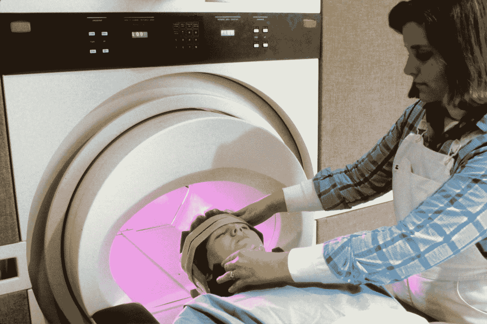

Photo by [National Cancer Institute](https://unsplash.com/@nci?utm_source=medium&utm_medium=referral) on [Unsplash](https://unsplash.com?utm_source=medium&utm_medium=referral)

# 介绍

## 深度学习的应用

[**深度学习**](https://en.wikipedia.org/wiki/Deep_learning) 是基于 [**人工神经网络**](https://en.wikipedia.org/wiki/Artificial_neural_network) 的 [**机器学习**](https://en.wikipedia.org/wiki/Machine_learning) 方法的更广泛家族的一部分。深度学习最有前景的应用之一是**图像分析**，例如用于图像分割或分类。尽管分割为每个类别(即，每个像素属于 K 个类别中的一个)产生每个像素的概率分布(也称为掩模)，但是分类为整个图像产生概率分布(即，每个图像属于 K 个类别中的一个)。如今，软件解决方案几乎随处可见，例如在 [**医学成像**](https://en.wikipedia.org/wiki/Medical_imaging) 中。在测试新药的临床研究中，人们感兴趣的是检查新药是否能改变组织的状况，例如减少炎症。这些都可以通过医学图像来监控，这些医学图像是通过成像技术创建的，如[](https://en.wikipedia.org/wiki/Medical_ultrasound)**[**X 射线**](https://en.wikipedia.org/wiki/X-ray)[**计算机断层摄影(CT)**](https://en.wikipedia.org/wiki/CT_scan) ，甚至是常规的光学显微镜。然而，对生成的图像进行分割或分类是困难的，即使对于专家来说，这也是一项耗时且昂贵的任务；问题是这是否可以自动化以节省时间和金钱。这篇文章旨在为基于深度学习的医学图像分析提供一些直觉(重点是使用来自前[挑战](https://smart-stats-tools.org/lesion-challenge)的数据在多发性硬化症患者中进行病灶分割)。**

## **多发性硬化**

**[](https://en.wikipedia.org/wiki/Multiple_sclerosis)**多发性硬化(MS)是一种[脱髓鞘疾病](https://en.wikipedia.org/wiki/Demyelinating_disease)，其大脑和脊髓中神经细胞的绝缘套受损。MS 的三个主要特征是中枢神经系统 [**病变**](https://en.wikipedia.org/wiki/Lesion) 的形成(也叫斑块)、炎症、神经元[髓鞘](https://en.wikipedia.org/wiki/Myelin_sheath)的破坏。这种损伤破坏了部分神经系统的交流能力，因为[信号转导](https://en.wikipedia.org/wiki/Transduction_(physiology))被扭曲。 [**磁共振成像**](https://en.wikipedia.org/wiki/Magnetic_resonance_imaging) **(MRI)** 大脑和脊柱可能出现脱髓鞘区域(病变或斑块)。虽然原因尚不清楚，但潜在的机制被认为是免疫系统的破坏或产生髓鞘的细胞的失败。对此提出的原因包括遗传和环境因素，如由病毒感染引发。这种疾病的名称是指在神经系统中形成的疤痕(巩膜——更好的说法是斑块或病变)。尽管目前还没有治愈多发性硬化症的方法，但几种疗法已经被证明是有帮助的。治疗的主要目的是恢复发作后的功能，防止新的发作，并防止残疾。当磁共振成像上出现两个以上的病变时，一般建议在首次发作后开始药物治疗。正在进行的研究正在寻找更有效、方便和可耐受的复发-缓解型 MS 治疗方法，为进展型亚型创造疗法，神经保护策略和有效的对症治疗(但为了评估新疗法的疗效，廉价和标准化的疾病进展检查将是有帮助的)。****

## ****医学成像****

****如上所述的医学成像技术通常基于不可见光，即人眼可见光谱之外的光(380-750 纳米)。例如，[核磁共振扫描仪](https://en.m.wikipedia.org/wiki/Physics_of_magnetic_resonance_imaging#MRI_scanner)利用[无线电波](https://en.m.wikipedia.org/wiki/Radio_wave)(波长 1 毫米到 10 公里)生成人体器官的图像。与 MRI 相反，CT 和常规 X 射线成像使用波长为 250 pm 至 10 nm 的光(称为 X 射线，因此得名)。(注意，X 射线能量丰富，会造成细胞损伤，玩的时候要小心。)其他诊断方法如 [**脑电图**](https://en.wikipedia.org/wiki/Electroencephalography) 不产生经典图像作为主要输出，而是产生纯电信号(技术上，每种数字诊断方法都在某个点产生电信号，但在成像中，它们通过 [**傅立叶变换**](https://en.wikipedia.org/wiki/Fourier_transform) 映射以产生图像)。x 射线成像和超声波生成 2D 图像，而 CT 和 MRI 生成图像体(3D 图像)，这使得它们更难以分析以发现病变组织，例如大脑中的病变组织。然而，单个切片的行为类似于常规图像。下面是不同成像模式/设置(例如**质子密度(PD)** 、**液体衰减反转恢复(FLAIR)** 等)下的大脑样本 MRI 切片( [**神经成像**](https://en.wikipedia.org/wiki/Neuroimaging) )。)显示。****

****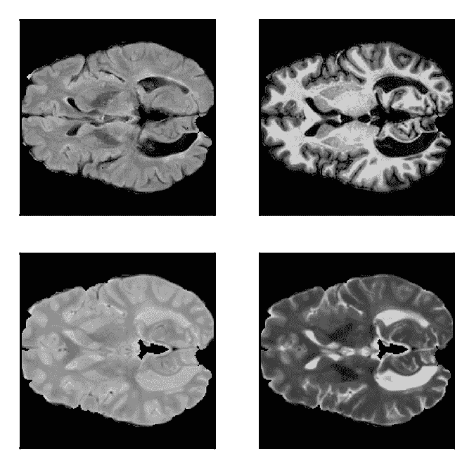********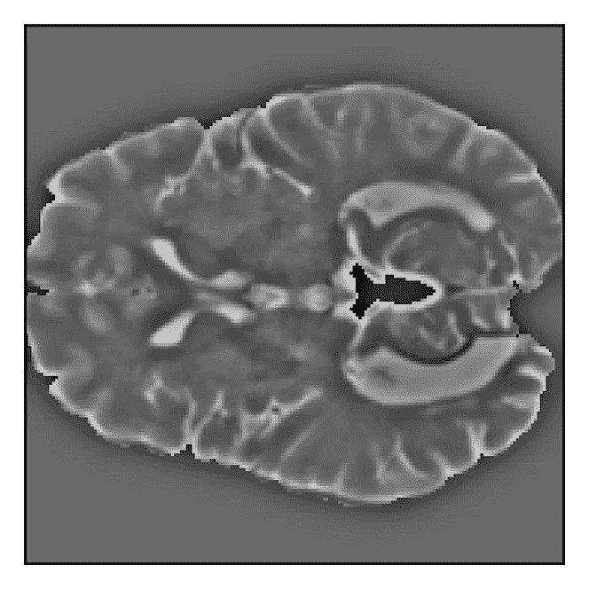********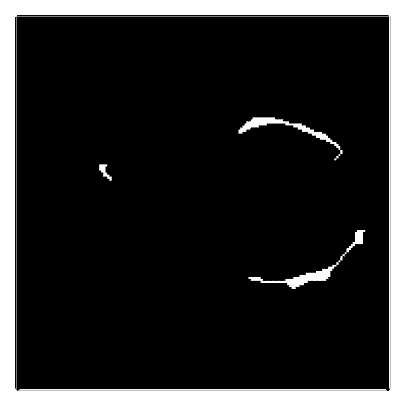****

****Example of different MRI imaging methods (top left to bottom right: **FLAIR**, **MPRAGE**, **PD**, **T2**) with a sample **Gaussian-filtered** version of a T2 weighted image, and a **mask/label** with white lesion pixels. (images by author)****

****上图(右图)显示了多发性硬化症患者的三个病变区域。一个**病变**是通常由多发性硬化症等疾病引起的机体组织的任何损伤或异常变化。为了检查针对多发性硬化症的治疗效果，必须随着时间的推移观察这些区域，以评估治疗是否可以实现任何身体改善，例如通过**测量图像体积**中病变的总体积。请注意蒙版中的黑色像素比白色像素多得多。黑白图像被表示为秩二 [**张量**](https://en.wikipedia.org/wiki/Tensor) (在术语 [**矩阵**](https://en.wikipedia.org/wiki/Matrix_(mathematics)) 下更为人所知)，其中每个条目表示一个 [**像素**](https://en.wikipedia.org/wiki/Pixel) 的强度。值的范围从 0 到 255，因为其表示形式为 [8 位](https://en.wikipedia.org/wiki/8-bit)，但是在输入网络之前，条目被归一化到范围[0，1]——值越高，像素越亮。彩色图像是三阶张量，其中一维在不同颜色通道上迭代(例如 [**RGB 颜色空间**](https://en.wikipedia.org/wiki/RGB_color_space) )。类似地，3D 彩色图像体积是秩 4 张量。然而，颜色通道可以包含不同的成像模式(PD、T2 等。)或者甚至是所述模式的高斯滤波图像。MR 图像体积的尺寸为:****

```
**[nx_voxels, ny_voxels, nz_voxels, n_channels]**
```

****[**体素**](https://en.wikipedia.org/wiki/Voxel) 是一个图像体的 [**像素**](https://en.wikipedia.org/wiki/Pixel) 的类似物。典型的 MR 图像大约有 200 个 *x* 200 个 *x* 200 个体素。这产生每个通道总共 8.000.000 个体素。假设有 4 个通道(针对 4 种不同模式)，则得出 32.000.000(！)体素。包含所有类的所有掩码的输出具有维度:****

```
**[nx_voxels, ny_voxels, nz_voxels, n_classes]**
```

# ****映象分析****

## ****卷积神经网络****

****通过[](https://en.wikipedia.org/wiki/Convolutional_neural_network)****卷积神经网络已经建立了图像分析的黄金标准，并且发现*良好的*网络架构已经成为最近研究的主要目的。CNN 由 [**卷积层**](https://en.wikipedia.org/wiki/Convolutional_neural_network#Convolutional_layer) 组成，这些卷积层由 [**内核**](https://en.wikipedia.org/wiki/Convolution) (也称为**滤波器**)定义，对于 2D 图像来说是二阶张量，对于填充了权重的 3D 图像来说是三阶张量。卷积是一种映射，它通过悬停在输入上并使用所有通道的核条目对图像张量条目进行加权来生成新图像。这些新图像被称为**特征地图**。********

********

****Convolution operation on a 7x7x3 image (three input channels) with two 3x3 filters ([source](https://github.com/cs231n/cs231n.github.io)). **Note how every input channel has different weights for each filter**.****

****通常，在 CNN 的单个层中使用许多过滤器，这些过滤器是在训练(推断)阶段**学习**的，即以感兴趣的区域比不相关的区域更明显的方式设置权重。在一个卷积层之后，一些**激活函数** ( [sigmoid](https://en.wikipedia.org/wiki/Sigmoid_function) ， [rectifier](https://en.wikipedia.org/wiki/Rectifier_(neural_networks)) )被应用于特征图，其后面还可以跟随一个 [**汇集层**](https://en.wikipedia.org/wiki/Convolutional_neural_network#Pooling_layer) 。在 CNN 中，计算卷积层(有时是汇集层)与激活函数的顺序映射，这放大了网络过程中的某些模式，因为每个操作的输出又是一个特征图。****

```
****### convolutional layer (vertical line detector)****from** scipy.signal **import** convolve2d
kernel = np.array([
[1,0,-1],
[1,0,-1],
[1,0,-1]])feature_map = convolve2d(image, kernel, mode='same')**### pooling layer****def** pool2d(X, pool_size, mode='max'):
   p_h, p_w = pool_size
   Y = np.zeros((X.shape[0] - p_h + 1, X.shape[1] - p_w + 1))
   **for** i **in** range(Y.shape[0]):
       **for** j **in** range(Y.shape[1]):
           **if** mode == 'max':
               Y[i, j] = X[i: i + p_h, j: j + p_w].max()
           **elif** mode == 'avg':
               Y[i, j] = X[i: i + p_h, j: j + p_w].mean()
   **return** Ypool_size = (3, 3)
pooled_image = pool2d(feature_map, pool_size, mode='max')**
```

****下面，一个 3 *x* 3 卷积和一个用于**垂直边缘检测**的**步距**为 1(上面的例子)以及一个 3 *x* 3 最大池被可视化。请注意垂直线在滤镜贴图中是如何变得更加明显的(分隔形状的垂直边缘比其他边缘更清晰，即不那么模糊)。此外，池化操作会使图像变得更粗糙。****

****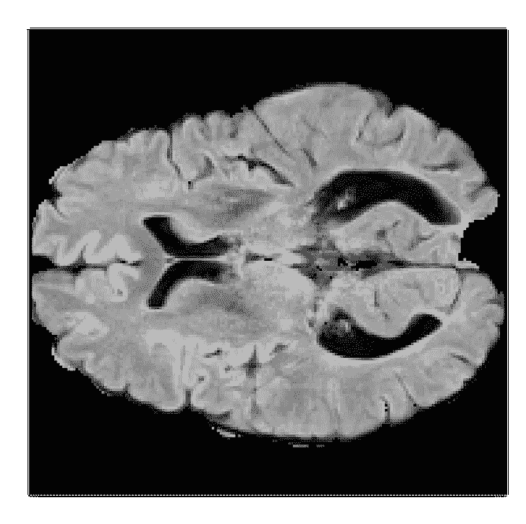********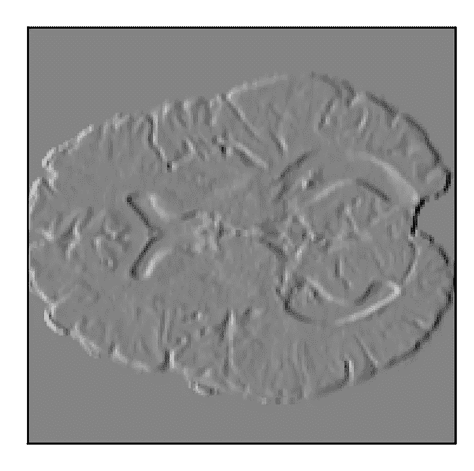********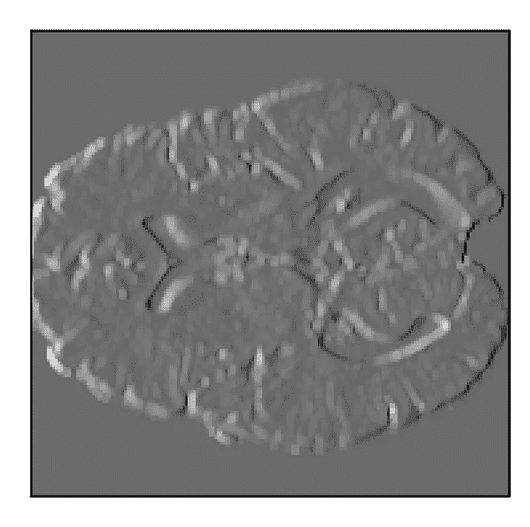****

******Left**: Original MR image. **Mid**: Convolved image. **Right**: Convolved and maximum-pooled image. (images by author)****

****从上面的图像来看，病变无论如何都很难被发现，因为它们与周围的区域融合在一起。必须以某种方式设计滤波器(在训练阶段学习),使得损伤是特征图中的明显纹理。您也可以认为，使用其他 MR 成像模式可以改善结果，但最终需要不同模式的组合和额外的高斯滤波版本来唯一识别病变。不同的图像模式堆叠在一起，充当输入中的单独通道。因此，卷积层的一般形状为:****

```
**[nx_filter, ny_filter, nz_filter, n_input_channels, n_filters]**
```

****因此，单个卷积层的参数数量为:****

```
****### parameters for kernels/filters**
p_f = n_in * (nx_f * ny_f * nz_f) * n_f**### parameters for biases (each filter has one bias term)**
p_b = n_f**### total number of parameters**
p_total = p_f + p_b**
```

****假设有 3 个输入通道和 16 个形状滤波器(5 *x* 5 *x* 5)，该层的参数总数为:****

```
**p_total = 3 * 16 * (5 * 5 * 5) + 16 = **6016****
```

****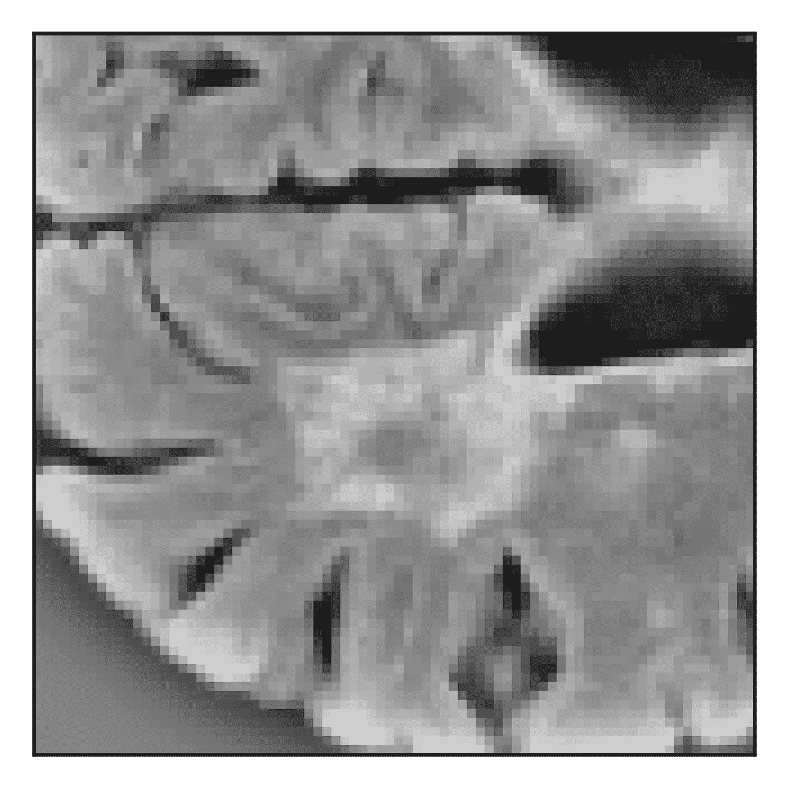****

****An example of **selective random sampling**. (image by author)****

****注意，对于体积图像，使用三维过滤器。如上所述，体积由几百万个体素组成，这使得当前处理整个体积是不可行的，并且必须使用子样本来代替(例如 80 *x* 80 *x* 80 个体素)。它在边界区域提供较少的上下文，这将导致较差的性能，但是它需要较少的计算能力。但是，最好以随机方式执行；由于类别的不平衡，通过**选择性随机采样**控制子体积中的类别分布很重要，即偶尔丢弃没有损伤的子体积。****

## ****模型架构****

****根据问题(例如，是否执行分类或分割)和图像维度(2D 或 3D)，有不同的 CNN 架构(也称为拓扑)； [**U-Net**](https://en.wikipedia.org/wiki/U-Net) ， [**3D-U-Net**](https://arxiv.org/abs/1606.06650) ， [**V-Net**](https://arxiv.org/abs/1606.04797) 是分割任务中比较知名的，而 [**ResNet**](https://arxiv.org/abs/1512.03385) 在分类任务中被证明是高性能的。它们由数百万个(10+以上)可训练参数组成。当前[病灶分割的最高分](https://smart-stats-tools.org/lesion-challenge)在 91.7–93.4%的范围内。****

****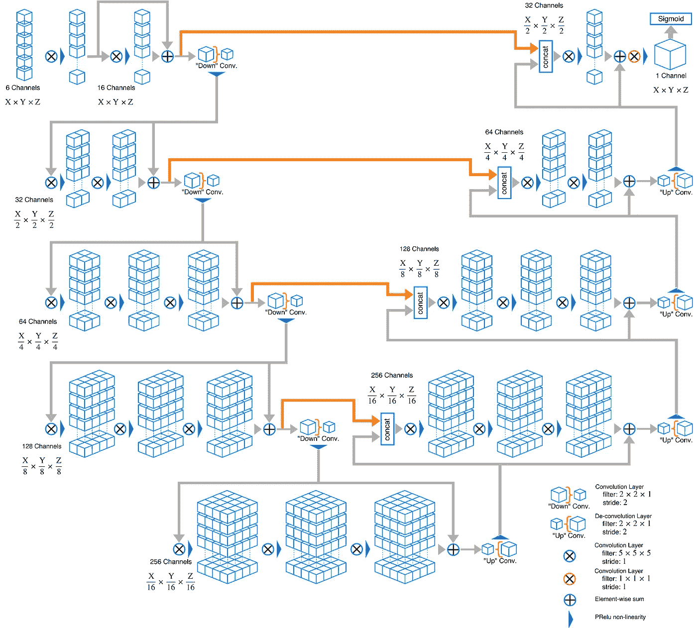****

****Scheme of the **V-Net** for volumetric image segmentation ([source](https://github.com/gtancev/V-Net/blob/master/VNetDiagram.png)).****

****V-Net 由具有规则卷积的部分组成，在这种情况下也称为*向下*卷积，其生成特征图。在网络的另一部分， *up* 卷积(也称为转置卷积)则相反。一个*上*卷积是一个*下*卷积的逆运算(卷积)——点击阅读更多关于[的内容。在网络的末端，1 *x* 1 *x* 1 卷积移除剩余通道，并根据类别数量使用 **sigmoid** 或 **softmax** 激活函数为每个像素/体素分配类别标签。](https://medium.com/activating-robotic-minds/up-sampling-with-transposed-convolution-9ae4f2df52d0)****

****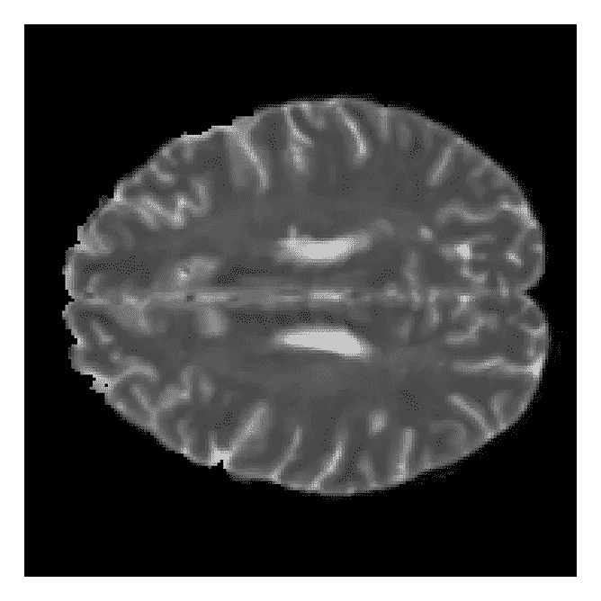********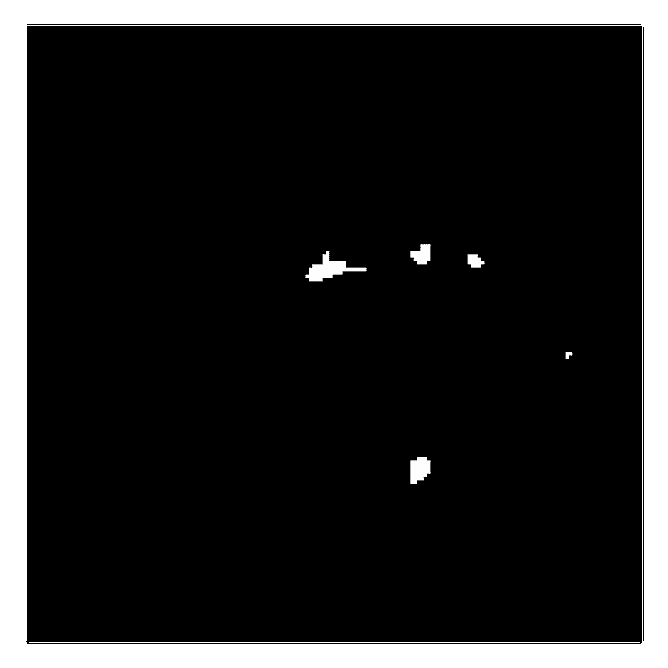********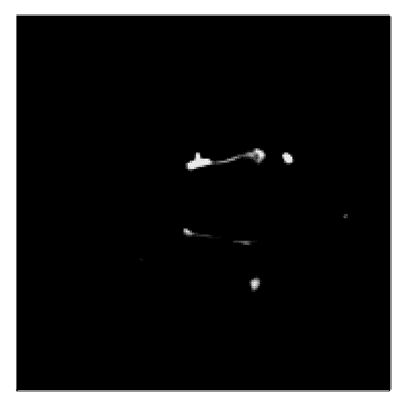****

******Left**: Original T2-weighted image. **Mid**: Original mask. **Right**: Prediction. (images by author)****

****如上所述，肿瘤分割是**不平衡数据集问题**的一个例子，这使得开发适当的解决方案更加困难。在这种情况下，模型通常会将数据集中样本较少的类错误分类，在这里它将是一个病变像素。这个问题可以通过在**损失函数**的计算中给每个类的贡献分配权重来解决，该损失函数通常被公式化为(二元)[**交叉熵**](https://en.wikipedia.org/wiki/Cross_entropy) 。校正不平衡的其他损失函数是可能的，例如 [**骰子损失**](https://en.wikipedia.org/wiki/S%C3%B8rensen%E2%80%93Dice_coefficient) 。****

```
****### dice loss****def** dice_loss(output, target, axis=[1, 2, 3], smooth=1e-5):
   inse = tf.reduce_sum(tf.multiply(output, target), axis=axis)
   l = tf.reduce_sum(tf.multiply(output, output), axis=axis)
   r = tf.reduce_sum(tf.multiply(target, target), axis=axis)
   dice = (tf.constant(2.0) * tf.cast(inse, dtype=tf.float32) +
   tf.constant(smooth)) / (tf.cast(l + r, dtype=tf.float32) +
   tf.constant(smooth))                           
   dice = tf.reduce_mean(dice)                           
   **return** tf.constant(1.0) - dice**
```

****除了纯卷积神经网络之外，还有受视频图像分割启发的发展。视频由在时域中相关的图像(也称为帧)组成，即单个帧在可能的许多时间步长上相互依赖。为了处理任何种类的序列数据(文本、音频、时间序列)，使用[](https://en.wikipedia.org/wiki/Recurrent_neural_network)**递归神经网络，例如作为[长短期记忆(LSTM)](https://en.wikipedia.org/wiki/Long_short-term_memory) 单元，或[门控递归单元(GRU)](https://en.wikipedia.org/wiki/Gated_recurrent_unit) 。通过将 MR 体积中的三维之一视为时间坐标，卷积 [LSTM](https://arxiv.org/abs/1506.07452) 和 [GRU](https://www.researchgate.net/publication/313074651_Multi-dimensional_Gated_Recurrent_Units_for_the_Segmentation_of_Biomedical_3D-Data) 实现已经被开发用于医学图像分析。******

## ********数据扩充和规则化********

******虽然探索网络架构的空间很重要，但通过在模型中集成(即时) [**数据增强**](/data-augmentation-for-deep-learning-4fe21d1a4eb9) 和 [**正则化**](https://en.wikipedia.org/wiki/Regularization_%28mathematics%29) 技术，也可以实现更好的性能，这减少了方差并避免了过拟合( [**偏差-方差权衡**](https://en.wikipedia.org/wiki/Bias%E2%80%93variance_tradeoff) )。数据扩充和正则化方法的目标是避免过度拟合，并开发一个概括良好的模型，即以高准确度/精确度/召回率预测以前没有见过的数据。一方面，可以通过从数据集中采样并对其应用变形、缩放或旋转等变换来创建合成数据；加上选择性随机采样，标记的训练数据量可以增加(如果你需要一个实现了这些特性的**类**，我可以把你带到我的 GitHub。[另一方面，](https://github.com/gtancev/Image-Data-Sampler)[**drop connect**](http://proceedings.mlr.press/v28/wan13.html)**(是 [**DropOut**](https://patents.google.com/patent/US9406017B2/en) )有助于单个神经元的不相关。********

****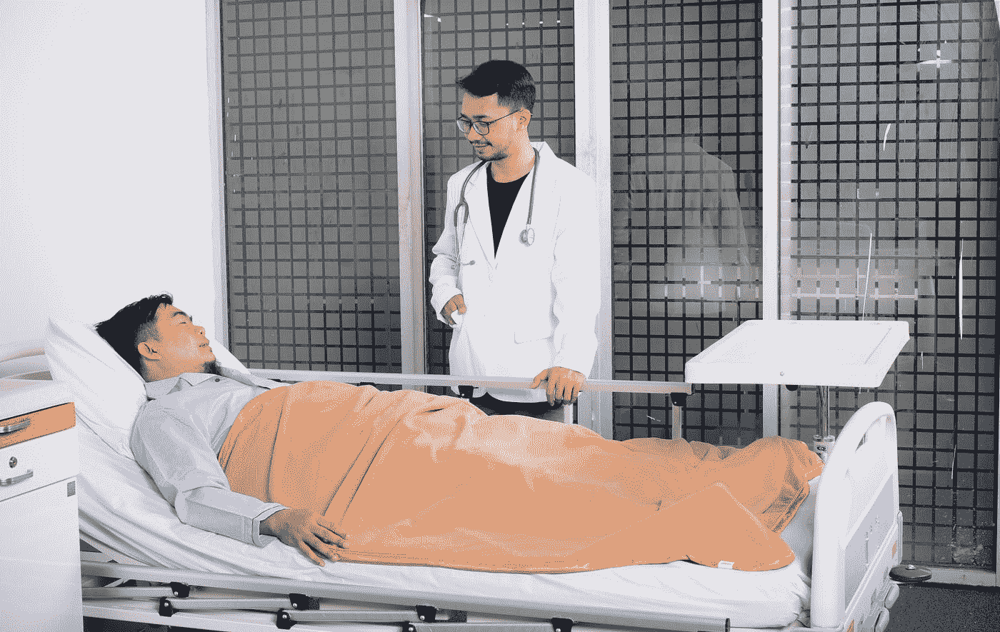****

****Photo by [Ali Yahya](https://unsplash.com/@ayahya09?utm_source=medium&utm_medium=referral) on [Unsplash](https://unsplash.com?utm_source=medium&utm_medium=referral)****