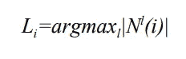
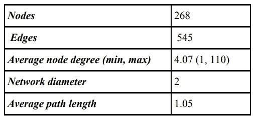
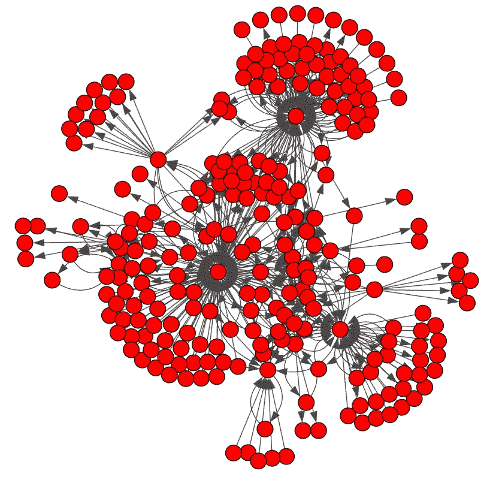
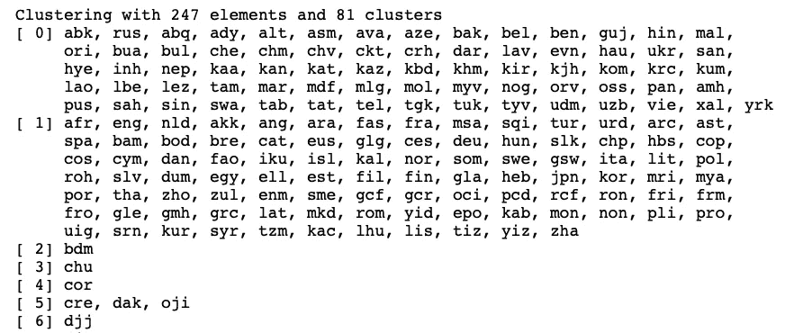
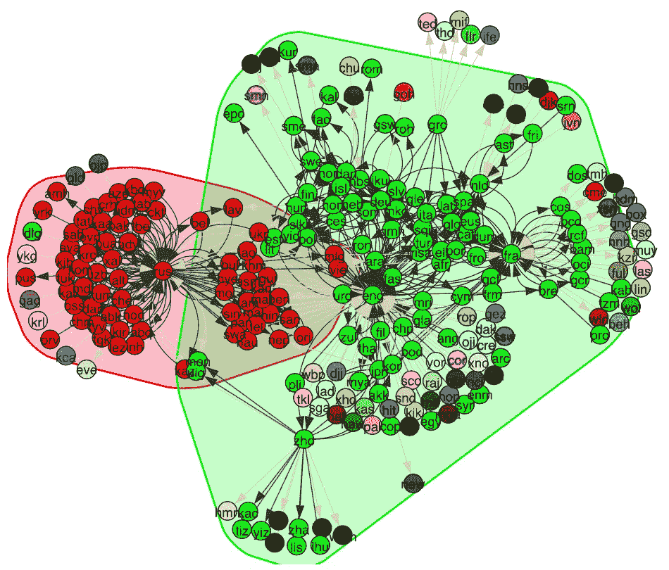
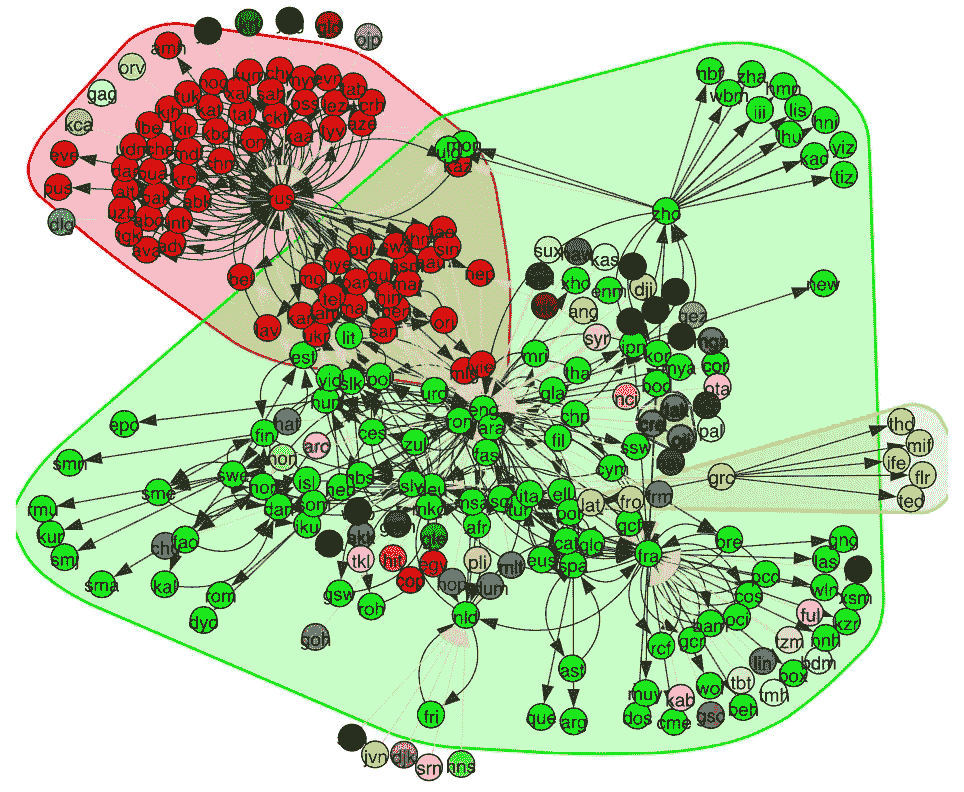
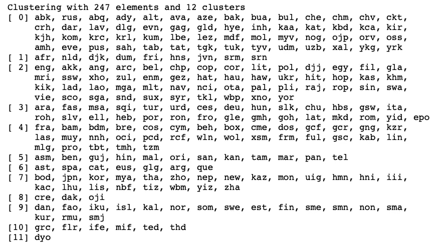
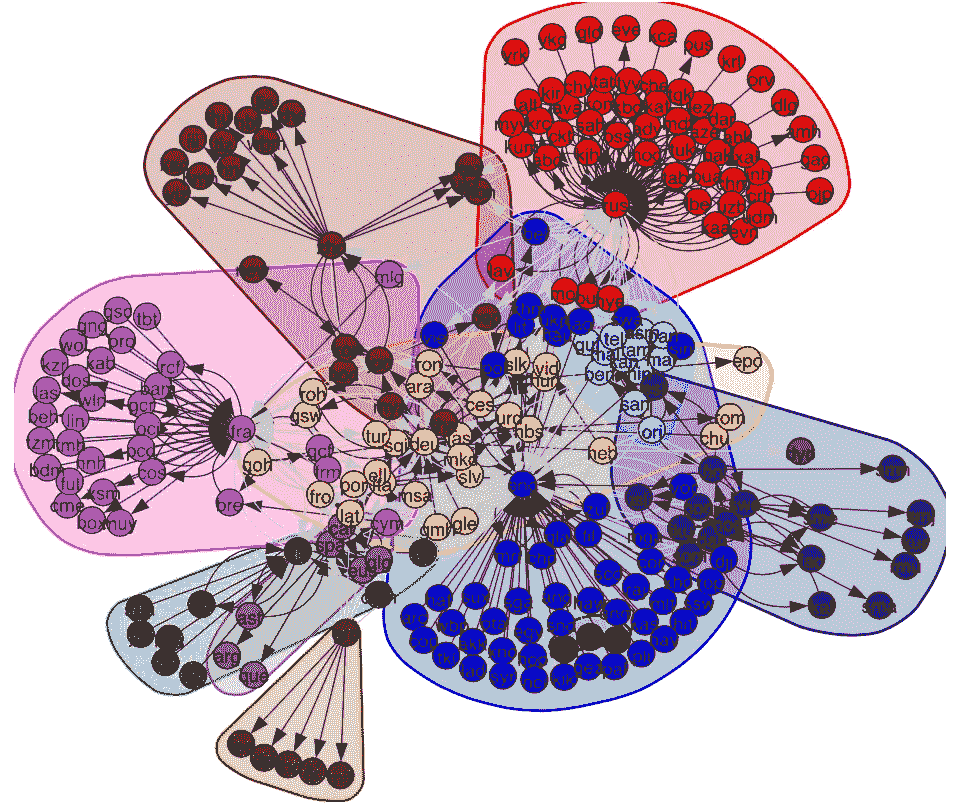

# 检测语言共现网络中的社区

> 原文：<https://towardsdatascience.com/detecting-communities-in-a-language-co-occurrence-network-f6d9dfc70bab?source=collection_archive---------9----------------------->

## 用 Python 实现 Igraph 中的社区发现算法


Photo by [Perry Grone](https://unsplash.com/@perrygrone?utm_source=medium&utm_medium=referral) on [Unsplash](https://unsplash.com?utm_source=medium&utm_medium=referral)

在这篇文章中，我们将在 python 包 Igraph 中进行社区检测，尝试检测语言共现网络中的社区。这将使用两种流行的社区检测算法来实现:Walktrap 和标签传播

## 背景

全球语言共现网络(GLCNs)链接可能共同使用的语言。将语言共现表示为一个网络可以推断国际信息共享和知识转移。这包括该语言使用者接收信息的多样性、接收信息的速度以及母语使用者在全球传播信息的能力。

让我们从建立网络交换的正式基础开始。这是一个基本图形的思想，它由一组节点(或顶点)以及它们之间的一组链接(或边)组成。图可以是有向的(边表示单向关系)或无向的(边表示双向关系，因为每条边都可以双向遍历)。此外，一个图可以是双重的，在这种情况下，两个集线器之间的任何连接要么存在，要么不存在。另一方面，图可以是加权的，在这种情况下，任何连接都被赋予特定的权重或尊重，这通常是一个(正)数。这里的目的是展示关于复杂网络假设(和非正式社区调查)的网络形式概念的早期和简要交流，并描绘(大部分通过模型)通常用于在图论基础上识别网络的众多计算系统中的几个。在这里，我们通过使用现有的算法来发现图中的社区结构，来描绘全球语言共现网络中的语言共现的思想

## 步行陷阱

Walktrap 由 Pascal Pons 开发，是图论中的一种算法，用于通过随机行走来识别大型网络中的社区。这些随机行走然后被用于计算节点之间的距离。然后通过自底向上的分层聚类将节点分配到具有较小的社区内距离和较大的社区间距离的组中。当然，应该注意，该算法只考虑每个节点一个社区，这在某些情况下可能是不正确的假设。

## 标签传播

标签传播，或 LPA，由 U.N.Raghavan 提出，是一种近线性社区检测解决方案，受益于相当简单的实现。该算法的工作原理如下:

1.  网络的特征是图 G(V，E)，其中 V 是节点的全集，E 是边的全集。
2.  对于节点 i(i ∈ V)，设 Li 表示 I 的标号，N(i)表示其邻居的集合
3.  在过程开始时，每个节点被分配一个唯一的标签，例如 Li = i
4.  然后，这些标签在整个网络中传播，每个节点在每次迭代中将其标签更新为由大多数邻居共享的标签。
5.  重复该过程，直到每个节点具有其邻居的最频繁标签之一，即，没有节点需要改变它们的标签。

6.最后，社区由共享相同标签的节点构成



## 资料组

麻省理工学院(MIT)的图书翻译全球语言网络将用于这篇文章。该数据集是一个有向网络，来自 1979 年至 2011 年全球出版的超过 220 万本书籍的翻译。翻译数据来自联合国教科文组织的翻译索引——印刷书籍翻译的国际索引。在网络中，节点代表不同的语言，而边代表一本书从一种语言到另一种语言的翻译。数据集中平移的频率(共现频率)可用于加权边。



Properties of the obtained graph

## 履行

我们选择的算法(Walktrap 和 Label Propagation)将使用 iGraph 包在 Python 中实现，测试准备工作相当简单。首先，iGraph 只需要 SourceNode、DestinationNode 和 Weight，幸运的是我们的数据集默认提供这 3 列。首先，我们可以使用 iGraph 函数将网络加载到工作区:Read_Ncol，如下所示:

```
import cairocffi
import igraphg = igraph.Graph.Read_Ncol('books.txt', directed = True)
```

我们可以简单地使用

```
igraph.plot(g)
```

要获得网络的图形表示:



Book Translation Network implemented in igraph

iGraph 中的 Community_walktrap 带两个可选参数；权重和步数，其中权重是包含要执行的随机行走长度中的边权重和步数的列表。使用 Read_Ncol 将权重自动分配为第三列，因此要在函数中指定权重，简单如下

```
weights=g.es[“weight”]
```

其中“g”是读入的图表。一般来说，在实施中使用 3、4 或 5 个步骤。在这篇文章中，我们将使用 4。

运行 community_walktrap 将返回一个 VertexDendrogram 对象，该对象最初是以最大模块性切割的。在这个对象上运行 as_clustering()会返回一个 VertexClustering 对象，它描述了一个图的顶点集的聚类情况。

```
wtrap = g.community_walktrap(weights=g.es["weight"], steps = 4)
clust=wtrap.as_clustering()
```



A sample of the VertexClustering object from the walktrap algorithm

虽然这很好，但看起来并不特别有趣！然后，我们可以使用 plot()在 iGraph 中绘制该结果，其中有两个参数 mark_groups 和**visual_style，其中 mark_groups 指定是否通过彩色多边形高亮显示某些顶点组，visual_style 指定视觉属性。我们可以简单地设置一个 python 字典，其中包含我们希望传递给 plot()的关键字参数，在本例中，plot()标记顶点标签。

```
visual_style = dict()
visual_style["bbox"] = (700, 600)
visual_style["vertex_label"] = g.vs["name"]igraph.plot(clust,mark_groups = True,**visual_style)
```



Plotting the output of the walktrap algorithm on our dataset

输出显示形成了两个主要社区，分别包含 71 和 94 个节点，以及第三个更小的社区，只有 3 个成员。剩余的 100 个节点(37.3%)每个都被分配到它们自己的集群(即 n=1)，这在我们的社区定义中不计算在内。然而，这两个主要社区似乎围绕着英语和俄语，我们可以通过回顾顶点群集对象并查看每个社区的成员来进一步验证这一点。

标签传播是一种更简单的方法，不需要参数，但是有一些可选的参数；权重、初始权重和固定权重，其中权重与 walktrap 方法中的结构相同。然而，initial 可以是初始顶点标签的列表，而 fixed 是每个顶点的布尔列表，其中 True 对应于在算法期间标签不应改变的顶点。这最后两个参数在我们的测试中不是必需的，只有权重在参数中指定。与 walktrap 不同，标签传播不返回树图对象，而是直接返回顶点聚类对象，然后可以用与 walktrap 方法相同的方式绘制该对象。

```
labelProp = g.community_label_propagation(weights=g.es["weight"])
igraph.plot(labelProp,mark_groups = True,**visual_style)
```



Plotting the output of the Label Propagation algorithm on our dataset

正如 Walktrap 算法所发现的，在加权数据集上运行标签传播识别出两个大小相似的主要社区，分别有 70 个和 102 个成员。然而，还有两个小社区，分别有 3 名和 8 名成员。同样，由于该方法的聚集性，约三分之一的节点没有被分类到社区中(n=85，数据集的 31.7%)

值得注意的是，图的高权重和密集性质对算法在此分析中的工作方式有相当大的影响。例如，对于 walktrap，在一个未加权的图中，一个与邻居有 3 条未加权边的节点将有 1/3 的机会随机遍历每条边。然而，当考虑到权重时，选择高权重边(主要是英语和俄语)的概率变得极高，导致行走被卡在单个边上来回。标签传播的情况略有不同；每次迭代后，节点标签更新为其大多数邻居共享的标签。由于俄语和英语具有如此高的入度和出度，大多数节点在其邻域集中具有这两种语言中的一种，这意味着这些节点很可能会更新标签以匹配上述两种语言的标签，当考虑边权重时更是如此。

## 不使用边缘权重重新运行

尽管移除权重不会对标签传播的社区结构产生太大影响，但它会对 Walktrap 算法的结果产生很大影响。因此，我们可以重新运行算法，不指定权重:

```
wtrapnoweights = g.community_walktrap(steps = 4)
clustnoweights=wtrapnoweights.as_clustering()
```



VertexClustering object from Walktrap using an unweighted graph

我们已经可以看到更多的社区已经形成，这看起来是一个更有趣的结果。所以我们来策划一下吧！

```
wtrapnoweights = g.community_walktrap(steps = 4)
clustnoweights=wtrapnoweights.as_clustering()igraph.plot(clustnoweights,mark_groups = True, **visual_style)
```



Output of the walktrap algorithm on our dataset with no weights

重复测试，这一次给所有的边相同的权重产生了非常不同的结果。检测到十个社区，只有一个节点被分配到自己的集群。在已确定的社区规模方面也不太不平衡(平均 22.4 个节点成员；最低 3；最大 54)。这个结果实际上非常有趣，如果你看看 VertexClustering 对象，再看看 community 9，它表明所有的斯堪的纳维亚语言已经形成了一个社区，还有 community 7，它已经将许多亚洲语言聚集在一起，如朝鲜语和日语。

## 结论

在这篇文章中，我们使用图书翻译全球语言网络比较了两种聚集社区检测算法。我们发现，当使用加权网络时，两种方法都不会在数据集中生成许多不同的社区。相反，一般来说，形成了两个主要群体。这表明没有明显的语言群体，相反，在这个网络中，信息共享发生在国际一级。这一结论得到了以下事实的支持:通过定性地考虑社区成员的语系，我们确定了两种方法确定的两个主要社区在规模和组成方面的相似性。表明这些发现不是所用方法的产物。通过移除边权重，我们发现基础数据集的这一属性在社区形成中非常重要。然而，还不知道在这项工作中使用的边缘权重是否真正代表语言共现频率。边缘权重来自许多不同的国际图书馆向联合国教科文组织报告的数据。这些数据可能会受到不同地点的报告偏差的影响，不同的地点遵循不同的做法，并具有不同的完整性水平，而且它们也可能不是最新的。这需要进一步调查。

一个有趣的扩展可能是在图上重新运行算法，但是没有英语和俄语节点。我们预计这将返回一组更有趣的社区，它们不会受到对高度连接的节点和权重较大的边的较大偏好的影响。

感谢您查看这篇文章！虽然这不是我通常会创造的那种东西，但我发现社区检测的想法很吸引人。完整的信息和代码可以在下面的我的 Github 上找到

[](https://github.com/HarryBitten) [## 哈里比特-概述

### HarryBitten 有 4 个存储库可用。在 GitHub 上关注他们的代码。

github.com](https://github.com/HarryBitten) 

下次再见！