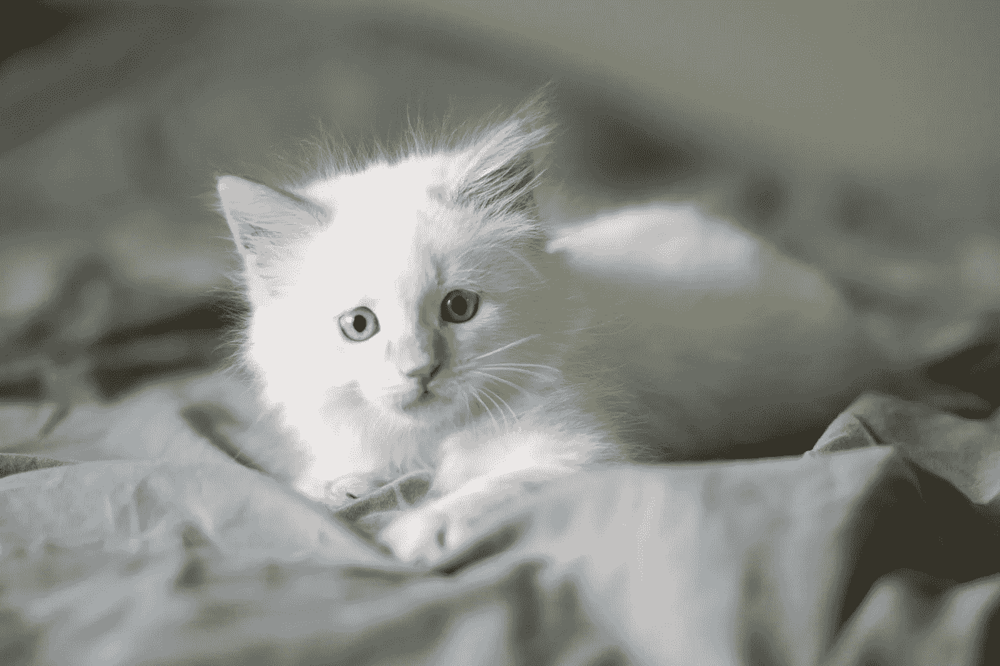

# 在 iOS 上检测可爱的动物:续

> 原文：<https://towardsdatascience.com/detecting-cute-animals-on-ios-a-continuation-a5fd6beec1d9?source=collection_archive---------36----------------------->

## 在 iOS 上构建自定义图像分类器应用程序

Photo by [Austin Kirk](https://unsplash.com/@austinkirk?utm_source=unsplash&utm_medium=referral&utm_content=creditCopyText) on [Unsplash](https://unsplash.com/s/photos/cute-animal?utm_source=unsplash&utm_medium=referral&utm_content=creditCopyText)

之前写过[为一部手机](/detecting-cute-animals-with-machine-learning-d39a511bd144)做一个带机器学习的可爱动物探测器。当时，我必须只为 Android 开发，因为 iOS 工具与我用来训练模型的工具不兼容。但是现在 iOS 工具更新了，我有了一些时间，所以下面是我在 iOS 上实现我的可爱动物检测器所做的事情。

# 转换模型

在 iOS 上，CoreML 是用于机器学习模型的格式。苹果提供了[工具，能够以一种简单明了的方式将我拥有的 Keras 模型转换成 CoreML](https://apple.github.io/coremltools/generated/coremltools.converters.keras.convert.html) 。

Converting the trained model to be used on iOS

与 Android 的情况一样，转换器需要提供输入形状。然而，在这种情况下，输入张量中的第一个维度必须为零，而不是设置为 1。需要 image_input_names 和 class_labels，以便 iOS 应用程序知道模型 1)处理图像，2)是分类器。这使得编写应用程序代码更加容易，因为有专门用途的 API 可用。

# 在 iOS 上读取相机

该应用需要在 iOS 和 Android 上做同样的事情:

1.  在屏幕上显示相机预览
2.  让用户按下按钮来捕捉当前图像
3.  将捕获的图像输入分类器
4.  分类完成后显示结果

图像捕捉的 Android 实现实际上没有使用相机。相反，当用户按下按钮时，它会以位图的形式获取预览内容，并生成图像进行分类。在 iOS 上，我没有找到将预览内容提取为位图的方法，所以我选择了指示相机拍摄正确图片的路线。

Photo by [Amy Chen](https://unsplash.com/@spdumb2025?utm_source=unsplash&utm_medium=referral&utm_content=creditCopyText) on [Unsplash](https://unsplash.com/s/photos/cute-animal?utm_source=unsplash&utm_medium=referral&utm_content=creditCopyText)

在应用程序可以访问摄像机之前，用户必须授予它权限。还有其他可能的授权状态，当被询问时，用户可能会拒绝许可，但是对于一个仅关于使用相机的示例应用程序，我认为假设许可已经或将要被授予是没问题的。

Checking for permission to use the camera, and requesting it if needed

对于相机的自定义使用，如在这个应用程序中，AVKit 是要使用的平台库。需要创建并启动摄像机会话。在会话中，有输入和输出，输入连接到输出。在这种情况下，输入设置为来自后置摄像头的视频输入，以便屏幕可以显示实时预览，输出是一张照片，因为该应用程序处理单张照片。

Creating and starting the camera session

照片输出是用来拍照的。evaluate 按钮的 target 方法创建一个 settings 对象，其中默认设置适合此用途，并指示要捕获的照片。

Callback method to take a photo

# 裁剪照片

在 Android 应用程序中，应用程序正在处理位图，这使得裁剪和缩放变得容易。在 iOS 上，AVKit 将产生一个 AVCapturePhoto 对象，它需要更多的工作来匹配屏幕，因为屏幕分辨率与照片分辨率不同。

Cropping a captured photo to include only the part shown on screen

在这种情况下，支持裁剪的最佳图像类型是 CGImage。与用于屏幕显示的 UIImage 不同，CGImage 不知道它的方向，因此需要从 AVCapturePhoto 对象中提取。方向用于确保屏幕边界的方向与照片的方向相同，以便可以正确计算缩放因子。(宽度和高度尺度不同；使用身高是正确的，但我不知道为什么。)

要提取用于分类的图片是照片中心的 299x299 区域。因此，代码将一个 299x299 的矩形缩放到照片分辨率，将其居中，并进行裁剪。最后，返回一个具有适当的屏幕缩放因子和方向的 UIImage，因为使用 UIImage 比使用 CGImage 更方便。

Photo by [Liliya Lisa](https://unsplash.com/@lilissa?utm_source=unsplash&utm_medium=referral&utm_content=creditCopyText) on [Unsplash](https://unsplash.com/s/photos/cute-fox?utm_source=unsplash&utm_medium=referral&utm_content=creditCopyText)

# 运行分类器

创建模型最好在启动时完成，因为它不会在应用程序运行时改变，并且需要一段时间来创建。创建的模型类型来自 Vision framework，这是一个很好的用于图像分类的库。

Creating a model object to run classification

当试图用默认配置运行模型时，我遇到了一个溢出错误，[显然意味着模型对于神经引擎](https://stackoverflow.com/questions/54773171/espresso-aneruntimeengine-program-inference-overflow)来说太大了。这就是为什么它仅限于 CPU 和 GPU 的原因。

从 Vision 框架开始分类非常简单。使用模型和回调方法创建分类请求，从(裁剪的)图像创建处理程序，并使用请求调用处理程序。

Starting classification of the image

分类器完成后，将使用结果调用完成方法。该方法验证结果是分类结果。由于模型被转换为一个带有适当输出标签的图像分类器，代码可以查找标识符“cute ”,而不需要知道哪个索引对应于哪个类。

# 摘要

构建 iOS 应用比构建 Android 应用要简单一些，部分原因是我已经有了一些 Android 应用的经验。最大的障碍是需要对捕获的照片进行图像处理，因为我对 UIImage、CGImage 和 AVCapturePhoto 的复杂性不是很熟悉。正如在制作了 Android 应用程序之后，我现在对自己在真正的 iOS 应用程序中应用机器学习的能力更有信心了。

Screenshot of the app evaluating a dog

是的，还能用。