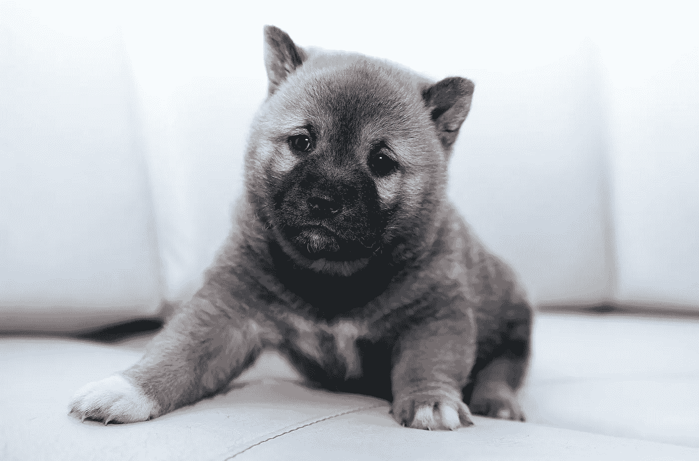
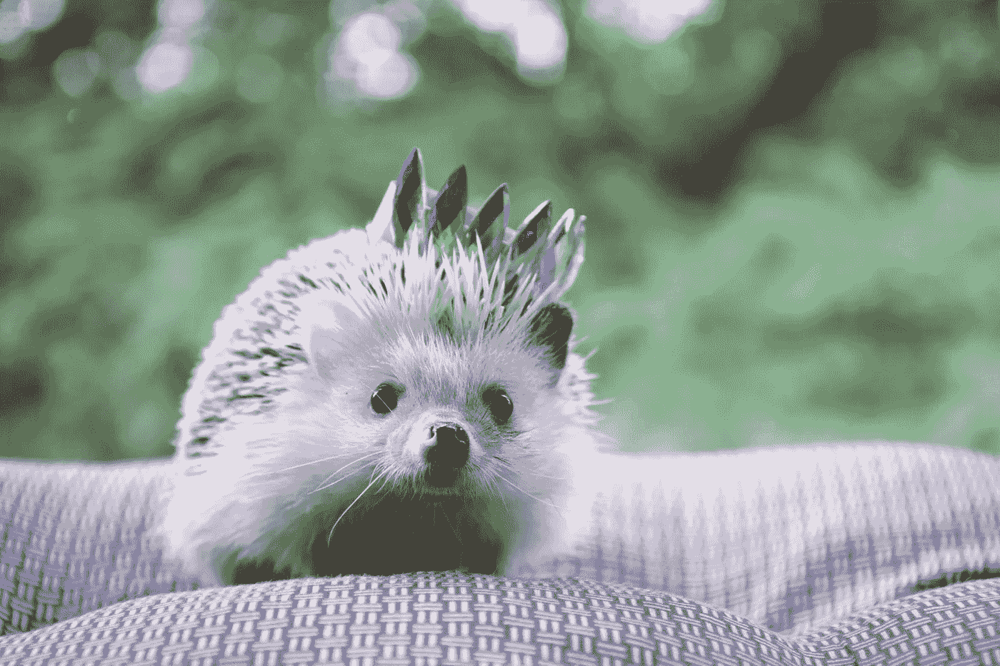
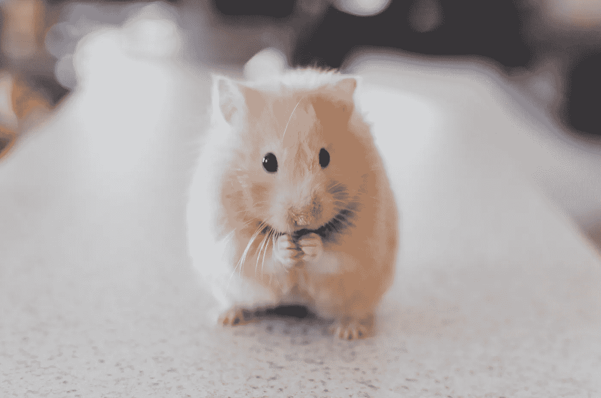
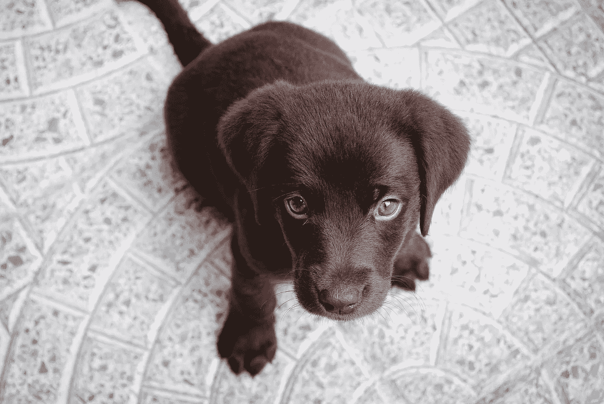
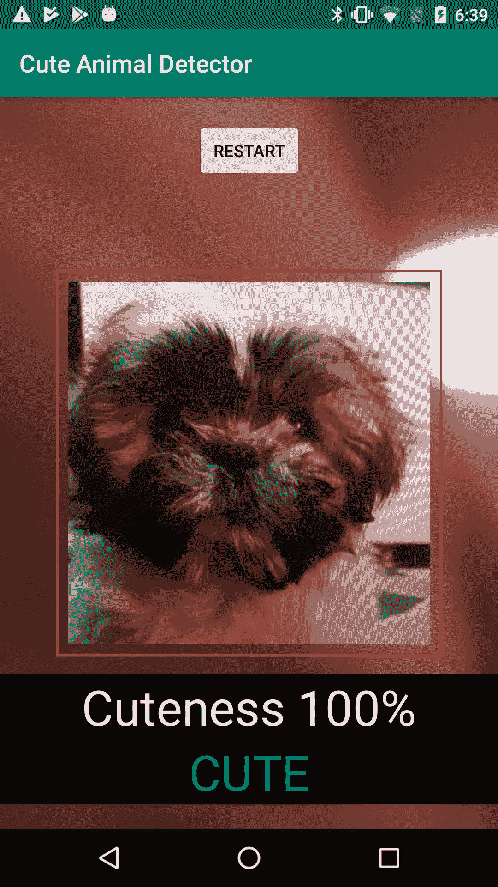

# 用机器学习检测可爱的动物

> 原文：<https://towardsdatascience.com/detecting-cute-animals-with-machine-learning-d39a511bd144?source=collection_archive---------17----------------------->

## 培训和构建自定义图像分类器移动应用程序

Photo by [Álvaro Niño](https://unsplash.com/photos/e9ZJpC8P0UY?utm_source=unsplash&utm_medium=referral&utm_content=creditCopyText) on [Unsplash](https://unsplash.com/search/photos/cute?utm_source=unsplash&utm_medium=referral&utm_content=creditCopyText)

当我的一位数据科学家同事最近发现我有移动应用开发背景时，他让我向他展示如何在移动应用中使用机器学习模型。我认为一个图像分类应用程序，比如经典的 [Not Hotdog](https://medium.com/@timanglade/how-hbos-silicon-valley-built-not-hotdog-with-mobile-tensorflow-keras-react-native-ef03260747f3) ，将是一个很好的例子，因为它也需要连接到手机的摄像头，而不仅仅是一个运行在手机而不是桌面上的模型。

我花了一段时间来拼凑我需要的所有东西，以制作一个完整的应用程序。这就是为什么我认为写一个帖子会很有用，这样整个旅程都可以在一个地方记录下来。我写的所有代码，获取训练图像，训练模型，以及应用程序本身，都可以在 Github 上[获得。代码经过了全面的注释，因为我希望它对数据科学家和移动应用程序开发人员都有用。](https://github.com/asharov/cute-animal-detector)

# 建什么？

起初我以为我只是建立一个热狗探测器，并发现了一个[职位，通过模型建立部分](/building-the-hotdog-not-hotdog-classifier-from-hbos-silicon-valley-c0cb2317711f)。但是我身边没有很多热狗，所以演示这样一个应用程序会很困难。因为我喜欢可爱的动物，所以我决定做一个可爱探测器，作为一个更抽象的概念，它可以在许多日常环境中演示。

对于训练数据的来源，我挑了 [ImageNet](http://image-net.org/) 。我决定将小狗和小猫的图片作为我的“可爱”训练数据，并有点武断地将爬行动物和有蹄动物作为我的“不可爱”训练数据。在过滤掉不可用的图片后，我剩下了 1718 个可爱的图片和 1962 个不可爱的图片。视觉上验证我有好的数据肯定验证了爬虫的选择是“不可爱”。Brrrrr…

# 利用初始迁移学习

对于自定义图像分类，[迁移学习](https://machinelearningmastery.com/transfer-learning-for-deep-learning/)是必由之路。从头开始训练一个图像分类器需要很长时间，我能想到的任何网络架构都不会比当前的技术水平更好。我选择了 InceptionV3，因为我找到了一篇关于如何用它制作一个自定义图像分类器的示例代码为的[好文章。](https://medium.com/abraia/first-steps-with-transfer-learning-for-custom-image-classification-with-keras-b941601fcad5)

建立模型的关键点是以 InceptionV3 模型为基础，增加一个新的分类层，并将训练限制在新的分类层。由于训练数据来自 ImageNet，因此 InceptionV3 构造函数被告知使用这些权重。另一个参数表示排除顶层，顶层进行实际的分类，因为我将使用我自己的层进行分类。

Building an image classifier out of the Inception model

如今，图像分类已经从在每个卷积层之后使用池化，转移到在最后使用全局平均池化。因此，基本的 InceptionV3 模型扩展了一个 GAP 层，最后是一个具有两个节点的 softmax 分类层，因为有两个类要预测，可爱和不可爱。在最后一步中，来自基本 InceptionV3 模型的所有层都被标记为不可训练，因此训练仅适用于添加的自定义层。

Photo by [Liudmyla Denysiuk](https://unsplash.com/photos/iJ9o00UeAWk?utm_source=unsplash&utm_medium=referral&utm_content=creditCopyText) on [Unsplash](https://unsplash.com/search/photos/cute?utm_source=unsplash&utm_medium=referral&utm_content=creditCopyText)

# 用于培训的数据

我已经下载了我的训练图像，现在需要做一点工作来为训练做准备。为 Keras 设置数据的一个好方法是为每个训练、验证和测试数据集创建目录。然后，在每个目录中，为每个标签创建一个子目录，并将每个标签的图像放在相应的子目录中。所以我有目录“可爱”和“不可爱”。这使得 Keras 在训练过程中自动拾取标签。

在进行影像分类时，扩充数据总是一个好主意。Keras 配备了现成的 [ImageDataGenerator](https://keras.io/preprocessing/image/) ，可用于通过不同的转换自动增加图像数据。

Making a generator to augment the training data dynamically

ImageDataGenerator 用参数初始化，参数是它应该执行哪种类型的转换。我没有选择任何会引入失真的，因为失真可能会删除可爱。InceptionV3 期望像素在范围[-1，1]内，它提供了函数`preprocess_input`来对该范围执行最小-最大缩放。这个函数被传递给生成器，这样生成的图像将是适当的格式。

然后设置生成器从图像目录中产生图像。参数数据集可以是“训练”或“测试”，这取决于是生成训练数据还是验证数据。图像大小 299x299 是 InceptionV3 所期望的。

# 构建模型

用生成器训练模型非常简单。五个纪元似乎适合这项任务。事实上，在第三个纪元之后，我没有看到任何改进。有了这些参数，我在 Macbook 上的训练大概花了 2.5 个小时，我觉得还是挺合理的。

Training the model

上面的最后一行`model.save('iscute.h5')`，以 Keras 使用的 HDF5 格式保存模型。这不是用于移动应用程序的格式。对于 Android，我选择使用 tensorflow-lite。(我想用 CoreML 做一个 iOS 应用，但是我用的是 Python 3.7，CoreML 工具还不支持那个版本。)Tensorflow 自带合适的转换器，所以这里没有太多代码。我得到的 HDF5 文件大小为 84 MB，而 tensorflow-lite 文件为 83 MB，因此大小没有太大的减少。

Converting the trained model to be used on Android

这里唯一令人头痛的是发现对`input_shapes` 参数的需求。在没有该参数的情况下第一次运行时，我得到了错误消息“ValueError: None 仅在第一维中受支持。张量“input_1”具有无效的形状“[无，无，无，3]”。所需的尺寸是图像尺寸 299x299，错误消息指出使用什么张量名称作为字典参数中的键。

Photo by [Ricky Kharawala](https://unsplash.com/photos/adK3Vu70DEQ?utm_source=unsplash&utm_medium=referral&utm_content=creditCopyText) on [Unsplash](https://unsplash.com/search/photos/cute?utm_source=unsplash&utm_medium=referral&utm_content=creditCopyText)

# 在 Android 上读取摄像头

现在我已经准备好在应用程序中使用我的模型，所以是时候构建应用程序了。它需要执行以下操作:

1.  在屏幕上显示相机预览
2.  让用户按下按钮来捕捉当前图像
3.  将捕获的图像输入分类器
4.  分类完成后显示结果

我还不知道如何做的部分是 1 和 3。此外，Android 相机 API 已经改变，我能找到的许多教程仍然是为旧的、过时的版本编写的。幸运的是，我确实找到了[一个详细列出了所有需要做的事情的帖子](https://android.jlelse.eu/the-least-you-can-do-with-camera2-api-2971c8c81b8b)。访问相机图像需要相当多的代码，所以我不会在这里展示其中的大部分。[检查存储库](https://github.com/asharov/cute-animal-detector)中的完整代码。

准备图像捕捉需要获得一个`CameraManager`，请求用户允许使用相机(除非已经被授权)，并获得一个包含预览的`TextureView`的引用。一个真正的应用程序将需要为相机许可不被授予做好准备。

Preparing for using the Android camera

在`TextureView`可用之前，相机无法显示任何内容，因此应用程序可能需要通过设置监听器来等待。之后，该应用程序需要找到一个合适的相机(这里的背面)并打开它。

Waiting until the camera is available before starting to use it

Finding a backwards-facing camera

Opening the discovered backwards-facing camera

`openCamera()`方法传入一个状态回调。当相机打开时，将通知该回调，它可以触发创建相机预览会话，以便当用户按下评估按钮时相机图像可用。

Creating a session with the camera to capture the image

Photo by [Jairo Alzate](https://unsplash.com/photos/sssxyuZape8?utm_source=unsplash&utm_medium=referral&utm_content=creditCopyText) on [Unsplash](https://unsplash.com/search/photos/cute?utm_source=unsplash&utm_medium=referral&utm_content=creditCopyText)

# 在 Android 上进行分类

为了弄清楚如何进行分类，我简要地看了一下 [Tensorflow-lite 指南](https://www.tensorflow.org/lite/guide)。虽然它有助于开始，但它对代码的实际细节帮助很小。对于细节，我浏览了进行图像分类的[示例应用程序](https://github.com/tensorflow/tensorflow/tree/master/tensorflow/lite/java/demo)，并从非常一般的代码中提取出我需要的特定位。

初始化分类器意味着将模型从应用程序的资产加载到内存中，并从中创建 Tensorflow `Interpreter`对象。图像分类器的输入被有效地作为一个`ByteBuffer`给出，它是如此之大，以至于在初始化过程中预分配它是有意义的。

Initializing the Tensorflow-lite classifier

当在图像上运行分类器时，在后台线程中执行它是很重要的。它需要几秒钟的时间来运行，让 UI 线程等待那么长时间是不可接受的。首先要做的是在缓冲区中以正确的格式创建输入:将图像缩放到 299x299，并运行最小-最大缩放以获得范围[-1，1]的像素值，如 InceptionV3 所预期的。

Preprocessing the captured image into suitable input for InceptionV3

最后，可以运行分类器。`run()`方法的类型不是很有帮助，因为它只需要一个`Object`作为输入和输出。如上所述，对于图像分类，`ByteBuffer`是一种很好的输入格式。这个分类案例的输出是一个单元素数组，它的元素是一个浮点数组，其大小是类的数量。运行之后，这个浮点数组将被每个类的概率填充。所以在我的例子中，它是一个两元素的数组，元素是“可爱”和“不可爱”的概率。

Running the Tensorflow-lite classifier

在这个阶段，我没有找到一种方法来确定哪个类对应于数组中的哪个索引。因此，需要从 Keras 模型中提取类到索引的映射，并可能作为数据包含在应用程序中，以防不同训练运行之间的映射不稳定。

# 摘要

最终，构建一个图像分类器应用程序并不太困难。它跨越了几个领域，所以信息并不都在一个地方，但是当你看的时候，它们都在某个地方。我构建的应用程序当然只是一个演示，但现在知道了原理和方法，我有信心我也可以在真正的应用程序中添加这种功能。

Screenshot of the app evaluating a dog

是的，我认为我的模型工作得很好。