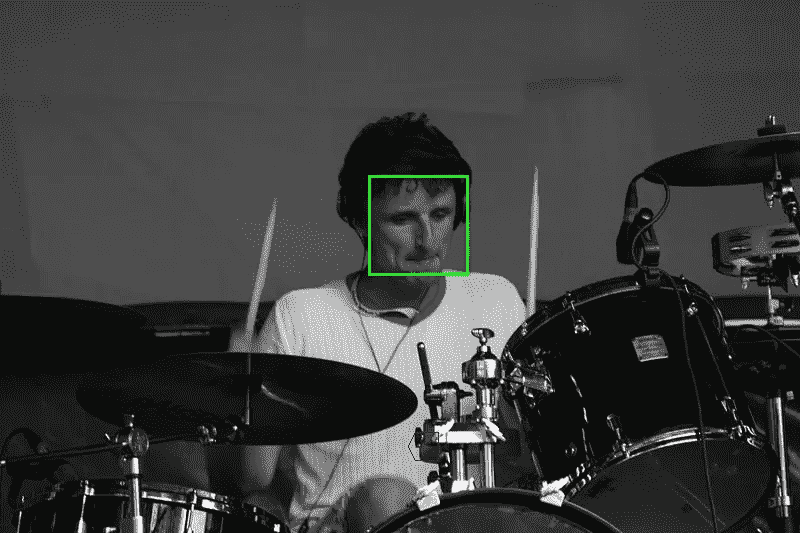

# 用 Python 和 OpenCV 人脸检测神经网络检测人脸

> 原文：<https://towardsdatascience.com/detecting-faces-with-python-and-opencv-face-detection-neural-network-f72890ae531c?source=collection_archive---------5----------------------->



Cool Kids of Death Off Festival

现在，我们都知道人工智能正变得越来越真实，它正在一天天填补人类和机器之间的能力差距。它不再只是一个花哨的词了。多年来，它在许多领域取得了许多进展，其中一个领域就是计算机视觉。

就计算机视觉而言，它的目标是训练机器像人类一样看待和识别世界。并且还收集足够大的知识来执行图像和视频识别、图像分析和分类、媒体再现、自然语言处理等。

# 卷积神经网络

随着时间的推移，计算机视觉的进步已经逐渐实现并完善，主要是通过一种特定的算法，卷积神经网络(CNN 或 ConvNets)，这是一种特殊类型的前馈网络，主要用于分析视觉图像。卷积神经网络非常类似于普通的神经网络，但是由具有可学习的权重和偏差的神经元组成。

由于其独特的过程，ConvNets 比其他深度神经网络架构性能更好。ConvNets 不是一次看一个像素，而是将几个像素组合在一起，这样他们就可以了解时间模式。另一方面，ConvNets 可以“看到”形成直线或曲线的一组像素。由于深度神经网络的深层性质，在下一个级别中，他们将看到的不是像素组，而是形成一些形状的线条和曲线组。如此等等，直到它们形成完整的画面。

# 迁移学习

然而，CNN 需要大数据集和大量的计算时间来训练。有些甚至需要跨多个 GPU 花费 2-3 周的时间。如果你想了解 CNN，你需要学习很多东西，从最基本的东西开始，像内核、池层等等。但是现在，你可以直接潜水，使用这项技术的很多开源项目。

这实际上是真的，因为有一种叫做迁移学习的技术。迁移学习是一种非常实用和强大的技术，它利用经过训练的模型，而不是从头开始训练网络。迁移学习利用不同数据集上的训练模型，并使其适应我们试图解决的问题。

为了构建我们的应用程序，我们将遵循迁移学习技术，并使用一个经过训练的模型，该模型是使用 Caffe 框架训练的，Caffe 框架是一个考虑到表达、速度和模块化的深度学习框架。Caffe 附带了一个存储库，供研究人员和机器学习从业者用来共享他们训练过的模型。这个图书馆叫做模型动物园。你可以通过浏览他们的[文档](http://caffe.berkeleyvision.org/model_zoo.html)来了解所有相关信息。

# 入门指南

python 代码、经过训练的 caffe 模型和 prototxt 文件(包括网络的文本描述和一些用于我们的应用程序的示例图像)可以在 [github 资源库](https://github.com/HimashaHarinda/face-detection-app)中找到，如果您想看一看的话。

在我们的应用程序中，我们将使用以下库:

1.  OpenCV 支持许多与计算机视觉和机器学习相关的算法，更不用说它内置于我们将在应用中使用的深度神经网络中。
2.  Numpy，这是一个用于 python 科学计算的包。
3.  OS，它提供了一种使用操作系统相关功能的可移植方式

因此，为了安装它们，您可以在命令提示符窗口中运行以下命令。`pip install opencv-python`要安装 OpenCV，`pip install numpy`要安装 Numpy，您不需要专门安装 OS 库，因为它随 Python 安装一起提供，但是您仍然必须导入它。

# 构建应用程序

首先，让我们创建一个名为 faceDetection.py 的文件，并导入我们的库。

```
#import libraries
import os   
import cv2
import numpy
```

现在，我们将获得工作目录的绝对路径，在那里我们将放置所有的图像，

```
#import libraries
import os   
import cv2
import numpy#get the absolute path of the working directory
dir_path = os.path.dirname(os.path.realpath(__file__))
```

现在，我们将创建一个名为“输出”的文件夹来存放我们的最终图像，如果它还不存在的话。

```
#import libraries
import os   
import cv2
import numpy#get the absolute path of the working directory
dir_path = os.path.dirname(os.path.realpath(__file__))#create the Output folder if it doesn't already exist
if not os.path.exists('Output'): 
  os.makedirs('Output')
```

之后，我们将从当前工作目录加载我们预先训练好的模型和 prototxt 文件。

```
#import libraries
import os   
import cv2
import numpy#get the absolute path of the working directory
dir_path = os.path.dirname(os.path.realpath(__file__))#create the Output folder if it doesn't already exist
if not os.path.exists('Output'): 
  os.makedirs('Output')#Reads the network model stored in Caffe framework's format.
model = cv2.dnn.readNetFromCaffe('deploy.prototxt', 'weights.caffemodel')
```

然后，我们将遍历当前文件夹中可用的文件，检查是否有扩展名为的文件。png，。jpg 和. jpeg。

```
#import libraries
import os   
import cv2
import numpy#get the absolute path of the working directory
dir_path = os.path.dirname(os.path.realpath(__file__))#create the Output folder if it doesn't already exist
if not os.path.exists('Output'): 
  os.makedirs('Output')#Reads the network model stored in Caffe framework's format.
model = cv2.dnn.readNetFromCaffe('deploy.prototxt', 'weights.caffemodel')for file in os.listdir(dir_path):
  #split the file name and the extension into two variales
  filename, file_extension = os.path.splitext(file) #check if the file extension is .png,.jpeg or .jpg 
  if (file_extension in ['.png','.jpg','.jpeg']):
```

如果找到具有上述扩展名的图像，我们将使用 OpenCV 读取该图像，并通过访问 image.shape 元组获得其高度和宽度，然后使用前两个元素在脸部周围绘制矩形。

```
#import libraries
import os   
import cv2
import numpy#get the absolute path of the working directory
dir_path = os.path.dirname(os.path.realpath(__file__))#create the Output folder if it doesn't already exist
if not os.path.exists('Output'): 
  os.makedirs('Output')#Reads the network model stored in Caffe framework's format.
model = cv2.dnn.readNetFromCaffe('deploy.prototxt', 'weights.caffemodel')for file in os.listdir(dir_path):
  #split the file name and the extension into two variales
  filename, file_extension = os.path.splitext(file) #check if the file extension is .png,.jpeg or .jpg
  if (file_extension in ['.png','.jpg','.jpeg']):
    #read the image using cv2
    image = cv2.imread(file) #accessing the image.shape tuple and taking the elements
    (h, w) = image.shape[:2]
```

然后，我们将使用`cv2.dnn.blobFromImage`函数得到我们的斑点，将图像作为输入。使用`cv2.dnn.blobFromImage`函数，我们将图像的尺寸调整为 300x300，1.0 是比例因子，此处我们使用默认值，因此没有缩放，之后是卷积神经网络预期的空间尺寸，最后的值是元组中的平均减法值，它们是 RGB 平均值，最后，函数返回一个“blob”，这是调整大小、平均减法和归一化后的输入图像。

之后，我们将把斑点输入到模型中，并使用`model.foreward`函数得到检测结果。

```
#import libraries
import os   
import cv2
import numpy#get the absolute path of the working directory
dir_path = os.path.dirname(os.path.realpath(__file__))#create the Output folder if it doesn't already exist
if not os.path.exists('Output'): 
  os.makedirs('Output')#Reads the network model stored in Caffe framework's format.
model = cv2.dnn.readNetFromCaffe('deploy.prototxt', 'weights.caffemodel')for file in os.listdir(dir_path):
  #split the file name and the extension into two variales
  filename, file_extension = os.path.splitext(file) #check if the file extension is .png,.jpeg or .jpg 
  if (file_extension in ['.png','.jpg','.jpeg']):
    #read the image using cv2
    image = cv2.imread(file) #accessing the image.shape tuple and taking the elements
    (h, w) = image.shape[:2] #get our blob which is our input image 
    blob = cv2.dnn.blobFromImage(cv2.resize(image, (300, 300)), 1.0, (300, 300), (104.0, 177.0, 123.0)) #input the blob into the model and get back the detections 
    model.setInput(blob)
    detections = model.forward()
```

然后，我们将遍历所有检测到的人脸，并提取它们的起点和终点。我们将提取置信度并将其与置信度阈值进行比较，以便我们可以过滤掉弱检测。如果算法有超过 16.5%的把握检测到的是人脸，我们会在上面显示一个绿色的矩形。

```
#import libraries
import os   
import cv2
import numpy#get the absolute path of the working directory
dir_path = os.path.dirname(os.path.realpath(__file__))#create the Output folder if it doesn't already exist
if not os.path.exists('Output'): 
  os.makedirs('Output')#Reads the network model stored in Caffe framework's format.
model = cv2.dnn.readNetFromCaffe('deploy.prototxt', 'weights.caffemodel')for file in os.listdir(dir_path):
  #split the file name and the extension into two variales
  filename, file_extension = os.path.splitext(file) #check if the file extension is .png,.jpeg or .jpg 
  if (file_extension in ['.png','.jpg','.jpeg']):
    #read the image using cv2
    image = cv2.imread(file) #accessing the image.shape tuple and taking the elements
    (h, w) = image.shape[:2] #get our blob which is our input image 
    blob = cv2.dnn.blobFromImage(cv2.resize(image, (300, 300)), 1.0, (300, 300), (104.0, 177.0, 123.0)) #input the blob into the model and get back the detections 
    model.setInput(blob)
    detections = model.forward()
    #Iterate over all of the faces detected and extract their start and end points
    count = 0
    for i in range(0, detections.shape[2]):
      box = detections[0, 0, i, 3:7] * numpy.array([w, h, w, h])
      (startX, startY, endX, endY) = box.astype("int") confidence = detections[0, 0, i, 2]
      #if the algorithm is more than 16.5% confident that the      detection is a face, show a rectangle around it
      if (confidence > 0.165):
        cv2.rectangle(image, (startX, startY), (endX, endY), (0, 255, 0), 2)
        count = count + 1
```

最后，我们将输出图像保存在我们创建的输出文件夹中，并打印出一条成功消息，让用户知道已经完成了。

```
#import libraries
import os   
import cv2
import numpy#get the absolute path of the working directory
dir_path = os.path.dirname(os.path.realpath(__file__))#create the Output folder if it doesn't already exist
if not os.path.exists('Output'): 
  os.makedirs('Output')#Reads the network model stored in Caffe framework's format.
model = cv2.dnn.readNetFromCaffe('deploy.prototxt', 'weights.caffemodel')for file in os.listdir(dir_path):
  #split the file name and the extension into two variales
  filename, file_extension = os.path.splitext(file)#check if the file extension is .png,.jpeg or .jpg 
  if (file_extension in ['.png','.jpg','.jpeg']):
    #read the image using cv2
    image = cv2.imread(file)#accessing the image.shape tuple and taking the elements
    (h, w) = image.shape[:2]#get our blob which is our input image 
    blob = cv2.dnn.blobFromImage(cv2.resize(image, (300, 300)), 1.0, (300, 300), (104.0, 177.0, 123.0))#input the blob into the model and get back the detections 
    model.setInput(blob)
    detections = model.forward()
    #Iterate over all of the faces detected and extract their start and end points
    count = 0
    for i in range(0, detections.shape[2]):
      box = detections[0, 0, i, 3:7] * numpy.array([w, h, w, h])
      (startX, startY, endX, endY) = box.astype("int")confidence = detections[0, 0, i, 2]
      #if the algorithm is more than 16.5% confident that the      detection is a face, show a rectangle around it
      if (confidence > 0.165):
        cv2.rectangle(image, (startX, startY), (endX, endY), (0, 255, 0), 2)
        count = count + 1 #save the modified image to the Output folder
    cv2.imwrite('Output/' + file, image) #print out a success message
    print("Face detection complete for image "+ file + " ("+ str(count) +") faces found!")
```

我希望你喜欢这个结果！现在，您总是可以稍微摆弄一下代码，以了解每个函数的作用。如果你想阅读并获得更多信息，OpenCV 提供了很好的文档和教程。

# 结论

在本文中，我们走过了，

1.  卷积神经网络的概念，以及我们如何通过迁移学习和预训练模型节省大量时间和精力。
2.  Caffe 模型以及我们将如何使用预先训练的 Caffe 模型来实现我们的应用程序。
3.  安装所需的库并设置环境。

最后，我们实现了一个 python 程序，可以使用图像检测人脸。

如有任何问题，欢迎在下方留言。谢谢！