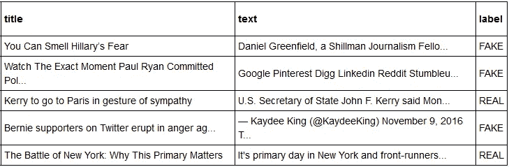
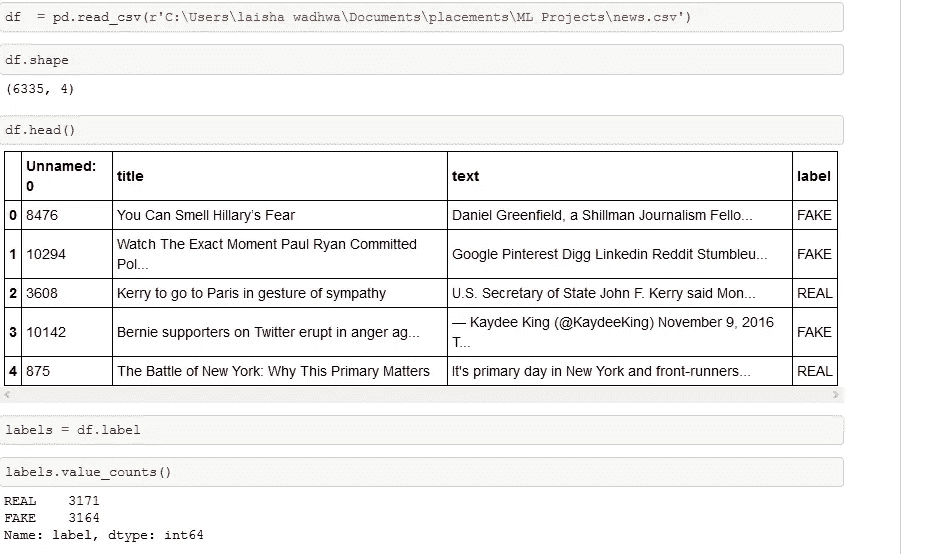
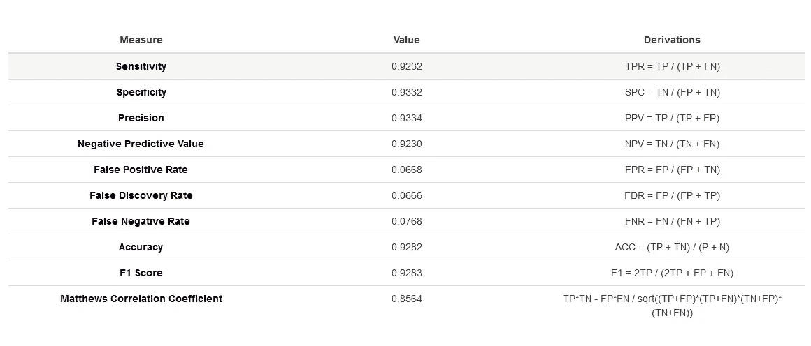

# 检测网上虚假政治新闻

> 原文：<https://towardsdatascience.com/detecting-fake-political-news-online-a571745f73dd?source=collection_archive---------21----------------------->

## 了解如何使用 NLP 和被动攻击算法来识别网上的假新闻。

Photo by [Lieu Cap](https://unsplash.com/@lieucap?utm_source=unsplash&utm_medium=referral&utm_content=creditCopyText) on [Unsplash](https://unsplash.com/s/photos/newspaper?utm_source=unsplash&utm_medium=referral&utm_content=creditCopyText)

近年来，在线社交网络的蓬勃发展使得许多在线平台上出于各种商业和政治目的的假新闻数量激增。

> 我们都曾偶然发现政客死亡的假新闻，一些领导人发表关于寺庙和清真寺之类的声明。

误导性的新闻极大地影响了读者，并且已经给线下社会带来了非常负面的影响。

因此，提高在线社交网络上信息的可信度的一个重要目标是及时和正确地识别假新闻。

在这篇文章中，我将指导你使用被动攻击算法构建一个**假新闻检测**分类器。

用于分类器的数据集可以在[这里](https://drive.google.com/file/d/1er9NJTLUA3qnRuyhfzuN0XUsoIC4a-_q/view)下载。

数据集包含三列，即:

1.  标题:新闻文章的标题
2.  文本:新闻文章的内容
3.  标签:两个标签——假的和真的。

A subset of the data-set

简而言之，使用 sklearn，可以在数据集上构建 TfidfVectorizer。然后，初始化被动主动分类器并拟合模型。最后，准确度分数和混淆矩阵定量地解释了模型的表现。

## 专业术语太多？好吧，让我们一步一步地把它们都弄清楚。

让我们了解一下像 TfidfVectorizer 和被动主动分类器这样的术语。

tfidf 矢量器将原始文档的集合转换成 TF-IDF 特征的矩阵。

让我们再深入一点..

# TfidfVectorizer 是由什么构成的？

1.  **TF(词频):一个词在文档中出现的次数就是它的词频**。较高的值意味着某个术语比其他术语出现得更频繁，因此，当该术语是搜索术语的一部分时，该文档是一个很好的匹配。
2.  **IDF(逆文档频率):**在一个文档中多次出现，但在很多其他文档中也多次出现的词，可能是不相关的。 **IDF 是衡量一个术语在整个语料库中的重要性的指标。**

# 被动主动分类器

被动攻击算法是在线学习算法。这种算法对于正确的分类结果保持被动，而在误算、更新和调整的情况下变得主动。与大多数其他算法不同，它不收敛。其目的是进行修正损失的更新，使得权重向量的范数变化很小。

让我们开始吧。

首先导入所有必需的库。

Loading the data-set and analyzing the distribution of predicting label

既然数据集已经加载，接下来我们将把它分成测试集和训练集。

数学模型只理解数字。因此，我们将使用 TFIDF 矢量器将训练集和测试集转换成模型的可解释形式。

现在我们已经万事俱备了。我们现在将构建被动主动分类器，并使用 sklearn 的 accuracy_score 指标对数据集进行评估。

在测试集上实现了 92.58%的准确率。接下来，我们将使用混淆矩阵评估结果，并计算 F1 得分。

这里 F1 的分数是: **0.9283。**

这里是各种度量的汇编，帮助我们定量评估分类器的性能。

Various metrics used to evaluate the performance of PAssive agressive classifier

Jupyter 笔记本的完整代码可以在我的 [GitHub 库](https://github.com/laishawadhwa/Fake-News-Detector)中找到。