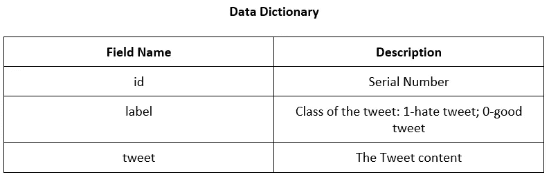
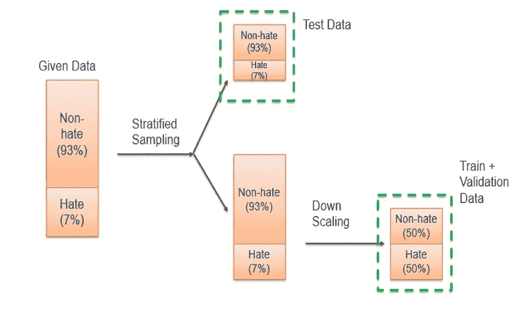
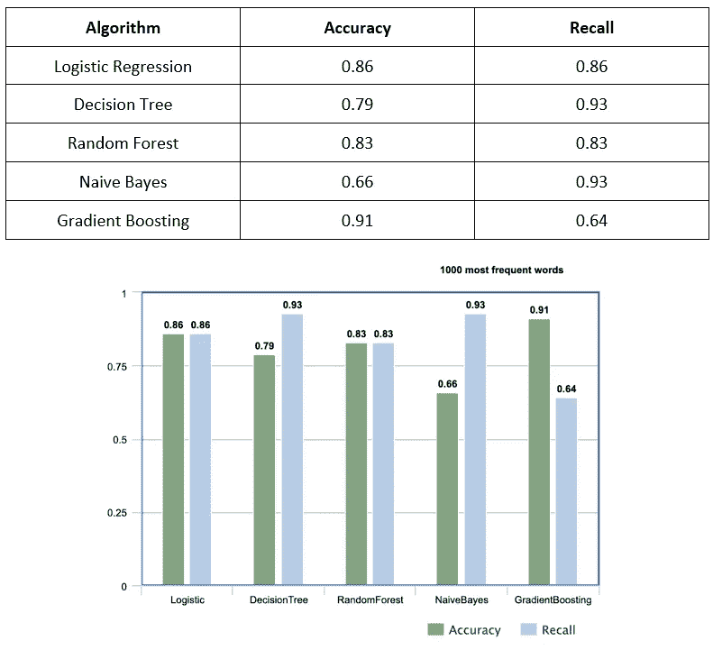

# 检测仇恨推特——推特情绪分析

> 原文：<https://towardsdatascience.com/detecting-hate-tweets-twitter-sentiment-analysis-780d8a82d4f6?source=collection_archive---------2----------------------->

## **一项综合研究，旨在确定预处理和模型选择的哪种组合能够提供最佳的仇恨言论过滤器**

**供稿人** : Vedant Kshirsagar、Adwait Toro、Sushrut Shendre、Sneha Lakshmikanthaiah、Rishab Ballekere Narayana Gowda、Tanvir Brar、Chavi Singal

我们所有的代码都可以在 GitHub 上找到

【https://github.com/vedant-95/Twitter-Hate-Speech-Detection 

**摘要**

由于不同文化和教育背景的人对互联网的使用呈指数增长，有毒在线内容已成为当今世界的一个主要问题。区分仇恨言论和攻击性语言是自动检测有毒文本内容的关键挑战。在这份报告中，我们提出了一种方法来自动将 Twitter 上的推文分为两类:仇恨言论和非仇恨言论。使用 Twitter 数据集，我们通过利用单词包和术语频率-逆文档频率(TFIDF)值对多个机器学习模型进行实验。考虑到这两种方法，我们对模型进行了比较分析。在调整给出最佳结果的模型之后，我们在应用逻辑回归模型时实现了 89%的准确率和 84%的召回率。我们还使用 flask 创建了一个模块，作为我们模型的实时应用程序。

**概述**

我们的目标是将推文分为两类，仇恨言论或非仇恨言论。我们的项目分析了来自 Kaggle 的包含 31，935 条推文的数据集 CSV 文件。数据集严重扭曲，93%的推文或 29，695 条推文包含非仇恨标签的推文数据，7%或 2，240 条推文包含仇恨标签的推文数据。构建我们模型的第一步是平衡仇恨和非仇恨推文的数量。我们的数据预处理步骤包括两种方法，**单词包**和**词频逆文档频率(TFIDF)。**

**单词袋**方法是自然语言处理和信息检索中使用的简化表示。在这种方法中，一个文本(如一个句子或一个文档)被表示为它的单词的包(多集合),不考虑语法甚至词序，但保持多样性。

**TFIDF** 是一个数字统计量，旨在反映一个单词对集合中的文档有多重要。在信息检索、文本挖掘和用户建模的搜索中，它被用作加权因子。

在我们将这些数据输入各种算法之前，我们必须清理这些数据，因为推文中包含许多不同的时态、语法错误、未知符号、标签和希腊字符。

我们通过使用词汇化、词干化、删除停用词和省略来解决这个问题。词汇化删除单词的屈折词尾，并将单词返回到其本身的基本形式或词典形式。词干化类似于词干化，因为它将屈折词或派生词简化为词干。停用词是一个常用词，如“the”、“a”、“an”、“in”，我们编程忽略它，因为它不重要。最后一步是省略任何外国字符和希腊符号。

**灵感**

探索这一主题的灵感来自仇恨言论实例的增加和仇恨言论意识。据《纽约时报》报道，“由偏见或成见引发的人身攻击在 2018 年达到了 16 年来的最高水平，针对拉丁美洲人的暴力事件大幅上升，超过了针对穆斯林和阿拉伯裔美国人的袭击事件的下降。”这种上升也可归因于数字社交媒体平台的兴起，这些平台为仇恨言论的传播提供了便利。大多数(59.6%)仇恨犯罪事件涉及种族和族裔偏见。其次是宗教偏见，占所有事件的 18.7%。当我们观察到仇恨推特中最常见的负面词汇与种族或宗教有关时，我们的研究验证了这些结果。这些尖酸刻薄的例子会下意识地在我们的社会中煽动仇恨，尤其是在我们易受影响的年轻一代的头脑中。根据公共研究，22%的受访者表示，由于网上的仇恨言论，他们在自己的社区感到不太安全，超过 85%的人支持建立一个工作组来监控网络欺凌。这个问题现在已经变得如此普遍，以至于美国第一夫人梅兰妮·特朗普已经把打击网络欺凌和网上仇恨言论作为她的主要目标。统计数据显示，在减少仇恨言论传播方面做得还不够。

**数据**

(来源:【https://www.kaggle.com/vkrahul/twitter-hate-speech )

**数据字典**

**可视化和文字云**

创建单词云是为了了解 tweets 中最常用的单词。这是针对仇恨和非仇恨两类推文进行的。接下来，我们创建了一个条形图，来可视化积极情绪和消极情绪中最常见单词之间的使用频率。

**正面推文**

**负面推文**

**数据架构**

如前所述，我们拥有的数据是不平衡的。我们总共有 31935 行，其中仇恨推文仅占推文总数的 7%。在不平衡的数据集上建模并不理想，因为模型无法学习哪些文本或信息导致该推文被归类为仇恨推文。

如果我们在不平衡的数据上训练一个模型，结果将是误导性的。在这样的数据集中，由于缺乏学习，该模型会简单地将每条推文预测为好推文。在这种情况下，尽管准确率很高，但它实际上并没有做好分类工作，因为它无法准确地对仇恨推文进行分类。

更简单地说，即使模型预测所有的推文都是非仇恨的，它仍然有 93%的准确率。

因此，我们执行策略抽样，并将数据分成临时集和测试集。请注意，由于我们已经执行了战略抽样，对于临时和测试数据集，好推文与讨厌推文的比例是 93:7。

在临时数据上，我们首先尝试使用 SMOTE(合成少数过采样技术)对仇恨推文进行上采样。由于 SMOTE 包不能直接处理文本数据，我们为它编写了自己的代码。流程如下:

我们创建了一个语料库，收录了临时数据集的仇恨推文中出现的所有独特词汇。一旦我们有了包含仇恨推文中所有可能单词的矩阵，我们就创建了一个空白的新数据集，并开始用新的仇恨推文填充它。这些新推文是通过从语料库中随机选择单词合成的。这些新推文的长度是根据组成语料库的推文的长度确定的。

然后，我们多次重复这个过程，直到合成数据中仇恨推文的数量等于临时数据中非仇恨推文的数量。然而，当我们使用单词袋方法生成特征时，特征的数量增加到了 100，000。由于特性数量非常多，我们面临硬件和处理能力的限制，因此不得不放弃 SMOTE 过采样方法。

由于不可能对仇恨推文进行上采样以平衡数据，我们决定对非仇恨推文进行下采样以使其平衡。我们从临时数据集中提取了一部分非仇恨性的推文。从这个子集中，我们选择了 *n* 条随机推文，其中 *n* 是临时数据中仇恨推文的数量。然后我们在临时数据中加入了仇恨推特的子集。这个数据集现在是我们用于特征生成和建模目的的训练数据。

测试数据仍然是好的推文和讨厌的推文之比为 93:7，因为我们没有对它进行任何采样。由于真实世界的数据是以这个比率出现的，所以没有进行采样。

**逼近**

我们已经研究了两种主要的特征生成方法:单词袋(BOW)和词频逆文档频率(TFIDF)。

1.一袋单词

2.术语频率逆文档频率

**一袋话**

词袋模型(bag-of-words model)是一种从文本中提取特征以用于建模的方法，例如使用机器学习算法。

它被称为单词的“*包*，因为任何关于文档中单词的顺序或结构的信息都被丢弃了。该模型只关心已知单词是否出现在文档中，而不关心它在文档中的位置。直觉是，如果文档有相似的内容，它们就是相似的。此外，仅从内容上，我们就可以了解文件的含义。

目标是将自由文本的每个文档转换成一个向量，我们可以使用它作为机器学习模型的输入或输出。因为我们知道词汇表有 10 个单词，所以我们可以使用 10 的固定长度的文档表示，用向量中的一个位置来给每个单词打分。最简单的评分方法是将单词的存在标记为布尔值，0 代表不存在，1 代表存在。

使用词汇表中上面列出的任意单词顺序，我们可以遍历第一个文档(“*这是最好的时代*”)，并将其转换为二进制向量。

文档的评分如下所示:

●“它”= 1

●“曾经”= 1

● "the" = 1

●“最佳”= 1

● "of" = 1

●“时代”= 1

●“最差”= 0

●“年龄”= 0

●“智慧”= 0

●“愚蠢”= 0

作为一个二进制向量，它将如下所示:

[1, 1, 1, 1, 1, 1, 0, 0, 0, 0]

其他三个文档如下所示:

1.“这是最坏的时代”= [1，1，1，0，1，1，1，0，0，0]

2.“那是智慧的时代”= [1，1，1，0，1，0，0，1，1，0]

3.“那是愚蠢的时代”= [1，1，1，0，1，0，0，1，0，1，1]

如果您的数据集很小，并且上下文是特定于领域的，BoW 可能比单词嵌入更好。上下文是非常领域特定的，这意味着你不能从预先训练的单词嵌入模型(GloVe，fastText 等)中找到相应的向量。)

**TFIDF**

TF*IDF 是一种信息检索技术，它衡量术语的频率(TF)及其逆文档频率(IDF)。每个单词或术语都有其各自的 TF 和 IDF 得分。一项的 TF 和 IDF 得分的乘积称为该项的 TF*IDF 权重。

简单来说，TF*IDF 得分(权重)越高，该术语越稀有，反之亦然。

TF*IDF 算法用于对任何内容中的关键字进行加权，并根据该关键字在文档中出现的次数为其分配重要性。更重要的是，它检查关键字在整个网络中的相关性，这被称为*语料库*。

对于文档 d 中的项 t，文档 d 中的项 t 的权重 Wt，d 由下式给出:

**Wt，d = TFt，d log (N/DFt)**

其中:

● TFt，d 是 t 在文档 d 中出现的次数。

● DFt 是包含术语 t 的文档数。

● N 是语料库中的文档总数。

TF*IDF 是如何计算的？一个词的 TF(词频)是一个词在文档中出现的频率(即出现的次数)。当你知道它的时候，你就能看到你使用一个术语是过多还是过少。

例如，当一个 100 个单词的文档中包含 12 次术语“cat”时，单词“cat”的 TF 为

TFcat = 12/100，即 0.12

一个词的 IDF(逆文档频率)是该词在整个语料库中的重要性的度量。

**数据清理**

我们说的和写的语言是由几个单词组成的，这些单词通常来源于另一个单词，并且可以包含一些不增加意义或上下文的单词。为了清理数据，我们实施了 5 种方法。

1.  **停用词移除**:停用词通常是冠词或介词，它们不能帮助我们找到上下文或句子的真正含义。这些单词可以被删除，而不会对您正在训练的最终模型产生任何负面影响。英语中常用的语言包括“is”、“and”、“are”等。
2.  **希腊字符**:我们接下来删除特殊字符和数字。数字很少包含有用的意义。特殊字符会扩大我们的词频矩阵。
3.  俚语词汇:俚语词汇包括通常在演讲中使用的非正式短语。由于缺乏现有的字典，我们将一些俚语映射到它们的原始形式，例如“luv”到“love”，“thx”到“thanks ”,举几个例子。
4.  **词干化**:使用词干化，考虑到在一个屈折词中可以找到的常见前缀和后缀的列表，通过切断单词的结尾或开头，单词被缩减为它们的词干。一个单词被查看并通过一系列决定如何删减的条件句。对于我们的数据集，使用波特词干算法。
5.  **词汇化**:词汇化是将一个单词的不同屈折形式组合在一起的过程，这样它们就可以作为一个单独的项目进行分析。词汇化类似于词干化，但它给单词带来了上下文。所以，它把意思相近的单词连接成一个单词。比如 *runs，running，ran* 都是单词 *run* 的形式，因此 *run* 就是所有这些单词的引理。

**造型**

对于单词袋和 TFIDF，我们运行 5 种分类算法，即逻辑回归、朴素贝叶斯、决策树、随机森林和梯度提升。此外，我们还在这两种方法中执行维数减少，并再次运行这 5 种算法。

**我)包话**

我们在训练数据集上实现了用于特征生成的单词包。在这种方法中，我们试图找出一条推文是否是仇恨推文的概率，给定某些词的存在及其在推文中的频率。

我们的训练数据是总共 4480 条推文，生成了 12566 个独特单词的语料库。在实现单词包特征工程之后，结果是包含 4480 行和 12566 列的数据帧，其中每一列对应于一个唯一的单词。然后，我们将标签连接成一列。

在运行分类算法时，获得了以下结果:

为了更好地显示这些结果，我们绘制了下面的聚类柱形图。

**Preprocessing: Bag of Words**

我们现在讨论将准确率和召回率作为我们的衡量标准的理由，以及它们将如何帮助我们选择冠军模型。乍一看，梯度增强似乎是最好的模型，因为它的精度最高。但是正如《数据架构》中所讨论的，我们的测试数据包含了 93:7 的好推文和讨厌推文的比例。因此，具有高精度可能不是最好的度量。因此，我们考虑召回，这是我们能够正确识别的仇恨推文的比例。如果这个指标很高，这将相当于大量的仇恨推文被归类为仇恨推文，从而实现我们的目标。如果我们只看回忆，朴素贝叶斯似乎是最好的模型。然而，另一个需要考虑的因素是，我们捕获的所有仇恨推文将被转发给运营团队，该团队将单独审查这些推文。因此，有大量的误报将意味着分析师将不得不不必要地审查更多的推文，这些推文实际上不是仇恨推文。这将导致时间、资源和人员的利用效率低下。我们的建议是拥有高召回率，同时确保假阳性的数量保持在最低水平。这将是理想的前进模式，给予高评分的准确性和召回率。因此，我们选择逻辑回归和随机森林作为冠军模型。

**ii)词频逆文档频率(TFIDF)**

有些词被认为是俚语或骂人的话，但它们太常见了，人们在日常生活中经常使用。因此，如果有一条包含这些词的推文，它实际上可能不是一条仇恨推文。为了区分一个俚语/辱骂性的词是否意在表达仇恨，我们尝试了 TFIDF 方法，因为它给这样的词分配了较低的权重。因此，我们不再使用单词包模型来计算这个单词在 tweet 中出现的次数，而是使用 TFIDF 权重。运行算法后，我们获得以下结果。

**Preprocessing: TF-IDF**

同样，逻辑回归和随机森林为我们提供了最好的准确性和召回结果。

**iii)1000 个最常用单词的单词包**

由于特征的数量等于唯一单词的数量，因此是巨大的(12566)，我们假设到目前为止我们讨论的两个模型可能是过度拟合的。因此，我们试图通过选取 1000 个最常用的单词(以及变量)来降低维度。在这个变量选择之后，我们再次实现分类算法。我们对单词包和 TFIDF 都这样做。获得的结果列表和绘图如下:

**Bag of Words for 1000 most frequent words**

**iv)1000 个最常用词的 TF-IDF**

**TF-IDF for 1000 most frequent words**

运行降维模型后获得的结果与未降维的结果一致。梯度推进再次给出了高准确度，朴素贝叶斯给出了好的回忆，逻辑回归和随机森林给出了这两个度量的最佳结果。

然而，这些模型没有显著的改进。虽然一些算法的指标有所改进，但另一些算法的指标却有所下降，并且改进/降低的幅度可以忽略不计。

最后，我们来看 ROC 曲线。以下是单词袋方法(所有单词)的曲线:

**ROC Curve for all the classifiers**

下表显示了各种算法的曲线下面积(AUC)

**AUC of all the classifiers**

现在，让我们看看 TFIDF 方法的 ROC 曲线和 AUC 表(所有单词)

**ROC curve and AUC for all the classifiers**

如我们所见，逻辑回归给出了最好的 AUC。此外，如果我们看它的 ROC 曲线，我们可以看到它相等地覆盖了假阳性率(FPR)和真阳性率(TPR)区域。将其与朴素贝叶斯进行比较，朴素贝叶斯表现出较差的假阳性性能，这也通过其先前的准确度得分而明显可见。类似地，梯度推进具有较差的真实积极表现，这从其较低的回忆分数可以明显看出。

此外，逻辑回归本质上是直接的，即可以借助简单的指数方程来解释该模型，并且可以可视化和比较其系数。因此，我们推荐**逻辑回归**作为我们案例的最佳模型。

**MVP**

在所有的数据清理、特性工程和建模之后，我们决定部署这个模型，以便从这个项目中获得一些有用的东西。这个项目的主要目标是开发一个可以检测仇恨推文的系统，以便 Twitter 可以采取适当的行动，减少社交欺凌的原因。因此，我们使用 Flask 技术部署了我们的机器学习模型。

以下是该网站的快照:-

该网站是使用 HTML 和 CSS 建立的，人们可以在网站的文本框中输入推文。

考虑我们提出的模型的两个用例

1-用户输入一条正面推文，然后被正确分类为正面推文。

2-用户输入一条仇恨推文，然后正确地被归类为仇恨推文。

**关键见解和经验**

政治、种族和性的推文构成了仇恨推文的主要部分。

当我们摆弄不平衡的数据集时，得到的结果是不准确的。由于训练数据的偏斜性质，该模型预测新数据属于训练集中的主要类。

在评估模型的性能时，分类器的加权精度不是唯一要考虑的度量。商业环境也扮演着重要的角色。

**挑战和未来步骤**

仇恨言论自动检测系统面临的一个挑战是随着时间和历史背景对话题的态度的改变。例如，在下面的摘录中:

“……残忍的印第安野蛮人，他们的战争规则是不分年龄、性别和条件一律格杀勿论……”

直觉表明这是仇恨言论；它将美洲原住民称为“无情的印第安野蛮人”，并暗示他们低人一等，使他们失去人性。事实上，该文本符合大多数仇恨言论定义中使用的条件。然而，这段文字实际上是引自《独立宣言》的。鉴于该文本的历史背景，发布该文本的用户可能并不打算获得仇恨言论的结果，而是为了其他目的而引用该历史文档。这表明用户意图和上下文在仇恨言论识别中起着重要作用。

作为另一个例子，考虑短语“纳粹组织是伟大的。”这将被视为仇恨言论，因为它显示了对仇恨团体的支持。然而，“纳粹的组织是伟大的”并不是支持他们的理想，而是在评论这个组织有多好。在某些情况下，这可能不被视为仇恨言论，例如，如果作者正在比较一段时间内的组织效率。这两个短语的区别很微妙，但足以区分是否是仇恨言论。

另一个挑战是，仇恨言论自动检测是一个闭环系统；个人意识到它正在发生，并积极试图逃避检测。希望传播仇恨信息的用户很快找到了规避这些措施的方法，例如，将内容发布为包含文本的图像，而不是文本本身。虽然可以采用光学字符识别来解决这一特殊问题，但这进一步表明了仇恨言论检测的难度。在那些试图传播仇恨内容的人和那些试图阻止它的人之间，这将是一场持续的战斗。

**结论**

随着仇恨言论继续成为一个社会问题，对仇恨言论自动检测系统的需求变得更加明显。在这份报告中，我们提出了一种通过使用单词袋和 TF IDF 值的机器学习来检测 Twitter 上仇恨言论和攻击性语言的解决方案。我们对多组特征值和模型参数进行了逻辑回归、朴素贝叶斯、决策树、随机森林和梯度推进的比较分析。结果显示**逻辑回归与 TF IDF 方法相比表现更好。**

我们提出了当前的问题，这个任务和我们的系统达到了合理的准确率(89%)和召回率(84%)。鉴于仍然存在的所有挑战，有必要对这一问题进行更多的研究，包括技术和实际问题。

**参考文献**

[1]ncbi.nlm.nih.gov/pmc/articles/PMC6701757/[在线]

[2] A. Gaydhani，V. Doma，S. Kendre 和 L. Bhagwat，“使用机器学习检测 Twitter 上的仇恨言论和攻击性语言:基于 N-gram 和 TF IDF 的方法”。

[3][https://www . nytimes . com/2019/11/12/us/hate-crimes-FBI-report . html](https://www.nytimes.com/2019/11/12/us/hate-crimes-fbi-report.html)

[4][https://www . daily prince tonian . com/article/2018/10/hate-speech-words-a second-look](https://www.dailyprincetonian.com/article/2018/10/hate-speech-deserves-a-second-look)