# 使用深度学习在 Keras 中检测心律失常，包括 Dense、CNN 和 LSTM

> 原文：<https://towardsdatascience.com/detecting-heart-arrhythmias-with-deep-learning-in-keras-with-dense-cnn-and-lstm-add337d9e41f?source=collection_archive---------4----------------------->

## 让我们从单个心电信号中检测异常心跳！

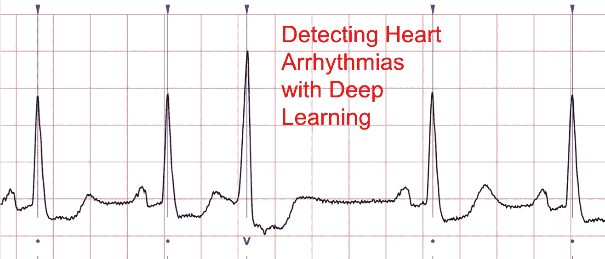

# 介绍

最近，我在回顾吴恩达团队([https://stanfordmlgroup.github.io/projects/ecg/](https://stanfordmlgroup.github.io/projects/ecg/))在卷积神经网络(CNN)心律失常检测器方面的工作。我发现这非常有趣，尤其是随着可穿戴产品(例如 Apple Watch 和便携式 EKG 机器)的出现，这些产品能够在家里监测你的心脏。因此，我很好奇如何建立一个可以检测异常心跳的机器学习算法。这里，我们将使用 ECG 信号(心脏的连续电测量)并训练 3 个神经网络来预测心律失常:密集神经网络、CNN 和 LSTM。

在本文中，我们将探讨 3 个教训:

1.  分割患者数据集，而不是样本数据集
2.  学习曲线可以告诉你获得更多的数据
3.  测试多种深度学习模型

你可以跟随我的 github(【https://github.com/andrewwlong/deep_arrhythmias】)上提供的 Jupyter 笔记本。

# 资料组

我们将使用来自 https://physionet.org/content/mitdb/1.0.0/[的 MIH-BIH 心律失常数据集，该数据集在 ODC 授权许可下可用。这是一个数据集，包含 20 世纪 70 年代以 360 Hz 测量的 48 个半小时双通道 ECG 记录。这些记录有心脏病专家对每次心跳的注释。注释符号可在](https://physionet.org/content/mitdb/1.0.0/)[https://archive.physionet.org/physiobank/annotations.shtml](https://archive.physionet.org/physiobank/annotations.shtml)找到

# 项目定义

根据 ECG 信号预测心跳是否在以心跳峰值为中心的每 6 秒窗口内出现心律失常。

为了简化问题，我们假设 QRS 检测器能够自动识别每次心跳的峰值。由于数据减少，我们将忽略记录的前 3 秒或最后 3 秒中的任何非心跳注释和任何心跳。我们将使用一个 6 秒的窗口，这样我们就可以将当前节拍与之前和之后的节拍进行比较。这个决定是在与一位医生交谈后做出的，这位医生说，如果你有与之比较的东西，就更容易识别。

# 数据准备

让我们从列出 data_path 中的所有患者开始。

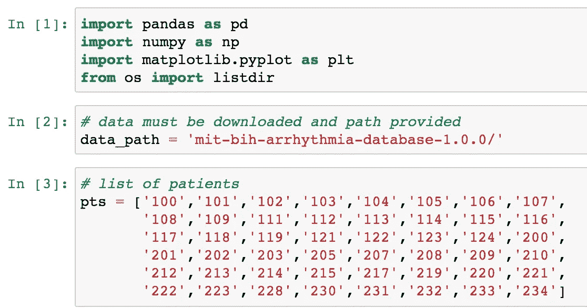

这里我们将使用 pypi 包 wfdb 来加载 ecg 和注释。

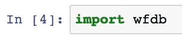

让我们加载所有注释，并查看心跳类型在所有文件中的分布。

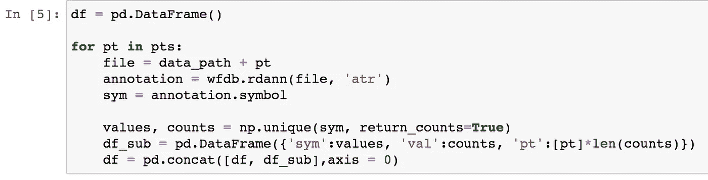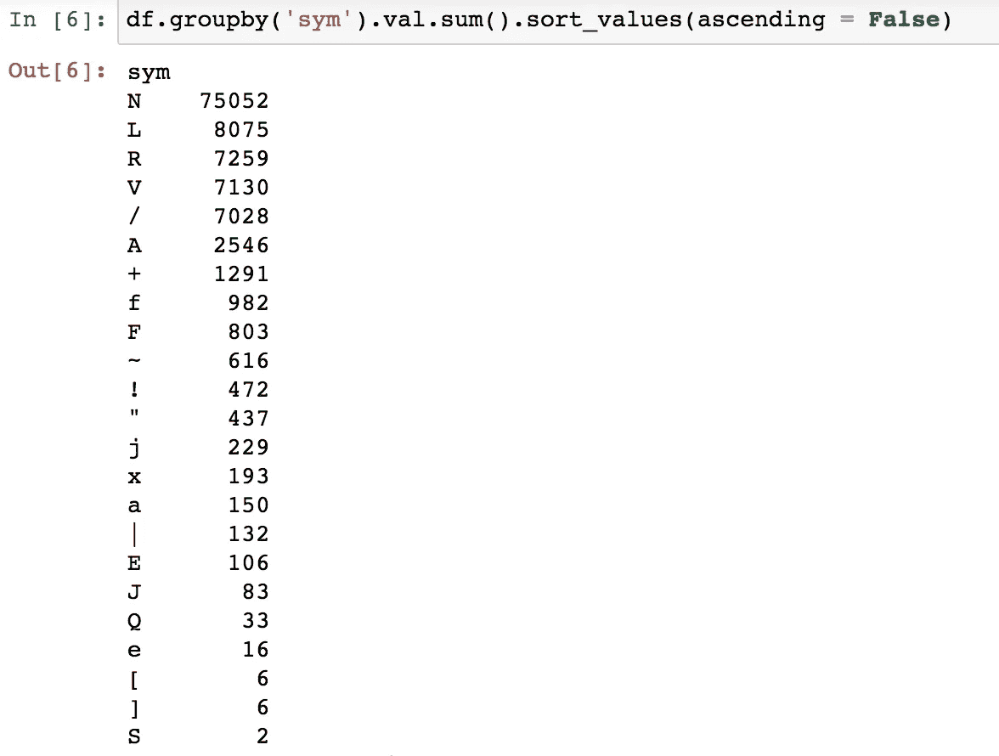

我们现在可以列出非心跳和异常心跳:

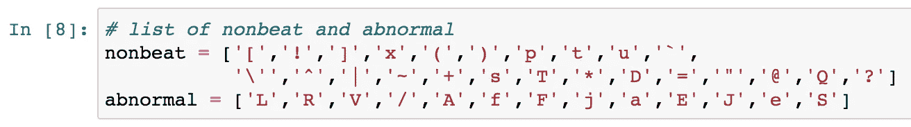

我们可以按类别分组，并查看数据集中的分布情况:

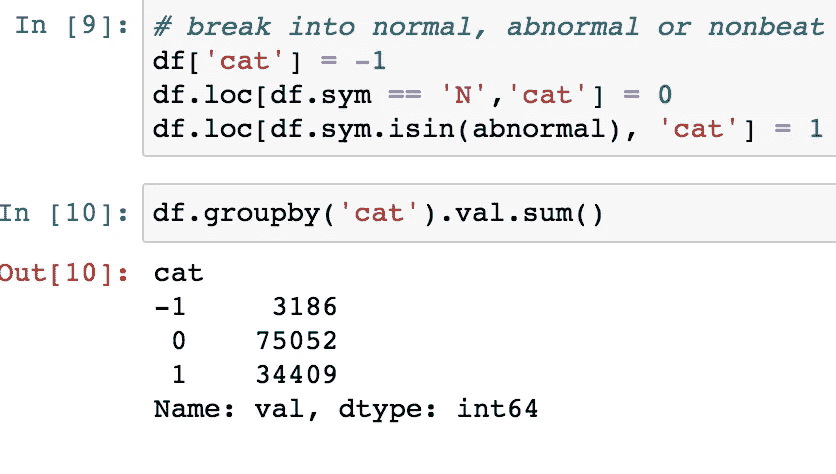

看起来这个数据集中大约有 30%是不正常的。如果这是一个真正的项目，最好查阅文献。鉴于这是一个关于心律失常的数据集，我想这比正常情况要高！

让我们编写一个函数来加载单个患者的信号和注释。注意注释值是信号数组的索引。

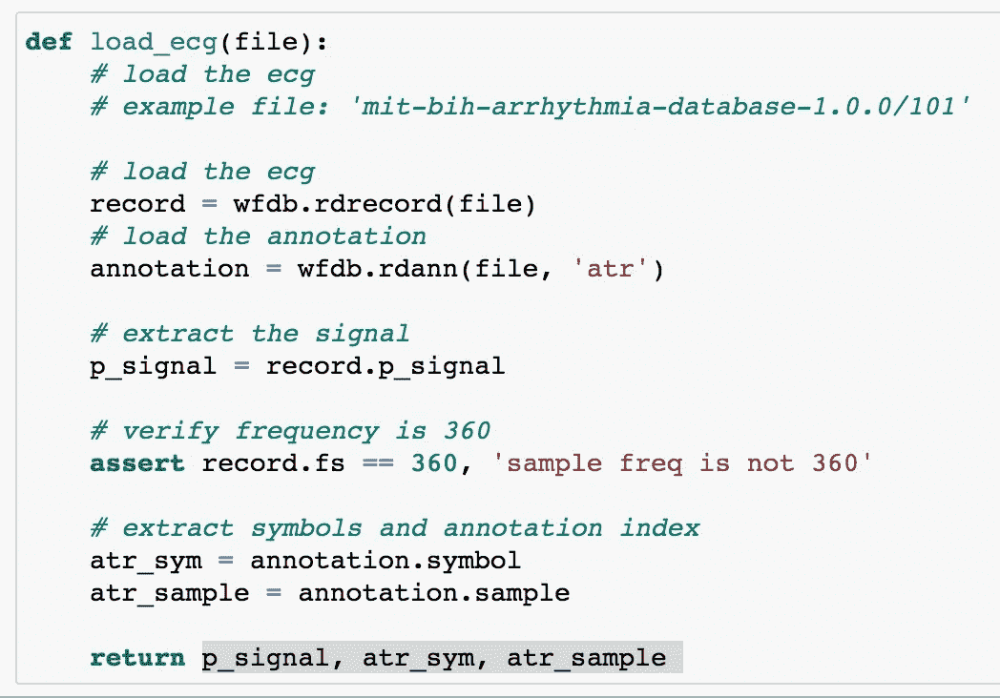

让我们来看看患者的心电图中有哪些异常心跳:

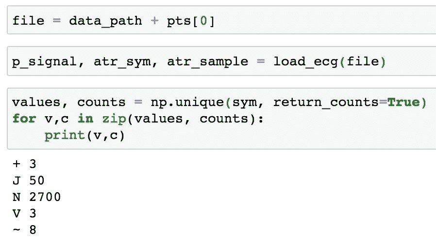

我们可以用以下公式绘制异常心跳周围的信号:

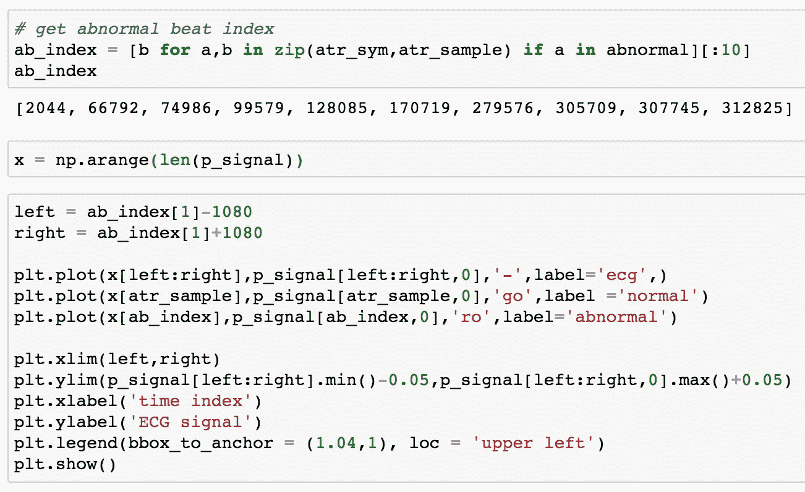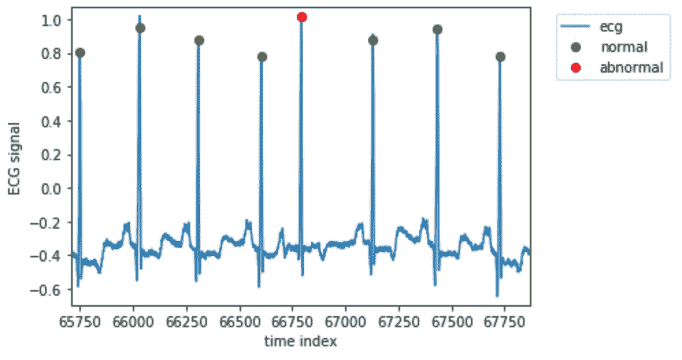

# 制作数据集

让我们制作一个数据集，它以前后相差+- 3 秒的节拍为中心

```
def make_dataset(pts, num_sec, fs, abnormal):
    # function for making dataset ignoring non-beats
    # input:
    # pts - list of patients
    # num_sec = number of seconds to include before and after the beat
    # fs = frequency
    # output: 
    #   X_all = signal (nbeats , num_sec * fs columns)
    #   Y_all = binary is abnormal (nbeats, 1)
    #   sym_all = beat annotation symbol (nbeats,1)

    # initialize numpy arrays
    num_cols = 2*num_sec * fs
    X_all = np.zeros((1,num_cols))
    Y_all = np.zeros((1,1))
    sym_all = []

    # list to keep track of number of beats across patients
    max_rows = []

    for pt in pts:
        file = data_path + pt

        p_signal, atr_sym, atr_sample = load_ecg(file)

        # grab the first signal
        p_signal = p_signal[:,0]

        # make df to exclude the nonbeats
        df_ann = pd.DataFrame({'atr_sym':atr_sym,
                              'atr_sample':atr_sample})
        df_ann = df_ann.loc[df_ann.atr_sym.isin(abnormal + ['N'])]

        X,Y,sym = build_XY(p_signal,df_ann, num_cols, abnormal)
        sym_all = sym_all+sym
        max_rows.append(X.shape[0])
        X_all = np.append(X_all,X,axis = 0)
        Y_all = np.append(Y_all,Y,axis = 0)
    # drop the first zero row
    X_all = X_all[1:,:]
    Y_all = Y_all[1:,:]

    # check sizes make sense
    assert np.sum(max_rows) == X_all.shape[0], 'number of X, max_rows rows messed up'
    assert Y_all.shape[0] == X_all.shape[0], 'number of X, Y rows messed up'
    assert Y_all.shape[0] == len(sym_all), 'number of Y, sym rows messed up' return X_all, Y_all, sym_alldef build_XY(p_signal, df_ann, num_cols, abnormal):
    # this function builds the X,Y matrices for each beat
    # it also returns the original symbols for Y

    num_rows = len(df_ann) X = np.zeros((num_rows, num_cols))
    Y = np.zeros((num_rows,1))
    sym = []

    # keep track of rows
    max_row = 0 for atr_sample, atr_sym in zip(df_ann.atr_sample.values,df_ann.atr_sym.values): left = max([0,(atr_sample - num_sec*fs) ])
        right = min([len(p_signal),(atr_sample + num_sec*fs) ])
        x = p_signal[left: right]
        if len(x) == num_cols:
            X[max_row,:] = x
            Y[max_row,:] = int(atr_sym in abnormal)
            sym.append(atr_sym)
            max_row += 1
    X = X[:max_row,:]
    Y = Y[:max_row,:]
    return X,Y,sym
```

# 第 1 课:对患者而非样本进行分割

让我们从处理所有病人开始。

```
num_sec = 3
fs = 360
X_all, Y_all, sym_all = make_dataset(pts, num_sec, fs, abnormal)
```

想象一下，我们天真地决定按照样本将我们的数据随机分成一个训练集和一个验证集。

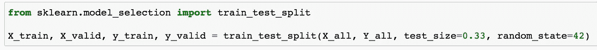

现在，我们准备建立我们的第一个密集神经网络。为了简单起见，我们将在 Keras 中这样做。如果你想看密集神经网络和另一个样本项目的方程，请参见我的另一篇文章[这里](/predicting-hospital-readmission-with-deep-learning-from-scratch-and-with-keras-309efc0f75fc)，这是我在这里写的[关于糖尿病再入院项目的深度学习后续。](/predicting-hospital-readmission-for-patients-with-diabetes-using-scikit-learn-a2e359b15f0)

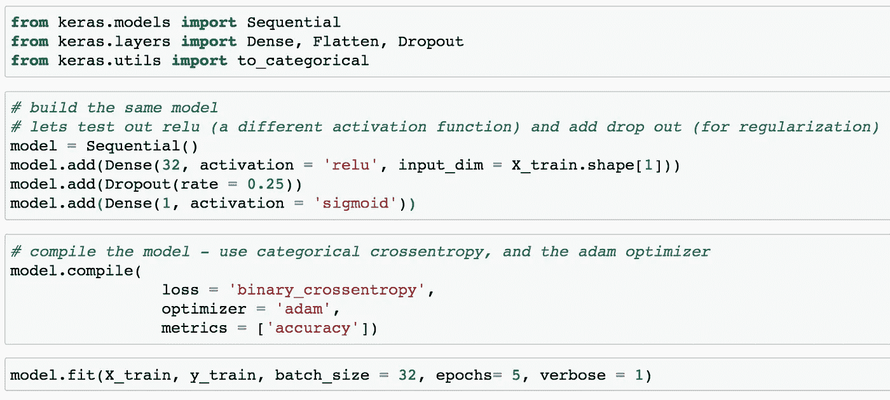

我们可以为度量报告构建一些函数。有关数据科学分类指标的更多讨论，请参见我之前的帖子[这里](/understanding-data-science-classification-metrics-in-scikit-learn-in-python-3bc336865019)。

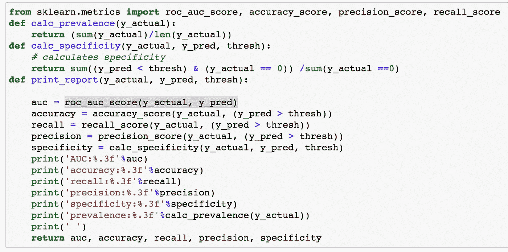

我们可以用`predict_proba`从 Keras 模型中得到预测

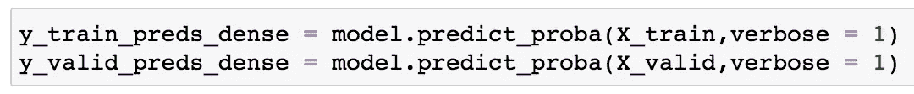

为简单起见，让我们将阈值设置为异常心跳的发生率，并计算我们的报告:

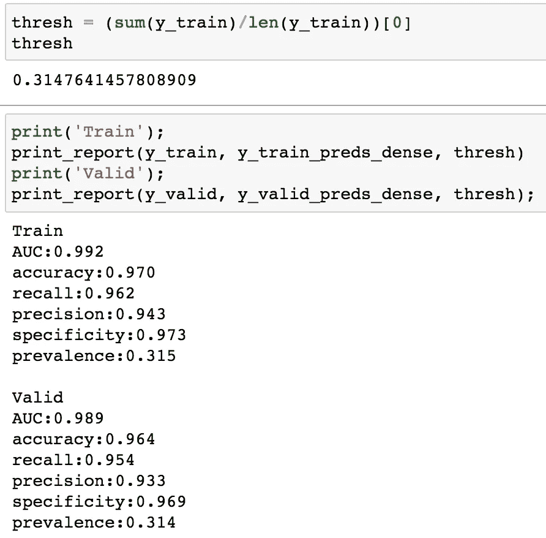

太神奇了！没那么难！但是等等，这对新病人有用吗？如果每个病人都有独一无二的心脏信号，也许就不会了。从技术上讲，同一个患者可以同时出现在训练集和验证集中。这意味着我们可能无意中泄露了数据集的信息。我们可以通过对病人而不是样本进行分割来测试这个想法。

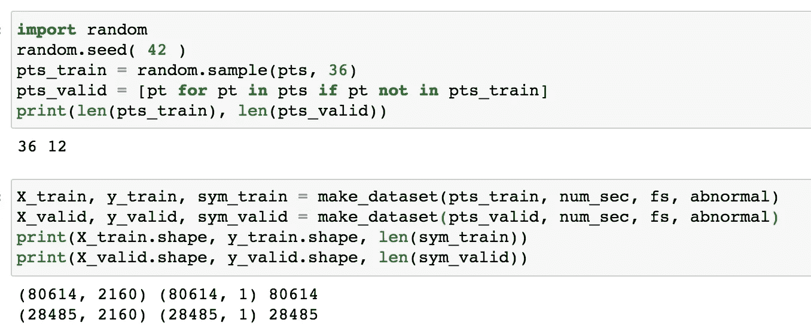

并训练一个新的密集模型:

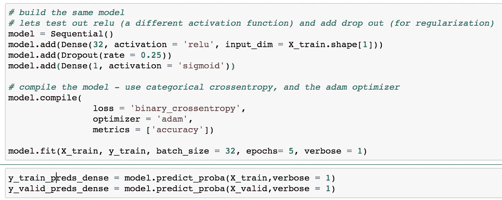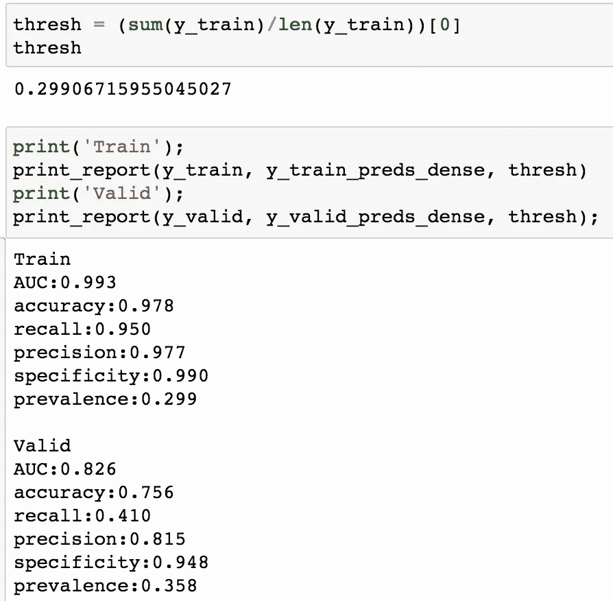

正如您可以看到的，验证 AUC 下降了很多，证实了我们之前有数据泄漏。经验教训:在病人身上而不是在样本上分开！

# 第二课:学习曲线可以告诉我们，我们应该得到更多的数据！

鉴于训练和验证之间的过度拟合。让我们做一个简单的学习曲线，看看我们是否应该去收集更多的数据。

```
aucs_train = []
aucs_valid = []n_pts = [1,18,36]
for n_pt in n_pts:

    print(n_pt)
    pts_sub = pts_train[:n_pt]
    X_sub, y_sub, sym_sub = make_dataset(pts_sub, num_sec, fs,abnormal)# build the same model
    # lets test out relu (a different activation function) and add drop out (for regularization)
    model = Sequential()
    model.add(Dense(32, activation = 'relu', input_dim = X_train.shape[1]))
    model.add(Dropout(rate = 0.25))
    model.add(Dense(1, activation = 'sigmoid'))# compile the model - use categorical crossentropy, and the adam optimizer
    model.compile(
                    loss = 'binary_crossentropy',
                    optimizer = 'adam',
                    metrics = ['accuracy']) model.fit(X_sub, y_sub, batch_size = 32, epochs= 5, verbose = 0)
    y_sub_preds_dense = model.predict_proba(X_sub,verbose = 0)
    y_valid_preds_dense = model.predict_proba(X_valid,verbose = 0)

    auc_train = roc_auc_score(y_sub, y_sub_preds_dense)
    auc_valid = roc_auc_score(y_valid, y_valid_preds_dense)
    print('-',auc_train, auc_valid)
    aucs_train.append(auc_train)
    aucs_valid.append(auc_valid)
```

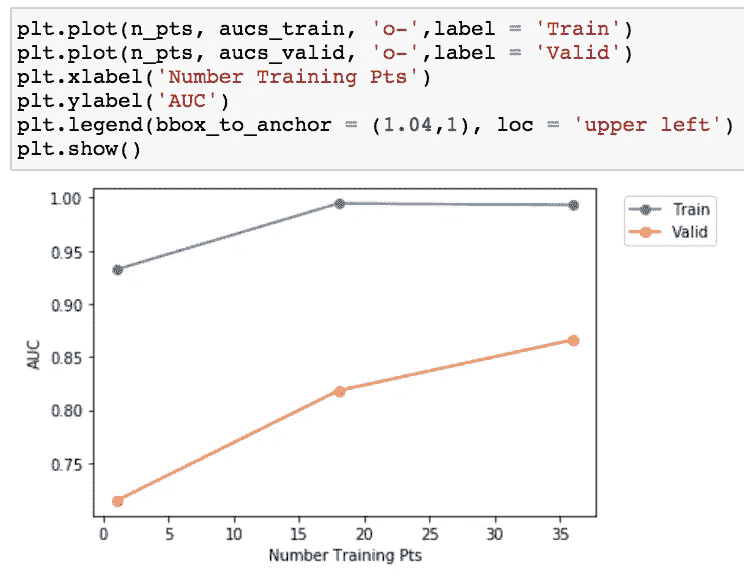

经验教训:更多的数据似乎有助于这个项目！

我怀疑吴恩达的团队也得出了同样的结论，因为他们花时间注释了来自 29163 名患者的 64121 份心电图记录，这比任何其他公共数据集都多两个数量级(见[https://stanfordmlgroup.github.io/projects/ecg/](https://stanfordmlgroup.github.io/projects/ecg/))。

# 第三课:测试多种深度学习模型

# 美国有线新闻网；卷积神经网络

先做个 CNN 吧。这里我们将使用一维 CNN(相对于 2D CNN 的图像)。

CNN 是一种特殊类型的深度学习算法，它使用一组过滤器和卷积算子来减少参数的数量。这种算法引发了图像分类的最新技术。从本质上讲，1D CNN 的工作方式是从第一个时间戳开始获取一个大小为`kernel_size`的过滤器(内核)。卷积运算符采用过滤器，并将每个元素乘以第一个`kernel_size`时间步长。然后对神经网络下一层中的第一个细胞的这些乘积求和。然后过滤器移动`stride`时间步长并重复。Keras 中默认的`stride`是 1，我们将使用它。在图像分类中，大多数人使用`padding`,它允许你通过添加“额外”的单元格来提取图像边缘的一些特征，我们将使用默认填充 0。卷积的输出然后乘以一组权重 W 并加到偏差 b 上，然后像在密集神经网络中一样通过非线性激活函数。然后，如果需要，您可以使用其他 CNN 图层重复此操作。这里我们将使用 Dropout，这是一种通过随机删除一些节点来减少过拟合的技术。

对于 Keras 的 CNN 模型，我们需要对我们的数据进行一点改造

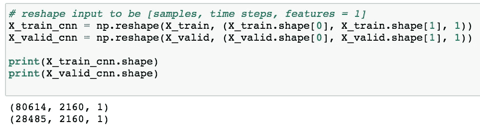

在这里，我们将是一个一层 CNN 与辍学

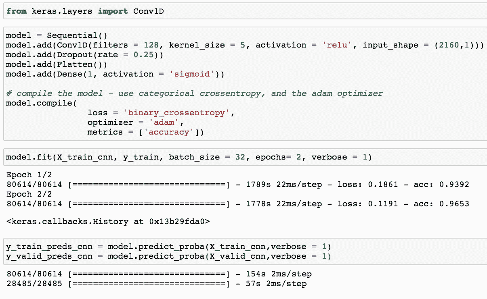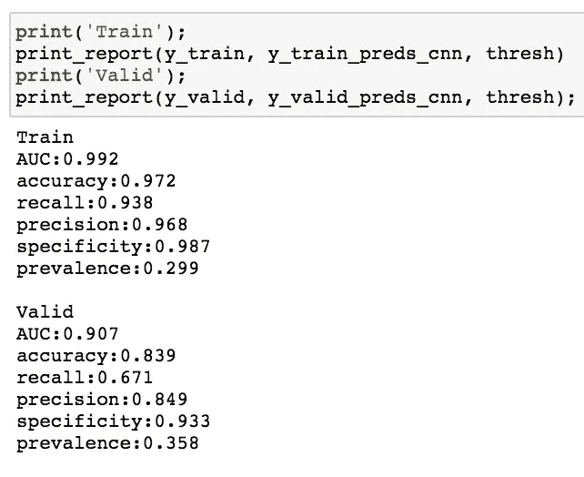

CNN 的性能似乎比密集神经网络更高。

# RNN: LSTM

由于该数据信号是时间序列，因此测试递归神经网络(RNN)是很自然的。这里我们将测试一种双向长短期记忆(LSTM)。与密集的神经网络和有线电视新闻网不同，RNN 在网络中有环路来保存过去发生的事情的记忆。这允许网络将信息从早期时间步骤传递到后期时间步骤，这在其他类型的网络中通常会丢失。本质上，在通过非线性激活函数之前，在计算中对于该存储器状态有一个额外的项。这里我们使用双向信息，这样信息可以双向传递(从左到右和从右到左)。这将有助于我们获得关于中心心跳左右两侧正常心跳的信息。

如下图所示，这花了很长时间来训练。为了使这个项目成为一个周末项目，我将训练集减少到 10，000 个样本。对于一个真正的项目，我会增加历元的数量，并使用所有的样本。

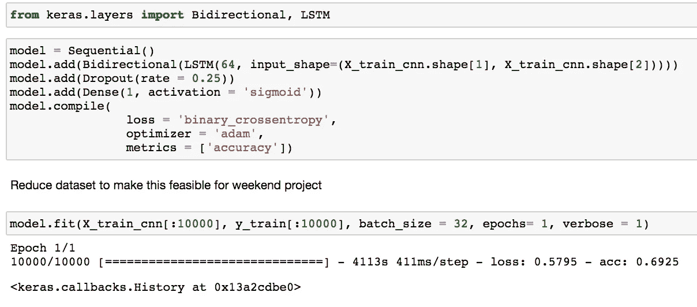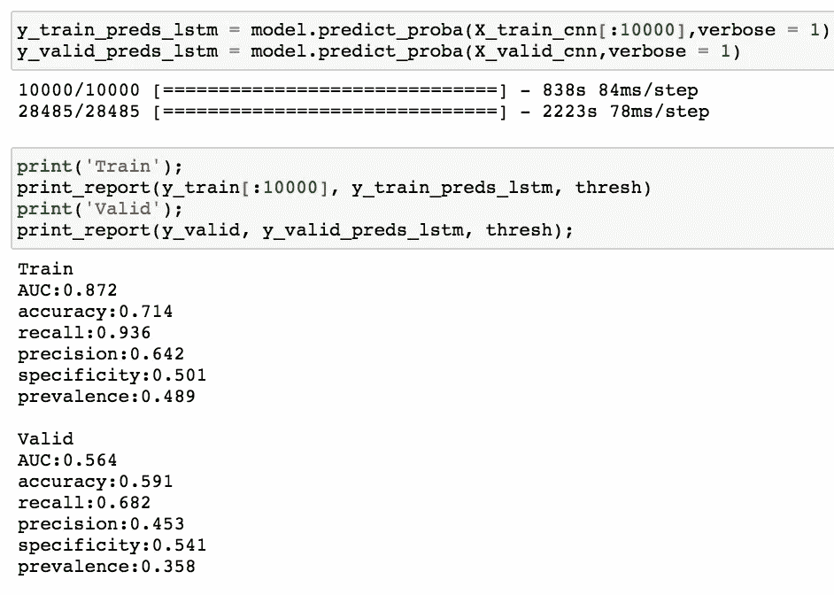

似乎该模型需要从额外的时期进行正则化(即删除)。

# 最终 ROC 曲线

这是这三个模型的最终 ROC 曲线

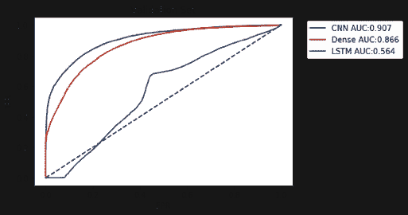

给更多的时间，这将是很好的尝试优化超参数，看看我们是否可以得到密集或 CNN 甚至更高。

# 限制

因为这只是一个周末项目，所以有一些限制:

*   没有优化超参数或层数
*   没有按照学习曲线的建议收集额外的数据
*   没有研究心律失常患病率的文献，以了解该数据集是否代表一般人群(可能不是)

感谢阅读！