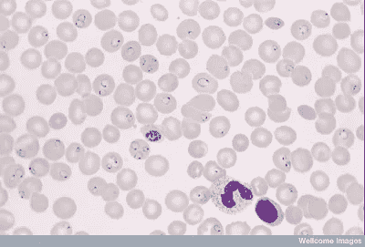
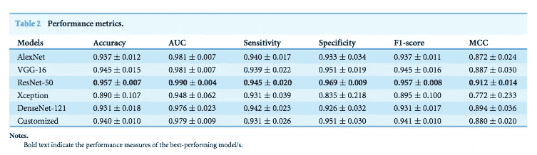
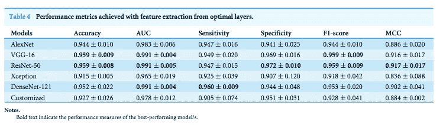

# 使用深度学习检测疟疾。

> 原文：<https://towardsdatascience.com/detecting-malaria-using-deep-learning-fd4fdcee1f5a?source=collection_archive---------6----------------------->

## 构建卷积神经网络以快速预测薄血涂片中疟疾寄生细胞的存在。


Nightmare: Malaria ([Source](https://www.youtube.com/watch?v=uugoIC5sfQs))

答虽然疟疾病毒没有以变异蚊子的形式出现，但*肯定觉得*这是一个变异问题。这种致命的疾病在世界不同地区已经达到流行病*、*甚至**地方病**的比例——每年杀死大约 **40 万**人[1]。在世界上的其他地方，它几乎不存在。一些地区特别容易爆发疾病——某些因素使得一个地区更容易感染疟疾[2]。

*   高度贫困
*   缺乏适当的医疗保健
*   政治不稳定
*   疾病传播媒介的存在(例如蚊子)〔6〕

由于这些问题的混合，我们在构建模型时必须记住一些事情:

*   可能缺少一个**可靠的电源**
*   电池供电的设备具有较少的**计算能力**
*   可能缺少**互联网连接**(所以在云上训练/存储可能很难！)

虽然我们希望获得尽可能高的精确度，但我们也必须考虑让模型尽可能小，计算效率尽可能高，并且能够部署到边缘和物联网设备。

> *目前对该病的诊断方法繁琐费时。*



Thin film of red blood cells. Stained parasites are deep purple. [(Source)](http://www.southsudanmedicaljournal.com/archive/february-2011/malaria-in-south-sudan-3.-laboratory-diagnosis.html)

最广泛使用的方法(到目前为止)是在显微镜下检查薄血涂片，并目测寻找受感染的细胞。患者的血液涂在载玻片上，用造影剂染色，以便更好地识别红细胞中受感染的寄生虫。

然后，临床医生*手动*计数寄生红细胞的数量**有时高达 5000 个细胞**(根据[世卫组织协议](http://www.wpro.who.int/mvp/lab_quality/2096_oms_gmp_sop_09_rev1.pdf))【3】。

# 为什么是卷积神经网络？

卷积神经网络具有自动提取特征和学习过滤器的能力。在以前的机器学习解决方案中，特征必须手动*编程——例如，大小、颜色、细胞的形态。利用卷积神经网络(CNN)将大大加快预测时间，同时反映(甚至超过)临床医生的准确性。*

我们将使用 **Keras、**和 **Tensorflow** 后端，如果你还没有安装的话，请继续安装[。一定要同时安装 **Numpy** 、 **Scikit-learn** 、 **Matplotlib、**和**imutils**](https://www.pyimagesearch.com/2016/11/14/installing-keras-with-tensorflow-backend/)**(Adrian rose Brock 创建的一个图像处理和深度学习便利功能包)。**

# **资料组**

**幸运的是，我们有一个巨大的标签和预处理图像数据集来训练和评估我们的模型。NIH 拥有 27，558 个细胞图像的疟疾数据集，其中寄生和未感染细胞的数量相等。应用基于水平集的算法来检测和分割红细胞。这些图像是由医学专业人员收集和注释的；更多信息可在[这里](https://ceb.nlm.nih.gov/repositories/malaria-datasets/)找到。此外，从页面下载数据:文件被命名为 *cell_images.zip***

# **源代码**

**我用 Keras 复制了 Adrian Rosebrock 的博文*深度学习和医学图像分析，这里可以找到。按照他的代码，我在 GitHub 上发布了我的版本。你可以在这里下载项目[的源代码来跟进或者创建你自己的项目。](https://github.com/gracelynxs/malaria-detection-model)***

> **我们开始吧！**

## **设置**

**首先，创建一个文件夹/目录来存储项目。然后，在名为 *malaria* 的目录中创建一个目录，将数据集下载到该目录中并打开它。**

```
$ cd whatever-you-named-your-directory
$ mkdir malaria
$ cd malaria
$ wget [https://ceb.nlm.nih.gov/proj/malaria/cell_images.zip](https://ceb.nlm.nih.gov/proj/malaria/cell_images.zip)
$ unzip cell_images.zip
```

**我们将切换回我们的父目录，并创建另一个名为 *cnn* 的目录，在那里我们存储我们的配置文件和网络架构。**

```
$ cd ..
$ mkdir cnn
$ cd cnn
```

****配置文件****

**在 *cnn* 里面创建一个模块，命名为 *config.py.* 这是我们的**配置文件**，它会存储我们所有的常量变量。**

**我们的配置文件初始化所有的**路径**到我们的**

*   **原始数据集(第 4 行)**
*   **包含培训和测试之间划分的目录(第 8 行)**
*   **以及我们新分离的训练、验证和测试数据集(第 11–13 行)。**

****80%** 的数据被留出用于原始数据集中的训练(第 16 行)。然后，在训练数据之外，另一个 **10%** 百分比将被用作验证数据(第 20 行)。**

## **构建数据集**

**创建一个名为 *build_dataset.py* 的模块，它应该位于您的原始目录中。 *build_dataset.py* 将用于在文件系统中创建路径。打开它并插入下面的代码。**

**导入所有必要的包(第 3–5 行)后，我们将打乱原始数据集中的所有图像(第 8–10 行)。**

**首先，让我们使用从我们的**配置文件**(第 2–4 行)中设置的值定义的索引来分割*训练*数据和*测试*数据；然后，我们使用索引来执行数组切片。**

**通过用另一个值覆盖索引，并重复相同的过程，留出一些*训练*数据用于*验证*(第 7–9 行)。**

**之后，我们将定义新分离的训练、验证和测试数据集。列表*数据集*包含 3 元组，其中包含:**

1.  **拆分的名称**
2.  **分割的图像路径**
3.  **拆分的输出目录的路径**

**现在，我们可以在数据集上循环。**

**第 4 行将打印它正在创建哪个*数据分割*，第 7–9 行将创建一个输出目录，如果它不存在的话。**

**在第 12 行，我们开始遍历输入图像路径。第 14 行将提取输入图像的*文件名*，第 15 行将提取相应的*类标签*(寄生，未寄生)。**

**然后，构建子目录的路径(第 18 行)，如果它们不存在就创建它们(第 21–23 行)。每个子目录(测试、验证和培训)被分成寄生和未寄生的映像。**

**最后，我们将构建实际图像的路径，并将其复制到子目录中(第 27–28 行)。**

**我们现在可以建立我们的目录了！打开终端，执行以下命令:**

```
$ python build_dataset.py
```

**输出应该如下所示:**

```
[INFO] building 'training' split
[INFO] 'creating malaria/training' directory
[INFO] 'creating malaria/training/Uninfected' directory
[INFO] 'creating malaria/training/Parasitized' directory
[INFO] building 'validation' split
[INFO] 'creating malaria/validation' directory
[INFO] 'creating malaria/validation/Uninfected' directory
[INFO] 'creating malaria/validation/Parasitized' directory
[INFO] building 'testing' split
[INFO] 'creating malaria/testing' directory
[INFO] 'creating malaria/testing/Uninfected' directory
[INFO] 'creating malaria/testing/Parasitized' directory
```

**现在我们已经处理了数据，让我们开始训练我们的模型。在我们开始之前，让我们快速看一下我们将使用的网络架构:Adrian Rosebrock 在他的书 [*中使用 Python*](https://www.pyimagesearch.com/deep-learning-computer-vision-python-book/) 复制的一个 **ResNet 模型**。他的模型是基于何等人 2015 年学术出版物 [*用于图像识别的深度残差学习*。艾尔。](https://arxiv.org/abs/1512.03385)【6】，但*更小*更紧凑*(**我们正试图为我们的型号**减小存储空间)。***

> ***模型架构(ResNet)***

***首先，我们为什么选择 **ResNet** ？在 Rajaraman 等人完成的一项研究中，他们使用预训练的卷积神经网络对我们正在使用的同一数据集中的图像进行分类。他们比较了六个模型:AlexNet、VGG-16、ResNet-50、Xception、DenseNet-121，以及他们建造的一个定制模型。他们的结果显示**ResNet-50 模型在这个特定的数据库上始终显示出最准确的结果** —它在 MCC 和 F-1 评分(这些在医疗保健应用中很重要)等指标上也具有最高的性能[4]。***

******

***Source: [4]***

***然而，当他们在最佳层(使用**特征提取**)而不是最终层上运行时，DenseNet-121 在**灵敏度**(这可以说是医疗保健设置中最重要的指标之一)方面胜过它。***

******

***Source: [4]***

***你可以从[这里](https://github.com/gracelynxs/malaria-detection-model/blob/master/CNN/resnet.py)下载代码，但是如果你已经有了源代码，它就在 *cnn* 下的文件夹里。**关于如何从头开始实现的详细解释(以及为什么它如此有效的基本解释)，**你可以在这里查看我的文章[。](/implementing-a-resnet-model-from-scratch-971be7193718)***

# ***训练模型***

***在您的原始目录中创建一个名为 *train_model.py* 的文件。***

***看看我们要导入的包:***

*   *****keras** 训练我们的模型(第 1-3 行)***
*   ***我们的自定义 *ResNet* 模型类(第 4 行)，和配置文件(第 5 行)***
*   *****sklearn** 打印分类报告(第 6 行)***
*   ***在第 7 行从我们的数据集中抓取路径(使用 **imutils** )***
*   *****Matplotlib** 用于绘制我们的图表(第 8 行)***
*   *****numpy** 进行数值加工(第 9 行)***
*   *****argparse** 用于命令行参数解析(第 10 行)***

***请注意，我们使用“Agg”后端来处理 **matplotlib** ，因为我们正在将我们的绘图保存到磁盘。***

***我们唯一需要解析的命令行参数是" ***— plot*** *"* 。它将默认放置在当前工作目录中(在这种情况下，它将是您的父目录)，并命名为“*plot.png*”。执行程序时，可以在命令行重命名该文件。***

## ***训练参数和学习率衰减函数***

***首先，让我们将我们想要训练的*段数* 设置为 **50** (第 2 行)*。*我们的*学习率*将被初始化为 **0.1** (第 3 行)，它将根据我们的衰减函数*(第 9–20 行*上的 poly_decay* )进行衰减。*批处理大小*将被设置为 **32** (第 4 行)，如果你在 CPU 上运行它，这是一个好数字，但是如果你使用 GPU，你可以将它增加到 64。****

****我们的多项式衰减函数将使我们的学习率在每个时期后衰减*(第 9 行)。我们将幂初始化为 1.0(第 14 行)，这将我们的多项式衰减变成了*线性衰减*。这是为了在我们的模型上减少**过度配合**。*****

***接下来，让我们获取测试/验证/测试集(第 2-4 行)中的图像路径总数，以确定验证&训练的*每个时期*的总步骤数。***

> *****数据增强*****

***将**数据扩充**应用到我们的图像有助于**规则化**(这有助于减轻过度拟合)。我们的网络将更好地概括验证数据(这可能意味着在训练集上表现更差)。***

***首先，让我们通过初始化 *ImageDataGenerator 对我们的训练数据进行数据扩充。*我们将把像素值重新调整到范围[0，1](第 4 行)，并对每个训练示例执行随机变换(第 5–11 行)。***

***对于我们的验证和训练数据，我们只是将像素值重新调整到范围[0，1]。***

## ***培训/测试/验证生成器***

***现在让我们初始化我们的训练生成器，它将从我们的输入目录加载图像。***

***Keras[*flow _ from _ directory*](https://keras.io/preprocessing/image/)函数有两个先决条件:一个用于数据拆分的*基本输入目录*，以及基本输入目录内的 *N 个*子目录，其中每个子目录对应一个类标签(在我们的例子中，N = 2；寄生和未寄生)。***

***看一下输入到每台发电机的参数:***

*   ****class_mode* 被设置为“*分类*，以对类别标签执行**一键编码**(第 4/13/22 行)***
*   ****target_size* :图像被调整到 *64 x 64* 像素(第 5/14/23 行)***
*   ****颜色模式*设置为“ *rgb* 通道排序(第 6/15/24 行)***
*   ****混洗*图像路径仅设置为训练发生器的*真*(第 7 行)***
*   ****batch_size* 被设置为 *BS* = 32(我们已经在前面的学习率部分进行了初始化)(第 8/17/26 行)***

## ***正在初始化 ResNet 模型***

***在第 2–3 行，我们用以下参数初始化 ResNet。***

*   ***图像为 64 x 64 x 3(长度、宽度和深度—三通道 RGB 图像)***
*   ***2 类(寄生和未寄生)***
*   ***阶段= (3，4，6)***
*   ***过滤器= (64，128，256，512)***

***这意味着第一 CONV 层(在减少空间维度之前)将具有 **64** 个总滤波器。***

***首先，我们将堆叠 **3 组残差模块**，每个残差模块中的 3 个 CONV 层将分别学习 32、32 和 **128 滤波器**。应用维数缩减。***

***然后，**应用 4 组剩余模块**。三个 CONV 层将学习 64、64 和 **256 过滤器**——再次应用维度缩减。***

***最后， **6 组剩余模块**再次堆叠，其中每个 CONV 层学习 128、128 和 **512 滤波器。**空间维度最终被缩减(查看我的文章[这里](/implementing-a-resnet-model-from-scratch-971be7193718)关于阶段和过滤器的解释)。***

***我们将使用的优化器是**随机梯度下降**(第 4 行)。我们的**学习率**设置为 *0.1* 和**动量**项为 *0.9。****

***最后，我们在第 5–9 行编译我们的模型。我们的**损失函数**被设置为*二进制交叉熵*，因为我们正在执行二进制、二类分类。***

***现在，让我们定义我们的一组[回调](https://medium.com/singlestone/keras-callbacks-monitor-and-improve-your-deep-learning-205a8a27e91c)——在每个时期结束时执行。为了在每个时期后衰减我们的学习率，我们应用了*poly _ decay**learning rate scheduler*(第 2 行)。***

***第 3–9 行的 *model.fit_generator* 调用告诉我们的脚本开始我们的训练过程。 *trainGen* 生成器自动从磁盘加载我们的图像，并解析图像路径中的类标签。 *valGen* 对验证数据做同样的事情。***

***既然我们已经完成了训练部分，我们可以在我们的测试集上评估它。我们将对测试数据(第 4–5 行)进行预测，并为数据集中的每幅图像找到概率最大的标签(第 10 行)。***

***然后，我们将在终端中打印一份分类报告(第 13–14 行)。***

***最后，我们将绘制我们的**测试**和**验证损失**，以及我们的**验证**和**测试准确性**的图表，以查看我们做得如何。***

> ***结果***

***通过参考 GitHub 上的[我的知识库](https://github.com/gracelynxs/malaria-detection-model)，确保你的项目结构正确。现在，打开一个终端并执行以下命令:***

```
*$ python train_model.py*
```

***在你的模型完成训练后，看看分类报告。***

***你应该获得***

*   *****对*训练*数据的准确率为 96.50%*****
*   *****96.78%准确率**在*上验证*数据***
*   *****在*测试*数据上有 97%的准确度*****

***总的来说，序列化的模型文件只有**17.7 MB。**量化模型本身的权重将允许我们获得 10MB 的模型 **<。*****

> ***现在您拥有了一个完整的端到端疟疾分类系统！***

***现在，您可以将该模型保存到磁盘上，并加载新的图像进行预测。您也可以在您的网站或应用程序上部署它。***

***如果您有任何问题，请在评论中或通过以下方式联系我们:***

*   ***领英:[https://www.linkedin.com/in/gracelynshi/](https://www.linkedin.com/in/gracelynshi/)***
*   ***给我发电子邮件到**gracelyn.shi@gmail.com*****

***特别感谢 PyImageSearch 的 Adrian Rosebrock 博士就此发表的博客文章和附带的代码[6]。***

*****参考文献*****

***[1]:世界卫生组织，*概况介绍:2016 年世界疟疾报告*，[https://www . who . int/Malaria/media/World-Malaria-Report-2016/en/](https://www.who.int/malaria/media/world-malaria-report-2016/en/)(2016 年 12 月 13 日)。***

***[2]世界卫生组织，*疟疾*，[https://www.who.int/news-room/fact-sheets/detail/malaria](https://www.who.int/news-room/fact-sheets/detail/malaria)(2018 年 11 月 19 日)。***

***[3]: [卡洛斯·阿蒂科·阿里扎](https://blog.insightdatascience.com/@datico)，*疟疾英雄:一个用于更快诊断疟疾的 web 应用*[https://blog . insightdatascience . com/https-blog-insightdatascience-com-Malaria-Hero-A 47 D3 D5 fc 4 bb](https://blog.insightdatascience.com/https-blog-insightdatascience-com-malaria-hero-a47d3d5fc4bb)(2018 年 11 月 6 日)***

***[4]: Rajaraman 等人，*预训练卷积神经网络作为特征提取器，用于改进薄血涂片图像中疟原虫的检测(2018)* 。PeerJ 6:e 4568；DOI 10.7717/peerj.4568***

***[5]何国光，张，任，孙，[](https://arxiv.org/abs/1512.03385)**【2015】*****

****[6] A. Rosebrock，*深度学习和医学图像分析* (2017)，[https://www . pyimagesearch . com/2018/12/03/Deep-Learning-and-Medical-Image-Analysis-with-keras/](https://www.pyimagesearch.com/2018/12/03/deep-learning-and-medical-image-analysis-with-keras/)****

****[7] A. Rosebrock， [*用 Python 进行计算机视觉的深度学习*](https://www.pyimagesearch.com/deep-learning-computer-vision-python-book/) (2017)****