# 用深度学习检测疟疾

> 原文：<https://towardsdatascience.com/detecting-malaria-with-deep-learning-9e45c1e34b60?source=collection_archive---------4----------------------->

## 人工智能造福社会系列—第一部分

## 人工智能促进社会公益——医疗保健案例研究


Photo by [Hal Gatewood](https://unsplash.com/photos/OgvqXGL7XO4?utm_source=unsplash&utm_medium=referral&utm_content=creditCopyText) on [Unsplash](https://unsplash.com/collections/345758/science?utm_source=unsplash&utm_medium=referral&utm_content=creditCopyText)

> 本文内容改编自我之前在 opensource.com[发表的](https://opensource.com/) [**自己的文章**](https://opensource.com/article/19/4/detecting-malaria-deep-learning)

# 介绍

欢迎来到 AI for Social Good 系列，在这里我们将关注人工智能(AI)与流行的开源工具、技术和框架如何被用于发展和改善我们的社会的不同方面。*“健康就是财富”*也许是一句老掉牙的名言，但却是千真万确的！在这篇特别的文章中，我们将看看如何利用人工智能来检测疟疾这一致命疾病，以及建立一个低成本、有效而准确的开源解决方案的前景。这篇文章的目的是双重的——理解致命疾病疟疾的动机和重要性，以及深度学习在检测疟疾方面的有效性。我们将在本文中讨论以下主要话题。

*   **该项目的动机**
*   **疟疾检测方法**
*   **用于疟疾检测的深度学习**
*   **从零开始训练的卷积神经网络**
*   **用预训练模型转移学习**

在我们开始之前，我想指出，我既不是医生，也不是医疗保健研究员，我远不如他们有资格。不过，我确实对将人工智能应用于医疗保健研究感兴趣。本文的目的不是深入宣传人工智能将取代工作岗位并接管世界，而是展示人工智能如何有助于疟疾检测、诊断并通过低成本有效且准确的开源解决方案减少人工劳动。


Python and TensorFlow — A great combo to build open-source deep learning solutions

由于 Python 和深度学习框架(如 TensorFlow)的强大功能，我们可以构建健壮、可扩展和有效的深度学习解决方案。这些工具的额外好处是开源和免费的，使我们能够构建真正具有成本效益的解决方案，并且每个人都可以轻松采用和使用。我们开始吧！

# 动机

疟疾是一种致命的传染性蚊媒疾病，由疟原虫寄生虫引起。这些寄生虫通过受感染的雌性按蚊的叮咬传播。虽然我们不会深入了解这种疾病的细节，但疟疾有五种主要类型。现在让我们看看这种疾病在下面的情节中有多致命的意义。

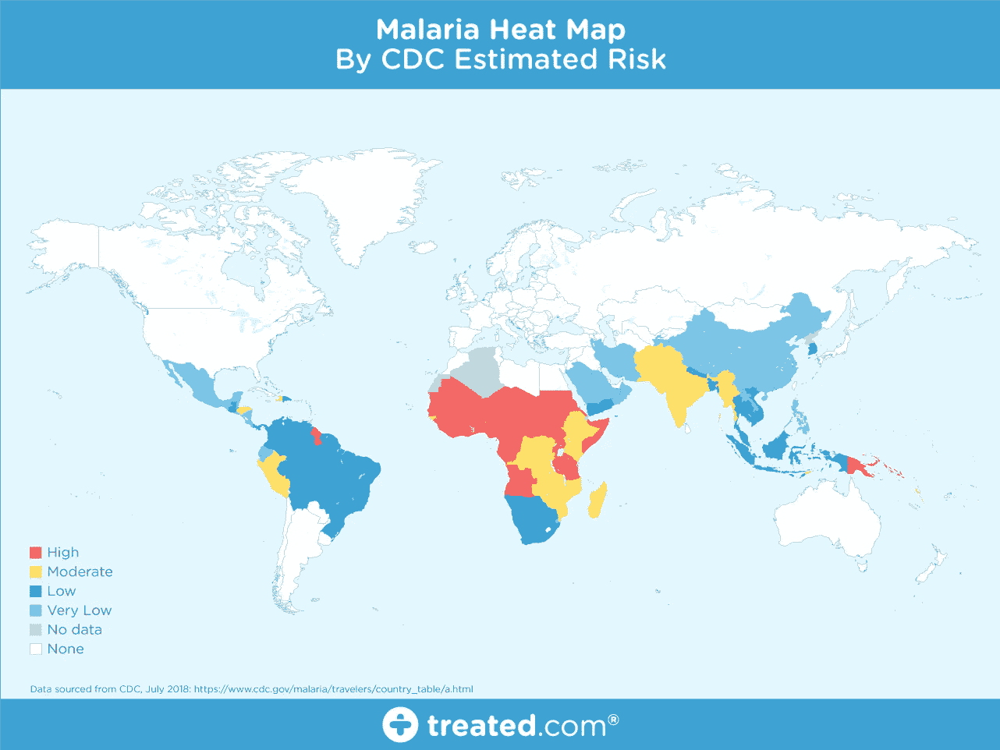

Malaria Estimated Risk Heath Map (Source: treated.com)

很明显，疟疾在全球流行，尤其是在热带地区。然而，该项目的动机是基于这种疾病的性质和致命性。最初，如果被感染的蚊子叮咬，蚊子携带的寄生虫会进入你的血液，并开始破坏携氧的红细胞。通常情况下，疟疾的最初症状类似于流感或病毒，通常在蚊子叮咬后几天或几周内开始感到恶心。然而，这些致命的寄生虫可以在你的身体里存活一年以上，没有任何问题！因此，延误正确的治疗会导致并发症甚至死亡。因此，疟疾的早期有效检测可以拯救生命。

世界卫生组织(世卫组织)发布了一些关于疟疾的重要事实，你可以在这里查看[](https://www.who.int/features/factfiles/malaria/en/)*。简而言之，近一半的世界人口面临疟疾的威胁，每年有超过 2 亿的疟疾病例和大约 40 万人死于疟疾。这给了我们更大的动力，让疟疾的检测和诊断变得快速、简单和有效。*

# *疟疾检测方法*

*有几种方法和测试可用于疟疾的检测和诊断。我们的数据和分析所基于的原始论文是 S Rajaraman 等人的 [*【预训练卷积神经网络作为特征提取器用于改进薄血涂片图像中疟原虫的检测】*](https://peerj.com/articles/4568/) 。艾尔。向我们简要介绍了其中的一些方法。这些包括但不限于厚薄血涂片检查、聚合酶链反应(PCR)和快速诊断测试(RDT)。虽然我们不会在此详细介绍所有方法，但需要记住的重要一点是，后两种测试是替代方法，通常在无法提供高质量显微镜服务的情况下使用。*

*我们将简要讨论基于典型血液涂片工作流程的标准疟疾诊断，这要感谢 Carlos Ariza 关于洞察数据科学的精彩文章，这是我从 Adrian Rosebrock 关于疟疾检测的精彩文章[*pyimagesearch*](https://www.pyimagesearch.com/)中了解到的，所以我衷心感谢他们两位提供了如此优秀的资源，让我在这个领域有了更多的视角。*

**

*A blood smear workflow for Malaria detection ([Source](https://blog.insightdatascience.com/https-blog-insightdatascience-com-malaria-hero-a47d3d5fc4bb))*

*根据《世卫组织议定书》的指导原则，这一程序包括以 100 倍的放大倍数对血液涂片进行强化检查，在此过程中，人们从 5000 个细胞中人工计数含有寄生虫的红细胞。事实上拉贾拉曼等人的论文。艾尔。我们之前提到的，谈到了完全相同的事情，为了使事情更清楚，我引用了这篇论文中的一个例子。*

> *厚血涂片有助于检测寄生虫的存在，而薄血涂片有助于识别引起感染的寄生虫的种类(疾病控制和预防中心，2012 年)。诊断的准确性很大程度上依赖于人的专业知识，并可能受到观察者之间的变异性和疾病流行/资源受限地区大规模诊断所带来的责任的不利影响(Mitiku，Mengistu & Gelaw，2003)。使用聚合酶链式反应(PCR)和快速诊断测试(RDT)等替代技术；然而，PCR 分析的性能有限(Hommelsheim 等人，2014 年)，而快速诊断技术在疾病流行地区的成本效益较低(Hawkes，Katsuva & Masumbuko，2009 年)。*

*因此，疟疾检测肯定是一个密集的手动过程，也许可以使用深度学习实现自动化，这是本文的基础。*

# *用于疟疾检测的深度学习*

*对于常规的手工诊断血涂片，这是一个密集的手工过程，需要适当的专业知识来分类和计数被寄生和未被感染的细胞。通常情况下，这可能无法很好地扩展，如果我们在全球特定地区没有合适的专业知识，可能会带来问题。在利用最先进的(SOTA)图像处理和分析技术来提取手工设计的特征和建立基于机器学习的分类模型方面，已经取得了一些进展。然而，这些模型是不可扩展的，因为有更多的数据可用于训练，并且考虑到手工设计的特征需要大量时间的事实。*

*深度学习模型，或者更具体地说，卷积神经网络(CNN)已经被证明在各种各样的计算机视觉任务中非常有效。虽然我们假设你对 CNN 有所了解，但如果你不了解，请点击这里的查看[这篇文章。简而言之，CNN 模型中的关键层包括卷积层和池层，如下图所示。](http://cs231n.github.io/convolutional-networks/)*

*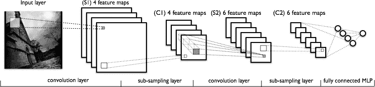*

*A typical CNN architeture (Source: deeplearning.net)*

*卷积层从数据中学习空间层次模式，这也是平移不变的。因此，他们能够学习图像的不同方面。例如，第一卷积层将学习小的和局部的图案，例如边缘和拐角，第二卷积层将基于来自第一层的特征学习更大的图案，等等。这允许 CNN 自动化特征工程并学习在新数据点上概括良好的有效特征。合并图层有助于缩减采样和降维。*

*因此，CNN 帮助我们进行自动化和可扩展的特征工程。此外，在我们的模型末尾插入密集层使我们能够执行像图像分类这样的任务。使用深度学习模型(如 CNN)的自动化疟疾检测可能非常有效、廉价和可扩展，特别是随着迁移学习和预训练模型的出现，这些模型即使在数据较少等限制下也能很好地工作。*

*Rajaraman 等人的论文，' [*预训练卷积神经网络作为特征提取器，用于改进薄血涂片图像中的寄生虫检测*](https://lhncbc.nlm.nih.gov/system/files/pub9752.pdf) *'* 利用他们论文中提到的数据的总共六个预训练模型，在检测疟疾与未感染样本方面获得了令人印象深刻的 95.9%的准确性。我们的重点是从头开始尝试一些简单的 CNN 模型和几个使用迁移学习的预训练模型，看看我们在同一数据集上得到的结果！我们将使用包括 Python 和 TensorFlow 在内的开源工具和框架来构建我们的模型。*

# *数据集详细信息*

*让我们讨论一下我们将在分析中使用的数据集。我们很幸运，李斯特山国家生物医学通讯中心(LHNCBC)的研究人员(国家医学图书馆(NLM)的一部分)仔细收集并注释了健康和感染血液涂片图像的数据集。你可以从 [***官网***](https://ceb.nlm.nih.gov/repositories/malaria-datasets/) 下载这些图片。*

*事实上，他们开发了一个移动应用程序，可以在连接到传统光学显微镜的标准 Android 智能手机上运行(Poostchi 等人，2018 年)。在孟加拉国吉大港医学院医院收集 150 名恶性疟原虫感染患者和 50 名健康患者的吉姆萨染色薄血涂片并拍照。智能手机的内置摄像头可以获取每个微观视野的幻灯片图像。这些图像由泰国曼谷的玛希多-牛津热带医学研究中心的专家幻灯片阅读者手工注释。让我们简单地检查一下我们的数据集结构。我们首先根据正在使用的操作系统安装一些基本的依赖项。*

*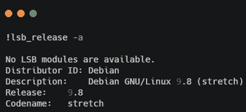*

*我在云上使用基于 Debian 的系统，它有一个 GPU，所以我可以更快地运行我的模型！安装树依赖项，以防您没有它，这样我们可以查看我们的目录结构(`**sudo apt install tree**`)。*

*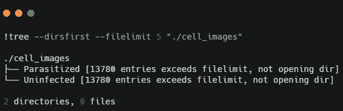*

*看起来我们有两个文件夹，里面有被感染和健康细胞的图像。使用下面的代码，我们可以获得图像总数的更多细节。*

*看起来我们有了一个平衡的数据集，包括 **13779** *疟疾*和*非疟疾*(未感染)细胞图像。让我们以此为基础构建一个数据框架，它将在我们开始构建数据集时对我们有用。*

*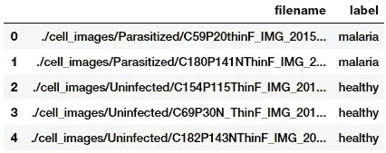*

# *构建和浏览影像数据集*

*为了建立深度学习模型，我们需要训练数据，但我们也需要在看不见的数据上测试模型的性能。我们将分别对训练、验证和测试数据集使用 60:10:30 的分割。我们将在训练期间利用训练和验证数据集，并在测试数据集上检查模型的性能。*

*显然，由于血液涂片和细胞图像会因人、测试方法和照片拍摄方向的不同而有所不同，因此图像的尺寸会有所不同。让我们获取一些训练数据集的汇总统计数据，以确定最佳图像尺寸(请记住，我们根本不接触测试数据集！).*

*我们应用并行处理来加速图像读取操作，并且基于汇总统计数据，我们决定将每个图像的大小调整为`**125x125**`像素。让我们加载所有的图像，并调整它们的大小到这些固定的尺寸。*

*我们再次利用并行处理来加速与图像加载和大小调整相关的计算。最后，我们得到了前面输出中描述的所需维数的图像张量。我们现在可以查看一些样本细胞图像，以了解我们的数据是什么样子的。*

*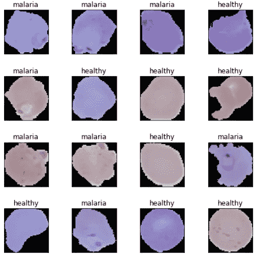*

*根据上面的样本图像，我们可以注意到疟疾和健康细胞图像之间的一些细微差异。我们基本上会让我们的深度学习模型在模型训练的时候尝试学习这些模式。在开始训练我们的模型之前，我们设置一些基本的配置设置。*

*我们固定我们的图像尺寸、批量大小、时期并编码我们的分类标签。TensorFlow 2.0 的 alpha 版本于 2019 年 3 月发布，就在本文撰写的几周前，它给了我们一个完美的借口来尝试它！*

# *深度学习模型训练阶段*

*在模型训练阶段，我们将建立几个深度学习模型，并在我们的训练数据上训练它们，并在验证数据上比较它们的性能。然后，我们将保存这些模型，并在稍后的模型评估阶段再次使用它们。*

## *模型 1: CNN 从零开始*

*我们的第一个疟疾检测模型将从头开始构建和训练一个基本的卷积神经网络(CNN)。首先让我们定义我们的模型架构。*

*基于前面代码中的架构，我们的 CNN 模型有三个卷积和池层，后面是两个密集层和正则化丢弃层。现在就来训练我们的模型吧！*

*我们得到了一个***95.6%**的验证精度，这已经很不错了，尽管我们的模型看起来有点过拟合，看看我们的 ***训练精度*****99.9%**。我们可以通过绘制训练和验证准确性和损失曲线来清楚地了解这一点。**

**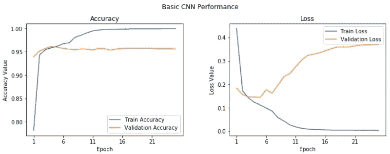**

**Learning Curves for Basic CNN**

**因此，我们可以看到，在第五纪元后，事情似乎并没有整体改善很多。这个模型还是留着以后评估吧。**

```
****model.save('basic_cnn.h5')****
```

## **深度迁移学习**

**正如人类具有跨任务转移知识的固有能力一样，转移学习使我们能够利用以前学习的任务中的知识，并将它们应用到更新的相关任务中，即使是在机器学习或深度学习的背景下。对迁移学习的全面介绍可以在我的文章[](/a-comprehensive-hands-on-guide-to-transfer-learning-with-real-world-applications-in-deep-learning-212bf3b2f27a)*和我的书[](https://github.com/dipanjanS/hands-on-transfer-learning-with-python)*中找到，供有兴趣深入研究的读者参考。****

******

***Ideas for deep transfer learning***

***就本文的目的而言，我们的想法是，我们能否利用预先训练的深度学习模型(在大型数据集上训练——如 [*ImageNet*](http://image-net.org/index) )通过在我们的问题背景下应用和转移其知识来解决疟疾检测的问题？***

**我们将应用两种最流行的深度迁移学习策略。**

*   ****作为特征提取器的预训练模型****
*   ****经过微调的预训练模型****

**我们将使用牛津大学视觉几何小组(VGG)开发的预训练 VGG-19 深度学习模型进行实验。像 VGG-19 这样的预训练模型是在具有许多不同图像类别的巨大数据集(ImageNet)上已经预训练的模型。考虑到这一事实，该模型应该已经学习了特征的健壮层次，这些特征相对于由 CNN 模型学习的特征是空间、旋转和平移不变的。因此，该模型已经学习了超过一百万幅图像的特征的良好表示，可以作为新图像的良好特征提取器，适用于计算机视觉问题，就像疟疾检测一样！在针对我们的问题释放迁移学习的力量之前，让我们简要讨论一下 VGG-19 模型架构。**

## **了解 VGG-19 模型**

**VGG-19 模型是建立在 ImageNet 数据库上的 19 层(卷积和全连接)深度学习网络，其建立的目的是图像识别和分类。这个模型是由卡伦·西蒙扬和安德鲁·齐泽曼建立的，并在他们题为[*‘用于大规模图像识别的超深度卷积网络’*](https://arxiv.org/pdf/1409.1556.pdf)*的论文中提到。我推荐所有感兴趣的读者去阅读这篇文章中的优秀文献。下图描述了 VGG-19 模型的架构。***

**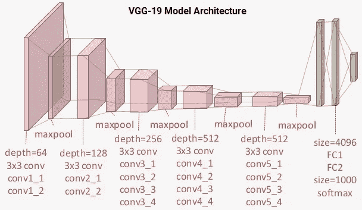**

**VGG-19 Model Architecture**

**您可以清楚地看到，我们共有使用`**3 x 3**`卷积滤镜的`**16**`卷积层，以及用于缩减采样的 max pooling 层，并且共有两个完全连接的隐藏层，每个层中有`**4096**`个单元，后面是一个密集的`**1000**`个单元层，其中每个单元代表 ImageNet 数据库中的一个图像类别。我们不需要最后三层，因为我们将使用我们自己的完全连接的密集层来预测疟疾。我们更关心前五个模块，这样我们可以利用 VGG 模型作为有效的特征提取器。**

**对于其中一个模型，我们将通过冻结所有五个卷积块来将其用作简单的特征提取器，以确保它们的权重不会在每个时期后更新。对于最后一个模型，我们将对 VGG 模型进行微调，其中我们将解冻最后两个块(块 4 和块 5)，以便在我们训练自己的模型时，它们的权重在每次迭代(每批数据)中得到更新。**

## **模型 2:作为特征提取器的预训练模型**

**为了构建这个模型，我们将利用 TensorFlow 加载 VGG-19 模型，并冻结卷积块，以便我们可以将其用作图像特征提取器。我们将在最后插入我们自己的密集层来执行分类任务。**

**因此，从前面的输出中很明显，我们的模型中有许多层，我们将只使用 VGG-19 模型的冻结层作为特征提取器。您可以使用以下代码来验证我们的模型中有多少层确实是可训练的，以及我们的网络中总共有多少层。**

**现在，我们将使用与之前模型相似的配置和回调来训练我们的模型。参考 [***我的 GitHub 库***](https://nbviewer.jupyter.org/github/dipanjanS/data_science_for_all/tree/master/os_malaria_detection/) 获取训练模型的完整代码。我们观察到下面的曲线显示了模型的准确性和损失。**

**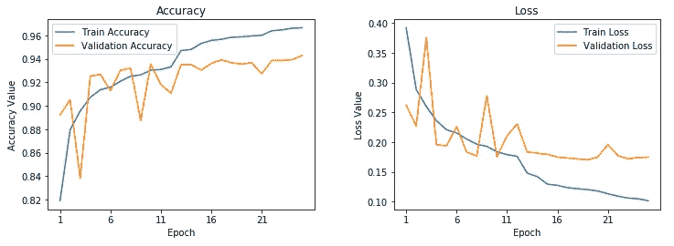**

**Learning Curves for frozen pre-trained CNN**

**这表明我们的模型并没有像我们的基本 CNN 模型那样过度拟合，但是性能并没有真的更好，事实上比我们的基本 CNN 模型略差。现在让我们保存这个模型，以便将来评估。**

```
****model.save('vgg_frozen.h5')****
```

## **模型 3:带有图像增强的微调预训练模型**

**在我们的最终模型中，我们将微调预训练 VGG-19 模型的最后两个块中存在的层的权重。除此之外，我们还将介绍图像增强的概念。图像增强背后的想法就像它的名字一样。我们从训练数据集中加载现有图像，并对其应用一些图像变换操作，如旋转、剪切、平移、缩放等，以产生现有图像的新的、改变的版本。由于这些随机变换，我们每次得到的图像并不相同。我们将利用`**tf.keras**`中一个名为`**ImageDataGenerator**`的优秀工具，它可以帮助我们构建图像增强器。**

**除了缩放图像(这是强制性的)之外，我们不对验证数据集应用任何变换，因为我们将使用它来评估每个时期的模型性能。对于迁移学习环境中图像增强的详细解释，如果需要，请随意查看我的文章[*。让我们来看看一些来自一批图像增强变换的样本结果。*](/a-comprehensive-hands-on-guide-to-transfer-learning-with-real-world-applications-in-deep-learning-212bf3b2f27a)**

**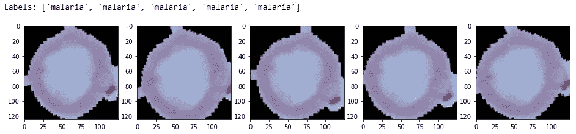**

**Sample Augmented Images**

**在前面的输出中，您可以清楚地看到图像的细微变化。我们现在将建立我们的深度学习模型，确保 VGG-19 模型的最后两个模块是可训练的。**

**我们降低了模型中的学习率，因为我们不想在微调时对预训练层进行大的权重更新。该模型的训练过程将略有不同，因为我们使用数据生成器，因此我们将利用`**fit_generator(…)**` 函数。**

**这看起来是我们迄今为止最好的模型，给了我们几乎 96.5%的**的 ***验证准确度*** ，并且基于训练准确度，看起来我们的模型没有我们的第一个模型那样过度拟合。这可以用下面的学习曲线来验证。****

****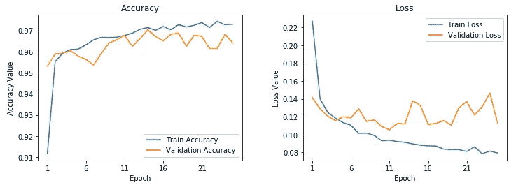****

****Learning Curves for fine-tuned pre-trained CNN****

****让我们现在保存这个模型，以便我们可以很快在我们的测试数据集上使用它进行模型评估。****

```
******model.save('vgg_finetuned.h5')******
```

****这就完成了我们的模型训练阶段，我们现在准备在实际的测试数据集上测试我们的模型的性能！****

# ****深度学习模型性能评估阶段****

****我们现在将评估我们刚刚在训练阶段构建的三个不同的模型，方法是使用它们对来自我们测试数据集的数据进行预测，因为仅仅验证是不够的！我们还构建了一个名为`**model_evaluation_utils**`的漂亮实用模块，我们将使用它来评估我们的深度学习模型和相关分类指标的性能。这里的第一步显然是扩展我们的测试数据。****

****下一步涉及加载我们保存的深度学习模型，并对测试数据进行预测。****

****最后一步是利用我们的`**model_evaluation_utils**`模块，用相关的分类指标检查每个模型的性能。****

****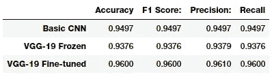****

****看起来我们的第三个模型在测试数据集上的表现是我们所有三个模型中最好的，给出了模型 ***准确性*** 以及***f1-分数*****96%**，这非常好，与我们之前提到的研究论文和文章中提到的更复杂的模型相当！****

# ****结论****

****在本文中，我们看到了一个有趣的疟疾检测的真实世界医学成像案例研究。疟疾检测本身并不是一个简单的过程，全球各地是否有合适的人员也是一个严重的问题。我们研究了利用人工智能的易于构建的开源技术，这些技术可以为我们提供检测疟疾的最先进的准确性，从而使人工智能造福社会。我鼓励每个人查阅本文中提到的文章和研究论文，没有它们，我就不可能构思和写这篇文章。让我们期待医疗保健行业更多地采用开源人工智能功能，让世界各地的每个人都可以更便宜地使用它！****

> ****本文改编自我之前在 opensource.com[发表的](https://opensource.com/) [**自己的文章**](https://opensource.com/article/19/4/detecting-malaria-deep-learning)****

****如果您有兴趣运行或采用本文中使用的所有代码，可以在[***my GitHub repository***](https://nbviewer.jupyter.org/github/dipanjanS/data_science_for_all/tree/master/os_malaria_detection/)上找到。****

****记得从 [***官网***](https://ceb.nlm.nih.gov/repositories/malaria-datasets/) 下载数据。****