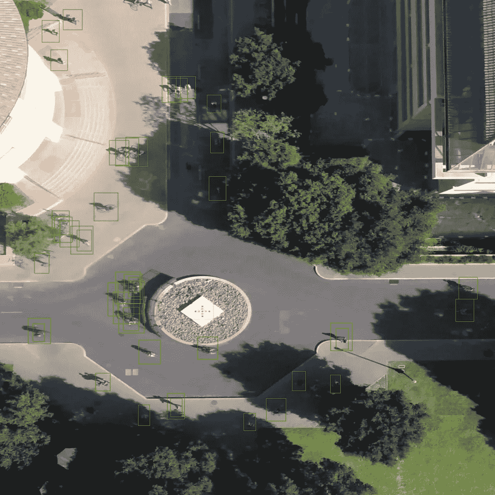

# 用 Jetson Xavier 在无人机上探测行人和骑车人

> 原文：<https://towardsdatascience.com/detecting-pedestrians-and-bikers-on-a-drone-with-jetson-xavier-93ce92e2c597?source=collection_archive---------18----------------------->

rones 是每个制造商和发烧友都想拥有的最酷的技术之一。与此同时，随着无人机变得越来越普遍，人工智能正在快速发展，我们现在正处于一个可以在无人机上进行物体检测和语义分割的状态。在这篇博文中，我将分享如何对无人机拍摄的图像进行物体检测。

**手头问题的一些基础知识**

*   首先，重要的是要认识到，我们无法在通用嵌入式硬件(如 raspberry pi)上实际运行对象检测，因此需要为人工智能推理构建专用硬件。
*   第二，如果你运行常用的对象检测模型，如在 COCO 和 Pascal VOC 数据集上训练的 YOLO 或 SSD，它们根本不会做得很好。这是因为从高处看一个物体和在地面上看是完全不同的。因此，推理数据的分布将与模型在训练期间遇到的分布非常不同，这将导致它失败。

**一些解决方案**

*   正如这篇文章的标题中提到的，我将使用目前自主机器人可用的最高端嵌入式处理器，来自 Nvidia 的 Jetson AGX Xavier。如果你想使用 Jetson TX2 或 nano，我会在文章末尾提供一些改进它们性能的建议。
*   为了解决不同数据分布的问题，斯坦福大学的研究人员发布了一个名为[斯坦福无人机数据集](http://cvgl.stanford.edu/projects/uav_data/)的数据集，其中包含几个从无人机上拍摄的视频，以及每个视频每一帧的标签。被检测的有六个等级:`Biker`、`Car`、`Bus`、`Cart`、`Skater`和`Pedestrian`。

任何经过斯坦福数据集训练的像样的对象检测模型都应该能够很好地检测这六个对象。在这篇文章中，我们将使用 [RetinaNet](https://arxiv.org/pdf/1708.02002.pdf) ，这是一个由脸书(FAIR)发布的非常好的对象检测模型，它以这样一种方式塑造损失函数，即模型在训练期间学习专注于困难的例子，从而学习得更好。更多关于 RetinaNet 的细节可以在[这里](https://github.com/facebookresearch/detectron2)找到。

## **获取模型并转换为 fp16**

答虽然 FAIR 的 Detectron 2 [model zoo](https://github.com/facebookresearch/detectron2/blob/master/MODEL_ZOO.md) 有几个模型可以下载和使用，但它们都是在 COCO 和 Pascal 数据集上训练的，正如我们所讨论的，这对我们的任务没有用。在斯坦福数据集上从头训练一个模型将是一项艰巨的任务。幸运的是，我发现 Nvidia 提供了一个在这个数据集上训练的模型，作为他们在 DeepStream SDK 上的一个网络研讨会的一部分。我并不想在这篇博文中支持 Nvidia，但是如果你想在没有训练自己的模型的情况下开始，最快的方法是注册[网上研讨会](http://go.nvidianews.com/dc/Ty58ol2Ube3I8pgmu_WArvStj6XbWRGXWkAZY1LzhWTzLXNHPKS0BV7BGSc_UfLnrsN9qjvyMiH8wtAcnwkDDFhf65REN7qhIZDTPZHoMdmGxzwGGPr7l-zysQq6xmLAbcs84_0Q4Bf6aa9jge1FX0qOVqI71plWvsc13G6SusnN_kbGc0qq7rJXpy2d9tWjLXELID3wYEHRZoNdEA8P42FfKySP092XdQni3ZHH-b8=/s0bif6s0UFMC0O31wc00E0N)并下载模型作为网上研讨会资源的一部分。你要找的文件是大约 150 MB 的`stanford_resnext50.onnx`。

一旦你有了这个文件，你就可以使用 GitHub 的`retinanet-examples`库的 C++ API 将`onnx`文件转换成一个引擎`plan`文件，这个文件是专门为你正在使用的 Jetson 设备编译的。以下是这些步骤的演练:

```
git clone [https://github.com/NVIDIA/retinanet-examples.git](https://github.com/NVIDIA/retinanet-examples.git)
cd retinanet-examples/extras/cppapi
mkdir build && cd build
cmake -DCMAKE_CUDA_FLAGS="--expt-extended-lambda -std=c++11" ..
make
cp /path/to/onnx/file . #copy onnx file to this directory./export stanford_resnext50.onnx engine.plan
```

成功创建`engine.plan`后，您可以使用`infer`实用程序在图像上测试模型的性能:

```
./infer engine.plan image.jpg
```

这将编写一个名为`detections.png`的文件，该文件将包含图像中检测到的对象的边界框。我给了斯坦福数据集中的一个视频图像作为模型的输入，下面是它输出的结果:



我们可以看到，该模型已经检测到几个行人在人行道上行走。这对于 Pascal 或 COCO 训练的模型是不可能的。这个图像的纵横比看起来很奇怪，因为 infer 实用程序将图像的大小调整为 1280x1280，这是模型的输入大小。

## **对视频的推断**

既然我们可以在单个图像中检测行人，那么通过编辑`cppapi`目录中的`infer.cpp`文件，就可以直接将其扩展到视频中。我想到了这个:

要使用这个脚本，将其保存为`cppapi`目录中的`infervideo.cpp`，并编辑`CMakeLists.txt`以添加添加`infervideo`可执行文件的行，并将其链接到`retinanet`和其他库。

完成后，您可以切换到`build`目录，并像以前一样调用`cmake`和`make`:

```
cmake -DCMAKE_CUDA_FLAGS="--expt-extended-lambda -std=c++11" ..
make
```

一旦构建了目标，您将在构建目录中看到一个名为`infervideo`的新可执行文件，它可以用作:

```
./infervideo engine.plan input.mov output.mp4
```

这将创建一个名为`output.mp4`的新视频，显示每个对象的边界框。如果您想要对来自无人机的实时视频流执行对象检测，您可以简单地提供摄像机的 gstreamer 管道作为脚本的第二个参数，它也会处理摄像机。

我用上面的脚本对我的母校新德里 IIT 德里校区拍摄的一段视频进行了推理。我使用了 0.2 的低阈值来绘制边界框，这就是为什么下面的视频中有一些误报。

## **提高性能**

如果您在 Xavier 上运行上面提供的脚本，您会发现视频的每一帧都需要 150 ms 来进行推断。这在 Xavier 上非常慢，在 TX2 或 nano 这样的小型 Jetsons 上就更慢了。以下是我们可以提高性能的一些方法:

*   我们在这篇文章中创建的引擎是用于 fp16 precision 的。您可以在整数精度上运行该模型，这将显著提高其性能。为此，您可以使用斯坦福数据集的一小部分数据和 tensorRT 的`trtexec`实用程序来创建 INT8 校准文件，并将该文件提供给我们构建目录中的`export`实用程序。
*   实际上，任何实时对象检测管道都不会对每一帧执行完整的推断，而是通常将其与计算成本低廉的跟踪器(如卡尔曼滤波器或光流)混合在一起。可以使用 opencv 的 KalmanFilter 类跨帧跟踪对象，每 4 或 5 帧只进行一次推断。如果无人机在推理过程中没有突然的抖动，这在实践中会很好。
*   我们正在使用的模型非常大，因为它需要 1280x1280 的图像。您可以在较低分辨率的图像甚至自定义数据集上训练模型，以显著改善模型的延迟和吞吐量。训练模型的说明在`retinanet-examples`存储库中，但是最好在一个配备支持 CUDA 的 GPU 的 x86 工作站上完成。

## **结论**

这篇博客旨在为那些在 Jetson Xavier 上部署 retinanet 模型有困难的人提供帮助，并记录我为在无人机上运行良好的对象检测管道所做的努力。虽然我们得到了比 Coco/Pascal 模型更好的结果，但要使模型在 Jetson 设备上实时运行，还需要做许多改进。请将此作为您自己项目的起点，如果您有任何其他改进性能的建议，请在下面发表评论。