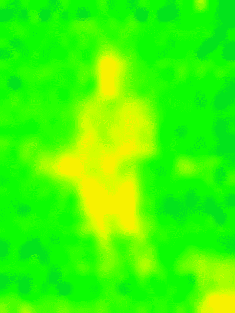
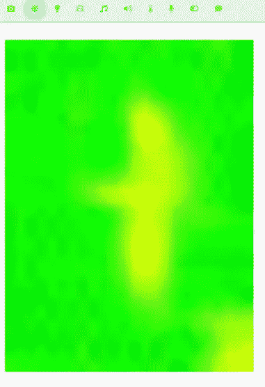
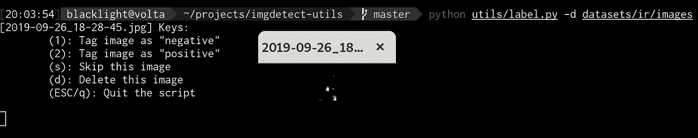

# 使用 RaspberryPi、热感相机和机器学习来检测人

> 原文：<https://towardsdatascience.com/detecting-people-with-a-raspberrypi-a-thermal-camera-and-machine-learning-376d3bbcd45c?source=collection_archive---------3----------------------->

这个故事的更新版本可以在 [*Platypush 博客*](https://blog.platypush.tech/article/Detect-people-with-a-RaspberryPi-a-thermal-camera-Platypush-and-a-pinch-of-machine-learning) *上免费获得。*

一段时间以来，基于人的存在触发事件一直是许多极客和 DIY 机器人的梦想。例如，让你的房子在你进出客厅时开灯或关灯是一个有趣的应用。大多数解决这类问题的解决方案，甚至更高端的解决方案，如[飞利浦色调传感器](https://www2.meethue.com/en-us/p/hue-motion-sensor/046677473389)，检测运动，而不是实际的人的存在——这意味着一旦你像树懒一样躺在沙发上，灯就会关闭。当你离开房间去你的卧室时，能够关掉音乐和/或电视，而不用麻烦地关掉所有的按钮，这也是一个有趣的推论。当你不在家时，检测你房间里的人是另一个有趣的应用。

热感相机与深度神经网络相结合是一种更强大的策略，可以实际检测人的存在。与运动传感器不同，即使人不动，它们也能探测到人的存在。此外，与光学相机不同，它们通过测量人体以红外辐射形式释放的热量来检测人体，因此更加耐用——它们的灵敏度不取决于照明条件、目标的位置或颜色。在探索热感相机解决方案之前，我尝试了一段时间来建立一个模型，而不是依赖于传统网络摄像头的光学图像。差异是惊人的:我用一周内在不同照明条件下拍摄的 1 万多张 640x480 图像训练光学模型，而我用一天内拍摄的 900 张 24x32 图像训练热感相机模型。即使使用更复杂的网络架构，光学模型在检测人的存在方面也不会达到 91%以上的准确度，而热模型在更简单的神经网络的单个训练阶段内将达到大约 99%的准确度。尽管潜力很大，但市场上并没有太多东西——已经有一些关于这个主题的研究工作(如果你在谷歌上搜索“人物检测热感相机”，你会发现大多数研究论文)和一些用于专业监控的高端和昂贵的产品。由于我的房子缺乏现成的解决方案，我决定承担起自己的责任，构建自己的解决方案——确保任何人都可以轻松复制它。

# 五金器具

*   一个 RaspberryPi(价格:35 美元左右)。理论上，任何模型都应该工作，但使用单核 RaspberryPi Zero 来执行机器学习任务可能不是一个好主意——任务本身并不昂贵(我们将只使用 Raspberry 来对经过训练的模型进行预测，而不是训练模型)，但它可能仍然会在 Zero 上遭受一些延迟。任何更多的表演模式应该做得很好。
*   热感相机。对于这个项目，我使用了[mlx 90640](https://shop.pimoroni.com/products/mlx90640-thermal-camera-breakout)Pimoroni breakout 相机(价格:55 美元)，因为它相对便宜，易于安装，并且提供了良好的效果。这款相机有标准(55)和广角(110)两种版本。我使用广角模式，因为相机监控一个大客厅，但考虑到两者具有相同的分辨率(32x24 像素)，因此更宽的角度以较低的空间分辨率为代价。如果你想使用不同的热感相机，你不需要做太多改变，只要它带有 RaspberryPi 的软件接口，并且与 [platypush](https://platypush.readthedocs.io/en/latest/) 兼容。
*   如果你用的是突破相机，我个人建议把它安装在类似于[突破花园](https://shop.pimoroni.com/products/breakout-garden-hat-i2c-spi)的东西上(价格:10-14 美元)，因为它很容易安装在你的 RaspberryPi 上，不需要焊接。

在您的 RaspberryPi 上设置 MLX90640 如果您有一个突破性的花园，这很容易。将突破花园放在你的覆盆子上。将摄像机分接头安装到 I2C 插槽中。启动 RaspberryPi。完成了。

# 软件

我在 Raspbian 上测试了我的代码，但是经过一些小的修改，它应该很容易适应安装在 RaspberryPi 上的任何发行版。

热感相机的软件支持需要做一些工作。MLX90640(还)没有 Python 现成的接口，但是为它提供了一个 [C++开源驱动](https://github.com/pimoroni/mlx90640-library)。安装说明:

```
# Install the dependencies
[sudo] apt-get install libi2c-dev# Enable the I2C interface
echo dtparam=i2c_arm=on | sudo tee -a /boot/config.txt# It's advised to configure the SPI bus baud rate to
# 400kHz to support the higher throughput of the sensor
echo dtparam=i2c1_baudrate=400000 | sudo tee -a /boot/config.txt# A reboot is required here if you didn't have the
# options above enabled in your /boot/config.txt# Clone the driver's codebase
git clone [https://github.com/pimoroni/mlx90640-library](https://github.com/pimoroni/mlx90640-library)
cd mlx90640-library# Compile the rawrgb example
make clean
make I2C_MODE=LINUX examples/rawrgb
```

如果一切顺利，您应该会在`examples`目录下看到一个名为`rawrgb`的可执行文件。如果你运行它，你应该会看到一堆二进制数据——这是相机捕捉的帧的原始二进制表示。记住它的位置或将它移动到自定义 bin 文件夹，因为它是 platypush 将用来与相机模块交互的可执行文件。

本文假设您已经在系统上安装并配置了 platypush。如果没有，请到我在[开始使用 platypush](https://medium.com/swlh/automate-your-house-your-life-and-everything-else-around-with-platypush-dba1cd13e3f6) 、 [readthedocs 页面](https://platypush.readthedocs.io/en/latest/)、 [GitHub 页面](https://github.com/BlackLight/platypush/)或 [wiki](https://github.com/BlackLight/platypush/wiki) 上的帖子。

您还需要 RaspberryPi 上的以下 Python 依赖项:

```
# For machine learning image predictions
pip install opencv opencv-contrib-python# For image manipulation in the MLX90640 plugin
pip install Pillow
```

在这个例子中，我们将在捕获和预测阶段使用 RaspberryPi，在训练阶段使用一个更强大的机器。在用于训练模型的计算机上，您需要以下依赖项:

```
# For image manipulation
pip install opencv# Install Jupyter notebook to run the training code
pip install jupyterlab
# Then follow the instructions at [https://jupyter.org/install](https://jupyter.org/install)# Tensorflow framework for machine learning and utilities
pip install tensorflow numpy matplotlib# Clone my repository with the image and training utilities
# and the Jupyter notebooks that we'll use for training
git clone [https://github.com/BlackLight/imgdetect-utils](https://github.com/BlackLight/imgdetect-utils)
```

# 捕获阶段

现在你已经有了所有的硬件和软件，是时候开始用你的相机捕捉帧，并用它们来训练你的模型了。首先，在 platypush 配置文件中配置 [MLX90640 插件](https://platypush.readthedocs.io/en/latest/platypush/plugins/camera.ir.mlx90640.html):

```
camera.ir.mlx90640:
    fps: 16      # Frames per second
    rotate: 270  # Can be 0, 90, 180, 270
    rawrgb_path: /path/to/your/rawrgb
```

重启 platypush。如果您启用了 [HTTP 后端](https://platypush.readthedocs.io/en/latest/platypush/backend/http.html)，您可以测试是否能够拍照:

```
curl -XPOST -H 'Content-Type: application/json' \
     -d '{"type":"request", "action":"camera.ir.mlx90640.capture", "args": {"output_file":"~/snap.png", "scale_factor":20}}' \
      [http://localhost:8008/execute](http://localhost:8008/execute)?token=...
```

热图像应该存储在`~/snap.png`下。在我的例子中，当我在传感器前面时，它看起来像这样:



注意右下角的辉光——这实际上是我的 RaspberryPi 4 CPU 发出的热量。它在我拍摄的所有图像中都存在，如果你将相机安装在树莓上，你可能会看到类似的结果，但这对于你的模型训练来说应该不是问题。

如果您打开 webpanel ( `[http://your-host:8008](http://your-host:8008)`)，您还会注意到一个由太阳图标表示的新标签，您可以使用它从 web 界面监控您的相机。



您也可以将浏览器指向`http://your-host:8008/camera/ir/mlx90640/stream?rotate=270&scale_factor=20.`，直接在网络面板外监控摄像机

现在向 platypush 配置添加一个 cronjob，以便每分钟拍摄一次快照:

```
cron.ThermalCameraSnapshotCron:
    cron_expression: '* * * * *'
    actions:
        -
            action: camera.ir.mlx90640.capture
            args:
                output_file: "${__import__(’datetime’).datetime.now().strftime(’/img/folder/%Y-%m-%d_%H-%M-%S.jpg’)}"
                grayscale: true
```

图像将以格式`YYYY-mm-dd_HH-MM-SS.jpg`存储在`/img/folder`下。没有应用比例因子——即使图像很小，我们也只需要它们来训练我们的模型。此外，我们将把图像转换成灰度——神经网络将更轻，实际上更准确，因为它将只需要依赖每个像素一个变量，而不会被 RGB 组合欺骗。

重启 platypush，验证每分钟在你的图片目录下创建一张新图片。让它运行几个小时或几天，直到你对样本数量满意为止。试着平衡房间里没有人和有人的照片数量，试着覆盖尽可能多的情况，例如，坐在、站在房间的不同位置等等。正如我前面提到的，在我的例子中，我只需要不到 1000 张足够多样的图片就可以达到 99%以上的准确率。

# 标记阶段

一旦你对你采集的样本数量感到满意，就把图像复制到你用来训练你的模型的机器上(它们应该都是小的 JPEG 文件，每个小于 500 字节)。将它们复制到您克隆了我的`imgdetect-utils`库的文件夹中:

```
BASEDIR=~/git_tree/imgdetect-utils# This directory will contain your raw images
IMGDIR=$BASEDIR/datasets/ir/images# This directory will contain the raw numpy training
# data parsed from the images
DATADIR=$BASEDIR/datasets/ir/datamkdir -p $IMGDIR
mkdir -p $DATADIR# Copy the images
scp pi@raspberry:/img/folder/*.jpg  $IMGDIR# Create the labels for the images. Each label is a
# directory under $IMGDIR
mkdir $IMGDIR/negative
mkdir $IMGDIR/positive
```

一旦复制了图像并创建了标签目录，运行存储库中提供的`label.py`脚本来交互式地标记图像:

```
cd $BASEDIR
python utils/label.py -d $IMGDIR --scale-factor 10
```

每个图像将在一个新窗口中打开，您可以通过键入 1(负)或 2(正)来标记它:



在程序结束时，图像目录下的`negative`和`positive`目录应该已经被填充。

# 培训阶段

一旦我们得到了所有标记的图像，就该训练我们的模型了。在`notebooks/ir`下提供了一个`[train.ipynb](https://github.com/BlackLight/imgdetect-utils/blob/master/notebooks/ir/train.ipynb)` Jupyter 笔记本，它应该是相对不言自明的:

如果您成功地正确执行了整个笔记本，您将在`models/ir/tensorflow`下拥有一个名为`ir.pb`的文件。那是你的 Tensorflow 模型文件，你现在可以把它复制到 RaspberryPi，并用它来做预测:

```
scp $BASEDIR/models/ir/tensorflow/ir.pb pi@raspberry:/home/pi/models
```

# 探测房间里的人

使用 platypush `[MlCv](https://platypush.readthedocs.io/en/latest/platypush/plugins/ml.cv.html)` [插件](https://platypush.readthedocs.io/en/latest/platypush/plugins/ml.cv.html)，将我们之前创建的`ThermalCameraSnapshotCron`的内容替换为按预定时间间隔拍照的逻辑，并使用我们刚刚训练的模型来预测房间中是否有人。

你可以在`procedure.people_detected`和`procedure.no_people_detected`中实现任何你喜欢的逻辑。这些程序仅在先前观察的状态发生变化时才会被调用。例如，当有人进入/离开房间时，打开或关闭灯的简单逻辑:

```
procedure.sync.people_detected:
    - action: light.hue.onprocedure.sync.no_people_detected:
    - action: light.hue.off
```

# 下一步是什么？

这是你的电话！随意试验更复杂的规则，例如，当有人进入房间时，使用 platypush 媒体插件改变房间中播放的音乐/视频的状态。或者早上第一次进房间的时候说一句自定义的早安短信。或者建立你自己的监视系统，当你不在家的时候跟踪别人的存在。或者增强模型以检测房间中的人数，而不仅仅是存在。或者你可以将它与光学流量传感器、距离传感器、激光测距传感器或光学相机(platypush [为其中一些提供了插件](https://platypush.readthedocs.io/en/latest/))结合起来，构建一个更加强大的系统，该系统还可以检测和跟踪传感器的移动或接近，等等。