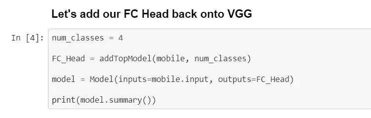

# 从 OCT-视网膜图像中检测视网膜损伤

> 原文：<https://towardsdatascience.com/detecting-retina-damage-from-oct-retinal-images-315b4af62938?source=collection_archive---------14----------------------->

[光学相干层析成像(OCT)](https://en.wikipedia.org/wiki/Optical_coherence_tomography) 是一种利用相干光捕捉生物组织高分辨率图像的成像技术。眼科医生大量使用 OCT 来获得眼睛视网膜的高分辨率图像。眼睛的视网膜功能更像照相机中的胶片。OCT 图像可用于诊断许多视网膜相关的眼病。

OCT 是一种新兴的生物医学成像技术，可以对高度散射的组织进行非侵入式实时高分辨率成像。它被眼科医生广泛用于对眼前部和视网膜的结构进行诊断成像。

在这篇文章中，我们将看到如何分类光学相干断层扫描来分类视网膜疾病。我们将讨论基于卷积神经网络(CNN)对视网膜 OCT 图像进行自动分类的分类方法，所述卷积神经网络基于使用迁移学习的 2 个预训练模型和 1 个定制 CNN 模型。

## 关于数据集

获取自:[视网膜 OCT 图像](https://www.kaggle.com/paultimothymooney/kermany2018/home)

**1。脉络膜新生血管(CNV):** 脉络膜新生血管是在[眼](https://en.wikipedia.org/wiki/Human_eye)的[脉络膜](https://en.wikipedia.org/wiki/Choroid)层产生新的血管。脉络膜新生血管是新生血管变性性黄斑病变(即“湿性”[黄斑变性](https://en.wikipedia.org/wiki/Macular_degeneration))[【1】](https://en.wikipedia.org/wiki/Choroidal_neovascularization#cite_note-1)的常见原因，通常会因极度近视、恶性近视变性或年龄相关发展而加剧。

**Choroidal neovascularization (CNV)**

**2。糖尿病黄斑水肿(DME):**

DME 是糖尿病的一种并发症，由黄斑中的液体积聚引起，可影响视网膜中央凹。黄斑是视网膜的中心部分，位于眼睛的后部，是视觉最敏锐的地方。DME 导致的视力丧失会持续数月，使人无法清晰聚焦。

**Diabetic Macular Edema (DME)**

**3。德鲁森:**

玻璃疣是视网膜下的黄色沉积物。玻璃疣是由脂质，一种脂肪蛋白质组成的。玻璃疣可能不会导致[老年性黄斑变性](https://www.aao.org/eye-health/diseases/age-related-macular-degeneration)。但是患有玻璃疣会增加一个人患 AMD 的风险。玻璃疣由蛋白质和钙盐组成，一般出现在双眼中。

**Drusen**

**4。正常**

当光线直接聚焦在视网膜上，而不是在它的前面或后面时，就会出现正常的视觉。视力正常的人能清楚地看到远近的物体。

**Normal**

# 迁移学习

## 微调我们的模型

微调实施包括*截断预训练网络的最后一层*(softmax 层)并用与我们的问题相关的新 soft max 层替换它。

## 1)MobileNet

MobileNet 是一种架构，更适合缺乏计算能力的基于移动和嵌入式的视觉应用。这个架构是 Google 提出来的。

使用预训练的 imagenet 权重加载 MobileNet，并排除顶层(即最后三层)用新的可训练层替换完全连接的层，并使用 include_top=False 显示模型中的其他层

*冻结一层或一组层意味着防止它们的权重在训练期间被更新。如果不这样做，那么卷积基先前学习的表示将在训练期间被修改。*

所有的卷积级别都是预先训练的，所以我们在完整的训练过程中冻结这些层，这样当新的完全连接的层试图学习模型时，它们的权重不会改变。因此，我们将可训练层设置为假。

GlobalAveragePooling2D 用于将输入转换为正确的形状，以便密集图层进行处理。它将前一层的 3D 输出展平为 1D 层，通过平均适合我们的全连接层。

num_classes=4，activation="softmax "通过推理将单个类别赋予样本—这是通过计算每个可能类别的概率来完成的。然后，我们可以选择概率最高的类别进行最终分类。

添加 mobilenet 层和全连接层，用于使用卷积基进行训练。

## 模型摘要

13 Conv Layers(Mobile Net)

可训练参数(权重)是在反向传播的反向过程中得到更新的所有参数。这些权重包含网络从训练数据中学习到的信息。

## 图像增强

图像增强背后的思想是，我们遵循一个设定的过程，从我们的训练数据集中获取现有图像，并对它们应用一些图像变换操作，如旋转、剪切、平移、缩放等，以产生现有图像的新的、改变的版本。

该增强生成 4 类 34464 幅训练图像和 3223 幅验证图像

## 培训模式

在模型的每次训练迭代期间，即在每个时期结束时，将调用回调机制。

**检查点**是一个定期保存应用程序状态快照的过程，因此如果出现故障，应用程序可以从上次保存的状态重新启动。*这在深度学习模型的训练过程中很有用，这通常是一项耗时的任务。*

**提前停止**减少神经网络中的过拟合就是利用提前停止。如果没有真正学到任何东西，提前停止可以通过终止训练过程来防止模型过度训练。

val_loss 没有从 0.70965 提高到最近 3 个时期的较低值，这是早期停止回调中的耐心。

测试准确率为 71.2%

## 混淆矩阵

正常图像很容易识别。

我们可以通过研究其他模型来提高更多。

## Github 代码: [Retinal-MobileNet.ipynb](https://nbviewer.jupyter.org/github/BadreeshShetty/OCT-Retinal/tree/master/Retinal-MobileNet.ipynb)

# 2)VGG16

来自牛津视觉几何小组，或简称为 **VGG** 的研究人员开发了 VGG 网络，该网络的特点是简单，只使用 3×3 的卷积层堆叠在彼此的顶部，深度不断增加。减少卷大小是由最大池处理的。最后，两个完全连接的层，每个层有 4，096 个节点，然后是 softmax 层。

池化是由 max pooling 层执行的，它位于某些卷积层之后。并非所有卷积层都遵循最大池。最大池是在一个 2×2 像素的窗口上执行的，步长为 2。ReLU 激活用于每个隐藏层。在大多数 VGG 变型中，过滤器的数量随着深度而增加。16 层架构 VGG-16 如下图所示。

与 mobilenet 类似，步骤几乎没有变化

展平层处理尺寸。因为我们有一个三维像素输入图像，所以我们使用 Flatten 将其转换为一个长的一维数字字符串。

13 Conv Layers(Vgg16)

与 MobileNet 相比，可训练参数更多。它标志着更多的功能都学到了模型。

## 混淆矩阵

与其他视网膜疾病相比，正常的玻璃疣被正确识别

## Github 代码: [RetinalVGG16.ipynb](https://nbviewer.jupyter.org/github/BadreeshShetty/OCT-Retinal/tree/master/RetinalVGG16.ipynb)

# 3)五隐层 CNN 模型

我们应用 5 CNN(卷积层)和 3*3 内核以及“relu”激活。

## 模型

## 可训练参数

与预训练模型相比，可训练性似乎更低。但是与预训练的模型相比，它仍然表现得更好。

## 测量精度

## 混淆矩阵

混淆矩阵在预测正常，玻璃疣和 DME 方面表现更好。

## Github 代码: [Retinal5CNN.ipynb](https://nbviewer.jupyter.org/github/BadreeshShetty/OCT-Retinal/blob/master/OCT-Retinal%205%20CNN.ipynb)

# 4)定制 VGG 模型

## 可训练参数

更多的可训练参数相比，这两个模型。与对比模型相比，不可训练参数也明显较少。

## 混淆矩阵

该模型已经正确地预测了大多数 OCT 视网膜疾病。上述推论可以在下面的预测中看到。

## 预言

Normal Prediction

Drusen Prediction

CNV Prediction

DME Prediction

从上面我们可以看到，所有的视网膜疾病都被正确地分类了。

## Github 代码: [OCT-Retinal-VGG.ipynb](https://nbviewer.jupyter.org/github/BadreeshShetty/OCT-Retinal/tree/master/OCT-Retinal-VGG.ipynb)

# 结论

具有 16 个隐藏层的 CNN 模型，即类似于 VGG 模型，给出了 96%测试准确度的最佳结果。

## 参考资料:

1.  [https://www.appliedaicourse.com](https://www.appliedaicourse.com/)

2.[https://www.kaggle.com/paultimothymooney/kermany2018](https://www.kaggle.com/paultimothymooney/kermany2018)

3.[http://www . cell . com/cell/full text/s 0092-8674(18)30154-5](http://www.cell.com/cell/fulltext/S0092-8674(18)30154-5)