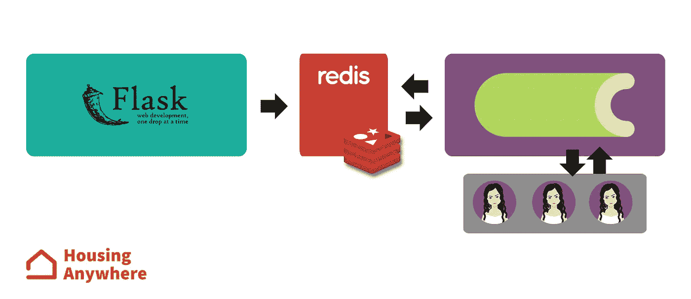
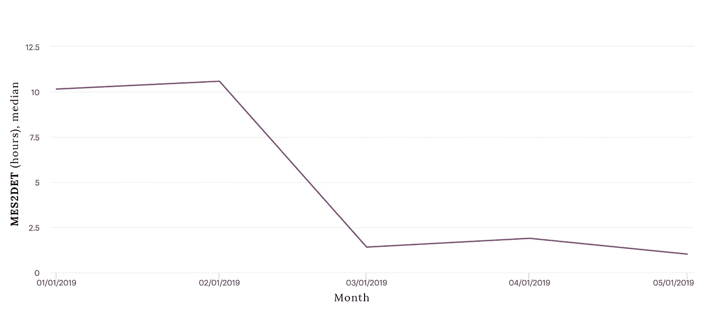

# 使用人工智能检测骗局，真的

> 原文：<https://towardsdatascience.com/detecting-scams-using-ai-for-real-6c96e712cf09?source=collection_archive---------30----------------------->

## 历时一年的旅程，开发市场上最好的欺诈防范系统之一

Photo by [Po-Ying Chen](https://unsplash.com/@poying?utm_source=unsplash&utm_medium=referral&utm_content=creditCopyText) on [Unsplash](https://unsplash.com/photos/FbrIh1-AITk?utm_source=unsplash&utm_medium=referral&utm_content=creditCopyText)

根据 2019 年 3 月发表的一项[研究——我特意寻找只是为了给这篇帖子找一个很酷的介绍——欧洲 40%的自定义人工智能初创公司实际上并不使用人工智能。我看到他们在那里做什么，利用普通人(和投资者)对这个领域鲜有的熟悉，在市场上将自己定位为酷黑魔法专家。我不为人工智能初创公司工作(我的意思是，我们不直接出售任何人工智能驱动的服务)，但几天前我们终于在](https://www.theverge.com/2019/3/5/18251326/ai-startups-europe-fake-40-percent-mmc-report)[发表了一篇内容广泛的帖子](https://medium.com/data-science-housinganywhere/how-ai-helped-housinganywhere-create-the-first-scammer-free-booking-platform-3153e1f358e3)，向公众介绍了我们的第一款人工智能驱动的产品。我认为分享我们实际部署它所经历的所有步骤以及我们为什么决定以这种方式进行部署会非常有趣。

没有重复，只是作为一个介绍性的术语:**佩内洛普**是我们检测骗局的内部工具。在我们的平台( [HousingAnywhere](https://housinganywhere.com/) ，一个在全球 400 多个城市都有房源的住宿市场)上发布的每个新房源都被归类为诈骗或非诈骗，在某些情况下，我们的*客户解决方案* (CS)部门会对其进行人工检查。它已经使用过去三年中收集的数据进行了训练，并作为一个集成来实现，其中每个模型独立地关注不同的特征或数据集的不同时间子集。

## 佩内洛普之前的欺诈预防

HousingAnywhere 不是 Penelope 生来就有的，提供信任和安全的市场一直是该公司的首要目标。多年来，欺诈预防系统在没有任何人工智能的情况下表现良好(难以置信，不是吗？)并且它几乎完全依赖于由一些静态 SQL 规则组成的触发器系统。一些被查询的数据结构和查询本身一点也不简单，但是一个简单的系统，如果设计和维护得好，往往可以胜过非常复杂的解决方案。问题是情况并不完全如此。当一家公司开始快速扩张，并且必须快速解决问题时，它可能会忽略一些好的实践。

最初的系统由大约 50 条规则组成，缺乏适当的文档，并且范围重叠。我们没有收集任何关于他们表现的统计数据，我们也不知道最初的设计者为什么要创造这些规则。我们有一种感觉，一些触发因素几个月来都没有导致任何检测，导致大量时间浪费在无用的检查上，但我们没有任何指标来证明这一假设，我们最终没有删除任何东西，在现有规则的基础上添加新规则，因为系统正在工作-在 3 年内没有一个骗子成功过！——我们很害怕碰任何东西。设计新规则本身也很棘手。有时，描述一个可疑的行为并不容易，对于一个人来说，可能很容易得到的东西可能需要数百行 SQL 语句，将可能存储在不同位置的表连接在一起。就在那时，我们开始考虑使用机器学习来取代规则系统:停止明确定义所有规则，让算法直接从我们的数据中学习它们。这是一个相当雄心勃勃的目标，我们花了 6 个多月的时间才实现，但那时我们已经有了一个非常具体的使用案例和一个定义良好的流程。我们不是简单地开始将随机数据扔给学习算法，看看会发生什么。此外，目标是替换已经被人们成功使用的现有产品(*有点儿*)，这允许我们有一个真实世界的框架来可靠地测试我们的替代产品(我已经在这里写了这个)。但是，如果我们不能衡量我们现有产品的性能，如何定义成功呢？

> 我们不是简单地开始将随机数据扔给学习算法，看看会发生什么。

我们在佩内洛普项目上花费了大量的精力，从一开始，就在永远扼杀它之前，对以前的规则系统进行合理化和改进。我们设计并实施了一个监控基础设施，能够跟踪每个触发器的性能(主要是精度)，我们还开始为客户解决方案部门收集一些指标，以检查我们的瓶颈在哪里，以及我们是否需要在技术基础设施的基础上改进我们的内部流程。我们最终两者都做了:如果人们遵循的过程一开始就没有效率，那么改进人们使用的技术基础设施就没有意义。人工智能是一种改善事物的工具，但它只是拼图中的一块。它的用处不在于单独使用它，而在于用它来改进整个过程。实现机器学习不是最容易的事情，最重要的是，这是一项结果非常不可预测的工作。先从简单的事情做起。

> 如果人们遵循的过程一开始就没有效率，那么改进人们使用的技术基础设施是没有意义的。

## 实际上是佩内洛普

一旦我们有了一个可靠的防欺诈基础设施(大约一个月的工作)，我们就开始构建一个替代方案来消除它。从一开始，我们从未考虑过完全取代人类主持人，我们也从未追求过类似学术论文的表现。我们总是不把精确度看做一个数字，而是看 CS 为检查标记的列表而浪费的无用工作的数量，并回忆为留在野外的诈骗列表的数量。规则系统也有助于为我们提供一组初始的工作特性。除此之外，我们还调查了其他一些人，这主要归功于每天与骗子打交道的人提供的信息。不过，我们没有浪费时间去研究那些在创建列表的前 5 分钟内无法获得的功能，同样，在早期阶段就有产品愿景在这方面非常有帮助。

我们在训练模型时面临的真正挑战是生成数据的平台的[进化性质。我们最终组装了 5 个](https://medium.com/data-science-housinganywhere/how-to-do-data-science-on-an-evolving-website-5fdec1c995da) [LightGBMs](https://github.com/microsoft/LightGBM) (性能相当，但训练时间比 XGBoost 短)，每个都用不同的数据集进行了垂直(样本数量)或水平(特征数量)大小的训练。每个模型都被加权以在新数据上具有最高性能(90-10 次验证，按时间顺序排列样本；探索权重空间的贝叶斯优化)。最终的模型已经被部署为一个 web API (Flask ),为一个异步调度预测任务的 Celery 实例提供数据。每个作业的结果在不同的通道上发送，并且部署不知道正在使用它的客户端。平台上发布的每一个新列表(唯一的例外是由可信的广告商创建的列表)都会发送给 Penelope 进行检查。或者被接受，被标记为诈骗，或者被发送进行人工审核。每个预测作业持续 3-4 秒，但需要其中的一小部分时间来通过第三方来源收集一些数据。

在第一次成功部署后(大约 2019 年 1 月)，我们必须决定如何处理系统的再培训过程以及我们数据的进化性质。我们运行了一些离线模拟，并比较了不同的再培训场景，发现对于我们的特定领域，每两周再培训 Penelope 会导致性能的显著提高(基本上，更多的骗子)。不足为奇的是，用集合中的所有最近特征训练的模型的重要性每次都与新列表的分类更相关。在未来，我们期望摆脱一些模式，并可能增加新的模式。在这个阶段，我们非常有信心做到这一点，我们有一个坚实的管道来发现新的换档功能，以训练我们的模型。

## 绩效和后续步骤

在 Penelope 之前，CS 部门每周花费 80 小时对可疑列表进行人工审核，目前大约是 15 小时(80%的改进)。大多数规则本身不会立即生效，需要 1 到 6 个小时来识别欺诈行为。这一限制将访问者置于风险之中，因为列表可以被联系几个小时。Penelope 能够在列表发布后立即对其进行分类，这使得这个窗口几乎为 0，并且实际上为 CS 提供了一个非常方便的指标来评估它们的性能。我们的防欺诈系统(作为一家公司)的质量现在与客户解决方案部门在检查 Penelope 标记的列表时的响应能力密切相关。 **Mes2Det** 是我们衡量这一点的内部指标，计算方法是在我们的系统上通知骗子后，报告骗子所需的时间。很容易注意到，自从 Penelope 上线以来，Mes2Det 改进了很多(从 10 小时减少到 2 小时),现在已经稳定了几个月。

目前，我们正在对 Penelope 进行不断的迭代，尽我们所能对其进行改进。我们已经学到的一些教训是，要追求的研究方向是缩小模型的范围，可能是用更小的数据集组装更简单的组件，而不是试图建立一个具有数百个复杂功能的更大的架构。在 6 月份，我们已经部署了第二个版本的 Penelope，即使它使用的数据集几乎是原始版本的一半，精度也提高了约 10%。