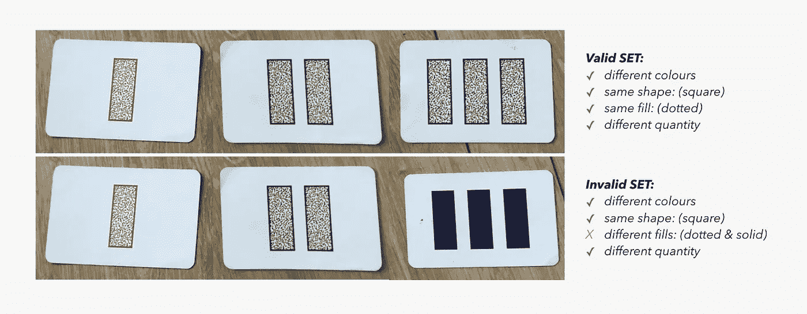
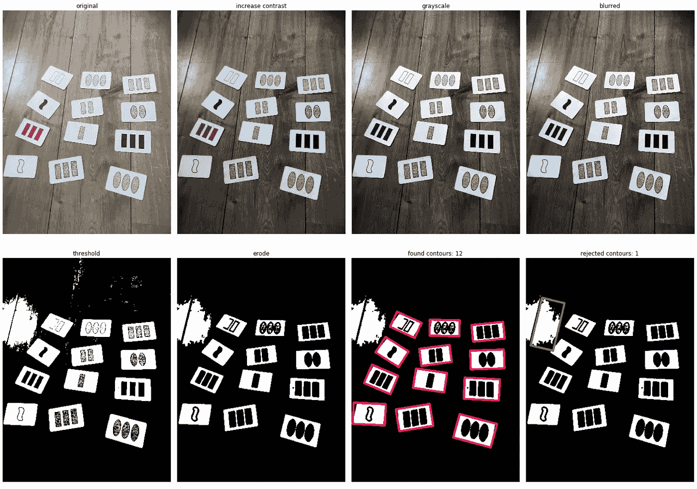
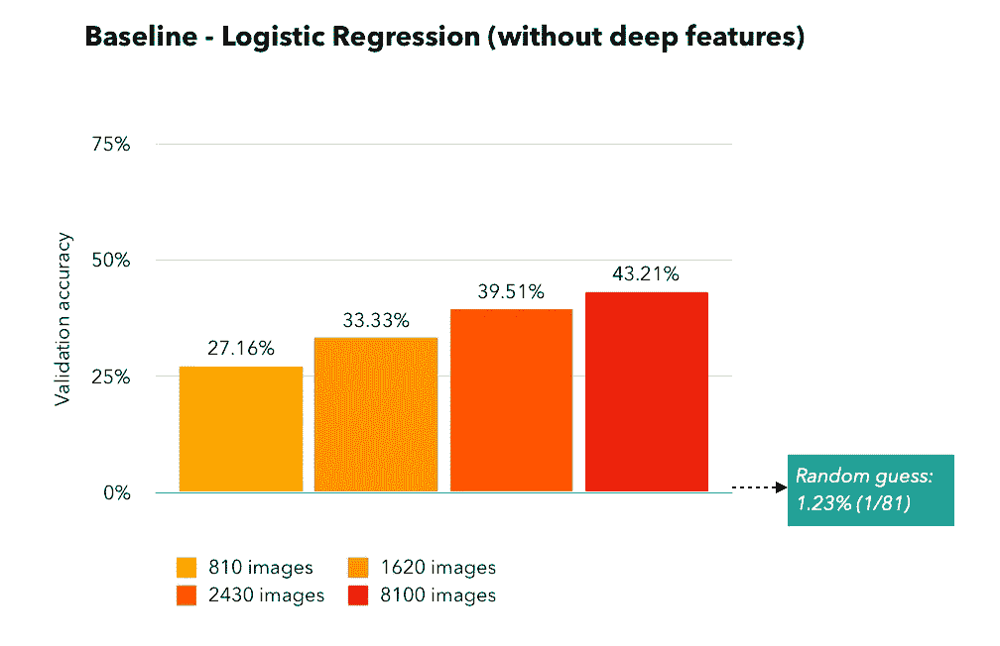
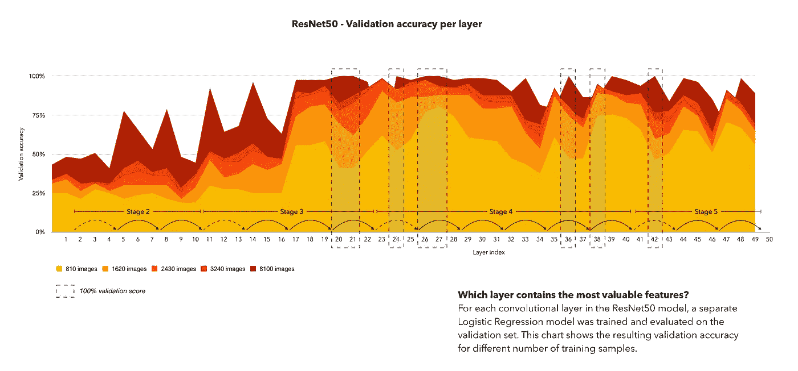
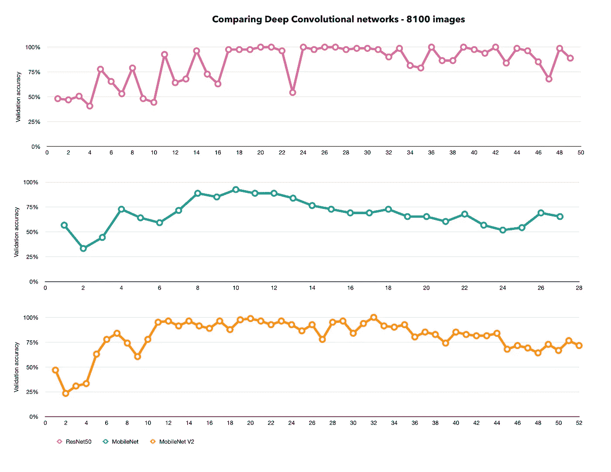
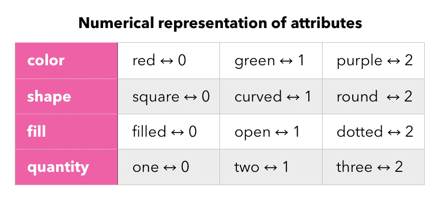
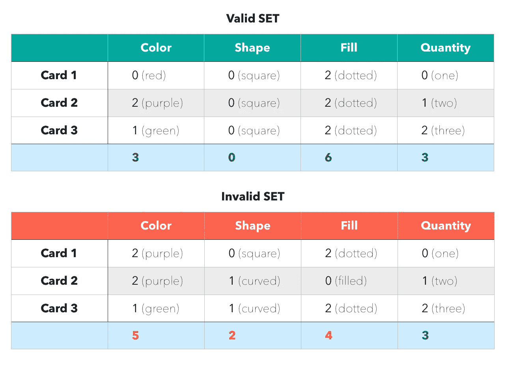
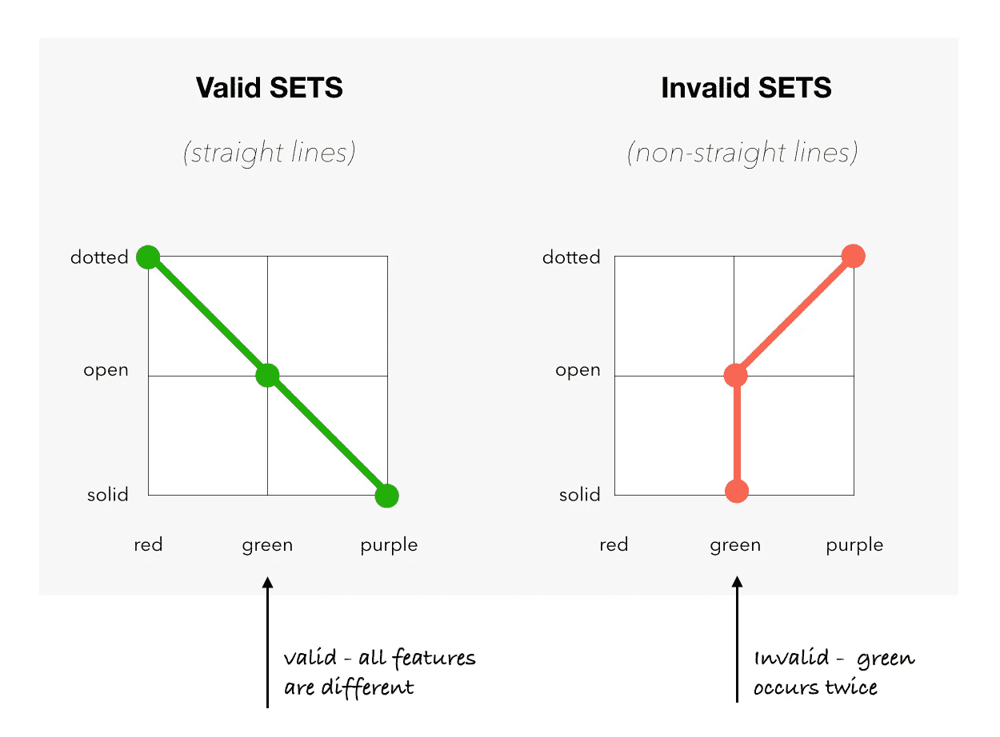
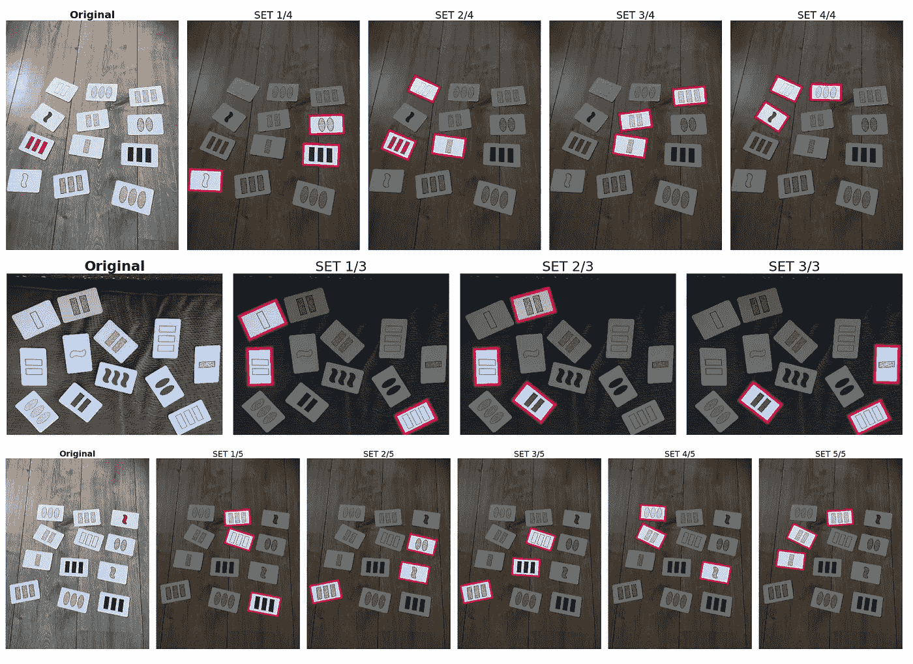

# 使用迁移学习检测集卡

> 原文：<https://towardsdatascience.com/detecting-set-cards-using-transfer-learning-b297dcf3a564?source=collection_archive---------22----------------------->

## 如何从深度卷积网络中生成强大的特征

在美丽的法国度假期间，我和我的家人玩了很多)**，一种简单而优雅的卡牌游戏。目标是在别人发现之前找到特定的卡片组合。玩游戏的时候，我们经常盯着牌，想知道是否还有一组我们没有看到的牌。这开始了一个有趣的个人兼职项目，我应用机器学习来寻找集合组合。**

*在这篇文章中，我将分享我的方法，代码的结果和亮点。要获得完整的源代码，请查看 Github 上的[笔记本。](https://github.com/stetelepta/setdetection)*

**

> *“我不能创造的，我不理解”*
> 
> *理查德·p·费曼*

*首先，让我们把事情搞清楚。对于当今最先进的机器学习模型来说，检测设置卡是一项简单的任务。像 [YOLO](https://pjreddie.com/darknet/yolo/) 这样的*物体检测*算法可以从视频中实时检测许多物体，因此从图像中找到带有简单彩色符号的卡片应该不会太难。*

*比起使用 YOLO，我会发现从头开始更有趣也更有挑战性。*

**

*Example of realtime object detection with YOLO*

**总体方案如下:**

***1。从图像中提取卡片使用计算机视觉提取单张卡片。***

***2。使用深度卷积网络对每个单独图像进行分类** 以生成用于(线性)分类器的特征。*

***3。寻找有效集合组合** 使用组合学来寻找有效集合。有趣的是，有一种优雅的方法只用几行代码就可以做到。*

# *关于游戏*

*在我们深入细节之前，让我解释一下这个游戏。*

*SET 游戏是一种流行的纸牌游戏，挑战你的模式识别技能。游戏的目标是找到一个“套”，这是三张牌的特殊组合。*

*共有 81 种独特的卡片，具有四种属性:*颜色、形状、填充和数量*。每个属性可以有三个不同的值。如果就四个属性中的每一个而言，三张牌或者是*相同的*或者是*都不同的**，则这三张牌被称为一组**

****

**Example for a valid and invalid SET combination**

**总共有 12-21 张牌放在桌子上，玩家实时收集尽可能多的牌。**

**游戏有不同的版本。我在这个项目中使用的版本是 2001 年的 Ravensburger 版本，具有以下特点:**

*   **颜色:*红色，绿色，紫色***
*   **形状:*方形，波浪形，圆形***
*   **填充:*实心、虚线、空心***
*   **数量:*一、二、三***

> **1974 年玛莎·让·法尔科发明了成套游戏。作为一名遗传学研究者，她研究了德国牧羊犬的癫痫症是否是遗传的。为了代表狗的基因信息，她开始在卡片上画符号。不同的属性(即颜色)代表了狗的不同特征。她意识到这可能是一个具有挑战性的难题，在朋友和家人的鼓励下，她开发并推广了这款纸牌游戏。SET 在数学界内外都变得非常流行。[【1】](https://www.semanticscholar.org/paper/The-card-game-set-Davis-Maclagan/1174ae5c47a6efcf95e1bf3743395794ae32d829)**

# **1.从图像中提取卡片**

**有一个[很棒的帖子](https://arnab.org/blog/so-i-suck-24-automating-card-games-using-opencv-and-python)详细解释了如何使用 [OpenCV](https://opencv.org) 从图像中提取规则扑克牌。附带的代码对于提取器械包卡片也非常有用。因此，我不再重复这个解释，我将参考发布的[获取详细信息，并且我将坚持这里的主要步骤。](https://arnab.org/blog/so-i-suck-24-automating-card-games-using-opencv-and-python)**

****

**Steps to extract the cards: find contours of cards in the preprocessed image (identify), warp them to a landscape orientation (register) and crop them to separate images.**

*   **识别卡片——为了在图像中找到卡片，我们利用了白色卡片与背景截然不同的事实。为了放大这种效果，首先对图像进行预处理。然后通过分组相似的像素来找到轮廓。最后，与典型卡片(如卡片上的符号)不匹配的轮廓被过滤掉。**
*   ***图像配准*—将找到的轮廓转换到一个单一的坐标系中，这叫做[图像配准](https://en.wikipedia.org/wiki/Image_registration)。这样，所有卡片都以横向结束，并且可以从图像中裁剪。**

****

**Example of finding the contours in an image**

**如果卡片和背景之间有足够的对比度，这种算法就能很好地工作。如果卡片重叠，它将无法找到所有的卡片，所以我不建议在实际应用中使用该代码，但对于这篇博客来说，它会做得很好。**

# **2.**对每个单独的图像进行分类****

**既然我们可以找到单张卡片，我们就可以开发一个将卡片分类的模型。**

## ****创建数据集****

**第一步是为此任务创建数据集。我在略有不同的光线条件下，从不同的角度为每张卡片拍了四张照片。我分离出一系列图片，并将其用作[验证集](https://en.wikipedia.org/wiki/Training,_validation,_and_test_sets)来测试模型的表现。**

****

**Example of the generated augmented card images**

**每堂课只有三个例子不足以成功训练一个模型。通过使用 Keras 中的`[ImageDataGenerator](https://keras.io/preprocessing/image/#imagedatagenerator-class)` API，您可以从基本数据集创建人工样本。这样你就可以创建一个任意大小的数据集，其中卡片可以旋转、缩放、翻转等。真实样本比人工样本好，但如果你不想自己拍成千上万张照片，这是一个很好的替代选择。**

## **测试基线模型**

**作为基线，我训练了一个[逻辑回归](https://scikit-learn.org/stable/modules/generated/sklearn.linear_model.LogisticRegression.html)模型，并使用增强的图像作为输入。在下面的结果中，您可以看到该模型对于不同数据集大小的性能。对于 8100 幅增强图像的训练集，验证准确率刚刚超过 43%。**

****

**相比较而言，随机选择类的模型只会得到 1.23%的分数，所以线性 logistic 回归模型至少学到了一些有用的东西。**

**对于我们的目的来说，准确度高*非常重要。*如果我们想找到一幅图像中的所有集合组合，我们需要正确分类 12+张卡片。91%或更低的准确度意味着平均而言，在*每张图片*中有一张卡片被错误分类，这将破坏集合检测。**

***让我们看看如何通过使用深度学习来提高这种性能。***

## **选择迁移学习策略**

**对于我们的任务，我可以尝试从头开始训练一个深度卷积神经网络(DCNN ),但由于我的(基础)数据集很小，该模型可能会过拟合。**

****

**一种流行的方法是使用[转移学习](/a-comprehensive-hands-on-guide-to-transfer-learning-with-real-world-applications-in-deep-learning-212bf3b2f27a)，你拿一个为某项任务训练过的模型，你*在另一项任务中重用*。**

**有许多方法可以应用迁移学习，为某项任务和数据集找到最佳策略可能会令人望而生畏。我发现[有一篇有趣的文章](https://blog.revolutionanalytics.com/2016/08/deep-learning-part-2.html)提供了一些指导:选择迁移学习策略的两个最重要的因素是新数据集 的*大小和与原始数据集的*相似度。****

*   ***如果你的新数据集很大:** 对于一个大的数据集，过度拟合的机会很小，所以你可以*微调整个网络* k 或者如果你的数据非常不同，从头开始训练一个 DCNN。实际上，即使数据集是不同的，用预训练模型的权重初始化网络可能仍然是有帮助的。*
*   ***如果您的新数据集很小:** 不要训练或微调 DCNN，因为它会过拟合。相反，根据数据集与原始数据集的相似程度，使用来自早期或后期层的 CNN 特征训练一个*线性分类器** 。
    如果您的数据集不同，请从网络中较早的某处选择更为*通用的*要素。如果是相似的，来自更多特定于*数据集的*最终图层的特征是最有用的。*

> **线性模型使用特征的线性组合，正因为如此，它们比可以学习各种非线性模式的神经网络更受限制。这种限制有助于减少过度拟合。通过使用线性模型和非线性特征表示，我们可以说是两全其美。*

*对于集合检测任务，我们有一个非常*小的*数据集，该数据集也与 ImageNet 的图像非常*不同*，因此该项目的转移学习策略将是从网络中的某个更早的处的*训练一个线性分类器。下一步就是找出*哪一层*会带来最好的性能。**

**

*Setup for the classification: use mid-level image embeddings from a pre-trained Deep Convolutional Network as input for a linear model*

## *寻找最佳图层*

*根据上面的指导方针，我们知道我们需要从网络中的“更早的某个地方”选择一个层，但是我们如何知道哪一个层具有最好的结果呢？为了找到我们的集合分类任务的最佳层，我决定测试*每一层*并在验证集合上比较性能。实验设置如下。*

*对于深度卷积网络中的每个*层* *i* :*

*   *将纸牌的输入图像通过预先训练好的网络(进行预测)，得到*第一层*的输出*
*   *使用图层输出作为输入特征来训练逻辑回归模型。*
*   *根据验证集评估模型。*

*验证精度最高的图层将用于最终模型。*

*我对不同数量的训练样本重复了这个实验，以观察训练数据量的影响。*

***resnet 50 的结果***

*[ResNet50 模型【2】](https://arxiv.org/abs/1512.03385)的 50 个卷积层中每一层的验证精度如下图所示。*

**

**我发现什么有趣:**

*   *在网络的第一个卷积层(*层 1* )之后，验证准确度与基线分数相当。例如，对于 8100 幅图像，验证准确率为 48.1%。这比基线(43.2%)有了小小的提高。*
*   *当深入到网络中时，验证准确性会变得更好，但分数根本不会单调增加。存在高峰和深谷，在这些地方，不知何故，特征表示对于检测集卡不是最佳的。*
*   *许多层使其达到 100%的验证准确性。最佳层位于网络的中层和高层。尽管满分看起来令人印象深刻，但我们需要考虑到验证集非常小(每个类只有一个样本)。即便如此，我认为良好的验证准确性可以为哪一层的性能最好提供一些指导。*
*   *正如所料，用于训练的数据量对性能非常重要。增加样本数量可以提高性能，但某些层有例外。*

## ***比较不同深度卷积模型***

*我还比较了一些不同架构的性能:[resnet 50](https://arxiv.org/abs/1512.03385)【2】，[MobileNet【3】](https://arxiv.org/abs/1704.04861)和[MobileNet V2【4】](https://arxiv.org/abs/1801.04381)。*

***残差神经网络(ResNets)** 微软的一个团队在 2015 年引入了深度残差学习，作为处理[消失梯度](https://en.wikipedia.org/wiki/Vanishing_gradient_problem)的新方法，这是一个阻止非常深度的网络有效工作的问题。通过使用*跳过连接*，来自先前层的激活可以被重用并提供基本性能，直到附加层得到改进。这使得在不影响性能的情况下增加层数成为可能[2]。
本实验使用的模型是 ResNet50，有 50 个卷积层。*

**

*The ResNet50 uses skip connections (denoted by arrows) to jump over some layers. By reusing activations from earlier layers, it helps to fight the notorious vanishing gradients problem. This made it possible to create really deep networks.*

***MobileNet 架构** 由谷歌开发的 [MobileNet](https://arxiv.org/abs/1704.04861) 架构经过优化，可以非常高效地在手机上运行。主要思想是使用不同类型的卷积，称为[深度方向可分离卷积](https://machinethink.net/blog/googles-mobile-net-architecture-on-iphone/)。它与常规卷积运算的结果大致相同，但速度要快得多[3]。
随着 [MobileNetV2](https://arxiv.org/abs/1801.04381) 的推出，最初的 MobileNet 架构通过应用残差学习(的一种变体)和许多其他创新得到了进一步改进【4】。*

***不同网络的验证结果** 在下图中，针对 8100 个图像的数据集绘制了每个模型的结果。*

**

*Performance on the validation set for three different architectures. Note that the number of convolutional layers is different for each architecture.*

**我发现什么有趣:**

*   *对于 ResNet50 架构，第 23 层的精度下降是一个有趣的异常现象。我真的不能解释是什么导致了它，但有趣的是它发生在第四阶段的开始。在每个阶段，过滤器的数量加倍。*
*   *这两个 MobileNet 模型看起来更稳定，因为它们对后续层显示出更少的变化。MobileNet 模型稳步增长，在第 10 层表现出最高性能(92.6%)。当到达更高层时，性能逐渐下降。*
*   *MobileNet V2 性能最好的层是第 32 层，它具有 100%的验证分数。网络中较高层的性能较低。*

*在数据量相同的情况下，ResNet50 拥有最多具有完美验证分数的层，对于最终模型，我将使用该架构。如果你想为 SET 检测创建一个移动应用程序，我想 MobileNetV2 也是一个有趣的选择。*

***分类结果
经过一点调整以改进模型后，我发现最大的增益是通过调整增强设置`brightness_range`和`fill_mode`获得的。经过几次迭代后，该模型现在可以正确地对所有测试图像进行分类。***

*我知道在你看到测试集的结果后调整一个模型，它变得更像一个验证集，并且有过度拟合的风险，但是为了博客的目的，我想我可以接受。*

**

*Example of found contours, registered images and predictions from the best model for each card*

# *3.查找集合组合*

*现在我们可以对卡片进行分类了，接下来是最后一步，找到所有可能的集合组合。*

*请记住，为了有一个集合，三张卡的每个属性需要有相同的*值或者不同的*值。一个简单的解决方案是考虑所有可能的三元组，并检查集合规则是否适用于三元组。对于 12 张卡，有 *12 除以 3 = 220* 个可能的三元组，检查所有的三元组不会花费太多的计算。***

首先，让我们将特征转换成数值。

## “设定的诡计”

我发现有一个有趣的方法来确定一个三连音是否是一个集合。考虑以下两个三胞胎:

当您查看这些有效和无效集合的示例时，您会发现:

*   对于有效集合，*每个属性的值之和是三的倍数。*
*   对于无效集合，一些*属性的值之和不是三的倍数。*

这个规则适用于所有可能的组合，它使得我们的集合寻找算法相当优雅。

Finding SETs, by checking if the sum of the attributes mod 3 is zero

## 有限域

有趣的是，这个技巧不适用于任意的数字表示，但是只要我们选择模 3 不同的数字值，它就会起作用。

更深层次的原因是，*模函数*是一个[有限域](https://en.wikipedia.org/wiki/Finite_field)。字段是具有特定属性的数字集合，其行为有点像有理数或实数。基本的运算如加、减、乘、除都有定义，每个数都有乘法逆运算，这意味着如果你把它和那个逆运算相乘，你会得到 1。这也意味着设定的自然数不是一个字段。

因为模函数是一个有限域，所以它有一些特殊的性质，这些性质对于集合游戏是很重要的。

你可以把一张集合卡想象成一个四维空间中的一个点，其中每个特征都是一个不同的维度(颜色、形状、填充和数量)。例如，具有特征值*绿色、正方形、虚线、两个*的卡片可以表示为 4D 点 *[1，0，2，1]。*因为每个特征只能取三个值中的一个，我们可以定义集卡的空间是一个大小为 3 的*有限域。*【1】

Example for two features (2D space). All points that are co-linear are valid SET combinations

现在，[可以表明](https://www.semanticscholar.org/paper/The-card-game-set-Davis-Maclagan/1174ae5c47a6efcf95e1bf3743395794ae32d829)对于有效集合，有限域内的点是*共线的*，这意味着这些点在一条线上。此外，如果点不是共线的，它不是一个有效的集合组合。

所以基本上，寻找集合的，其实就是在 4 维有限空间中寻找共线点！[1]

# 将这一切结合在一起

当所有的事情都凑在一起，你真的看到你的模型做了你希望的事情时，会有这种令人满意的*(有时是叛逆的)*感觉。

通过结合纸牌的*提取* 、纸牌类型的*分类*和*集合检测算法*，最终我们可以从一幅图像中找到集合组合！

Final result of finding SET combinations from an image

# 参考

*   [1] [《纸牌游戏集》](https://www.semanticscholar.org/paper/The-card-game-set-Davis-Maclagan/1174ae5c47a6efcf95e1bf3743395794ae32d829)
    *本杰明·斋戴维斯，黛安·麦克拉根，2003 年*
*   [2] [深度残差学习用于图像识别](https://arxiv.org/abs/1512.03385)，
    *何，，，任，，2014*
*   [3] [MobileNets:用于移动视觉应用的高效卷积神经网络](https://arxiv.org/abs/1704.04861)
    *Andrew G. Howard，朱梦龙，，Dmitry Kalenichenko，，Tobias Weyand，Marco Andreetto，Hartwig Adam，2017*
*   [4] [MobileNetV2:反向残差与线性瓶颈](https://arxiv.org/abs/1801.04381)
    *马克·桑德勒，，朱梦龙，安德烈·朱莫金诺夫，陈良杰，2018*