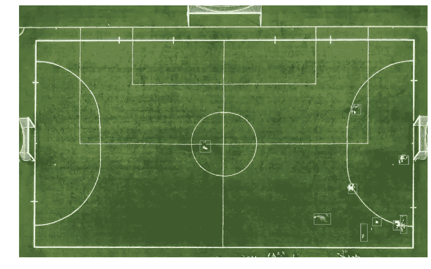
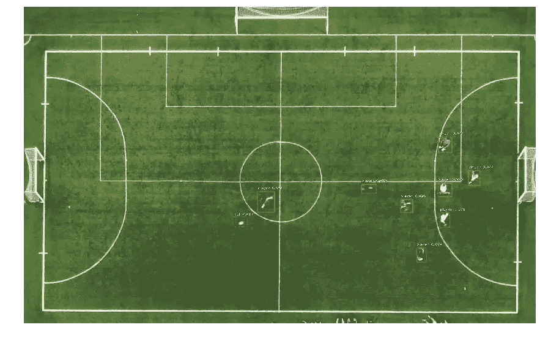
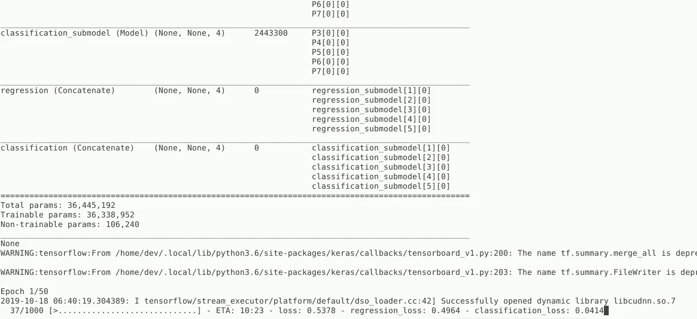
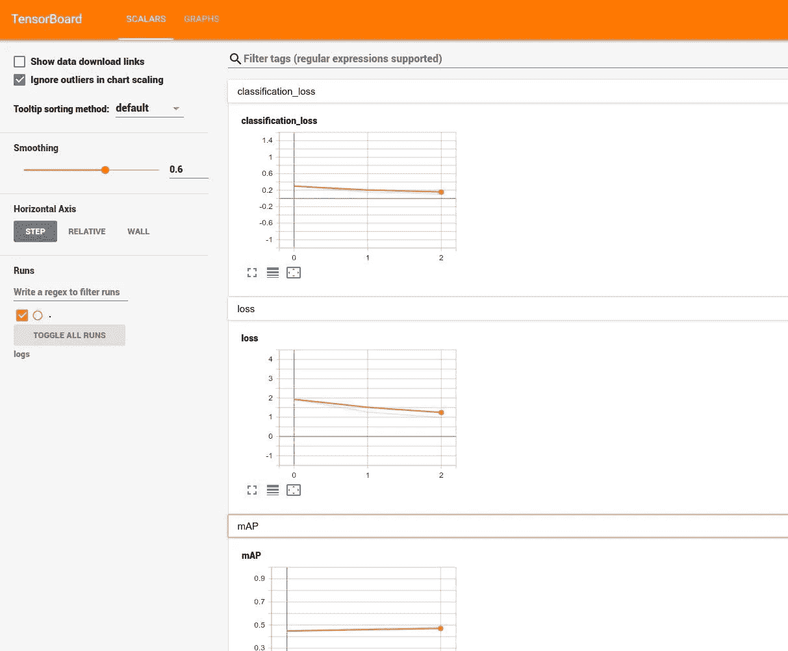
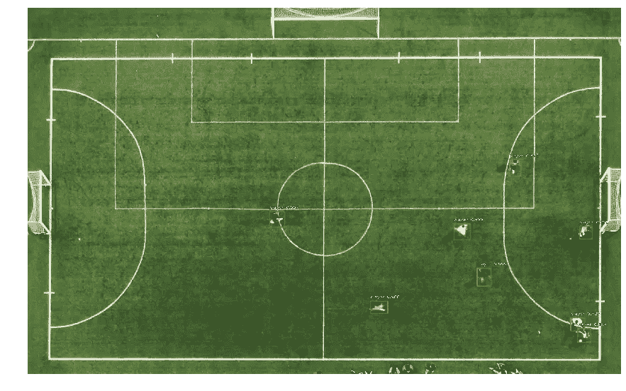
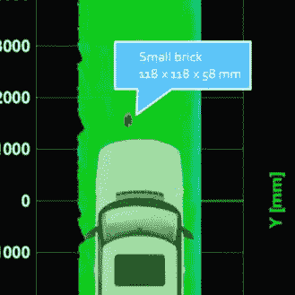

# 用视网膜网探测足球运动员和球。

> 原文：<https://towardsdatascience.com/detecting-soccer-palyers-and-ball-retinantet-2ab5f997ab2?source=collection_archive---------18----------------------->

## 用于体育运动的计算机视觉

## 直截了当的指南，建立一个计算机视觉模型，以检测球员和球在架空摄像机图像。

我们将使用 RetinaNet 模型，如[宗-林逸](https://arxiv.org/search/cs?searchtype=author&query=Lin%2C+T)、[普里亚戈亚尔](https://arxiv.org/search/cs?searchtype=author&query=Goyal%2C+P)、[罗斯·吉希克](https://arxiv.org/search/cs?searchtype=author&query=Girshick%2C+R)、[明凯·何](https://arxiv.org/search/cs?searchtype=author&query=He%2C+K)、[彼得·多拉](https://arxiv.org/search/cs?searchtype=author&query=Doll%C3%A1r%2C+P)的论文[中所述。](https://arxiv.org/abs/1708.02002)

我们还将使用 Fizyr 对 [keras-retinanet](https://github.com/fizyr/keras-retinanet) 的出色实现，将其应用于 Haizaha 的[足球运动员和球检测](https://haizaha.com/datasets/soccer-player-and-ball-localization)免费数据集。

# **要求**:

首先，确保安装了 TensorFlow 和 Keras。

如果您需要 GPU 支持，请遵循[tensorflow.org](https://www.tensorflow.org/install/gpu)上的说明。

接下来，您将需要克隆、构建和安装 [keras-retinanet](https://github.com/fizyr/keras-retinanet) 项目。

# **数据**

安装完所有依赖项后，下一步是下载标记为的[图片。](https://haizaha.com/datasets/soccer-player-and-ball-localization)

# **预训练重量**

我已经公开了我的训练重量。如果您想立即运行模型，以下是下载它们的方法。

# **进口**

我们需要导入 TensorFlow、Keras、keras_retinanet，以及其他一些模块。

# **实用程序**

*   **查看注释:**

我们将使用下面的 view_annotations 函数来显示带有相关边界框注释的图像。

如果您运行以下命令:

您应该会得到如下图像:



Output of view_annotations()

*   **加载模型:**

*   **用模型对图像进行检测**

# **推论**

既然我们已经创建了助手函数，我们需要做的就是调用它们来加载模型并在图像上运行它。

加载模型:

使用模型检测球员和球:

Run_detection 采用我们使用权重“pre-trained/resnet 50 _ CSV _ last _ inference . H5”创建的模型，并在“soccer/images/frame_0100.jpg”上运行该模型

您应该得到这样的结果:



Output of run_detection()

# **训练**

要训练您的模型，您需要做的就是执行 train.py 脚本:

模型训练应该开始，您应该会看到类似这样的内容:



Screenshot: training progress in the terminal

# 监测培训进展

TensorBoard 提供了一个简洁的网络界面来监控你的模型学习。要运行它，您只需在终端中运行以下代码:

```
tensorboard --logdir logs/fit
```

您希望确保 **logs/fit** 指向

现在，您可以在浏览器上访问以下 URL:

```
http://you_ir_address:6006
```



Screenshot: TensorBoard

# **转换培训模式**

训练完模型后，您需要将训练模型转换为推理模型，然后才能使用它来检测对象。

下面是如何将训练模型转换为推理模型:

# 运行新训练的模型

现在，您可以加载新训练的模型并再次运行检测:

您应该会从上面的代码中得到以下输出:



Output of run_detection() after re-training the model

# 优化:检测小物体具有挑战性

在过去的几年里，我们在物体探测任务上取得了令人印象深刻的进展。尽管如此，与检测大对象相比，今天的模型仍然难以检测图像中的小对象。



[Small Objects Detection](https://paperswithcode.com/task/small-object-detection/codeless), on [PapersWithCode.com](https://paperswithcode.com)

RetineNet 在第一阶段使用特征金字塔网络(FPN)来识别不同尺度上的对象。你可以使用不同的**比例**和**比例**值来帮助网络更好地识别小物体。

您需要做的是为您的模型创建一个 **config.ini** :

```
[anchor_parameters] 
sizes   = 32 64 128 256 512 
strides = 8 16 32 64 128 
ratios  = 0.5 1 2 3 
scales  = .5 1.2 1.6
```

训练模型时，请确保包含配置文件:

```
python keras-retinanet/keras_retinanet/bin/train.py --config config.ini csv soccer/train.csv soccer/labels.csv --val-annotations soccer/valid.csv
```

# 项目存储库

这个项目的所有代码都可以在 GitHub 上免费获得:

```
[https://github.com/ramarlina/retinanet-player-ball-detection](https://github.com/ramarlina/retinanet-player-ball-detection)
```